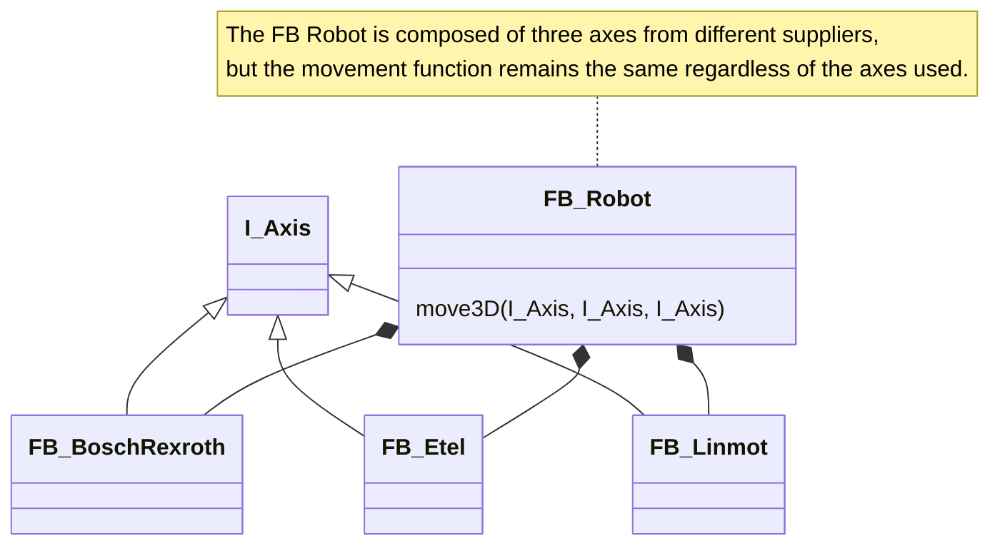
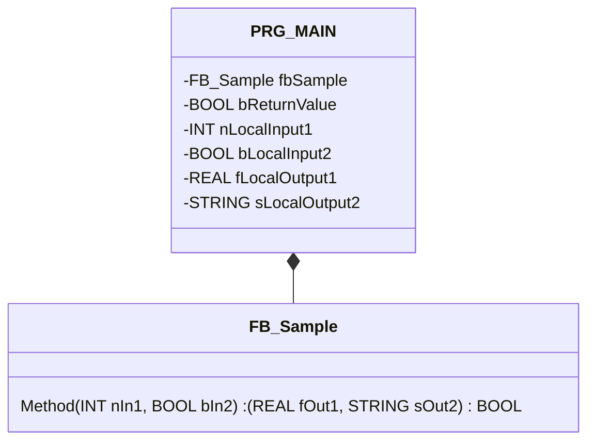
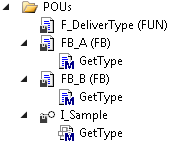
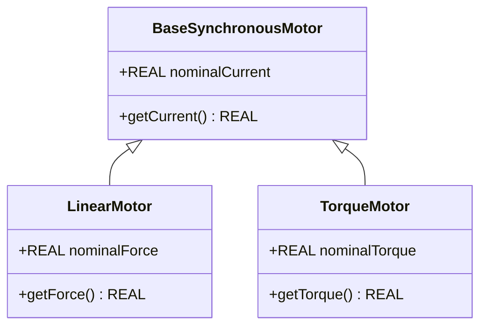
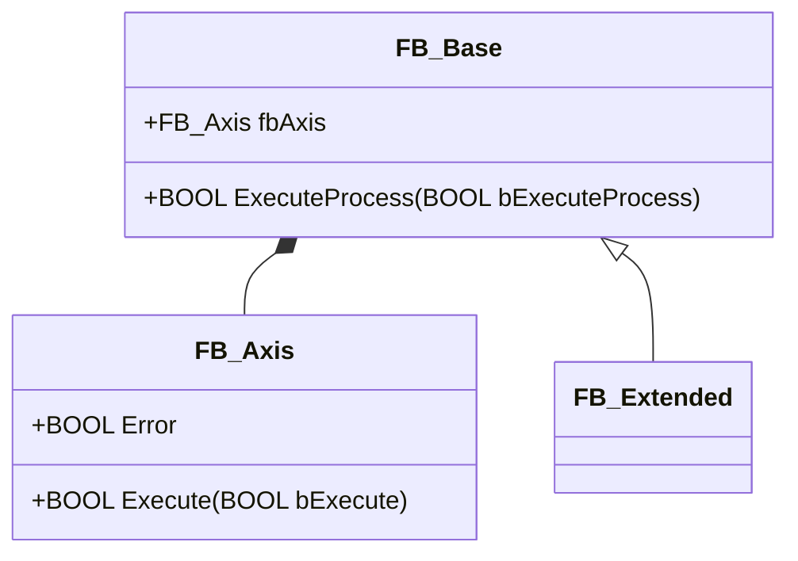
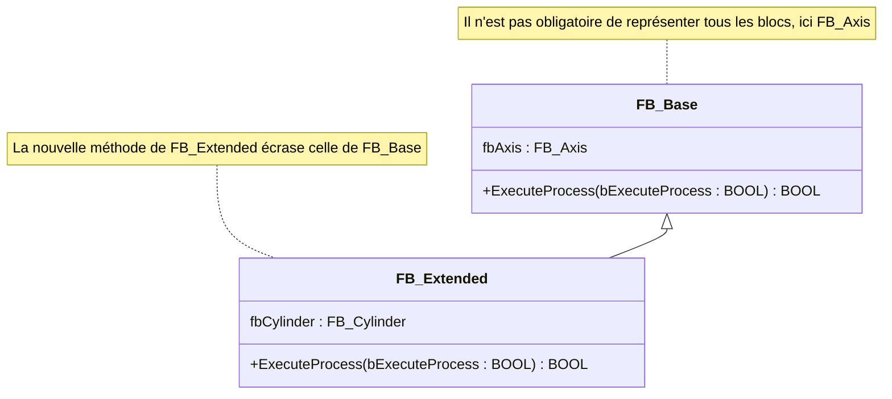
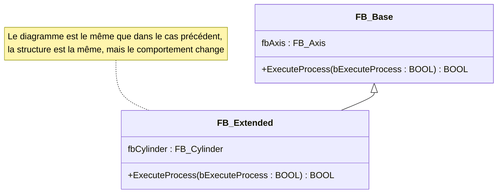
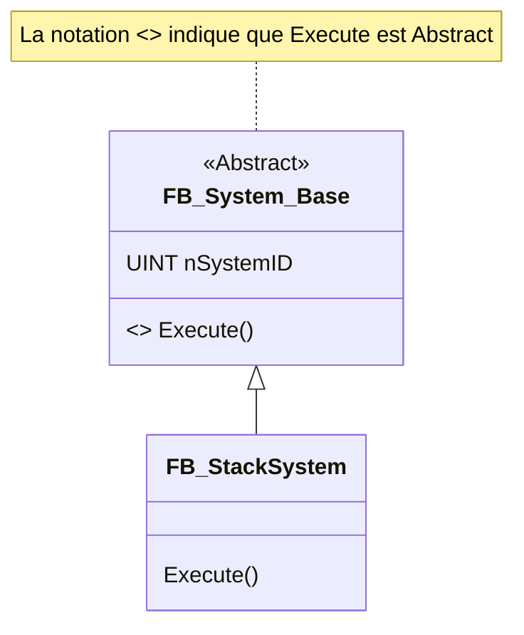
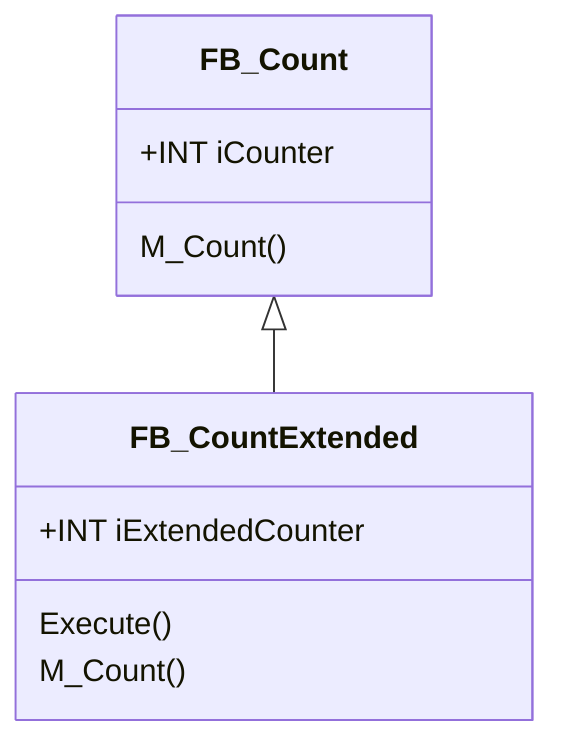
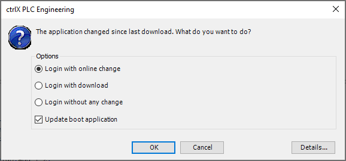

<h1 align="left">
  <br>
  
  <br>
  HEI-Vs Engineering School <h2>AAut Advanced Automation</h2>
  <br>
</h1>

[Cédric Lenoir](mailto:cedric.lenoir@hevs.ch)

# AAut Module 04 Overview /  IEC-61131-3 les outils OOP

## Summary

- [AAut Module 04 Overview /  IEC-61131-3 les outils OOP](#aaut-module-04-overview---iec-61131-3-les-outils-oop)
  - [Summary](#summary)
- [IEC 611313-3 OO programming.](#iec-611313-3-oo-programming)
  - [Object Method](#object-method)
  - [Object Property](#object-property)
  - [Object Interface](#object-interface)
  - [Differences in OOP languages](#differences-in-oop-languages)
  - [Interface](#interface)
  - [Abstract Function Block](#abstract-function-block)
  - [Object-Oriented Keywords from IEC 61131-3](#object-oriented-keywords-from-iec-61131-3)
- [Détails des extensions OOP du 61131-3](#détails-des-extensions-oop-du-61131-3)
  - [Object Method](#object-method-1)
    - [Notes about methods:](#notes-about-methods)
      - [Example](#example)
      - [Example](#example-1)
        - [Method Declaration](#method-declaration)
        - [MAIN Program](#main-program)
      - [Access modifier](#access-modifier)
      - [Abstract](#abstract)
  - [Object Property](#object-property-1)
    - [Implementation sample](#implementation-sample)
      - [Access modifier](#access-modifier-1)
      - [Abstract](#abstract-1)
  - [Object Interface](#object-interface-1)
    - [Method *of an interface*](#method-of-an-interface)
    - [Property *of an interface* or Set() Get()](#property-of-an-interface-or-set-get)
    - [Verifying Interface Declarations via the Compiler](#verifying-interface-declarations-via-the-compiler)
    - [Calling Methods and Properties of a Function Block Instance via an Interface Variable](#calling-methods-and-properties-of-a-function-block-instance-via-an-interface-variable)
    - [Example Interface](#example-interface)
        - [Interface Declaration:](#interface-declaration)
      - [Interface Implementation:](#interface-implementation)
      - [Interface application:](#interface-application)
- [Inheritance](#inheritance)
  - [Inheritance of a Function Block](#inheritance-of-a-function-block)
    - [Number of Extensions for Each Base Functional Block](#number-of-extensions-for-each-base-functional-block)
    - [Multiple inheritance is not allowed](#multiple-inheritance-is-not-allowed)
  - [Inheritance Principle](#inheritance-principle)
    - [Inheritance Content](#inheritance-content)
  - [Extending or Overriding Inherited Elements](#extending-or-overriding-inherited-elements)
  - [Use Cases for Inheritance](#use-cases-for-inheritance)
    - [Unchanged Usage](#unchanged-usage)
      - [Example:](#example-2)
        - [Functional Block FB\_Base :](#functional-block-fb_base-)
        - [Method FB\_Base.ExecuteProcess:](#method-fb_baseexecuteprocess)
        - [Function block FB\_Extended:](#function-block-fb_extended)
        - [Method FB\_Extended.ExecuteProcess:](#method-fb_extendedexecuteprocess)
    - [Overwrite](#overwrite)
      - [Example:](#example-3)
        - [Bloc fonctionnel FB\_Base :](#bloc-fonctionnel-fb_base-)
        - [Method FB\_Base.ExecuteProcess:](#method-fb_baseexecuteprocess-1)
        - [Function block FB\_Extended:](#function-block-fb_extended-1)
        - [Method FB\_Extended.ExecuteProcess:](#method-fb_extendedexecuteprocess-1)
    - [Extension](#extension)
      - [Example:](#example-4)
        - [Function block FB\_Base:](#function-block-fb_base)
        - [Method FB\_Base.ExecuteProcess:](#method-fb_baseexecuteprocess-2)
        - [Function block FB\_Extended:](#function-block-fb_extended-2)
        - [Method FB\_Extended.ExecuteProcess:](#method-fb_extendedexecuteprocess-2)
- [Abstract](#abstract-2)
  - [Application of Abstraction](#application-of-abstraction)
  - [Rules for Using the ABSTRACT Keyword](#rules-for-using-the-abstract-keyword)
    - [Exemple](#exemple)
      - [Abstract basic class:](#abstract-basic-class)
      - [Non-abstract sub-class:](#non-abstract-sub-class)
  - [Différences entre un FB abstrait, ``Abstract`` et une interface](#différences-entre-un-fb-abstrait-abstract-et-une-interface)
- [Super^](#super)
      - [Example](#example-5)
    - [Using the SUPER and THIS pointers:](#using-the-super-and-this-pointers)
      - [Function block FB\_Count:](#function-block-fb_count)
      - [Method FB\_Count.M\_Count:](#method-fb_countm_count)
      - [Function Block FB\_CountExtended](#function-block-fb_countextended)
      - [Method FB\_CountExtended.M\_Count:](#method-fb_countextendedm_count)
      - [Code of Function Block FB\_CountExtended](#code-of-function-block-fb_countextended)
      - [PRG\_Count Header](#prg_count-header)
      - [PRG\_Count Core](#prg_count-core)
      - [Another case, direct](#another-case-direct)
      - [With VAR\_IN\_OUT](#with-var_in_out)
- [THIS^](#this)
- [Main reference](#main-reference)
- [Other references](#other-references)

Reference for 
# IEC 611313-3 OO programming.

OOP Extensions of 61131-3. For more details, [refer to the notes from Beckhoff's documentation](#details-of-oop-extensions-of-61131-3).

## Object Method
Methods are an extension of the IEC 61131-3 standard and an object-oriented programming tool used for data encapsulation. A method contains a declaration and an implementation. However, unlike a function, a method is not an independent programming block but is subordinate to a function block or program. A method can access all valid variables in the top-level programming block.

## Object Property
A property is an extension of the IEC 61131-3 standard and is an object-oriented programming tool. It consists of the access methods **Get** and **Set**.

## Object Interface
An interface is an object-oriented programming tool. The Interface object describes a set of prototypes of `Method` and `Property`. In this context, the prototype means that the `Method` and `Property` contain only declarations, but no implementation.

This way, you can use different function blocks with common properties in the same way.

## Differences in OOP languages

In my opinion, the closest language is Delphi, followed by C#.

I don't really agree with the principle of associating a method with an action; it's very different!

Be careful with the concept of dynamically allocating objects from classes! There is **no dynamic allocation in IEC 61131-3**.


|Language Properties |IEC 61131-3 2nd edition |IEC 61131-3 3rd Edition |C++ |Java |C#|
|--------------------|------------------------|------------------------|----|-----|--|
|Multi languages     | +                      |+                       |-   |-    |- |
|OOP/procedural mixed|-                       |+                       |+   |-    |- |
|Classes             |~ (FB)                  |+                       |+   |+    |+ |
|Methods             |~ (Actions)             |+                       |+   |+    |+ |
|Interfaces          |-                       |+                       |-   |+    |+ | 
|Polymorphism        |-                       |+                       |+/- |+    |+ |
|Semantic Reference  |-                       |+ (Interfaces)          |-   |+    |+ |
|Constructor/Destructor|-/+                   |-/+                     |+   |+    |+ |
|Properties          |-                       |-                       |-   |-    |+ |
|Dyn. Memory *new*   |-                       |-                       |+   |+    |+ |
|Access control      |~ (Variables)           |~ (Variables)           |+   |+    |+ |


> It is advised to read the document PLCopen Software Creation Guidelines: [Creating PLCopen Compliant Libraries V1_0](https://plcopen.org/node/90?file=166), Version 1.0 of May 4, 2017, which is downloadable from the PLCopen website. As part of this, we will use the **SOLID** principles in the automation technology environment. SOLID stands for:

- SRP — Single Responsibility Principle
- OCP — Open/Closed Principle
- LSP — Liskov Substitution Principle
- IPS — Interface Segregation Principle
- DIP — Dependency Inversion Principle

Selon Copilot:
- **SRP — Single Responsibility Principle**: A class should have only one responsibility or reason for changing.
- **OCP — Open/Closed Principle**: Software entities should be open to extension but closed to modification.
- **LSP — Liskov Substitution Principle**: Objects of a derived class must be able to replace objects of the base class without altering the operation of the program.
  
- **IPS — Interface Segregation Principle**: It is better to have several specific interfaces rather than a single general interface.
- **DIP — Dependency Inversion Principle**: High-level modules should not depend on low-level modules. Both should depend on abstractions..

## Interface

- In object-oriented programming, an interface is a definition of a set of **methods and properties without implementation**.

- The classes or functional blocks that implement this interface must provide the concrete implementations of these methods and properties.

- In automation, it's a way to separate the management of devices from the management of the process. Devices provide interfaces to the process.



## Abstract Function Block
- An **Function Block Abstract** is a function block **that cannot be directly instantiated** and serves as a template for other function blocks.

- It can contain abstract methods and properties, without implementation, as well as non-abstract methods and properties. Derived function blocks must implement the abstract methods and properties or be defined as abstract themselves.


## Object-Oriented Keywords from IEC 61131-3

- **Function Block (FB)**: A programming unit that encapsulates data and algorithms.

- **Methods**: Functions or procedures defined within an FB to manipulate its data.

- **Properties**: Attributes of an FB that can be read or written.

- **Inheritance**: The ability of an FB to inherit characteristics from another FB.

- **Interfaces**: Definitions of methods without implementation, which FBs can implement.

- **Polymorphism**: The ability to treat objects of different classes uniformly.

- **Encapsulation**: Grouping data and methods within FBs, with access control.

- **Abstract Function Block**: An FB that cannot be directly instantiated and serves as a template for other FBs.

- **Dynamic Memory Allocation**: Dynamic memory allocation, although limited in IEC 61131-3.

- **SUPER^**: "SUPER" is a special variable used for object-oriented programming. "SUPER" is the pointer of a function block to the base function block instance from which the function block was created.

These keywords allow for structuring and managing code in a modular and reusable way in industrial automation systems.
# Détails des extensions OOP du 61131-3

> excerpts from the [Beckhoff online documentation](https://infosys.beckhoff.com). Available in German and English.

---


## Object Method
Methods are an extension of the IEC 61131-3 standard and an object-oriented programming tool used for data encapsulation. A method contains a declaration and an implementation. However, unlike a function, a method is not an independent programming block but is subordinate to a function block or program. A method can access all valid variables in the top-level programming block.

### Notes about methods:

- All data in a method is temporary and valid **only during the method's execution**, stored as stack variables. This means that the system resets all variables and function blocks you have declared in a method each time the method is called.

- Like functions, methods can return a value.

According to the IEC 61131-3 standard, methods can have additional inputs and outputs, just like regular functions. You assign the inputs and outputs when the method is called.

- Inputs without an explicitly specified initial value must be assigned when the method is called. Inputs with an explicitly specified initial value can optionally be assigned or ignored when the method is called.

- Access to the function block instance or program variables is permitted within the implementation part of a method.

- Use the `THIS` pointer to point to your own instance.

- It is not possible to access the `VAR_TEMP` variables of the function block within a method.

- You can declare `VAR_INST` variables that do not reset upon subsequent method calls (see also the Instance Variables chapter).

- By using the **REFERENCE TO** <structured type> return type, you can directly access a single element of the structured data type returned by the method when the method is called.

- In principle, accessing the `VAR_IN_OUT` variables of a function block is possible within a method. Since this access is potentially risky, it should be used judiciously. To avoid a compiler warning, it is advisable to use an intermediate variable.

#### Example
Consider a variable of type ``VAR_IN_OUT`` used for hardware access.
```iecst
FUNCTION_BLOCK PUBLIC FB_U300_D50 IMPLEMENTS I_DeviceMeasureLength
VAR_IN_OUT
	hw		: UA_U300_D50;
END_VAR
```
Accessing a variable of ``hw`` via a method will cause a compiler *Warning*.
```iecst
METHOD GetLength : LREAL
```
Code
```iecst
  GetLength := hw.Value * EXPT(10,-3);
```
**Warning** : *Access to VAR_IN_OUT ``hw`` declared in ``FB_U300_D50`` from external context ``GetLength``*. 

**Explanation:** The method is designed to access internal variables of ``FB_U300_D50``, which is not the case for hw, which comes from an external source.

  **Tip:** For variables of type ``VAR_IN_OUT`` that need to be used in a method, use an intermediate internal variable identified by an underscore (_).

Within the body of the Function Block:
```iecst
VAR
  _hw_Value : DINT;
END_VAR

// Code
// Isolate In_Out variable for the interface
  _hw_Value := hw.Value ;
```
In the method
```iecst
  GetLength := _hw_Value * EXPT(10,-3);
```

This example clearly illustrates that while some OOP functionalities can be useful in the long term, they are more cumbersome to implement in the short term.

- Methods defined in an interface can only define input, output, and `VAR_IN_OUT` variables, but they cannot contain implementations.

#### Example



##### Method Declaration
```iecst
METHOD Method : BOOL
VAR_INPUT
    nIn1  : INT;
    bIn2  : BOOL;
END_VAR
VAR_OUTPUT
    fOut1 : REAL;
    sOut2 : STRING;
END_VAR
```

```ìecst
// <method implementation code>
```

When creating the method via the IDE, the following pragma is added: *{warning 'Add method implementation'}*. This is for the programmer's benefit and can be removed in the final version.

##### MAIN Program
```iecst
PROGRAM PRG_MAIN
VAR
    fbSample      : FB_Sample;
    bReturnValue  : BOOL;
    nLocalInput1  : INT;
    bLocalInput2  : BOOL;
    fLocalOutput1 : REAL;
    sLocalOutput2 : STRING;
END_VAR
```

```iecst
bReturnValue := fbSample.Method(nIn1  := nLocalInput1,
                                 bIn2  := bLocalInput2,
                                 fOut1 => fLocalOutput1,
                                 sOut2 => sLocalOutput2);
```


#### Access modifier

The concepts of **Access Modifier** are provided for illustrative purposes within this course. We can only skim this aspect, as we are not aiming to create libraries here.

Regulates data access
- PUBLIC: access is unrestricted, equivalent to specifying no access modifier.

- PRIVATE: access to the method is restricted to the function block or the program, respectively.

- PROTECTED: access to the method is restricted to the program or the function block and its derivatives, respectively.

- INTERNAL: access to the method is limited to the namespace, the library.

In addition to these access modifiers, you can manually add the FINAL modifier to a method:

- FINAL: overwriting the method in a derivative of the function block is not allowed. This means that the method cannot be overwritten/extended into a potentially existing subclass.

#### Abstract
Indicates that the method has no implementation and that the implementation is provided by the derived FB.

---


## Object Property
### Implementation sample
Declaration of the function block FB_Sample
```iecst
FUNCTION_BLOCK FB_Sample
VAR
    _Var : INT;
END_VAR
```

> Good practice, identify a variable intended to be accessed via a ``Property`` or ``Method`` with the symbol *underscore* **_Var**.

```iecst
_Var := _Var + 1;
```
Declaration of the property nValue
```iecst
PROPERTY PUBLIC nValue : INT
```
Implementation of the accessor method ``FB_Sample.nValue.``**Set**

```iecst
// With Set, the value is written on _Var
_Var := nValue;
```
Implementation of the accessor method **FB_Sample.nValue.****Get**
```iecst
// With Get, the value is read from _Var
nValue := _Var;
```
Calling the property nValue
```iecst
PROGRAM MAIN
VAR
    fbSample : FB_Sample;
END_VAR
```

```iecst
fbSample();
If fbSample.nValue > 500 THEN
    fbSample.nValue := 0;
END_IF;
```

#### Access modifier

The concepts of **Access Modifier** are provided for illustrative purposes within this course. We can only skim this aspect, as we are not aiming to create libraries here.

Regulates data access
- **PUBLIC**: access is unrestricted, equivalent to specifying no access modifier.

- **PRIVATE**: access to the property is restricted to the function block or the program, respectively.

- **PROTECTED**: access to the property is restricted to the program or the function block and its derivatives, respectively.

- **INTERNAL**: access to the property is limited to the namespace, the library.

In addition to these access modifiers, you can manually add the FINAL modifier to a method:

- **FINAL**: overwriting the property in a derivative of the function block is not allowed. This means that the method cannot be overwritten/extended into a potentially existing subclass.

#### Abstract
Indicates that the method has no implementation and that the implementation is provided by the derived Function Block.

> The **Property** object is fundamental to the **Delphi** and **C#** languages. Note that the development of these two languages ​​was led by the same person: Anders Hejlsberg.

> > ``Property`` is only moderately useful in 61131-3 since we already have the concepts of ``VAR_INPUT`` and ``VAR_OUTPUT``. However, `property` is essential for creating interfaces, or by extension, ``Abstract` Function Blocks.

---

## Object Interface

An interface consists of two components:

- Methods, **Method**.

- Properties, **Property**

### Method *of an interface*
If a method is added under an interface, you can only add and instantiate variable declarations, ``VAR_INPUT``, ``VAR_OUTPUT``, and ``VAR_IN_OUT``, within that method.

Program code can only be added to the method once a function block **implements the interface** that belongs to the method.

### Property *of an interface* or Set() Get()

No implementation code is included for accessing methods in the interface property. If you remove the Set accessor, only read access is available for the property, not write access.

- The **Get()** accessor is used for read access to the property.

- The **Set()** accessor is used for write access to the property

### Verifying Interface Declarations via the Compiler

- In an interface, e.g., ``I_Sample``, you declare the methods and properties, including the return type, inputs, etc., that should be associated with that interface.

- In function blocks that must correspond to this interface and therefore provide the corresponding methods and properties, you implement the ``I_Sample` interface.

- The function block contains the interface in the ``IMPLEMENTS` list within its declaration section, e.g., ```FB_Sample IMPLEMENTS I_Sample``.

- A function block can implement one or more interfaces, e.g., ```FB_Sample IMPLEMENTS I_Sample1, I_Sample2``.

- A function block that implements an interface must contain **all the methods and properties defined in that interface**. The declaration of methods and properties must exactly match the declaration in the interface, including name, return type, inputs, and outputs.

- Function blocks add function block-specific code to the interface methods and properties. If an interface is implemented by multiple function blocks, you can use the same method with the same parameters but different implementation code in different function blocks.

- For function blocks that implement one or more interfaces, the compiler checks whether the function blocks adhere to their respective interface declarations. If the element declarations in the interface and the function block differ, or if the interface contains elements not included in the function block, the compiler reports an error.

### Calling Methods and Properties of a Function Block Instance via an Interface Variable

In addition to the compiler's automatic interface declaration verification, you can use interfaces to call an interface method or property of a function block instance via an interface variable.

- First, instantiate the interface (e.g., ``iSample : I_Sample;``) and the function block(s) that correctly implement the interface, [see previous use case](#verification-of-interface-declaration-via-the-compiler): Verification of interface declaration via the compiler.

- You can then assign the interface variable to each instance of a function block that correctly implements the interface. If no interface variable has been assigned yet, the variable contains the value 0 in inline mode.

- In the final step, you can call an interface method or property via the interface variable. The method or property is called for the function block to which the interface refers.

- This implementation allows for the consistent use of different but similar function blocks via the interface variable. Depending on the project state, you can, for example, assign a specific function block instance to the interface variable, so that the invocation of interface methods and properties is identical, even though a different function block instance is used depending on the project state.

### Example Interface

<figure>

<figcaption>Example Interface according to Beckhoff</figcaption>

</figure>

##### Interface Declaration:

- You have added the `I_Sample` interface to your project. Add the `GetType` method with the return type `STRING` to the interface.

- `I_Sample` and `GetType` do not contain any implementation code. The `GetType` method contains only the required declarations and variables, such as the return type. You can program the `GetType` method later in the function block that implements the `I_Sample` interface.

```iecst
INTERFACE I_Sample
```
Method I_Sample.GetType:
```iecst
METHOD GetType : STRING
```

#### Interface Implementation:

- If you then add a function block to the project and enter the I_Sample interface in the Implements field of the Add dialog box, the IDE automatically adds the GetType method to that function block. You can then implement the function block-specific code within the methods.

- The function blocks ``FB_A`` and ``FB_B`` both implement the ``I_Sample` interface:

<figure>

<figcaption>Adding a FB with Interface</figcaption>

</figure>

```iecst
FUNCTION_BLOCK FB_A IMPLEMENTS I_Sample
```

```iecst
FUNCTION_BLOCK FB_B IMPLEMENTS I_Sample
```
- Both function blocks must therefore contain a method with the name GetType and the return type STRING. Otherwise, the compiler reports an error, see [Verification of interface declaration via the compiler](#verification-de-la-déclaration-dinterface-via-le-compilateur).

**Method FB_A.GetType**
```iecst
METHOD GetType : STRING
```
```iecst
GetType := 'FB_A';
```
**Method FB_B.GetType**
```iecst
METHOD GetType : STRING
```
```iecst
GetType := 'FB_B';
```
#### Interface application:

- A function ``F_DeliverType`` contains the declaration of an input variable of the type of interface ``I_Sample``. Within the function, the interface method GetType is called via the interface variable ``iSample``. In this case, whether ``FB_A.GetType`` or ``FB_B.GetType`` is called depends on the transferred function block type, voir: [Calling methods and properties of a function block instance via an interface variable](#calling-methods-and-properties-of-a-function-block-instance-via-an-interface-variable).

```iecst
FUNCTION F_DeliverType : STRING
VAR_INPUT
    iSample : I_Sample;
END_VAR

F_DeliverType := iSample.GetType();
```

- Les instances de blocs fonctionnels qui implémentent l'interface ``I_Sample``, par exemple ``FB_A`` et ``FB_B``, peuvent être affectées à la variable d'entrée de la fonction ``F_DeliverType``.
- Exemples d'appels de fonction :
  - Si l'instance de bloc fonctionnel ``fbA`` est transférée à la fonction ``F_DeliverType``, la méthode ``fbA.GetType`` est appelée à l'intérieur de la fonction puisque la variable d'interface ``iSample`` pointe vers l'instance de bloc fonctionnel ``fbA``. Cet appel de méthode fournit la valeur de retour *FB_A*, qui est à son tour renvoyée par la fonction ``F_DeliverType`` et affectée dans le programme principal à la variable sResultA.

  - En conséquence, ``sResultB`` reçoit la valeur *FB_B*, puisque la méthode ``fbB.GetType`` est appelée à l'intérieur de la fonction ``F_DeliverType``.

```iecst
PROGRAM MAIN
VAR
    fbA       : FB_A;
    fbB       : FB_B;
    sResultA  : STRING;
    sResultB  : STRING;
END_VAR

sResultA := F_DeliverType(iSample := fbA); // call with instance of type FB_A
sResultB := F_DeliverType(iSample := fbB); // call with instance of type FB_B
```

---


# Inheritance
We already partially covered inheritance for structures during the fourth semester course. We will now expand on this concept.

Inheritance can be applied:

- to a Function Block.

- to a structure.

- to an interface.

## Inheritance of a Function Block

Extending a function block relies on the concept of inheritance in object-oriented programming. A derived function block **extends** a base function block and thus inherits the properties and functionality of the base function block, in addition to its own properties and functionality.

<div align="center">



</div>


Inheritance is one of the few relationships that students **must** know.

In IEC 61131-3, the term **functional block** can be used interchangeably with **class**. A derived functional block can therefore be called a **subclass**, and the base functional block a **base class**.

### Number of Extensions for Each Base Functional Block

The number of extensions for each base functional block is **unlimited**. A functional block can be extended and customized with several other functional blocks.

Possible:
```iecst
FUNCTION_BLOCK FB_Extended EXTENDS FB_Base
FUNCTION_BLOCK FB_ExtendedExtended EXTENDS FB_Extended
FUNCTION_BLOCK FB_ExtendedExtendedExtended EXTENDS FB_ExtendedExtended
...
```

### Multiple inheritance is not allowed

**Multiple inheritance is not allowed for function blocks.** A function block cannot extend more than one other function block.

Exception: A function block can implement multiple interfaces, and an interface can extend multiple other interfaces.

**Not possible**
```iecst
FUNCTION_BLOCK FB_Extended EXTENDS FB_Base1, FB_Base2
```
**Possible**
```iecst
FUNCTION_BLOCK FB_Sample IMPLEMENTS I_Sample1, I_Sample2
```
**Possible**
```iecst
INTERFACE I_Extended EXTENDS I_Base_1, I_Base_2 
```

## Inheritance Principle
### Inheritance Content

A derived function block inherits all the data, methods, properties, actions, and transitions defined in the base function block. Note the access options for inherited elements, which are defined via access modifiers.

Access Options for Inherited Elements

The extent to which a subclass can access inherited methods or properties within its scope depends on the access modifier with which the method or property is defined in the base class.

Methods and properties defined in the base class with the PRIVATE access modifier cannot be called within the subclass's scope, nor can they be overridden or extended by the subclass.

Private methods and properties are only available to the subclass to the extent that they are executed for the subclass instance, if they are called in the base class's implementation.

The concepts of **Access Modifier** are provided for illustrative purposes within this course. This aspect can be only briefly touched upon, as we are not aiming to create libraries here.

**Example**:

The base class has a `PUBLIC` method and a `PRIVATE` method. The `PUBLIC` method calls the `PRIVATE` method in its implementation. The `PUBLIC` method can be called by the called subclass, so the `PRIVATE` method is implicitly called at the same time. However, the `PRIVATE` method cannot be actively called, overridden, or extended by the subclass.

The following access modifiers are available to specify access options for a method or property:

|Access Modifier  |Comment |
|-----------------|------------------------------------------------|
|PUBLIC| Corresponds to the specification of no access modifiers. The element (method or property) can be called from outside the function block. Therefore, the element can also be accessed by a subclass.|
|PRIVATE| Access to the element is restricted to the function block. Access from outside the function block is not possible. This means that a subclass cannot access the element either. The subclass therefore cannot call, overwrite, or extend the element.|
|PROTECTED| Access to the element is restricted to the function block and its derivatives. A subclass can access the element and can therefore call, extend, or overwrite it. Access from outside this "inheritance family" is not possible.|
|INTERNAL| Access to the element is restricted to the namespace (the library). Access from outside the namespace is not possible. Therefore, the element cannot be overwritten or extended from outside the namespace.

## Extending or Overriding Inherited Elements

- A derived function block can extend or override the methods, properties, actions, and transitions defined in the base function block, provided a corresponding access modifier for the elements is used in the base class.

- To extend or override an element, the element must be declared in the subclass in the same way as in the base class:

- same name

- same access modifier for methods and properties

- same variable interface, for example, method input/output

- same return type for methods and properties

- When an element is extended or overridden in the subclass, only the implementation is adjusted to modify the element's behavior.

---

## Use Cases for Inheritance

In general, inherited elements to which the subclass has appropriate access can be used in three different ways:

- Inherited elements can be used without modification.

- Inherited elements can be overwritten.

- Inherited elements can be extended.

These three use cases are explained below using the **Method** element as an example.

---

### Unchanged Usage

- Requirement: The subclass requires exactly the same implementations as those already programmed in the base class's method.

- Implementation: In this case, the method is not created for the subclass.

- Consequence: The subclass uses the base class's method implementation.

#### Example:

- The base class must control an axis to execute a process.

- The same requirement applies to the subclass: the subclass must also control the axis.

- In this case, the ``ExecuteProcess`` method is not created for the subclass. If the method is called for an instance of the `fbExtended.ExecuteProcess(...)` subclass, the base implementation of the method is automatically called ``FB_Base.ExecuteProcess``. The subclass thus benefits from the implementations already implemented in the base class.

<div align="center">



</div>

##### Functional Block FB_Base :
```ìecst
FUNCTION_BLOCK FB_Base
VAR
    fbAxis  : FB_Axis;
END_VAR
```
##### Method FB_Base.ExecuteProcess:
```iecst
METHOD ExecuteProcess : BOOL
VAR_INPUT
    bExecuteProcess  : BOOL; 
END_VAR
```

```iecst
// Calling axis module by passing input parameter "bExecuteProcess" of this method to the input parameter "bExecute" of method "Execute"
fbAxis.Execute(bExecute := bExecuteProcess);
 
// Setting the return value of this method as inverted error signal of the axis module
ExecuteProcess := NOT fbAxis.Error;
```
##### Function block FB_Extended:
```ìecst
FUNCTION_BLOCK FB_Extended EXTENDS FB_Base
VAR
END_VAR
```

##### Method FB_Extended.ExecuteProcess:

> *n'existe pas, FB_Extended utilisera la méthode de FB_Base*

---

### Overwrite

- Requirement: Compared to the base class, the subclass requires completely different instructions in its method.

- Implementation: In this case, the subclass's method is created and populated with different instructions in its implementation section. Compared to the base class's method, only the implementation section differs—the declaration section must be identical.

- Consequence: The subclass uses its own implementation of the method. The subclass has overwritten the base class's method.

#### Example:

- The base class needs to control an axis to execute a process.

- However, the subclass needs to control a cylinder instead of an axis during the process execution.

- In this case, the `ExecuteProcess` method is created for the subclass. The method's implementation section is programmed with the required instructions, which have a completely different effect compared to the base implementation.

<div align="center">


</div>

##### Bloc fonctionnel FB_Base :
```iecst
FUNCTION_BLOCK FB_Base
VAR
    fbAxis  : FB_Axis;
END_VAR
```

##### Method FB_Base.ExecuteProcess:
```iecst
METHOD ExecuteProcess : BOOL
VAR_INPUT
    bExecuteProcess  : BOOL; 
END_VAR
```

```iecst
// Calling axis module by passing input parameter "bExecuteProcess" of this method to the input parameter "bExecute" of method "Execute"
fbAxis.Execute(bExecute := bExecuteProcess);
 
// Setting the return value of this method as inverted error signal of the axis module
ExecuteProcess := NOT fbAxis.Error;
```

##### Function block FB_Extended:
```iecst
FUNCTION_BLOCK FB_Extended EXTENDS FB_Base
VAR
    fbCylinder  : FB_Cylinder;
END_VAR
```

##### Method FB_Extended.ExecuteProcess:
```iecst
METHOD ExecuteProcess : BOOL
VAR_INPUT
    bExecuteProcess  : BOOL; 
END_VAR
```

```iecst
// Calling cylinder module by passing input parameter "bExecuteProcess" of this method to the input parameter "bExecute" of method "Execute"
fbCylinder.Execute(bExecute := bExecuteProcess);
 
// Setting the return value of this method as inverted error signal of the cylinder module
ExecuteProcess := NOT fbCylinder.Error;
```

### Extension

- Requirement: The subclass requires both the implementation already implemented in the base class and additional instructions specific to the subclass.

- Implementation: In this case, the subclass method is created and supplemented with the additional instructions required in the implementation section. At the desired location within the subclass method, the base class method is called via `SUPER^.SampleMethod(...)`. This call executes the original base class method. The additional instructions within the subclass method also execute additional instructions specifically required for the subclass.

- Consequence: The subclass uses its own additional implementation as well as the base class implementation, by calling the `SUPER` pointer. The subclass has extended the base class method.

#### Example:

- The base class must control an axis to execute a process.

- The subclass must also control an axis during the execution of the process. **Furthermore**, the subclass must control a cylinder.

- In this case, the ExecuteProcess method is created for the subclass. The implementation part of the method is programmed with the required additional instructions. The base class's method `FB_Base.ExecuteProcess` is called at an appropriate point in the subclass's method sequence using the `SUPER` pointer, `SUPER^.ExecuteProcess (...)`. Therefore, the subclass benefits from the implementations already implemented in the base class. Moreover, it can extend or customize the implementations with instructions required by the subclass.



##### Function block FB_Base:
```iecst
FUNCTION_BLOCK FB_Base
VAR
    fbAxis  : FB_Axis;
END_VAR
```

##### Method FB_Base.ExecuteProcess:
```iecst
METHOD ExecuteProcess : BOOL
VAR_INPUT
    bExecuteProcess  : BOOL; 
END_VAR
```

```iecst
// Calling axis module by passing input parameter "bExecuteProcess" of this method to the input parameter "bExecute" of method "Execute"
fbAxis.Execute(bExecute := bExecuteProcess);
 
// Setting the return value of this method as inverted error signal of the axis module
ExecuteProcess := NOT fbAxis.Error;
```


##### Function block FB_Extended:
```iecst
FUNCTION_BLOCK FB_Extended EXTENDS FB_Base
VAR
    fbCylinder  : FB_Cylinder;
END_VAR
```

##### Method FB_Extended.ExecuteProcess:
```iecst
METHOD ExecuteProcess : BOOL
VAR_INPUT
    bExecuteProcess    : BOOL; 
END_VAR
```

```iecst
// Extension: Calling cylinder module by passing input parameter "bExecuteProcess" of this method to the input parameter "bExecute" of method "Execute"
fbCylinder.Execute(bExecute := bExecuteProcess);
 
// Setting the return value of this method as inverted error signal of the cylinder module PLUS calling the base method and analyzing its return value 
ExecuteProcess := NOT fbCylinder.Error AND SUPER^.ExecuteProcess(bExecuteProcess := bExecuteProcess);
```

---

# Abstract
See Stefan Henneken's very interesting article on this topic, [Abstract vs Interface](https://stefanhenneken.net/2020/12/13/iec-61131-3-abstract-fb-vs-interface/). Also available in German: [Abstrakter FB vs. Schnittstelle](https://stefanhenneken.net/2020/09/21/iec-61131-3-abstrakter-fb-vs-schnittstelle/)

The keyword "ABSTRACT" is available for function blocks, methods, and properties. It allows for the implementation of a PLC project with different levels of abstraction.

Abstraction is a key concept in object-oriented programming. Different levels of abstraction contain general or specific implementation aspects.

## Application of Abstraction

It is useful to implement basic functions or common features of different classes in an abstract base class. You implement specific aspects in non-abstract subclasses.

>The principle is similar to using an interface.

>- **Interfaces correspond to purely abstract classes that contain only abstract methods and properties.**

>
- **An abstract class can also contain non-abstract methods and properties.**

## Rules for Using the ABSTRACT Keyword

- Abstract function blocks cannot be instantiated.

- Abstract function blocks can contain both abstract and non-abstract methods and properties.

- Abstract methods or properties do not contain any implementation (only the declaration).

- If a function block contains an abstract method or property, it must itself be abstract.

- Abstract function blocks must be extended to implement abstract methods or properties.

- Therefore: A derived function block must implement the methods/properties of its base function block, or it must also be defined as abstract.
### Exemple

<div align="center">



</div>

#### Abstract basic class:
```iecst
FUNCTION_BLOCK ABSTRACT FB_System_Base
```

The common features of all system modules are implemented in this abstract base class. It contains the non-abstract property ``nSystemID`` and the abstract method ``Execute`` for this purpose:
```iecst
PROPERTY nSystemID : UINT
```
```iecst
METHOD ABSTRACT Execute
```

While the implementation of ``nSystemID`` is the same for all systems, the implementation of the ``Execute` method differs for individual systems. 

> Execute est déclaré ``ABSTRACT``.

#### Non-abstract sub-class:
```iecst
FUNCTION_BLOCK FB_StackSystem EXTENDS FB_System_Base
```
Non-abstract classes derived from the base class are implemented for specific systems. This subclass represents a stack. Since it is not abstract, it must implement the `Execute` method, which defines the execution of the specific stack.

```iecst
METHOD Execute
```

## Différences entre un FB abstrait, ``Abstract`` et une interface

|                            |Interface	|Abstract FB|
|----------------------------|----------|-----------|
|supports multiple inheritance|+	|–|
|can contain local variables	|–	|+|
|can contain non-abstract methods	|–	|+|
|can contain non-abstract properties	|–	|+|
|supports further access modifiers besides public	|–	|+|
|applicable with array	|+	|only via POINTER|

Source: [Stefan Henneken](https://stefanhenneken.net/2020/12/13/iec-61131-3-abstract-fb-vs-interface/)

An interface can, in principle, only offer public methods. **To be verified**.

# Super^
``SUPER`` is a special variable used for object-oriented programming.

``SUPER`` is the pointer from a function block to the base function block instance from which the function block was created. The SUPER pointer thus also allows access to the implementation of the methods of the base function block (base class). A ``SUPER`` pointer is automatically available for each function block.

You can only use ``SUPER^`` **in method implementations and associated function block implementations**.

#### Example

```iecst
// Call of FB-Code of the base class
SUPER^();
// Call of method M_ExtendedAlgo that is implemented in base class
SUPER^.M_ExtendedAlgo();       
```

### Using the SUPER and THIS pointers:

<div align="center">



</div>

#### Function block FB_Count:
```iecst
FUNCTION_BLOCK FB_Count
VAR_OUTPUT
    iCounter : INT;
END_VAR
```

#### Method FB_Count.M_Count:

```ìecst
METHOD M_Count : BOOL
```

```ìecst
iCounter := iCounter + 1;
```
#### Function Block FB_CountExtended

```iecst
FUNCTION_BLOCK FB_CountExtended EXTENDS FB_Count
VAR_OUTPUT
    iExtendedCounter: INT;
END_VAR
```

#### Method FB_CountExtended.M_Count:

```ìecst
METHOD M_Count : BOOL
```

```ìecst
iExtendedCounter := iExtendedCounter - 1;
```

#### Code of Function Block FB_CountExtended

```iecst
SUPER^.M_Count();
THIS^.M_Count();
```

> Result ? Que fait le programme ci-dessous ?

#### PRG_Count Header
```iecst
PROGRAM PRG_Count
VAR
	fbCountExtended	: FB_CountExtended;
	
	iTestOne		: INT;
	iTestTwo		: INT;
END_VAR
```

#### PRG_Count Core
```iecst
fbCountExtended();

iTestOne := fbCountExtended.iCounter;
iTestTwo := fbCountExtended.iExtendedCounter;
```

#### Another case, direct
Consider the following Function Block:
```iecst
FUNCTION_BLOCK FB_Count
VAR_OUTPUT
    iCounter : INT;
END_VAR
```
With a simple implementation:

```iecst
    iCounter : iCounter + 1;
```

If we want the function block that inherits from FB_Count to perform this incrementation, we will need to call the parent function block during execution.

```iecst
FUNCTION_BLOCK FB_CountWithOption EXTENDS FB_Count
VAR

END_VAR
```

```iecst
SUPER^();                 // Call of FB-body of base class
```

#### With VAR_IN_OUT
If the parent function block contains variables by reference, these references must also be passed when calling `SUPER`.

```iecst
FUNCTION_BLOCK FB_Device
VAR_IN_OUT
    hw : HW_InOut;
END_VAR
```

```iecst
FUNCTION_BLOCK FB_DeviceWithOption EXTENDS FB_Device;
```

```iecst
SUPER^(hw := hw);
```

# THIS^
``THIS^`` is a special variable used for object-oriented programming.

``THIS^`` is a pointer from a function block to its own function block instance. A ``THIS^`` pointer is automatically available for each function block.

> See [the code above](#code-of-function-block-fb_baseextended).

In short: ``SUPER^`` points to the base function block, while ``THIS^`` points to the current function block.

<strong style="color:red;">Warning!</strong> **SUPER^** and **THIS^** are pointers. There is a high risk of address shifting during an online change operation, which can lead to a system crash. This happened, for example, while writing the examples for this course. Therefore:

- Always reload the entire program before leaving a machine.

- This is one of the reasons why I'm not a big fan of inheritance, due to the robustness issues that pointers can present.

- I consider the robustness of IEC-61131 software to be a higher priority than the flexibility that inheritance might offer.

<div align="center">
 <figure>
  
  <figcaption>Pointer with Online Change</figcaption>
</figure>
</div>


# Main reference
1.  [Système d'information de Beckhoff](https://infosys.beckhoff.com).
2.  [TwinCAT 3 | PLC Object-oriented programming](https://infosys.beckhoff.com/content/1033/tc3_plc_intro/2527303819.html) 


# Other references
The references below, in order of personal preference:
  1.  [Stefan Henneken: Chief Spaghetti Coder](https://stefanhenneken.net)
  2.  [Gerhard Barteling: The ABSTRACT keyword](https://www.plccoder.com/abstract/)
  3.  Systems Engineering with SysML/UML Modeling, Analysis, Design, Tim Weilkiens, 2011.
  4.  A Practical Guide to SysML The Systems Modeling Language By Sanford Friedenthal, Alan Moore, Rick Steiner, 2009


<!-- Fin du fichier README.md -->