<h1 align="left">
  <br>
  
  <br>
  HEI-Vs Engineering School <h2>AAut Advanced Automation</h2>
  <br>
</h1>

[Cédric Lenoir](mailto:cedric.lenoir@hevs.ch)

# AAut Module 01, OOP Introduction

## Sommaire

- [AAut Module 01, OOP Introduction](#aaut-module-01-oop-introduction)
  - [Sommaire](#sommaire)
- [Preamble](#preamble)
- [First  part](#first--part)
  - [Aperçu](#aperçu)
  - [Ce qu'il faut retenir](#ce-quil-faut-retenir)
  - [Ce qu'il faut savoir](#ce-quil-faut-savoir)
  - [Mots clés](#mots-clés)
- [Introduction](#introduction)
  - [Notions de programmation orientée objet, ou rappel...](#notions-de-programmation-orientée-objet-ou-rappel)
    - [Principes de base](#principes-de-base)
    - [Avantages de la programmation orientée objet](#avantages-de-la-programmation-orientée-objet)
    - [Les différents éléments](#les-différents-éléments)
    - [Condition de la programmation orientée objet](#condition-de-la-programmation-orientée-objet)
  - [La base, le Function Block](#la-base-le-function-block)
    - [La structure, STRUCT](#la-structure-struct)
- [Les machines d'état type ISA-88](#les-machines-détat-type-isa-88)
- [Module Type Package and PackML](#module-type-package-and-packml)
  - [Le concept](#le-concept)
    - [P\&ID schema](#pid-schema)
    - [UML in ISA-88](#uml-in-isa-88)
    - [Une ligne de production selon PackML](#une-ligne-de-production-selon-packml)
      - [MTP Overview](#mtp-overview)
  - [IEC 61131-3 OO, pour quoi faire ?](#iec-61131-3-oo-pour-quoi-faire-)
  - [Structure et comportement](#structure-et-comportement)
    - [Une structure](#une-structure)
    - [Un comportement](#un-comportement)
- [Héritage en IEC 61131-3](#héritage-en-iec-61131-3)
  - [Principe de base](#principe-de-base)
    - [Pour une structure: `EXTENDS`](#pour-une-structure-extends)
    - [Pour un Function Block: `EXTENDS`](#pour-un-function-block-extends)
  - [Méthodes](#méthodes)
    - [Méthodes cycliques](#méthodes-cycliques)
      - [Core of Function Block when Extended](#core-of-function-block-when-extended)
      - [Le cas particulier de VAR\_IN\_OUT](#le-cas-particulier-de-var_in_out)
      - [Le lien avec les machines d'état.](#le-lien-avec-les-machines-détat)
      - [Héritage et surchage de méthode](#héritage-et-surchage-de-méthode)
    - [Méthodes asynchrones](#méthodes-asynchrones)
- [Notion de Abstract](#notion-de-abstract)
- [Exemples d'apprentissage](#exemples-dapprentissage)

# Preamble
There are two parts in this section the first part explain some basic concepts of OO IEC 61131-3 to understand the PackML OO implementation.

[The second part, the reference](README%20Reference.md) is based on the documentation of Beckhoff, but we do not have enough time to deep in details in all concepts of IEC 61131-3 OO.
[Une ancienne version de  référence en français](Programmation_IEC_61131_3_FR.md) est maintenue, car c'est un des très rares documents IEC 61131-3 OO en français.

# First  part


## Aperçu
- Présentation des principaux éléments de OOP pour IEC 61131-3

- Avantages et inconvénient de OOP

- Quelques notions d'UML

> *IEC 61131-3 ne permet pas en principe d'allouer dynamiquement des objets. Nous préciserons l'utilisation des symboles UML adaptés à ce cours.*

## Ce qu'il faut retenir
-   Disponible mais pas forcément nécessaire.
-   Surtout utiler pour des machines produites en série mais qui doivent être adaptées à différentes applications.
-   Attention: peut augmenter la complexité du code, poser des problèmes de maintenance et de robustesse.
-   OOP n'est pas qu'un problème de syntaxe, c'est aussi une méthode de travail qui peut se faire sans les extensions OOP du 61131-3.

> A ma connaissance, au 18 février 2025, il n'existe pas d'autre implémentation de la norme IEC-61131-3 OOP que celle de [Codesys](https://www.codesys.com/) qui est un compilateur largement utilisé par de nombreux fournisseurs de solution PLC.
> > *Il semble que [BR-Automation, ABB Group](https://www.br-automation.com) ait présenté un produit en novembre 2024.*
> > Siemens annonce la plateforme Siemens AX qui doit permettre de travailler en OOP en utilisant Visual Studio Code, mais à l'heure d'écrire ces lignes, février 2026, Siemens AX n'est disponible que pour un groupe restreint d'utilisateurs Beta.

## Ce qu'il faut savoir
-   Les différents éléments de OOP 61131-3.
-   Principal intéret, le polymorphisme.
-   Utiliser une interface et des méthodes.
-   Le monde Siemens TIA Portal travaille sans OOP.

## Mots clés
-   **inheritance** : Mécanisme permettant à une classe de dériver les propriétés et méthodes d'une autre classe.
-   **interface** : Définition d'un ensemble de méthodes et de propriétés sans implémentation, que les classes peuvent implémenter.
-   **method** : Fonction ou procédure définie dans une classe ou un bloc fonctionnel pour manipuler ses données.
-   **override** : Redéfinition d'une méthode héritée dans une classe dérivée pour en modifier le comportement.
-   **polymorphism** : Capacité à traiter des objets de différentes classes de manière uniforme via des interfaces ou des classes de base.
-   **properties** : Attributs d'une classe ou d'un bloc fonctionnel qui peuvent être lus ou écrits via des méthodes d'accès.
-   **abstract** : Déclaration d'une classe ou d'une méthode qui ne peut pas être instanciée directement et doit être implémentée par une classe dérivée.
-   **encapsulation** : Regroupement des données et des méthodes au sein des classes, avec contrôle d'accès pour protéger les données.
-   **IDE** : Environnement de développement intégré, outil logiciel qui fournit des fonctionnalités complètes pour le développement de logiciels.
- **UML**, **U**nified **M**odeling **L**anguage : Un langage de modélisation standardisé utilisé pour spécifier, visualiser, construire et documenter les artefacts d'un système logiciel. UML offre une façon de représenter graphiquement les concepts de programmation orientée objet, tels que les classes, les objets, les interfaces, les relations, les états et les activités. Il est largement utilisé pour la conception et l'analyse des systèmes logiciels complexes.

# Introduction
Nous allons commencer par expliquer dans quelle mesure le language IEC-61131-3 Structured Text est déjà orienté objet, mais sans les extensions spécifiques OOP, Object Oriented Programming.


## Notions de programmation orientée objet, ou rappel...

### Principes de base

Dans la programmation **orientée objet**, le logiciel est divisé en **objets**. Toutes les descriptions relatives à un objet sont regroupées dans un élément, un bloc fonctionnel, par exemple. Les descriptions comprennent les données et les procédures associées à l'objet. De plus, une interface d'accès à l'objet peut être définie via des méthodes et des propriétés.

Cette approche de programmation permet ainsi de développer des objets qui peuvent être réutilisés de manière autonome et indépendamment des conditions spécifiques. Les éléments peuvent être utilisés sans modification dans une ou plusieurs applications.

### Avantages de la programmation orientée objet

La méthode de programmation orientée objet offre de nombreux avantages.

En divisant le logiciel en objets, il est possible de développer une application **claire** et **bien structurée**. Ainsi, l'application et les éléments individuels sont facilement **compréhensibles** et faciles à **étendre**. La **réutilisabilité** des objets de programmation permet de gagner **du temps** et de réduire **les coûts** de développement et de maintenance des applications.

### Les différents éléments
Un langage orienté objet, **OOP**, **Object-oriented programming** se caractérise par les éléments suivants :

- **Classes et Objets** : Les classes définissent des types de données abstraits, et les objets sont des instances de ces classes.
- **Encapsulation** : Les données et les méthodes sont regroupées au sein des classes, et l'accès aux données est contrôlé via des méthodes.
- **Héritage** : Les classes peuvent hériter des propriétés et des méthodes d'autres classes, permettant la réutilisation du code.
- **Polymorphisme** : Les objets peuvent être traités comme des instances de leur classe de base, permettant des méthodes et des propriétés communes.
- **Abstraction** : Les détails complexes sont cachés, ne montrant que les fonctionnalités essentielles.

### Condition de la programmation orientée objet
Comme il est illusoir de prétendre développer un bon projet d'automation sans des spécications correctes, il est illusoir de vouloir développer un bon logiciel sans spécifications correctes, dont diagramme **UML**. Par chance nous disposons maintenant d'un outil puissant et intégré, le **duo Mermaid Class Diagram et Copilot**...

> Ces concepts permettent de structurer le code de manière modulaire et réutilisable, facilitant ainsi la maintenance et l'évolution des logiciels.

## La base, le Function Block
La base de la programmation orientée objet du IEC 61131-3 est un object connu, puisqu'il s'agit du **Function Block**. Il fournit les éléments principaux que sont les **Classes et Objets** ainsi que la notion d'**Encapsulation**.

> Pour être précis:
> > Un Function Block est une classe tant qu'il n'est pas instancié. On utilise par défaut le préfixe **FB_**.
> > Un Function Block devient un objet quand il est déclaré. On utilise par défaut le préfixe **fb**.

```iecst
PROGRAM PRG_Test
VAR
  fbU300_D50   : FB_U300_D50;
  fbO300_DL    : FB_O300_DL;
  fbMMS_22_IOL : FB_MMS_22_IOL;
END_VAR
```
Un bloc fonctionnel est un **POU**, **Program Organization Unit**, qui renvoie une ou plusieurs valeurs lors de son exécution. Les valeurs des variables de sortie et des variables internes sont conservées jusqu'à la prochaine exécution. **Cela signifie que le bloc fonctionnel peut ne pas renvoyer les mêmes valeurs de sortie s'il est appelé plusieurs fois avec les mêmes variables d'entrée**.

### La structure, STRUCT
La structure au même titre que le bloque fonctionnel **est une classe**.

> Pour être précis:
> > Une structure est une classe tant qu'elle n'est pas instanciée. On utilise par défaut le préfixe **ST_**.
> > Une structure devient un objet quand elle est déclarée. On utilise par défaut le préfixe **st**.

```ìecst
TYPE ST_ActiveSensor
   STRUCT
      S_PushButon    : BOOL;
      B_SensorActive : BOOL;
      H_LedStation   : BOOL;
   END_STRUCT;
END_TYPE
```

```iecst
PROGRAM PRG_Test
VAR
  stActiveSensor    : ST_ActiveSensor
END_VAR
```
---

# Les machines d'état type ISA-88

Il faut revenir à l'introduction, ce qui nous intéresse, c'est l'automation modulaire. Que ce soit pour MTP, ou PackML, la machine d'état est similaire.

<div align="center">
  <figure>
    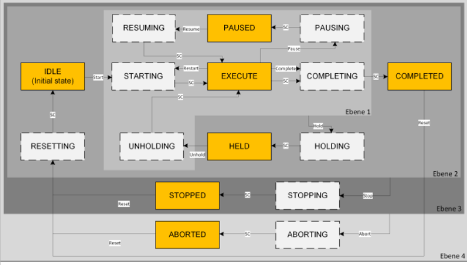
    <figcaption>MTP State Machine</figcaption>
  </figure>
</div>

<div align="center">
  <figure>
    
    <figcaption>PackML State Machine</figcaption>
  </figure>
</div>

Ce que cela nous dit finalement, c'est que chaque équipement, nous utiliserons un Equipement Module afin de l'avoir à disposition dans les deux mondes, donc chaque EM devra pouvoir réagir d'une certaine manière dans un état donné.

Dans le monde orienté objet, cela nous dit que chaque objet Equipement Module doit fournir une série de services, nous utiliserons des méthodes en fonction d'un état donné de la machine.

---

# Module Type Package and PackML
## Le concept
Dans le cadre de ce cours, nous allons travaille sur PackML.
PackML se base sur la structure de ISA-88.

### P&ID schema
<div align="center">
  <figure>
    
    <figcaption>Unit in P&ID represenation</figcaption>
  </figure>
</div>

### UML in ISA-88
We have Unit, EM Equipement Module and CM Control Module

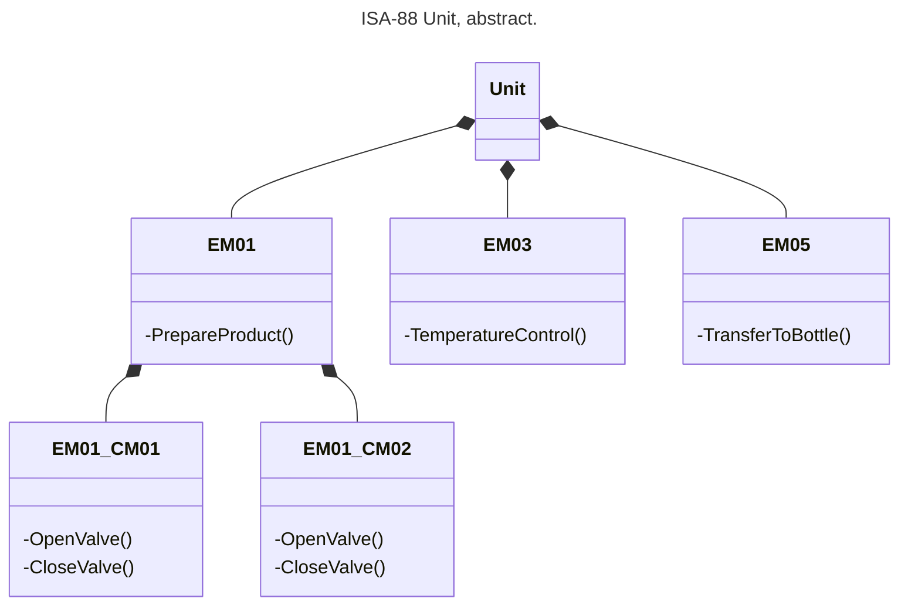

PackML utilise la structure ISA-88, impose des états et des modes de fonctionnement similaires à ISA-88 ainsi qu'une structure de donnée, PackTag qui normalise une strcture pour l'accès aux informations de la machine, dont le système d'alarme.

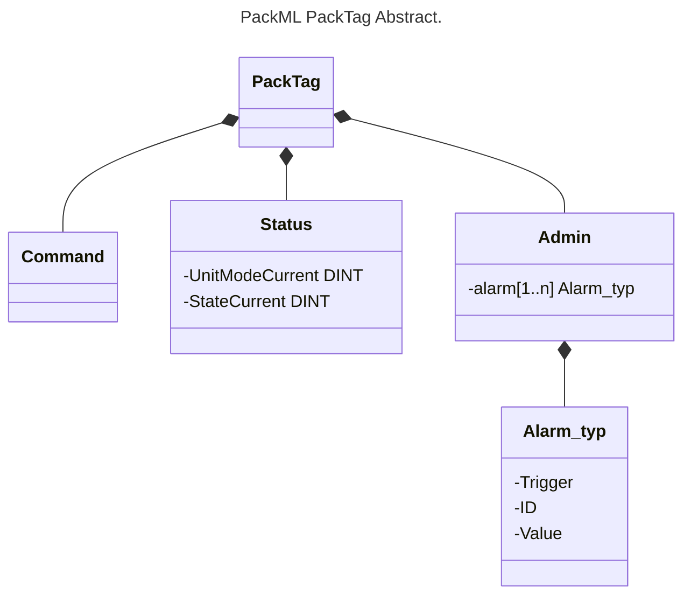

Pour résumer, PackTag que nous développerons et utiliserons plus loin dans le cours est conçu pour permettre une supervision de machines indépendantes via le PackTag qui idéalement utilisera le protocole OPC-UA. Le [PackTag est de plus normalisé dans OPC-UA](https://reference.opcfoundation.org/PackML/v101/docs/) qui fournit une description standardisée du PackTag.

### Une ligne de production selon PackML
<div align="center">
  <figure>
    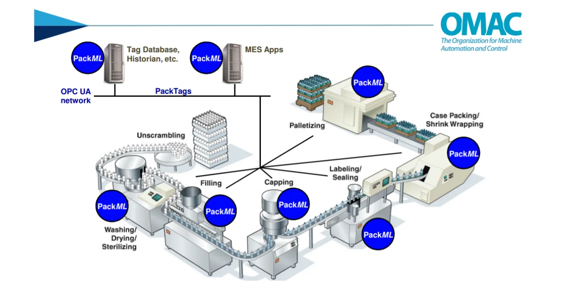
    <figcaption>A connected line with PackML and OPC-UA. Source: OMAC</figcaption>
  </figure>
</div>

La philosophie de MTP, Module Type Package est un peu différente.
- MTP est plus orienté processus Batch alors que PackTag est orienté processus discret.
- PackTag est conçu uniquement pour communiquer au niveau machine/unit, alors que MTP pourrait communiquer au niveau Unit et EM Equipement Module. Un Control Module selon ISA-88 n'étant prévu que pour être entièrement dépendant d'un équipement.
- MTP est conçu pour une intégration complète de plusieur PEA dans un même processus.

#### MTP Overview

<div align="center">
  <figure>
    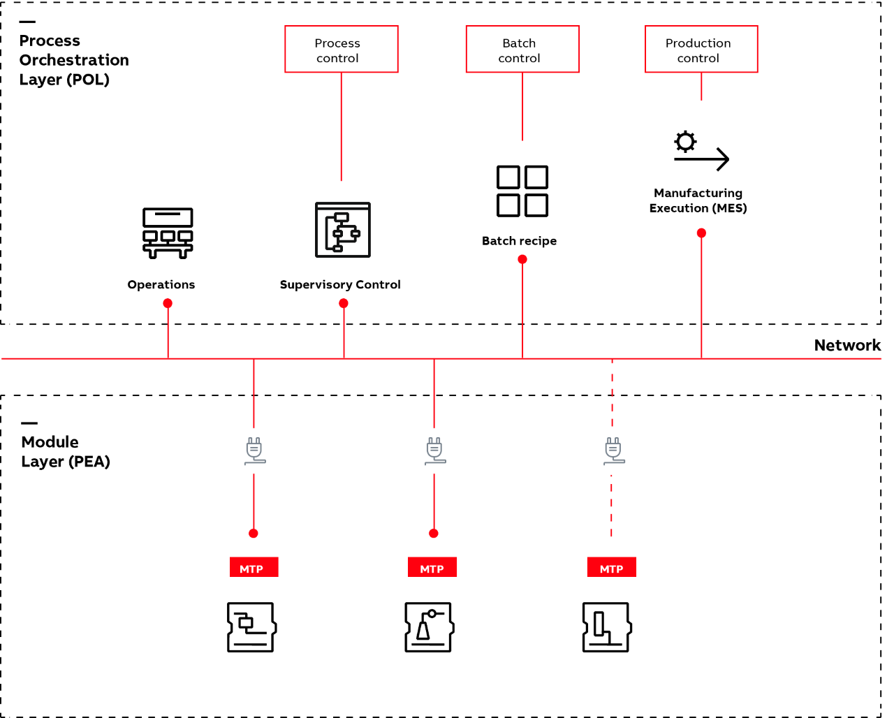
    <figcaption>Process Orchestration Layer and Process Equipment Assemblies, Source: ABB</figcaption>
  </figure>
</div>

MTP va beaucoup plus loin en terme d'intégration. L'objectif des deux standards va dans le même sens. Réduire le temps d'intégration du système d'automation grâce à une architecture standard et modulaire. C'est ceci qui caractérise principalement l'automation avancée à l'heure actuelle.

:bulb: On notera dans la figure [MTP](#mtp-overview) que ce que la partie PLC qui reste le noyau du cours d'automatisation se concentre sur la partie basse, Process Equipment Assemblies. Tout l'aspect supervision sous le label Process Orchestration Layer fait appel à des notions qui sortent du domaine de ce cours.

---

## IEC 61131-3 OO, pour quoi faire ?
Le monde de l'automation dans sa grande majorité a réussi à survivre depuis 1993, date de l'apparition de la norme, sans notions orientées objet.
L'extension OO date de la 3ème édition de 2013. La dernière édition de 2025 n'apporte que des modifications mineures et pourtant, peut de systèmes utilisent réelement ces extensions. Certains fournisseurs majeurs comme Siemens ou Allen-Bradley ne l'utilisent que peu voir pas du tout.

Une des raisons de l'évolution peut se trouver du côté de l'OPC-UA qui permet l'utilisation de méthodes. On peut programmer des méthodes dans un système Siemens TIA Portal, mais au prix de passablement de complexité.

Dans la suite de cours nous allons présenter quelques exemples, ou Use Cases, pour lequels l'utilisation des méthodes lié à l'héritage peut s'avérer particulièrement efficace.

---

## Structure et comportement
J'aime rappeler qu'un système d'automatisation peut se décomposer en deux groupes.

### Une structure
Dans le cas de PackML, cette structure est représentée par le PackTag qui n'est rien d'autre qu'une grande structure.

**Exemple**: PackTag Command

```iecst
TYPE HEVS_PackTag_Command :
STRUCT
  UnitMode              : DINT;
  UnitModeChangeRequest : BOOL;
  MachSpeed             : REAL;
  MaterialIntelock      : DWORD;
  CntrlCmd              : DINT;
  CmdChangeRequest      : BOOL;
  Parameter_Real        : ARRAY[1..HEVS_PackTag_GVL.C_COMMAND_MAXREALPARAMS] OF HEVS_PackTag_Parameter_Real;
  Parameter_String      : ARRAY[1..HEVS_PackTag_GVL.C_COMMAND_MAXSTRINGPARAMS] OF HEVS_PackTag_Parameter_String;
  Parameter_Lreal       : ARRAY[1..HEVS_PackTag_GVL.C_COMMAND_MAXLREALPARAMS] OF  HEVS_PackTag_Parameter_Lreal;
  Parameter_Dint        : ARRAY[1..HEVS_PackTag_GVL.C_COMMAND_MAXDINTPARAMS] OF HEVS_PackTag_Parameter_Dint;
  SelectedRecipe        : DINT;
  RecipeChangeRequest   : BOOL;
  Recipe                : ARRAY[1..HEVS_PackTag_GVL.C_COMMAND_MAXRECIPE] OF HEVS_PackTag_Recipe;
END_STRUCT
END_TYPE
```
Toutes les informations nécessaire au pilotage d'une machine se retrouve au même endroit.

```iecst
// www.hevs.ch
// Institut Systemes Industriels
// Project:  HEVS Pack 2022
// Author:   Cedric Lenoir
// Date:     2024 August 29
//	
// Base GVL for HEVS Pack Tag
// File name should be PackTag
//
{attribute 'qualified_only'}
VAR_GLOBAL
  Command : HEVS_PackTag_Command;
  Status  : HEVS_PackTag_Status;
  Admin   : HEVS_PackTag_Admin;
END_VAR
```

:bulb: Cette structure est systèmatiquement utilisée sur différents projets de la HEVS. Que ce soit sur les machines de laboratoire pour les travaux pratiques ou des projets en batch process voir continuous process. Le gain de temps est considérable, on peut l'estimer à un ou deux mois à comparer à un projet qui nécessiterai un démarrage à zéro.

:warning: l'implémentation actuelle de PackTag HEVS au 17 février 2026 n'inclut pas *encore* les méthodes.

### Un comportement
Dans la dernière remarque du paragraphe précédent, nous avons une première notion de comportement:

> l'implémentation actuelle de PackTag HEVS au 17 février 2026 n'inclut pas *encore* les méthodes.

:bulb: A supposer que OPC-UA soit utilisé pour une interface utilisateur, l'utilisation d'une méthode permet de garantir, par exemple, qu'une commande en écriture ait été exécutée avec succès. Sinon il faudra passer par une phase, souvent compliquée, qui consiste à relire la variable écrite pour valider la communication.

Bien sûr: **no free lunch**, en d'autres termes, il y aura un travail à faire pour permettre l'utilisation des méthodes.

---

# Héritage en IEC 61131-3
## Principe de base
On peut hériter d'un ``Function Block`` ou d'un ``STRUCT``.

### Pour une structure: `EXTENDS`

*Nous avons abordé brièvement l'héritage dans le cours d'automatisation de base.*

```iecst
TYPE ST_DeviceInfo :
STRUCT
  Id   : UDINT;
  Name : STRING;
END_STRUCT
END_TYPE
```
En voulant ajouter un numéro de série simple.

```iecst
TYPE ST_DeviceInfoExtended EXTENDS ST_DeviceInfo:
STRUCT
  SerialNr   : ULINT;
END_STRUCT
END_TYPE
```

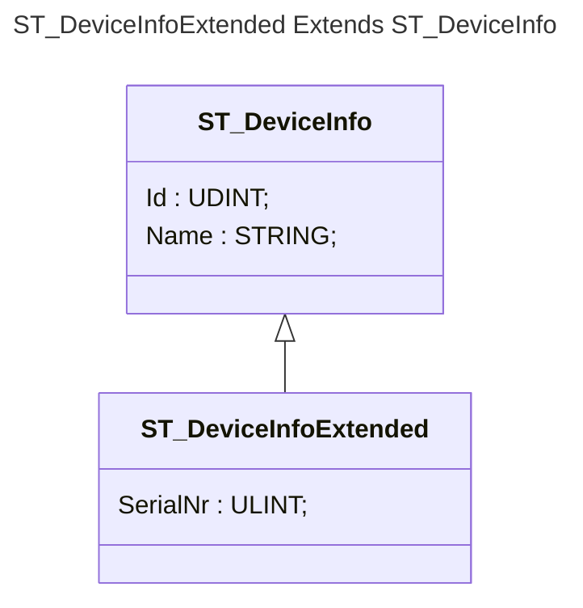

:bulb: Nous aurions pu bien sur utiliser la composition pour créer une nouvelle structure du type:

```iecst
TYPE ST_DeviceInfoCompose:
STRUCT
  stDeviceInfo : ST_DeviceInfo;
  SerialNr     : ULINT;
END_STRUCT
END_TYPE
```

Mais au prix d'une certaine lourdeur au moment de l'utilisation.

```iecst
// Header
  udiMyId              : UDINT;
  stDeviceInfoExtended : ST_DeviceInfoExtended;
  stDeviceInfoCompose  : ST_DeviceInfoCompose;

// Core case Extend
  uliMySerial := stDeviceInfoExtended.Id;
// Core case Compose (no OO)
  uliMySerial := stDeviceInfoCompose.stDeviceInfo.Id;
```

### Pour un Function Block: `EXTENDS`

```iecst
FUNCTION_BLOCK CM_Valve
VAR_INPUT
    Open     : BOOL;
    Close    : BOOL;
END_VAR
VAR_OUTPUT
    IsOpen   : BOOL;
    IsClosed : BOOL;
END_VAR
```
En voulant ajouter un capteur qui vérifie l'état de la vanne.

```iecst
FUNCTION_BLOCK CM_ValveSensor EXTENDS CM_Valve
VAR_INPUT
    Sensor   : BOOL;
END_VAR
VAR_OUTPUT
    Error    : BOOL;
END_VAR
```

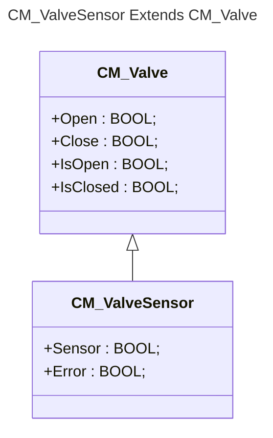

:bulb: Comme pour la structure, nous aurions pu bien sur utiliser la composition pour créer une nouvelle structure du type:

```iecst
FUNCTION_BLOCK CM_ValveCompose
VAR_INPUT
    Sensor   : BOOL;
END_VAR
VAR_OUTPUT
    Error    : BOOL;
END_VAR
VAR
    cmValve  : CM_Valve;
END_VAR
```

Mais au prix d'une certaine lourdeur au moment de l'utilisation.

```iecst
// Header
  xIsOpen        : BOOL;
  cmValveSensor  : CM_ValveSensor;
  cmValveCompose : CM_ValveCompose;

// Core case Extend
  cmValveSensor();
  xIsOpen := cmValveSensor.IsOpen;
// Core case Compose (no OO)
  cmValveCompose();
  xIsOpen := cmValveCompose.cmValve.IsOpen;
```


## Méthodes
Nous décomposons ici les méthodes en deux catégories distinctes, cyclique et asynchrones. Il n'existe strictement aucune différence au niveau des règles de codage selon IEC 61131-3. Mais, les cas d'utilisation sont différents.

Je pense que cette différentiation est importante et elle explique sans doute une partie du peu d'utilisation de IEC 61131-3 orienté objet. Beaucoup de programmeur qui ont l'habitude de travailler en programmation objet de haut niveau ne comprennent souvent pas grand chose à la programmation cyclique et l'usage qu'ils font des méthodes est peu utile en automatisation.

### Méthodes cycliques
:warning: Dans ce premier exemple, nous nous sommes préoccupé uniquement de la **structure**. Mais que ce passe-t-il au niveau du **comportement**.

#### Core of Function Block when Extended
Dans un premier exemple, nous ajoutons uniquement une variable en boucle dans CM_Valve.

```iecst
// Header
FUNCTION_BLOCK CM_Valve
VAR_INPUT
    Open      : BOOL;
    Close     : BOOL;
END_VAR
VAR_OUTPUT
    IsOpen    : BOOL;
    IsClosed  : BOOL;
    IsCounter : ULINT;
END_VAR
```

```iecst
// Core
IsCounter := IsCounter + 1;
```

:interrobang: Que se passe-t-il si j'utilise mes deux Function Blocks `CM_Valve` et `CM_ValveSensor` de la manière suivante:

```iecst
// Header
  uliCountValve       : ULINT := 0;
  uliCountValveSensor : ULINT := 0;
  cmValve             : CM_Valve;
  cmValveSensor       : CM_ValveSensor;
```

```iecst
// Core case Extend
  cmValve();
  uliCountValve := cmValve.IsCounter;
  cmValveSensor();
  uliCountValveSensor := cmValveSensor.IsCounter;
```

:heavy_check_mark: La variable ``uliCountValve`` **s'incrémente** à la vitesse du temps de cycle du programme.
:x: La variable ``uliCountValveSensor`` **reste à 0**.

> D'une certaine manière, quand j'appele un Function Block à chaque cycle, j'appelle sa méthode interne, comme ``cmValve()`` qui l'exécute.

> Si je veux que `CM_ValveSensor` utilise la méthode interne de `CM_Valve` **il faut le préciser explicitement**. C'est la première relative complexité de l'orienté objet.

:bulb: il faut compléter le core de `CM_ValveSensor` de la manière suivante:


```iecst
FUNCTION_BLOCK CM_ValveSensor
// Header....

// Core
// Call core of CM_Valve, that is core of the parent.
SUPER^();
```
Bien sûr, le choix reste au programmeur, mais un Function Block.

Si l'on reprend le cas cité plus haut:

```iecst
// Core case Extend
  cmValve();
  uliCountValve := cmValve.IsCounter;
  cmValveSensor();
  uliCountValveSensor := cmValveSensor.IsCounter;
```

On aura enfin deux compteurs qui s'incrémente à la même vitesse.

Dans le cas où on souhaite un comportement différent pour les deux Function Block, il reste la solution de coder un nouveau compteur sans appel à ``SUPER^()``.

Par exemple:

```iecst
FUNCTION_BLOCK CM_ValveSensor
// Header....

// Core
// Call core of CM_Valve, that is core of the parent.
IsCounter := IsCounter + 2;
```
#### Le cas particulier de VAR_IN_OUT
Vous aurez sans doute remarqué que, hormis le compteur, actuellement ``CM_Valve`` ne fait rien, il n'est pas relié au hardware.

Modifions ``CM_Valve`` avec un liaison au hardware et une logique interne rudimentaire.

```ìecst
TYPE ST_VALVE
   STRUCT
      xOutValve : BOOL;
      xInSensor : BOOL;
   END_STRUCT;
END_TYPE
```

```iecst
// Header
FUNCTION_BLOCK CM_Valve
VAR_INPUT
    Open      : BOOL;
    Close     : BOOL;
END_VAR
VAR_IN_OUT
    io        : ST_VALVE;
END_VAR
VAR_OUTPUT
    IsOpen    : BOOL;
    IsClosed  : BOOL;
    IsCounter : ULINT;
END_VAR
```

```iecst
// Core
IsCounter := IsCounter + 1;
IF Open      AND
   NOT Close THEN
  io.xOutValve := TRUE;
END_IF;
IF NOT Open AND
   Close    THEN
  io.xOutValve := FALSE;
END_IF;
IsOpen := io.xInSensor;
IsClose := NOT io.xInSensor;
```

On a vu, et c'est l'un de ses avantage, que l'écriture ``VAR_IN_OUT`` **impose** de fournir une variable existante en paramètre.

```iecst
// Header
  hwValve         : ST_VALVE;
  hwValveSensor   : ST_VALVE;
  cmValve         : CM_Valve;
  cmValveSensor   : CM_ValveSensor;
```

```iecst
// Core case Extend
  cmValve(io := hwValve);
  cmValveSensor(io := hwValve);
```

:interrobang: en supposant que le core du programme de ``CM_ValveSensor`` reste le même, est-ce que cela va fonctionner ?

```iecst
FUNCTION_BLOCK CM_ValveSensor
// Header....

// Core
// Does it work ?????
SUPER^();
```
Réponse simple: **non**. Et il n'y a aucun risque de se tromper, le compilateur le refusera. Tout simplement parce que ``SUPER^()`` n'est rien d'autre qu'un mot de remplacement pour le Function Block parent similaire à ``cmValve(...)`` qui lui attend un argument en paramètre. Le codage correct sera donc:

```iecst
FUNCTION_BLOCK CM_ValveSensor
// Header....

// Core
// It works
SUPER^(io := hwValve);
```

:bulb: l'utilisation systématique d'une varialble de boucle du type ``uliCountValve := uliCountValve + 1``; même si pas formellement requis peut s'avérer utile en programmation orienté objet. Cela permettra de vérifier rapidement si le Function Block parent est appelé, ou pas.

#### Le lien avec les machines d'état.
Nous avons mentionné en tout début de module les machines d'état. **Quel est le lien ?**

Prenons une machine d'état minimum selon PackML.

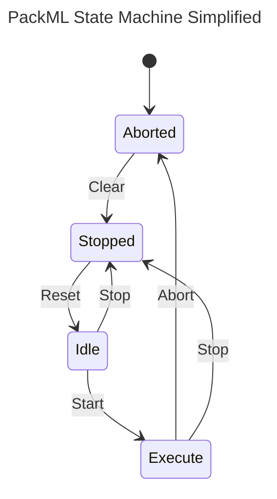

Ce que nous dit PackML, c'est que chaque équipement, ainsi que la machine ne peuvent se trouver que dans un seul état à la fois, et oblitoirement dans ces états.

Reprenons pour cette exemple une partie du [diagramme P&ID ci-dessus](#pid-schema). Un équipement constitué d'une pompe et d'une vanne.

<div align="center">
  <figure>
    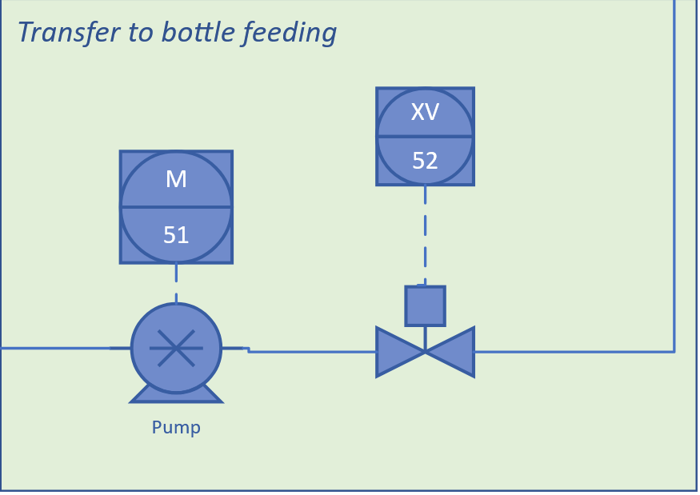
    <figcaption>EM_PumpGroup</figcaption>
  </figure>
</div>

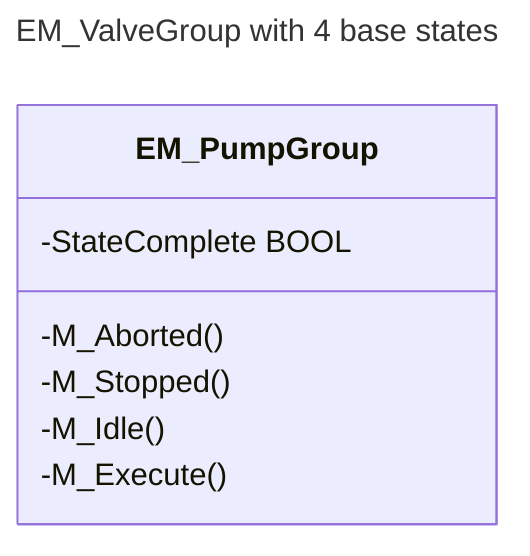

Une programme simplifié de cet équipement nous donne:

```iecst
FUNCTION_BLOCK EM_PumpGroup
VAR
  ePackState  : E_PackState;
END_VAR

// Core
CASE ePackState OF
  E_PackState.Aborted:
    M_Aborted();

  E_PackState.Stopped:
    M_Stopped();

  E_PackState.Idle:
    M_Idle()
  
  E_PackState.Execute:
    M_Execute()
END_CASE
```

Il suffit ensuite de coder chaqune des méthodes pour que l'équipement fasse ce qu'il est sensé faire dans chacun des états.

#### Héritage et surchage de méthode
C'est sous cette forme que l'on trouve le principal avantage des méthodes que j'appelle **cycliques**, c'est à dire qui peuvent être appelées en continu par l'objet lui-même. Noter le préfixe **-** dans le schéma UML, ce qui indique que **la méthode est privée**.

Supposons maintenant qu'il soit nécessaire de créer une nouvelle version de cette pompe, mais uniquement pour l'état **Execute**. Nous pouvons simplement hériter de la première version pour en créer une deuxième.

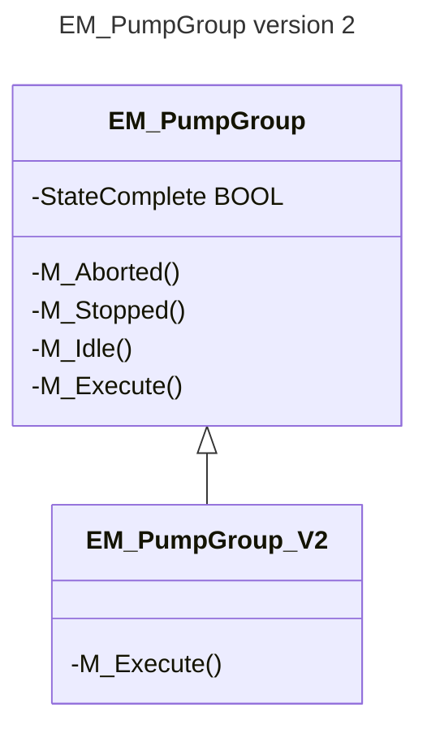

En language IEC 61131-3

```iecst
FUNCTION_BLOCK PUBLIC EM_PumpGroup_V2 EXTENDS EM_PumpGroup
```

La surchage de la méthode se fait via l'IDE en copiant/collant la méthode M_Execute de EM_PumpGroup vers EM_PumpGroup_V2.

<div align="center">
  <figure>
    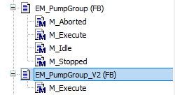
    <figcaption>Surcharge de la méthode M_Execute</figcaption>
  </figure>
</div>

C'est à mon avis, le meilleur exemple d'utilisation de l'héritage que l'on puisse faire en IEC 61131-3. La suite passe par la [notion d'abstraction](#notion-de-abstract).

### Méthodes asynchrones
Ce que j'appelle une méthode asynchrone, c'est une méthode de type single-shot qui permet d'appeler une fonction particulière à un moment donné pour le Function Block.

Reprenons l'exemple de CM Valve vu ci-dessus, mais remplaçons les deux entrées ``Open`` et ``Close`` par des méthodes. 

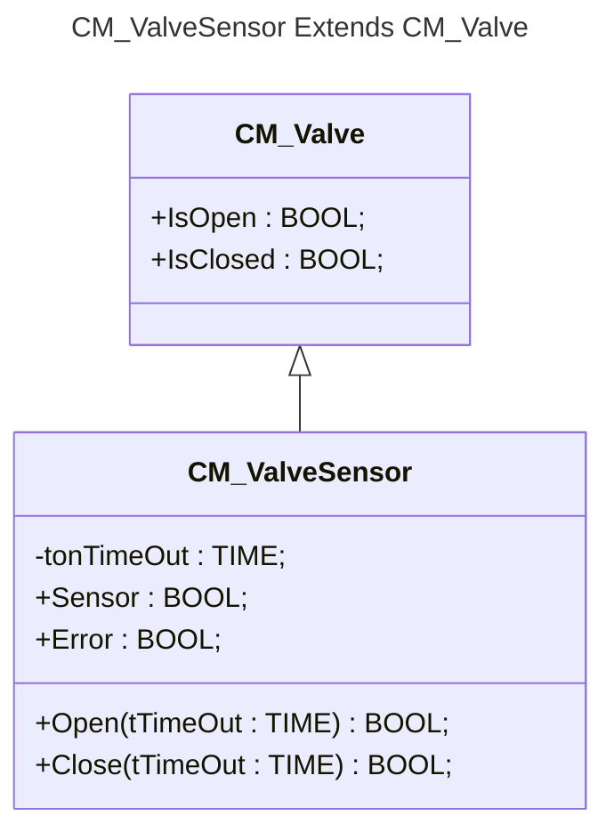

L'avantage de ces méthodes est que:
1.  Il est plus simple de modifier uniquement une partie de CM_ValveSensor en modifiant uniquement les méthodes et pas une autre partie cyclique qui, par exemple gérerai des alarmes.
2.  On peut facilement accéder manuellement à ce Function Block via un protocole comme OPC-UA.

Exemple d'utilisation

```iecst
// If Open is TRUE, then execute something
IF Open(tTimeOut := #T500ms) THEN
  your code here....
END_IF
```

---

# Notion de Abstract
La encore, il ne s'agit pas de rentrer dans les détails de la notion d'abstraction.

L'idée est de montrer ce que l'on peut en faire dans le cadre d'une programmation modulaire.

En IEC 61131-3, il existe la notion d'interface. En quelque mots, une interface permet de faire la liste des méthodes et propriétés qu'un Function Block **doit absolument** implémenter. La particularité de l'interface, c'est qu'elle est purement virtuelle, aucun code n'existe.

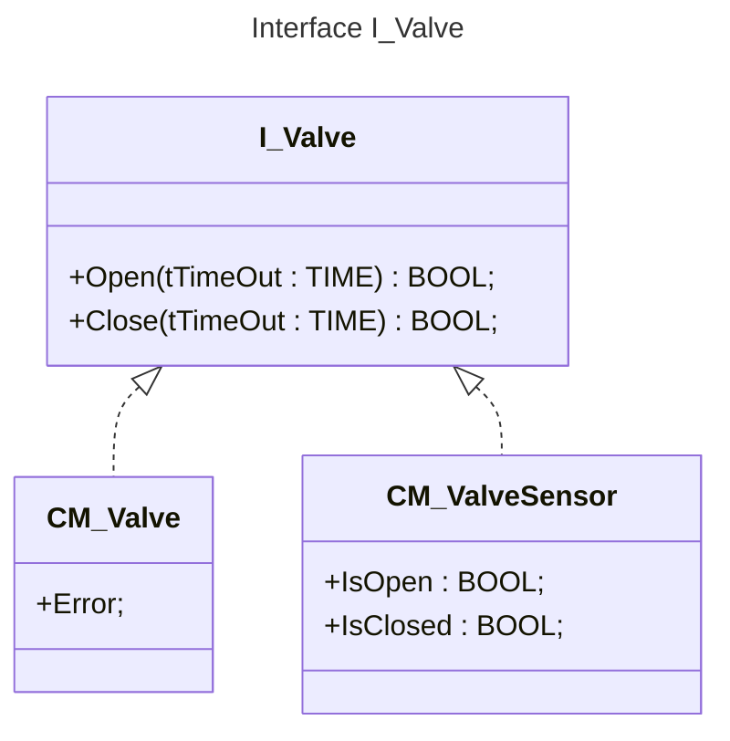

**Ce qui nous intéresse vraiment ici**, c'est un chemin intermédiaire entre l'interface et le *vrai* Function Block, on le dit **Abstract**.

Un Fonction Block abstrait contient déjà du code, mais il est incomplet, c'est un peu comme si on livrait uniquement un chassis pour une voiture. Concrètement, cela signfie qu'**il n'est pas possible d'instancier un Function Block abstrait**.

Nous reprenons l'exemple [EM_PumpGroup ci-dessus](#héritage-et-surchage-de-méthode) avec surchage de méthode. Simplement nous partons de l'idée que nous auront plusieur Equipment Modules qui partagent la même base.

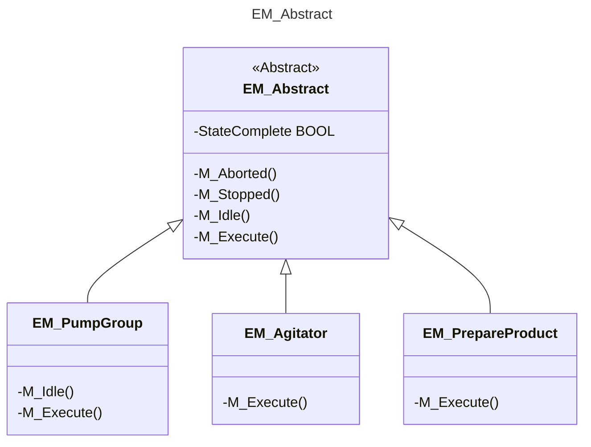

Notre Function Bloc Abstract ressemble plus ou moins à ceci:

```iecst
//
//	www.hevs.ch
//	Institut Systemes Industriels
//	Project: 	HEVS Pack 2022
//	Author:		Cedric Lenoir
//	Date:		2025 July 17
//	
//	Summary:	Control Module Abstract.
//				Cannot be used directly because of no internal logic 
FUNCTION_BLOCK ABSTRACT EM_Abstract
VAR_INPUT
END_VAR
VAR_IN_OUT
  Status_StateCurrent     : DINT;   // has to take the PackTag Status.  StateCurrent
  Status_ModeCurrent      : DINT;   // has to take the PackTag Status ModeCurrent
END_VAR
VAR_OUTPUT
END_VAR
VAR
  // Equipment Module identification.
  uiUniqueId             : USINT;	
  // To be set at init with FB_init, Example:
  usiEquipmentModuleId   : USINT (1..100);

  strEquipmentModuleName : STRING := 'Equipment Module xx';	

  // This Flag is used as result on SC State complete.
  setSC                  : BOOL;
  stActing               : ST_Acting;
  //...
END_VAR
```

Cela signifie qu'il n'est pas possible d'instancier directement ``EM_Abstract``.
Par contre dans ``EM_Absract`` on aura inséré une logique de base qui appelle les différentes méthodes en fonction des états, mais nous créons des méthodes qui ne font rien.

Ensuite, il nous suffit de déclarer nos equipements et de compléter les méthodes des états qui nous intéressent.

```iecst
FUNCTION_BLOCK EM_Agitator EXTENDS EM_Abstract
VAR_INPUT
END_VAR
VAR_OUTPUT
END_VAR
VAR
  uliEmExampleLoop	: ULINT;	
END_VAR
```

---

# Exemples d'apprentissage
Au labo nous allons prendre un ou plusieurs exemples basés sur un Control Module ou un Equipment Module de type Abstract.

---

Pour plus de détails, on peut se référer au [document de référence](./README%20Reference.md) ou aux liens qu'il contient.


<!-- Fin du fichier README.md -->