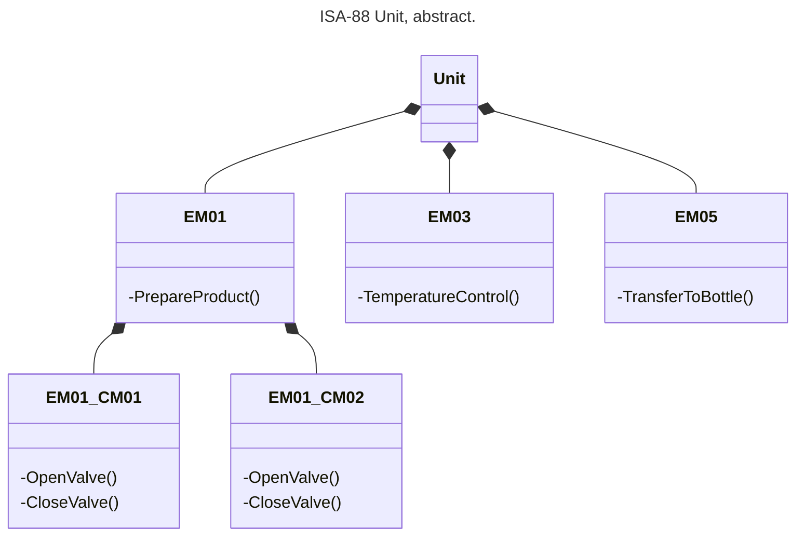
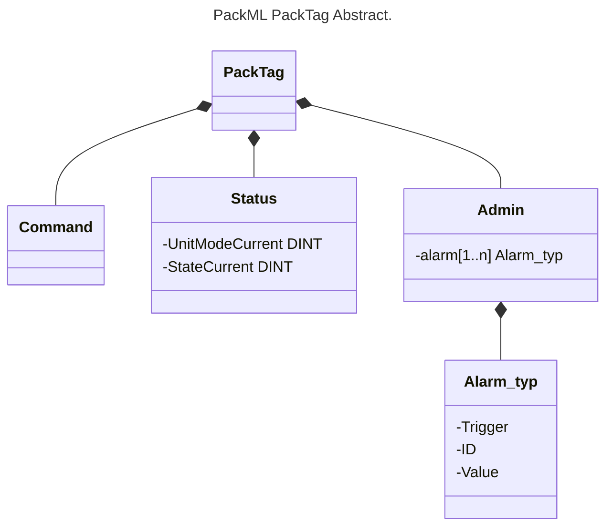
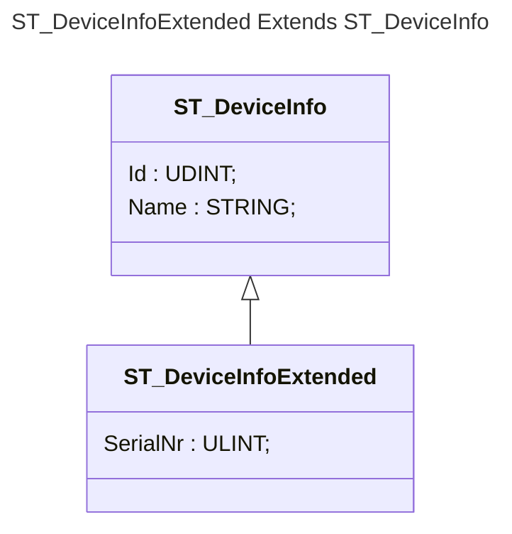
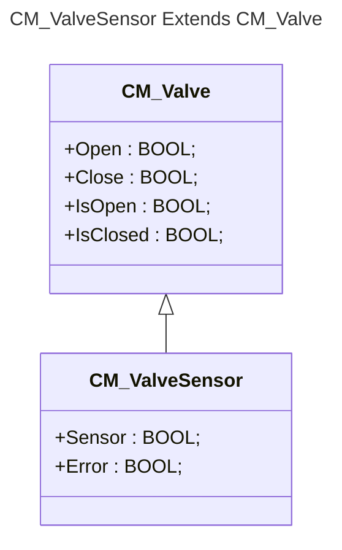
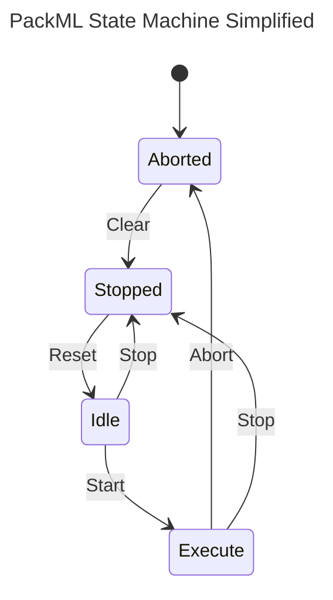
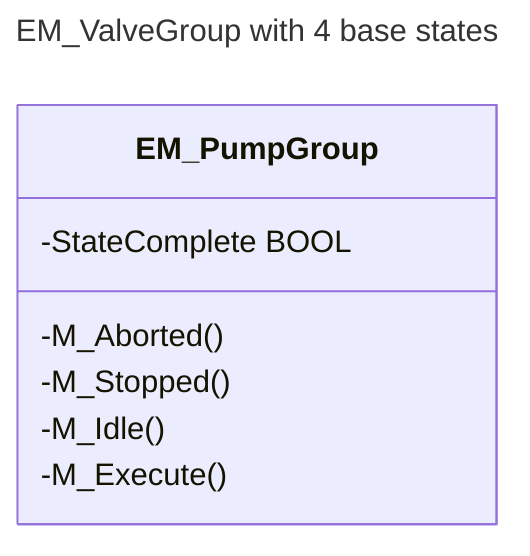
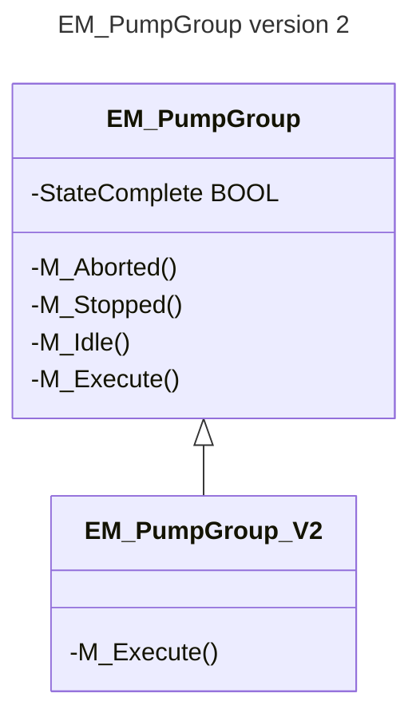
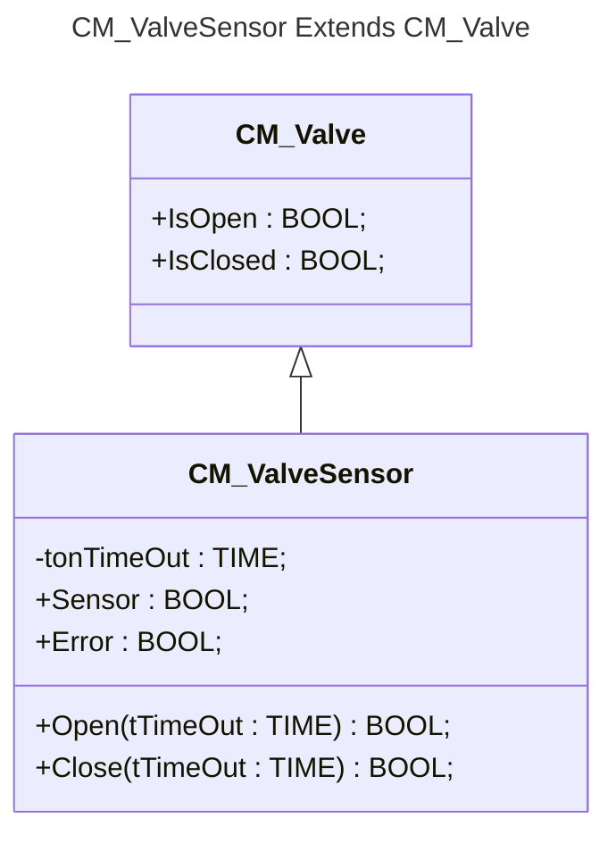
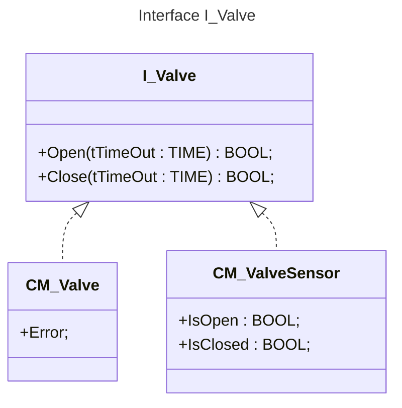
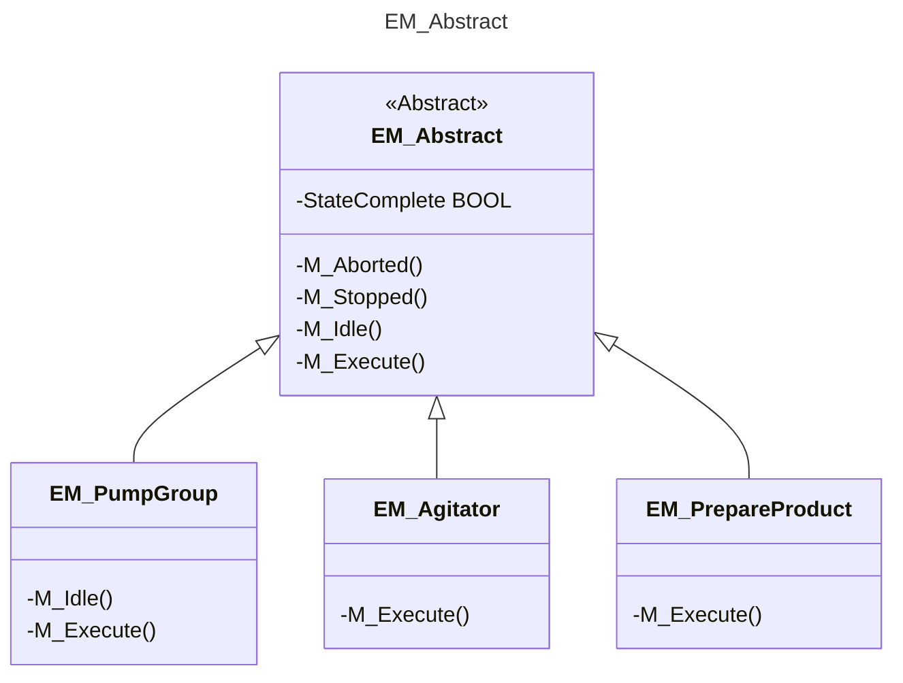

<h1 align="left">
  <br>
  
  <br>
  HEI-Vs Engineering School <h2>AAut Advanced Automation</h2>
  <br>
</h1>

[Cédric Lenoir](mailto:cedric.lenoir@hevs.ch)

# AAut Module 01, OOP Einführung

## Zusammenfassung

- [AAut Module 01, OOP Einführung](#aaut-module-01-oop-einführung)
  - [Zusammenfassung](#zusammenfassung)
- [Vorwort](#vorwort)
- [Teil Eins](#teil-eins)
  - [Überblick](#überblick)
  - [Wichtigste Erkenntnisse](#wichtigste-erkenntnisse)
  - [Was Sie wissen müssen](#was-sie-wissen-müssen)
  - [Schlüsselwörter](#schlüsselwörter)
- [Einleitung](#einleitung)
  - [Objektorientierte Programmierung – Konzepte oder eine Zusammenfassung…](#objektorientierte-programmierung--konzepte-oder-eine-zusammenfassung)
    - [Grundprinzipien](#grundprinzipien)
    - [Vorteile der objektorientierten Programmierung](#vorteile-der-objektorientierten-programmierung)
    - [Die verschiedenen Elemente](#die-verschiedenen-elemente)
    - [Eine Voraussetzung für objektorientierte Programmierung](#eine-voraussetzung-für-objektorientierte-programmierung)
  - [Die Grundlage: Der Function Block](#die-grundlage-der-function-block)
    - [Die Struktur, STRUCT](#die-struktur-struct)
- [Zustandsautomaten vom Typ ISA-88](#zustandsautomaten-vom-typ-isa-88)
- [Module Type Package und PackML](#module-type-package-und-packml)
  - [Das Konzept](#das-konzept)
    - [P\&ID schema](#pid-schema)
    - [UML in ISA-88](#uml-in-isa-88)
    - [Eine Produktionslinie gemäß PackML](#eine-produktionslinie-gemäß-packml)
      - [MTP Overview](#mtp-overview)
  - [IEC 61131-3 OO – Wozu das Ganze?](#iec-61131-3-oo--wozu-das-ganze)
  - [Struktur und Verhalten](#struktur-und-verhalten)
    - [Eine Struktur](#eine-struktur)
    - [Verhalten](#verhalten)
- [Vererbung in IEC 61131-3](#vererbung-in-iec-61131-3)
  - [Grundprinzip](#grundprinzip)
    - [Für eine Struktur: `EXTENDS`](#für-eine-struktur-extends)
    - [Für einen Function Block: `EXTENDS`](#für-einen-function-block-extends)
  - [Methoden](#methoden)
    - [Zyklische Methoden](#zyklische-methoden)
      - [Core of Function Block when Extended](#core-of-function-block-when-extended)
      - [Der Sonderfall von VAR\_IN\_OUT](#der-sonderfall-von-var_in_out)
      - [Der Zusammenhang mit Zustandsautomaten.](#der-zusammenhang-mit-zustandsautomaten)
      - [Methodenvererbung und Überladung](#methodenvererbung-und-überladung)
    - [Asynchrone Methoden](#asynchrone-methoden)
- [Das Konzept der Abstraktion](#das-konzept-der-abstraktion)
- [Lernbeispiele](#lernbeispiele)


# Vorwort
Dieser Abschnitt besteht aus zwei Teilen. Der erste Teil erläutert einige grundlegende Konzepte der objektorientierten Programmierung nach IEC 61131-3, um die objektorientierte Implementierung von PackML zu verstehen.

Der zweite Teil, [eine Referenz in Englisch](README%20Reference.md), basiert auf der Dokumentation von Beckhoff. Aus Zeitgründen können wir jedoch nicht alle Konzepte der objektorientierten Programmierung nach IEC 61131-3 detailliert behandeln. 

:bulb: [Die englische Referenz basiert auf der Beckhoff-Dokumentation, die in deutscher Sprache vorliegt](https://www.google.com/url?sa=t&source=web&rct=j&opi=89978449&url=https://infosys.beckhoff.com/content/1033/tc3_plc_intro/2527303819.html&ved=2ahUKEwit9dWzvOOSAxXW0QIHHaJgOb0QFnoECAYQAQ&usg=AOvVaw3hRE3NELbgB58nTOp2GQrF).

[Eine ältere Referenzversion in Französisch](Programmation_IEC_61131_3_FR.md) wird weiterhin bereitgestellt, da sie eines der wenigen französischsprachigen Dokumente zur objektorientierten Programmierung nach IEC 61131-3 ist.

# Teil Eins


## Überblick
- Vorstellung der wichtigsten OOP-Elemente für IEC 61131-3

- Vor- und Nachteile der objektorientierten Programmierung (OOP)

- Einige UML-Konzepte

> *IEC 61131-3 erlaubt prinzipiell keine dynamische Objektzuweisung. Wir werden die Verwendung von für diesen Kurs angepassten UML-Symbolen spezifizieren.*

## Wichtigste Erkenntnisse
- Verfügbar, aber nicht zwingend erforderlich.

- Vor allem nützlich für in Serie gefertigte Maschinen, die an verschiedene Anwendungen angepasst werden müssen.

- Vorsicht: Kann die Codekomplexität erhöhen und Probleme hinsichtlich Wartung und Robustheit verursachen.

- OOP ist nicht nur ein Syntaxproblem; es ist auch eine Arbeitsmethode, die ohne die OOP-Erweiterungen von 61131-3 implementiert werden kann.

Meines Wissens existierte am 18. Februar 2025 außer der Implementierung von Codesys (https://www.codesys.com/), einem von vielen SPS-Lösungsanbietern weit verbreiteten Compiler, keine weitere Implementierung des IEC-61131-3-OOP-Standards.

BR-Automation, ein Unternehmen der ABB-Gruppe, präsentierte im November 2024 ein entsprechendes Produkt.

Siemens kündigte die Siemens AX-Plattform an, die objektorientierte Programmierung mit Visual Studio Code ermöglichen soll. Stand Februar 2026 ist Siemens AX jedoch nur für eine begrenzte Gruppe von Beta-Nutzern verfügbar.

## Was Sie wissen müssen
- Die verschiedenen Elemente der objektorientierten Programmierung (OOP) 61131-3.

- Hauptvorteil: Polymorphie.

- Verwendung von Schnittstellen und Methoden.

- Das Siemens TIA Portal-System arbeitet ohne OOP.

## Schlüsselwörter
- **inheritance**: Ein Mechanismus, der es einer Klasse ermöglicht, die Eigenschaften und Methoden einer anderen Klasse zu erben.

- **interface**: Eine Menge von Methoden und Eigenschaften, die ohne Implementierung definiert sind und von Klassen implementiert werden können.

- **method**: Eine Funktion oder Prozedur, die in einer Klasse oder einem Funktionsblock definiert ist, um deren Daten zu bearbeiten.

- **override**: Das Überschreiben einer geerbten Methode in einer abgeleiteten Klasse, um deren Verhalten zu ändern.

- **polymorphism**: Die Fähigkeit, Objekte verschiedener Klassen einheitlich über Schnittstellen oder Basisklassen zu behandeln.

- **properties**: Attribute einer Klasse oder eines Funktionsblocks, die über Zugriffsmethoden gelesen oder geschrieben werden können.

- **abstract**: Deklaration einer Klasse oder Methode, die nicht direkt instanziiert werden kann und von einer abgeleiteten Klasse implementiert werden muss.

- **encapsulation**: Gruppierung von Daten und Methoden innerhalb von Klassen mit Zugriffskontrolle zum Schutz der Daten.

- **IDE**: Integrierte Entwicklungsumgebung, ein Softwarewerkzeug mit umfassenden Funktionen für die Softwareentwicklung.

- **UML**: **Unified Modeling Language**: Eine standardisierte Modellierungssprache zur Spezifikation, Visualisierung, Konstruktion und Dokumentation der Artefakte eines Softwaresystems. UML ermöglicht die grafische Darstellung objektorientierter Programmierkonzepte wie Klassen, Objekte, Schnittstellen, Beziehungen, Zustände und Aktivitäten. Sie wird häufig für den Entwurf und die Analyse komplexer Softwaresysteme verwendet.

# Einleitung
Wir beginnen damit, zu erläutern, inwieweit die IEC-61131-3 Strukturierte Textsprache bereits objektorientiert ist, jedoch ohne die spezifischen OOP-Erweiterungen (Objektorientierte Programmierung).


## Objektorientierte Programmierung – Konzepte oder eine Zusammenfassung…

### Grundprinzipien

In der **objektorientierten** Programmierung wird Software in **Objekte** unterteilt. Alle Beschreibungen eines Objekts werden in einem Element, beispielsweise einem Funktionsblock, zusammengefasst. Die Beschreibungen umfassen die dem Objekt zugeordneten Daten und Prozeduren. Darüber hinaus kann eine Schnittstelle für den Zugriff auf das Objekt über Methoden und Eigenschaften definiert werden.

Dieser Programmieransatz ermöglicht somit die Entwicklung von Objekten, die unabhängig und ohne spezifische Bedingungen wiederverwendet werden können. Elemente können unverändert in einer oder mehreren Anwendungen eingesetzt werden.

### Vorteile der objektorientierten Programmierung

Die objektorientierte Programmierung bietet viele Vorteile.

Durch die Unterteilung der Software in Objekte lässt sich eine **übersichtliche** und **gut strukturierte** Anwendung entwickeln. Dadurch sind die Anwendung und ihre einzelnen Elemente leicht **verständlich** und einfach **erweiterbar**. Die **Wiederverwendbarkeit** von Programmierobjekten spart **Zeit** und reduziert die **Kosten** für die Anwendungsentwicklung und -wartung.

### Die verschiedenen Elemente
Eine objektorientierte Programmiersprache (OOP) zeichnet sich durch folgende Elemente aus:

- **Klassen und Objekte**: Klassen definieren abstrakte Datentypen, und Objekte sind Instanzen dieser Klassen.

- **Kapselung**: Daten und Methoden sind in Klassen gruppiert, und der Datenzugriff wird über Methoden gesteuert.

- **Vererbung**: Klassen können Eigenschaften und Methoden von anderen Klassen erben, was die Wiederverwendung von Code ermöglicht.

- **Polymorphismus**: Objekte können als Instanzen ihrer Basisklasse behandelt werden, wodurch gemeinsam genutzte Methoden und Eigenschaften möglich sind.

- **Abstraktion**: Komplexe Details werden verborgen, sodass nur die wesentliche Funktionalität sichtbar ist.

### Eine Voraussetzung für objektorientierte Programmierung
Genauso unrealistisch ist es, ein gutes Automatisierungsprojekt ohne korrekte Spezifikationen zu entwickeln, wie es auch unrealistisch ist, gute Software ohne korrekte Spezifikationen, einschließlich eines **UML**-Diagramms, zu entwickeln. Glücklicherweise steht uns nun ein leistungsstarkes und integriertes Werkzeug zur Verfügung: das Duo **Mermaid Class Diagram und Copilot**.

> Diese Konzepte ermöglichen es uns, Code modular und wiederverwendbar zu strukturieren und so die Softwarewartung und -entwicklung zu erleichtern.

## Die Grundlage: Der Function Block
Die Grundlage der objektorientierten Programmierung gemäß IEC 61131-3 ist ein bekanntes Objekt: der **Function Block**. Er stellt die Hauptelemente bereit: **Klassen und Objekte** sowie das Konzept der **Kapselung**.

> Genauer gesagt:
> > Ein Funktionsbaustein ist eine Klasse, bis er instanziiert wird. Standardmäßig wird das Präfix **FB_** verwendet.

Ein Funktionsbaustein wird zu einem Objekt, sobald er deklariert wird. Das Präfix **fb** wird standardmäßig verwendet.

```iecst
PROGRAM PRG_Test
VAR
  fbU300_D50   : FB_U300_D50;
  fbO300_DL    : FB_O300_DL;
  fbMMS_22_IOL : FB_MMS_22_IOL;
END_VAR
```
Ein Funktionsbaustein ist eine **POU**, Program Organization Unit, die bei ihrer Ausführung einen oder mehrere Werte zurückgibt. Die Werte der Ausgabevariablen und internen Variablen bleiben bis zur nächsten Ausführung erhalten. **Das bedeutet, dass der Funktionsbaustein möglicherweise nicht dieselben Ausgabewerte zurückgibt, wenn er mehrmals mit denselben Eingabevariablen aufgerufen wird.**

### Die Struktur, STRUCT
Die Struktur ist, wie der Funktionsbaustein, **eine Klasse**.

> Genauer gesagt:

> > Eine Struktur ist eine Klasse, bis sie instanziiert wird. Standardmäßig wird das Präfix **ST_** verwendet.

> > Eine Struktur wird zu einem Objekt, sobald sie deklariert wird. Standardmäßig wird das Präfix **st** verwendet.

```ìecst
TYPE ST_ActiveSensor
   STRUCT
      S_PushButon    : BOOL;
      B_SensorActive : BOOL;
      H_LedStation   : BOOL;
   END_STRUCT;
END_TYPE
```

```iecst
PROGRAM PRG_Test
VAR
  stActiveSensor    : ST_ActiveSensor
END_VAR
```
---

# Zustandsautomaten vom Typ ISA-88

Wir müssen zur Einleitung zurückkehren; uns interessiert die modulare Automatisierung. Ob für MTP oder PackML, der Zustandsautomat ist ähnlich.

<div align="center">
  <figure>
    
    <figcaption>MTP State Machine</figcaption>
  </figure>
</div>

<div align="center">
  <figure>
    
    <figcaption>PackML State Machine</figcaption>
  </figure>
</div>

Letztendlich bedeutet dies, dass wir für jedes Gerät ein Gerätemodul verwenden, um es in beiden Welten verfügbar zu machen. Daher muss jedes Gerätemodul in der Lage sein, in einem bestimmten Zustand auf eine bestimmte Weise zu reagieren.

In der objektorientierten Programmierung bedeutet dies, dass jedes Gerätemodul eine Reihe von Diensten bereitstellen muss. Wir verwenden Methoden, die auf einem gegebenen Maschinenzustand basieren.

---

# Module Type Package und PackML
## Das Konzept
In diesem Kurs arbeiten wir mit **PackML**.
PackML basiert auf der **ISA-88**-Architektur.

### P&ID schema
<div align="center">
  <figure>
    
    <figcaption>Unit in P&ID represenation</figcaption>
  </figure>
</div>

### UML in ISA-88
We have Unit, EM Equipement Module and CM Control Module



PackML verwendet die ISA-88-Struktur, definiert Zustände und Betriebsmodi, die ISA-88 ähnlich sind, sowie eine Datenstruktur, PackTag, die eine Struktur für den Zugriff auf Maschineninformationen, einschließlich des Alarmsystems, standardisiert.



Zusammenfassend lässt sich sagen, dass PackTag, das wir im weiteren Verlauf des Kurses entwickeln und einsetzen werden, die Überwachung unabhängiger Maschinen ermöglicht, idealerweise über das OPC-UA-Protokoll. PackTag ist zudem in OPC-UA standardisiert (https://reference.opcfoundation.org/PackML/v101/docs/), welches eine standardisierte Beschreibung von PackTag bereitstellt.

### Eine Produktionslinie gemäß PackML
<div align="center">
  <figure>
    
    <figcaption>A connected line with PackML and OPC-UA. Source: OMAC</figcaption>
  </figure>
</div>

Die Philosophie von **MTP**, **M**odule **T**ype **P**ackage, unterscheidet sich etwas.

– MTP ist stärker chargenorientiert, während PackTag auf Einzelprozesse ausgelegt ist.

– PackTag ist ausschließlich für die Kommunikation auf Maschinen-/Anlagenebene konzipiert, während MTP sowohl auf Anlagen- als auch auf EM-Ebene **E**quipment **M**odule kommunizieren kann. Ein Steuermodul ist gemäß ISA-88 vollständig von einer einzelnen Anlage abhängig.

– MTP ist für die vollständige Integration mehrerer ECMs, Equipment Modules, in einen einzigen Prozess ausgelegt..

#### MTP Overview

<div align="center">
  <figure>
    
    <figcaption>Process Orchestration Layer and Process Equipment Assemblies, Source: ABB</figcaption>
  </figure>
</div>

MTP geht hinsichtlich der Integration deutlich weiter. Das Ziel beider Standards ist deckungsgleich: die Integrationszeit des Automatisierungssystems durch eine standardisierte und modulare Architektur zu verkürzen. Dies ist das Hauptmerkmal moderner Automatisierung.

Beachten Sie in Abbildung [MTP](#mtp-overview), dass sich die SPS-Komponente, die weiterhin den Kern des Automatisierungskurses bildet, auf die untere Ebene, die Prozessanlagenbaugruppen, konzentriert. Der gesamte Überwachungsaspekt, unter der Bezeichnung Prozessorchestrierungsschicht, umfasst Konzepte, die nicht Gegenstand dieses Kurses sind.

---

## IEC 61131-3 OO – Wozu das Ganze?
Die Automatisierungsbranche kommt seit der Einführung des Standards im Jahr 1993 größtenteils ohne objektorientierte Konzepte aus.

Die OO-Erweiterung stammt aus der dritten Ausgabe von 2013. Die neueste Ausgabe von 2025 bringt nur geringfügige Änderungen, und dennoch nutzen nur wenige Systeme diese Erweiterungen. Einige große Anbieter wie Siemens und Allen-Bradley verwenden sie kaum oder gar nicht.

Ein Grund für diese Entwicklung könnte OPC-UA sein, das die Verwendung von Methoden ermöglicht. Methoden lassen sich zwar in einem Siemens TIA Portal-System programmieren, allerdings mit erheblichem Aufwand.

In den folgenden Abschnitten stellen wir einige Beispiele bzw. Anwendungsfälle vor, in denen sich die Verwendung von Methoden in Verbindung mit Vererbung als besonders effektiv erweisen kann.

---

## Struktur und Verhalten
Ich erinnere gerne daran, dass sich ein Automatisierungssystem in zwei Gruppen unterteilen lässt.

### Eine Struktur
Im Fall von PackML wird diese Struktur durch den PackTag repräsentiert, der im Grunde eine große Struktur darstellt.

**Exemple**: PackTag Command

```iecst
TYPE HEVS_PackTag_Command :
STRUCT
  UnitMode              : DINT;
  UnitModeChangeRequest : BOOL;
  MachSpeed             : REAL;
  MaterialIntelock      : DWORD;
  CntrlCmd              : DINT;
  CmdChangeRequest      : BOOL;
  Parameter_Real        : ARRAY[1..HEVS_PackTag_GVL.C_COMMAND_MAXREALPARAMS] OF HEVS_PackTag_Parameter_Real;
  Parameter_String      : ARRAY[1..HEVS_PackTag_GVL.C_COMMAND_MAXSTRINGPARAMS] OF HEVS_PackTag_Parameter_String;
  Parameter_Lreal       : ARRAY[1..HEVS_PackTag_GVL.C_COMMAND_MAXLREALPARAMS] OF  HEVS_PackTag_Parameter_Lreal;
  Parameter_Dint        : ARRAY[1..HEVS_PackTag_GVL.C_COMMAND_MAXDINTPARAMS] OF HEVS_PackTag_Parameter_Dint;
  SelectedRecipe        : DINT;
  RecipeChangeRequest   : BOOL;
  Recipe                : ARRAY[1..HEVS_PackTag_GVL.C_COMMAND_MAXRECIPE] OF HEVS_PackTag_Recipe;
END_STRUCT
END_TYPE
```
Alle Informationen, die zum Betrieb einer Maschine benötigt werden, befinden sich an einem Ort.

```iecst
// www.hevs.ch
// Institut Systemes Industriels
// Project:  HEVS Pack 2022
// Author:   Cedric Lenoir
// Date:     2024 August 29
//	
// Base GVL for HEVS Pack Tag
// File name should be PackTag
//
{attribute 'qualified_only'}
VAR_GLOBAL
  Command : HEVS_PackTag_Command;
  Status  : HEVS_PackTag_Status;
  Admin   : HEVS_PackTag_Admin;
END_VAR
```

:bulb:Diese Struktur wird systematisch in verschiedenen HEVS-Projekten eingesetzt, sowohl auf Labormaschinen für praktische Übungen als auch in Batch- und kontinuierlichen Prozessprojekten. Die Zeitersparnis ist beträchtlich und wird auf ein bis zwei Monate im Vergleich zu einem Projekt geschätzt, das von Grund auf neu entwickelt werden müsste.

:warning: Die aktuelle PackTag HEVS-Implementierung vom 17. Februar 2026 enthält *noch* keine Methoden.

### Verhalten
Im letzten Absatz des vorherigen Abschnitts haben wir eine erste Vorstellung vom Verhalten:

Die aktuelle PackTag HEVS-Implementierung vom 17. Februar 2026 enthält *noch* keine Methoden.

:bulb: Angenommen, OPC-UA wird für eine Benutzerschnittstelle verwendet, ermöglicht uns die Verwendung einer Methode beispielsweise die Gewährleistung, dass ein Schreibbefehl erfolgreich ausgeführt wurde. Andernfalls wäre eine oft komplizierte Phase erforderlich: die Überprüfung der geschriebenen Variable zur Validierung der Kommunikation.

Natürlich ist nichts umsonst, d. h. es ist etwas Aufwand erforderlich, um die Verwendung der Methoden zu ermöglichen.

---

# Vererbung in IEC 61131-3
## Grundprinzip
Sie können von einem ``Function Block`` oder einer ``STRUCT`` erben.

### Für eine Struktur: `EXTENDS`

*Wir haben die Vererbung im Grundlagenkurs Automatisierung kurz behandelt.*

```iecst
TYPE ST_DeviceInfo :
STRUCT
  Id   : UDINT;
  Name : STRING;
END_STRUCT
END_TYPE
```
Indem ich versuchte, eine einfache Seriennummer hinzuzufügen.

```iecst
TYPE ST_DeviceInfoExtended EXTENDS ST_DeviceInfo:
STRUCT
  SerialNr   : ULINT;
END_STRUCT
END_TYPE
```



:bulb: Wir hätten natürlich auch die Komposition nutzen können, um eine neue Struktur des folgenden Typs zu erstellen:

```iecst
TYPE ST_DeviceInfoCompose:
STRUCT
  stDeviceInfo : ST_DeviceInfo;
  SerialNr     : ULINT;
END_STRUCT
END_TYPE
```

Allerdings ist die Anwendung dadurch etwas umständlich.

```iecst
// Header
  udiMyId              : UDINT;
  stDeviceInfoExtended : ST_DeviceInfoExtended;
  stDeviceInfoCompose  : ST_DeviceInfoCompose;

// Core case Extend
  uliMySerial := stDeviceInfoExtended.Id;
// Core case Compose (no OO)
  uliMySerial := stDeviceInfoCompose.stDeviceInfo.Id;
```

### Für einen Function Block: `EXTENDS`

```iecst
FUNCTION_BLOCK CM_Valve
VAR_INPUT
    Open     : BOOL;
    Close    : BOOL;
END_VAR
VAR_OUTPUT
    IsOpen   : BOOL;
    IsClosed : BOOL;
END_VAR
```
Indem ich einen Sensor hinzufügen möchte, der den Status des Ventils überprüft.

```iecst
FUNCTION_BLOCK CM_ValveSensor EXTENDS CM_Valve
VAR_INPUT
    Sensor   : BOOL;
END_VAR
VAR_OUTPUT
    Error    : BOOL;
END_VAR
```



:bulb: Wie bei der Struktur hätten wir natürlich auch die Komposition nutzen können, um eine neue Struktur des folgenden Typs zu erstellen:

```iecst
FUNCTION_BLOCK CM_ValveCompose
VAR_INPUT
    Sensor   : BOOL;
END_VAR
VAR_OUTPUT
    Error    : BOOL;
END_VAR
VAR
    cmValve  : CM_Valve;
END_VAR
```

Allerdings ist die Anwendung dadurch etwas umständlich.

```iecst
// Header
  xIsOpen        : BOOL;
  cmValveSensor  : CM_ValveSensor;
  cmValveCompose : CM_ValveCompose;

// Core case Extend
  cmValveSensor();
  xIsOpen := cmValveSensor.IsOpen;
// Core case Compose (no OO)
  cmValveCompose();
  xIsOpen := cmValveCompose.cmValve.IsOpen;
```

## Methoden
Hier unterteilen wir Methoden in zwei Kategorien: zyklische und asynchrone. Die Codierungsregeln gemäß IEC 61131-3 sind identisch. Die Anwendungsfälle unterscheiden sich jedoch.

Diese Unterscheidung ist wichtig und erklärt vermutlich einen Teil der begrenzten Verbreitung des objektorientierten IEC 61131-3. Viele Programmierer, die mit objektorientierter Programmierung auf hohem Niveau vertraut sind, verstehen zyklische Programmierung oft nur unzureichend, und ihre Methodenverwendung bringt bei der Automatisierung wenig Nutzen.

### Zyklische Methoden
:warning: In diesem ersten Beispiel haben wir uns ausschließlich auf die **Struktur** konzentriert. Doch wie sieht es mit dem **Verhalten** aus?

#### Core of Function Block when Extended
In einem ersten Beispiel fügen wir CM_Valve lediglich eine Variable in einer Schleife hinzu.

```iecst
// Header
FUNCTION_BLOCK CM_Valve
VAR_INPUT
    Open      : BOOL;
    Close     : BOOL;
END_VAR
VAR_OUTPUT
    IsOpen    : BOOL;
    IsClosed  : BOOL;
    IsCounter : ULINT;
END_VAR
```

```iecst
// Core
IsCounter := IsCounter + 1;
```

:interrobang: Was passiert, wenn ich meine beiden Funktionsbausteine ​​`CM_Valve` und `CM_ValveSensor` folgendermaßen verwende:

```iecst
// Header
  uliCountValve       : ULINT := 0;
  uliCountValveSensor : ULINT := 0;
  cmValve             : CM_Valve;
  cmValveSensor       : CM_ValveSensor;
```

```iecst
// Core case Extend
  cmValve();
  uliCountValve := cmValve.IsCounter;
  cmValveSensor();
  uliCountValveSensor := cmValveSensor.IsCounter;
```

:heavy_check_mark: Die Variable ``uliCountValve`` wird mit der Programmzykluszeit inkrementiert.

:x: Die Variable ``uliCountValveSensor`` bleibt bei 0.

> In gewisser Weise rufe ich mit jedem Aufruf eines Funktionsblocks in einem Zyklus dessen interne Methode auf, beispielsweise ``cmValve()``, die ihn ausführt.

> Soll `CM_ValveSensor` die interne Methode von `CM_Valve` verwenden, **muss dies explizit angegeben werden**. Dies ist die erste relative Komplexität der objektorientierten Programmierung.

:bulb: Der Kern von `CM_ValveSensor` muss wie folgt vervollständigt werden:


```iecst
FUNCTION_BLOCK CM_ValveSensor
// Header....

// Core
// Call core of CM_Valve, that is core of the parent.
SUPER^();
```
Die Entscheidung liegt natürlich weiterhin beim Programmierer, aber ein Funktionsbaustein.

Nehmen wir den oben genannten Fall:

```iecst
// Core case Extend
  cmValve();
  uliCountValve := cmValve.IsCounter;
  cmValveSensor();
  uliCountValveSensor := cmValveSensor.IsCounter;
```

Wir haben dann endlich zwei Zähler, die sich im gleichen Tempo erhöhen.

Sollten die beiden Funktionsblöcke unterschiedliches Verhalten zeigen, können wir weiterhin einen neuen Zähler programmieren, ohne einen Funktionsblock aufzurufen.``SUPER^()``.

Par exemple:

```iecst
FUNCTION_BLOCK CM_ValveSensor
// Header....

// Core
// Call core of CM_Valve, that is core of the parent.
IsCounter := IsCounter + 2;
```

#### Der Sonderfall von VAR_IN_OUT
Sie haben wahrscheinlich bemerkt, dass ``CM_Valve`` außer dem Zähler derzeit keine Funktion hat; es ist nicht mit der Hardware verbunden.

Wir werden ``CM_Valve`` nun mit einer Hardwareverbindung und etwas grundlegender interner Logik ausstatten.

```ìecst
TYPE ST_VALVE
   STRUCT
      xOutValve : BOOL;
      xInSensor : BOOL;
   END_STRUCT;
END_TYPE
```

```iecst
// Header
FUNCTION_BLOCK CM_Valve
VAR_INPUT
    Open      : BOOL;
    Close     : BOOL;
END_VAR
VAR_IN_OUT
    io        : ST_VALVE;
END_VAR
VAR_OUTPUT
    IsOpen    : BOOL;
    IsClosed  : BOOL;
    IsCounter : ULINT;
END_VAR
```

```iecst
// Core
IsCounter := IsCounter + 1;
IF Open      AND
   NOT Close THEN
  io.xOutValve := TRUE;
END_IF;
IF NOT Open AND
   Close    THEN
  io.xOutValve := FALSE;
END_IF;
IsOpen := io.xInSensor;
IsClose := NOT io.xInSensor;
```

Wir haben gesehen, und das ist einer ihrer Vorteile, dass die Notation ``VAR_IN_OUT`` die Angabe einer bereits existierenden Variable als Parameter **erfordert**.

```iecst
// Header
  hwValve         : ST_VALVE;
  hwValveSensor   : ST_VALVE;
  cmValve         : CM_Valve;
  cmValveSensor   : CM_ValveSensor;
```

```iecst
// Core case Extend
  cmValve(io := hwValve);
  cmValveSensor(io := hwValve);
```

:interrobang: Unter der Annahme, dass der Kern des Programms `CM_ValveSensor` unverändert bleibt, wird es dann funktionieren?

```iecst
FUNCTION_BLOCK CM_ValveSensor
// Header....

// Core
// Does it work ?????
SUPER^();
```
Kurze Antwort: **Nein**. Und es besteht kein Risiko, einen Fehler zu machen; der Compiler wird ihn ablehnen. Ganz einfach, weil ``SUPER^()`` lediglich ein Platzhalter für den übergeordneten Funktionsblock ist, ähnlich wie ``cmValve(...)``, der ein Argument als Parameter erwartet. Der korrekte Code lautet daher:

```iecst
FUNCTION_BLOCK CM_ValveSensor
// Header....

// Core
// It works
SUPER^(io := hwValve);
```

:bulb: Die systematische Verwendung einer Schleifenvariablen vom Typ ``uliCountValve := uliCountValve + 1`` kann sich, auch wenn sie formal nicht erforderlich ist, in der objektorientierten Programmierung als nützlich erweisen. Dies ermöglicht eine schnelle Überprüfung, ob der übergeordnete Funktionsblock aufgerufen wird oder nicht.

#### Der Zusammenhang mit Zustandsautomaten.

Wir haben Zustandsautomaten ganz am Anfang des Moduls erwähnt. **Welcher Zusammenhang besteht?**

Betrachten wir einen minimalen Zustandsautomaten gemäß PackML.



PackML besagt, dass sich jedes Gerät sowie die Maschine selbst jeweils nur in einem Zustand befinden können und in diesem Zustand verbleiben müssen.

Betrachten wir dazu in diesem Beispiel einen Ausschnitt aus dem [oben stehenden R&I-Fließbild](#pid-schema). Ein Gerät besteht aus einer Pumpe und einem Ventil.

<div align="center">
  <figure>
    
    <figcaption>EM_PumpGroup</figcaption>
  </figure>
</div>



Ein vereinfachtes Programm für diese Geräte ergibt Folgendes:

```iecst
FUNCTION_BLOCK EM_PumpGroup
VAR
  ePackState  : E_PackState;
END_VAR

// Core
CASE ePackState OF
  E_PackState.Aborted:
    M_Aborted();

  E_PackState.Stopped:
    M_Stopped();

  E_PackState.Idle:
    M_Idle()
  
  E_PackState.Execute:
    M_Execute()
END_CASE
```

Dann müssen wir nur noch jede Methode so programmieren, dass das Gerät in jedem Zustand seine vorgesehene Funktion erfüllt.

#### Methodenvererbung und Überladung
Hier liegt der Hauptvorteil sogenannter **zyklischer** Methoden. Diese können vom Objekt selbst kontinuierlich aufgerufen werden. Beachten Sie das Präfix **-** im UML-Diagramm. Es zeigt an, dass die Methode **privat** ist.

Angenommen, wir benötigen eine neue Version dieser Pumpe, jedoch nur für den Zustand **Ausführen**. Wir können einfach von der ersten Version erben, um eine zweite zu erstellen.



En language IEC 61131-3

```iecst
FUNCTION_BLOCK PUBLIC EM_PumpGroup_V2 EXTENDS EM_PumpGroup
```

Die Methode wird über die IDE überschrieben, indem die M_Execute-Methode von EM_PumpGroup nach EM_PumpGroup_V2 kopiert und eingefügt wird.

<div align="center">
  <figure>
    
    <figcaption>Überladen der M_Execute-Methode</figcaption>
  </figure>
</div>

Meiner Meinung nach ist dies das beste Beispiel für die Verwendung von Vererbung in IEC 61131-3. Der Rest betrifft das [Konzept der Abstraktion](#das-konzept-der-abstraktion).

### Asynchrone Methoden
Eine asynchrone Methode ist eine einmalige Methode, die es ermöglicht, eine bestimmte Funktion des Funktionsbausteins zu einem festgelegten Zeitpunkt aufzurufen.

Nehmen wir das Beispiel des CM-Ventils von oben, ersetzen wir jedoch die beiden Eingänge „Öffnen“ und „Schließen“ durch Methoden.



Der Vorteil dieser Methoden liegt darin:

1. Es ist einfacher, nur einen Teil des Funktionsbausteins CM_ValveSensor zu modifizieren, indem lediglich die Methoden angepasst werden und nicht ein anderer zyklischer Teil, der beispielsweise Alarme verwaltet.

2. Dieser Funktionsbaustein kann über ein Protokoll wie OPC-UA einfach manuell aufgerufen werden.

Anwendungsbeispiel

```iecst
// If Open is TRUE, then execute something
IF Open(tTimeOut := #T500ms) THEN
  your code here....
END_IF
```

---

# Das Konzept der Abstraktion
Wir werden hier nicht näher auf das Konzept der Abstraktion eingehen.

Es geht vielmehr darum, seine Anwendung im Kontext der modularen Programmierung zu demonstrieren.

In IEC 61131-3 wird das Konzept der Schnittstelle definiert. Kurz gesagt, ermöglicht eine Schnittstelle die Auflistung der Methoden und Eigenschaften, die ein Funktionsbaustein implementieren **muss**. Das definierende Merkmal einer Schnittstelle ist ihre rein virtuelle Natur; es existiert kein Code.



**Was uns hier wirklich interessiert**, ist ein Zwischenschritt zwischen der Schnittstelle und dem *eigentlichen* Funktionsbaustein; wir nennen ihn **Abstract**.

Ein abstrakter Funktionsbaustein enthält bereits Code, ist aber unvollständig. Es ist vergleichbar mit der Lieferung eines Autochassis ohne weitere Komponenten. Praktisch bedeutet dies, dass **ein abstrakter Funktionsbaustein nicht instanziiert werden kann**.

Wir werden das Beispiel [EM_PumpGroup](#inheritance-and-method-overriding oben) mit Methodenüberladung erneut betrachten. Wir gehen dabei von der Prämisse aus, dass wir mehrere Gerätemodule haben, die dieselbe zugrundeliegende Struktur teilen.



Unser Funktionsblock-Abstract sieht in etwa so aus:

```iecst
//
//	www.hevs.ch
//	Institut Systemes Industriels
//	Project: 	HEVS Pack 2022
//	Author:		Cedric Lenoir
//	Date:		2025 July 17
//	
//	Summary:	Control Module Abstract.
//				Cannot be used directly because of no internal logic 
FUNCTION_BLOCK ABSTRACT EM_Abstract
VAR_INPUT
END_VAR
VAR_IN_OUT
  Status_StateCurrent     : DINT;   // has to take the PackTag Status.  StateCurrent
  Status_ModeCurrent      : DINT;   // has to take the PackTag Status ModeCurrent
END_VAR
VAR_OUTPUT
END_VAR
VAR
  // Equipment Module identification.
  uiUniqueId             : USINT;	
  // To be set at init with FB_init, Example:
  usiEquipmentModuleId   : USINT (1..100);

  strEquipmentModuleName : STRING := 'Equipment Module xx';	

  // This Flag is used as result on SC State complete.
  setSC                  : BOOL;
  stActing               : ST_Acting;
  //...
END_VAR
```

Das bedeutet, dass ``EM_Abstract`` nicht direkt instanziiert werden kann.

Innerhalb von ``EM_Abstract`` wird jedoch eine grundlegende Logik implementiert, die je nach Zustand verschiedene Methoden aufruft. Diese Methoden sind allerdings zunächst inaktiv.

Anschließend müssen wir lediglich unsere Ausrüstung deklarieren und die Methoden für die relevanten Zustände vervollständigen.

```iecst
FUNCTION_BLOCK EM_Agitator EXTENDS EM_Abstract
VAR_INPUT
END_VAR
VAR_OUTPUT
END_VAR
VAR
  uliEmExampleLoop	: ULINT;	
END_VAR
```

---

# Lernbeispiele
Im Labor werden wir ein oder mehrere Beispiele anhand eines abstrakten Steuermoduls oder eines Gerätemoduls verwenden.

---

Weitere Details finden Sie im [Referenzdokument](./README%20Reference.md) oder in den darin enthaltenen Links.


<!-- Fin du fichier README.md -->