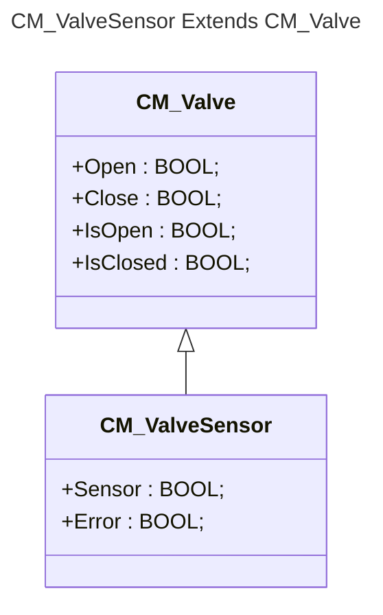

```iecst
FUNCTION_BLOCK CM_Valve
VAR_INPUT
    Open     : BOOL;
    Close    : BOOL;
END_VAR
VAR_OUTPUT
    IsOpen   : BOOL;
    IsClosed : BOOL;
END_VAR
```
En voulant ajouter un capteur qui vérifie l'état de la vanne.

```iecst
FUNCTION_BLOCK CM_ValveSensor EXTENDS CM_Valve
VAR_INPUT
    Sensor   : BOOL;
END_VAR
VAR_OUTPUT
    Error    : BOOL;
END_VAR
```



:bulb: Comme pour la structure, nous aurions pu bien sur utiliser la composition pour créer une nouvelle structure du type:

```iecst
FUNCTION_BLOCK CM_ValveCompose
VAR_INPUT
    Sensor   : BOOL;
END_VAR
VAR_OUTPUT
    Error    : BOOL;
END_VAR
VAR
    cmValve  : CM_Valve;
END_VAR
```

Mais au prix d'une certaine lourdeur au moment de l'utilisation.

```iecst
// Header
  xIsOpen        : BOOL;
  cmValveSensor  : CM_ValveSensor;
  cmValveCompose : CM_ValveCompose;

// Core case Extend
  xIsOpen := cmValveSensor.IsOpen;
// Core case Compose (no OO)
  xIsOpen := cmValveCompose.cmValve.IsOpen;
```
