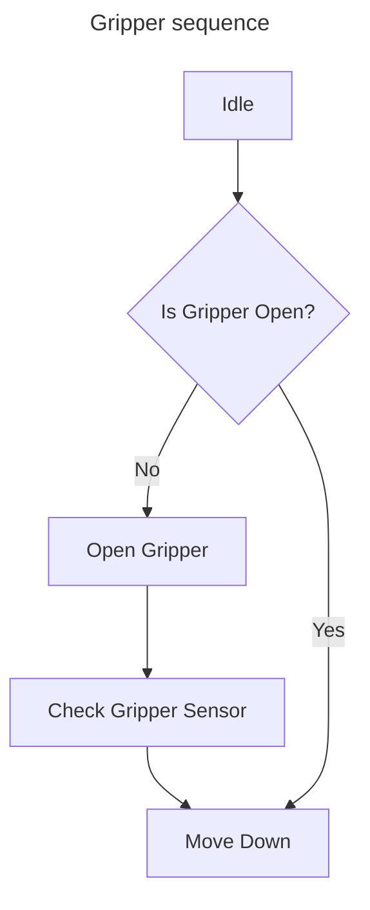
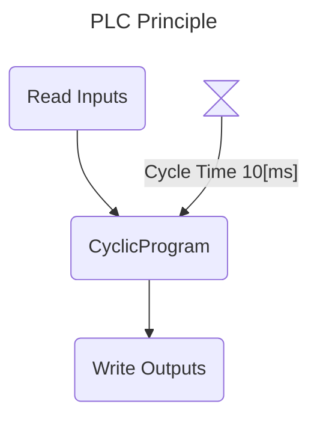
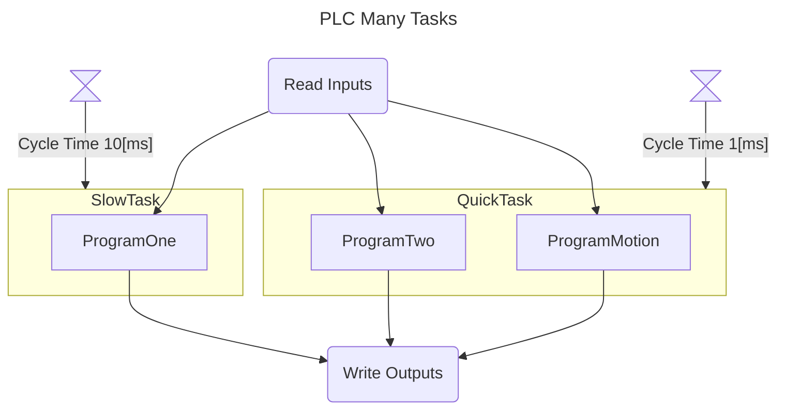
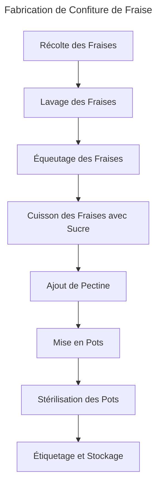
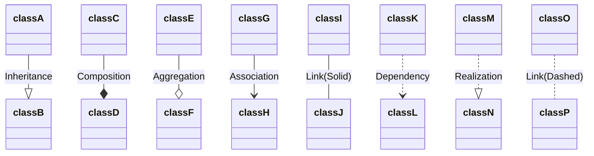
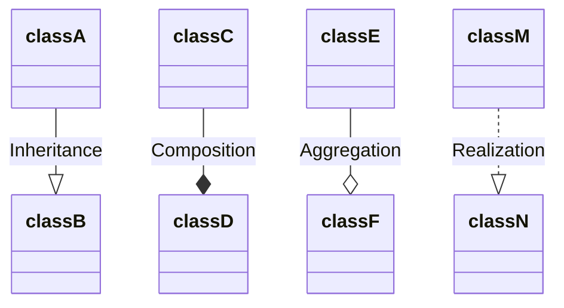
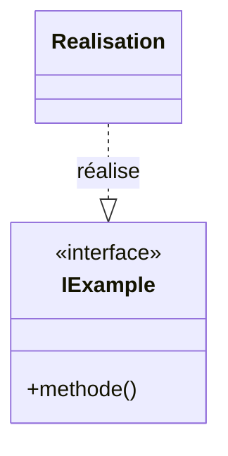
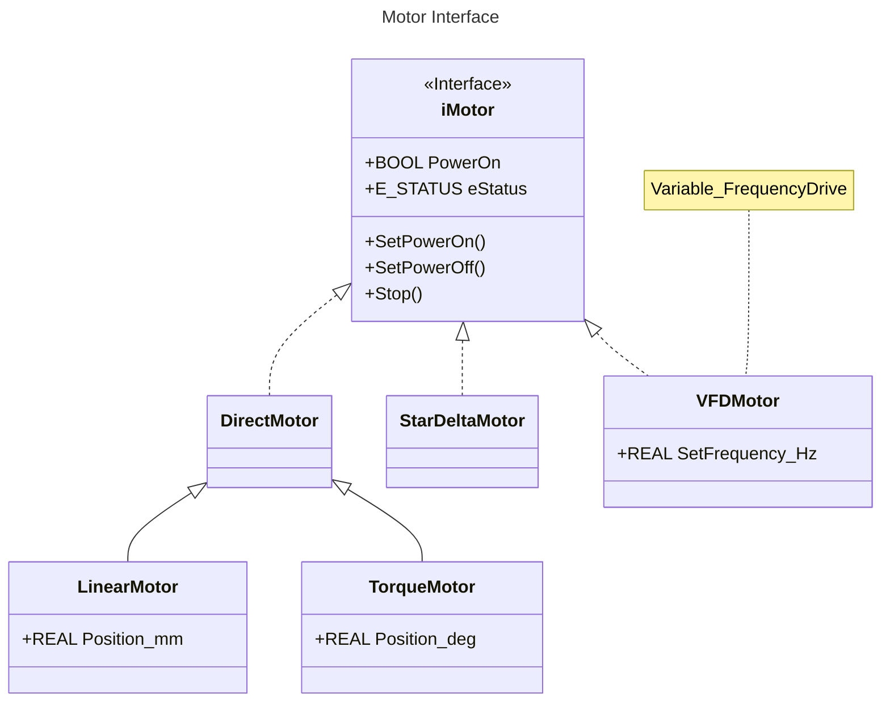
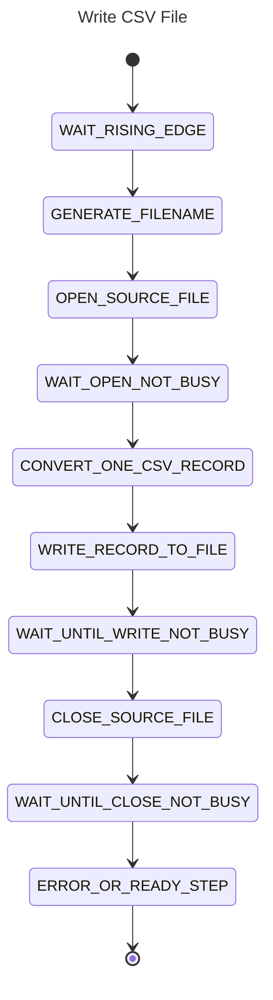
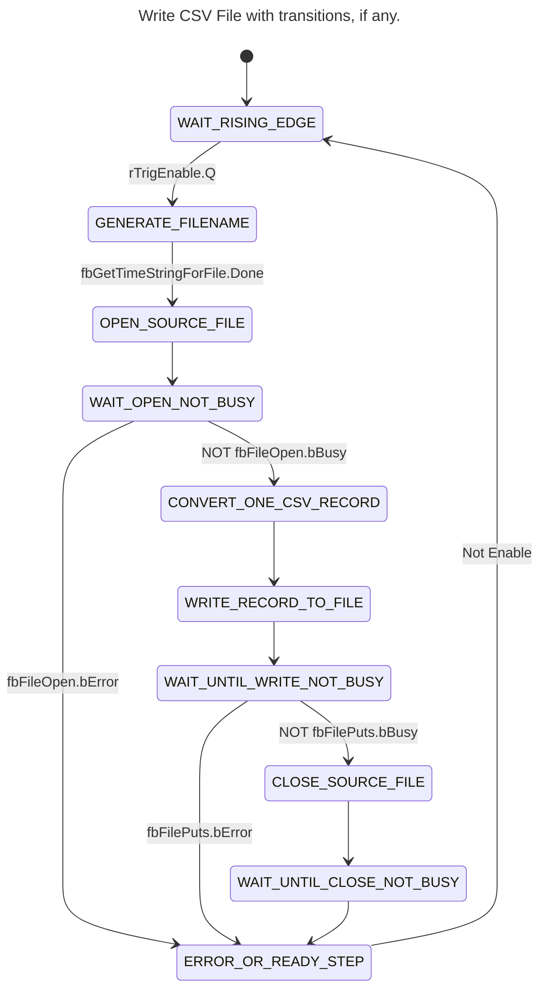

<h1 align="left">
   
  
   
  HEI-Vs Engineering School <h2>AAut Advanced Automation </h2>
   
</h1>

[Cédric Lenoir](mailto:cedric.lenoir@hevs.ch)

# Module 01 /  System Engineering

## Aperçu
Ce module présente les outils de base de modélisation d'un sytème d'automation inspiré par [SysML](https://sysml.org/).
Il présente aussi une série d'outils Open Source qui permettent de mettre en application la théorie en utilisant des outils actuels et disponibles librement dans le cadre des cours dispensés par la HEVS.

## Ce qu'il faut retenir
Ce cours présente une méthode de travail qui permet de:
- modéliser une partie du code en adaptant certains outils standards aux spécificités du PLC.
- générer une partie du code à l'aide d'une AI générative, en l'occurence ici Copilot dans [Visual Studio Code](https://code.visualstudio.com/).
- documenter le code, en particulier à l'aide des outils [Mermaid.js](https://mermaid.js.org/)
- on présentera aussi Node-RED dont la palette [Dashboard 2.0](https://dashboard.flowfuse.com/) permet d'intégrer de la documentation sous forme [Markdown](https://www.markdownguide.org) directement dans l'interace utilisateur.

> Les outils présentés ici ne se substituent pas aux environnements de développement classiques fournis par les fabricants de PLC, mais ils les complémentent.

## Ce qu'il faut savoir
Il faut être capable d'utiliser et coder trois types de diagrammes qui seront utilisé dans les cours d'automation.
- Class ou Object diagrames, Block Definition Diagram selon l'appelation SysML.
- Flowchart diagrams, ou Activity Diagram selon l'appelation SysML.
- State diagrams, ou A StateMachine diagram selon l'appelation SysML.

Les diagrammes choisis ne respectent pas la définitions stricte de SysML, mais de même, il n'existe pas de diagrammes permettant une représentation stricte de la norme IEC-61131-3, en particulier le fonctionnement propres au bloques fonctionnels.

Nous utiliserons la base [Mermaid](https://mermaid.js.org) pour représenter ces diagrammes dans des documents [Markdown](https://www.markdownguide.org/).
Ces représentations offrent l'avantage de pouvoir être utilisée, archivées et visualisées à l'aide des platformes basées sur [GIT](https://git-scm.com/), à savoir [GitHub](https://github.com/) et [GitLab](https://about.gitlab.com/).
- GitHub est utilisé comme système de diffusion externes des cours d'automation de la HEVS.
- GitLab est utilisé comme système d'archivage interne des projets dans la HEVS. Les étudiants n'ont pas d'accès libre à GitLab HEVS, d'ou l'utilisation de GitHub.

Dans le cadre des cours d'automation, ces outils seront principalement utilisés via l'outil [Visual Studio Code](https://code.visualstudio.com/).

L'ensemble des outils sont sélectionnés d'une part car:
- ils sont Open Source et peuvent être utilisés sans coûts pour les étudiants,
- ils sont disponibles sur les platformes Windows, OSx et Linux,

## L'automation industrielle en évolution
L'automation industrielle est en phase transitoire. En 2025, plusieurs environnements de développement des principaux fournisseurs proposent des évolutions vers des environnements qui permettent de s'affranchir des IDE traditionnels essentiellement graphiques pour évoluer vers des environement orientés texte afin de faciliter l'utilisation des systèmes de gestion du code de type GIT.

Au moment de la rédaction de se paragraphe, le nouvel environnement Simatic AX est encore en version réservée à quelques clients tests. [Simatic AX](https://github.com/simatic-ax).
Je garde le pari du code IEC 61131-3 car la norme a été revue en 2025 et reste un standard d'actualité qui sera très probablement encore présent à l'horizon 2035.

## Mots clés
-   Un **[State Diagram](https://mermaid.js.org/syntax/stateDiagram.html)** (ou diagramme d'état) est utilisé pour représenter les différents états d'un système ainsi que les transitions entre ces états. Il est particulièrement utile pour modéliser le comportement dynamique d'un système, comme les machines à états finis, où le système peut être dans un état à un moment donné et passer à un autre état en réponse à des événements ou des conditions spécifiques.

-   Un **Activity Diagram**, diagramme d'activité ou encore **[Flow Chart](https://mermaid.js.org/syntax/flowchart.html)** est utilisé pour représenter le flux de contrôle ou de données entre différentes activités dans un système. Il est souvent utilisé pour modéliser les processus métier ou les algorithmes, montrant comment les activités sont enchaînées et comment les décisions et les boucles influencent le flux global.

-   Un **[Class Diagram](https://mermaid.js.org/syntax/classDiagram.html)** ou diagramme de classes est utilisé pour représenter la structure statique d'un système en montrant les classes, leurs attributs, leurs méthodes et les relations entre elles. Il est essentiel pour la modélisation orientée objet, permettant de visualiser les composants principaux d'un système et leurs interactions.

> En automation, on utilisera principalement le **State Diagram** pour la modélisation d'un programme. Il est particulièrment approprié aux programmes cycliques des automates.

> On utilisera le **diagramme d'activité** ou **Activity Diagram**, pour modéliser les fonctions automatisée en faisant abstraction du codage. On parle de Function Specification, il permettra de valider les fonctionnalités avant de les coder.

> En programmation orienté objet, on parle de **classes** et d'**objets**. Cette distinction ne fait pas vraiment sens en programmation PLC, dans la mesure où il n'y a pas d'allocation dynamique.

# Introduction
La méthode du cours tiens compte de l'évolution des outils de travail. Cela influe en partie sur la manière de travailler.

Cela implique générer du code avec Copilot. Attention, il faut comprendre le code.

# Les extensions utilisées pour Visual Studio Code
Les extensions utilisées dans ce cours sur VScode sont les suivantes:

- [GitHub Copilot](https://marketplace.visualstudio.com/items?itemName=GitHub.copilot): GitHub Copilot is an AI-powered code completion tool that helps you write code faster and with fewer errors by suggesting whole lines or blocks of code as you type.

- [GitHub Copilot Chat](https://marketplace.visualstudio.com/items?itemName=GitHub.copilot-chat): GitHub Copilot Chat provides an interactive chat interface within VS Code, allowing you to ask questions and get coding assistance from GitHub Copilot in a conversational manner.

- [Markdown All in One](https://marketplace.visualstudio.com/items?itemName=yzhang.markdown-all-in-one): This extension provides a comprehensive set of tools for working with Markdown in VS Code, including shortcuts, table of contents generation, and more.

- [Markdown Preview Enhanced](https://marketplace.visualstudio.com/items?itemName=shd101wyy.markdown-preview-enhanced): This extension enhances the built-in Markdown preview in VS Code with additional features like rendering diagrams, exporting to various formats, and more.

- [Markdown Preview Mermaid Support](https://marketplace.visualstudio.com/items?itemName=bierner.markdown-mermaid): This extension adds support for rendering Mermaid diagrams in the Markdown preview, allowing you to visualize flowcharts, sequence diagrams, and more directly within VS Code.

- [Structured Text Language Support](https://marketplace.visualstudio.com/items?itemName=Serhioromano.vscode-st): This extension provides syntax highlighting, IntelliSense, and other language support features for Structured Text, a programming language used in industrial automation.

# [Mermaid Flowchart](https://mermaid.js.org/syntax/flowchart.html)
Ce type de diagramme doit être principalement vu comme un diagramme de communication. Il permet de valider le fonctionnement d'un processus avant de passer au codage.

## Exemple avec une pince, *gripper*.
Dans ce cas, le digramme sert principalement à formaliser un langage standard, du type:

> Lorsque le système est à l'état de repos, *Idle*, il vérifie si la pince, *Gripper* est ouverte. Si la pince n'est pas ouverte, le système procède à l'ouverture de la pince, puis vérifie le capteur de la pince. Une fois cette vérification effectuée, le système descend vers la position suivante. Si la pince est déjà ouverte, le système descend directement sans ouvrir la pince.

  <figure>

   </figure>

## Exemple avec un PLC

### PLC avec une seule tâche.

  <figure>

   </figure>

### PLC avec plusieurs tâches

Ici, on symbolise la lecture des entrées, puis ProgramOne avec un temps de cycle de 10[ms], ProgramTwo et ProgramMotion avec un temps de cycle de 1[ms] et finalement l'écriture des sorties.

> On notera que le diagramme ci-dessous sera compliqué à générer sans l'aide d'une AI.

  <figure>

   </figure>

## La confiture de fraise.
On est dans le cas de la formalisation d'un processus.

  <figure>

   </figure>

## Résumé d'un diagramme d'activité
Il y a une différence fondamentale entre un diagramme d'état tel que déjà vu dans le cour d'automatisation de base, et rappelé ci-dessous et le diagramme d'activité.

### Le diagramme d'activité ou Flow Chart
Sert à modéliser la réalité.

### Le diagramme d'état...
Sert à modéliser le programme.

> Dans le cas de la recette de confiture, on pourra utiliser le diagramme d'activité pour réaliser un digramme d'état.

# [Class Diagram](https://mermaid.js.org/syntax/classDiagram.html)
Ce type de diagramme permet de représenter l'architecture du programme.

## Les liens suivants sont à connaitre

  <figure>

</figure>

### Pour rappel
-   **Inheritance**, ou héritage, la **classe A** reprend les éléments de la **classe B** et la complète.
-   **Composition**, c'est typiquement le cas d'un Function Block qui est composé de un ou plusieurs autres Function Block, ici, une **pince D** serait composée au minimum d'un **actionnneur pneumatique C**.
-   **Aggregation**, c'est le cas du passage par référence, la classe E existe en mémoire à l'extérieur de la classe F, mais est utilisée par celle-ci. En IEC 61131-3, le ``VAR_IN_OUT``.

Les trois éléments précédents ont déjà été vus en Automatisatin de Base, ce que l'on ajoute cette année, c'est la notion de **Realization**.

### Lien entre interface et réalisation

Une **interface** définit un contrat ou un ensemble de méthodes que les classes concrètes doivent implémenter. La **réalisation**, ou implémentation, est la classe concrète qui fournit le code effectif pour chaque méthode de l'interface.

En UML, ce lien est représenté par une flèche en trait plein avec un triangle vide pointant vers l'interface :

  <figure>

</figure>

Cela signifie que `Realisation` implémente l'interface `IExample`.

- **iMotor** est une interface qui définit deux propriétés : `PowerOn`, de type BOOL et `eStatus`, de type E_STATUS.
- Trois classes implémentent cette interface : **DirectMotor**, **StarDeltaMotor** et **VFDMotor**.
    - **VFDMotor** possède une propriété supplémentaire : `SetFrequency_Hz`, de type REAL. Une note indique que VFDMotor correspond à un "Variable_FrequencyDrive".
- **DirectMotor** est une classe de base pour deux classes dérivées :
    - **LinearMotor**, qui ajoute la propriété `Position_mm`, position en millimètres, de type REAL, hérite de **DirecMotor**.
    - **TorqueMotor**, qui ajoute la propriété `Position_deg`, position en degrés, de type REAL, hérite de **DirectMotor**.

Ce diagramme illustre une hiérarchie d’héritage où différents types de moteurs partagent une interface commune, certains ayant des propriétés spécifiques selon leur type.

-   En particulier, l'inteface définit trois méthodes, **SetPowerOn()**, **SetPowerOff()** et **Stop()** qui seront à implémenter quel que soit le type de moteur. Ceci offre un avantage au niveau de l'interface utilisateur, car il ne sera possible de définir une interface sans se soucier du type de moteur qui sera mis sous tension ou arrêté depuis l'interface.
-   De même, on donnera la garantie que quelque soit le type de moteur implémenté dans le programme, il doit pouvoir recevoir ces trois commandes.

# [State Diagram](https://mermaid.js.org/syntax/stateDiagram.html)
Le state diagram ne contient que deux types d'objet. On fait abstraction du point noir de départ et le rond avec un point à la fin.
- Le point noir au départ concerne le démarrage du programme lors du premier cycle. Dans certains automates, on peut définir un dernir cycle lors de la coupure de l'automate. Les points de départ et de fin ne sont pas des états, par contre, ils peuvent définir l'état initial, ci-dessous, le premier état,
- Un **état** correspond à une valeur unique d'un ``Enum ``dans un ``CASE..OF``.
- Une **transition** correspond à une condition pour passer d'un état à un autre.

Ce type de diagramme permet de représenter le comportement interne du programme, principalement l'utilisation du code de type IEC-61131-3 ``CASE..OF``.

  <figure>

</figure>

## On peut ajouter les transitions
L'exemple ci-dessous n'est pas complet, c'est un extrait.

  <figure>

</figure>

# Votre Job
Installer Visual Studio Code ainsi que les extensions [mentionnées ci-dessus](#les-extensions-utilisées-pour-visual-studio-code) et vous familiariser avec l'utilisation de Markdown et Mermaid.

## Option 1
Vous pouvez installer GIT sur votre PC. Cela vous permettra de charger facilement les cours et de les éditer, puis si nécessaire de les sauvegarder sur GitHub. GitHub est un outil de base de la programmation. L'existance de GitHub fait que la perte de donnée d'un programme ne peut plus être considérée comme un accident, mais comme une grossière erreur du programmeur.

Visual Studio Code permet nativement de charger et sauvegarder des données sur GitHub pour autant que GIT soit installé au préalable.

## Option 2
Dans le cadre du laboratoire d'automation, nous allons utiliser le logiciel Node-RED. [L'installation prend quelques minutes](https://nodered.org/docs/getting-started/local).
