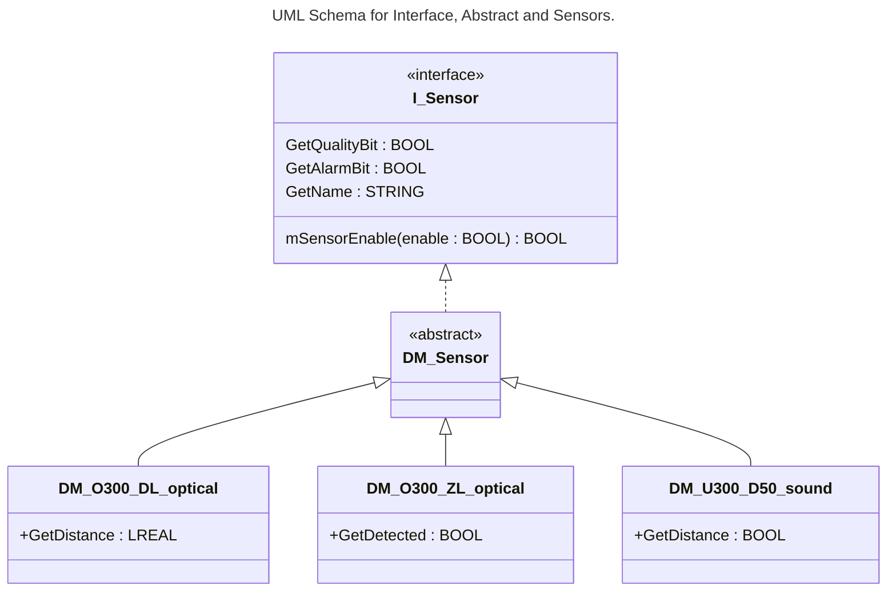
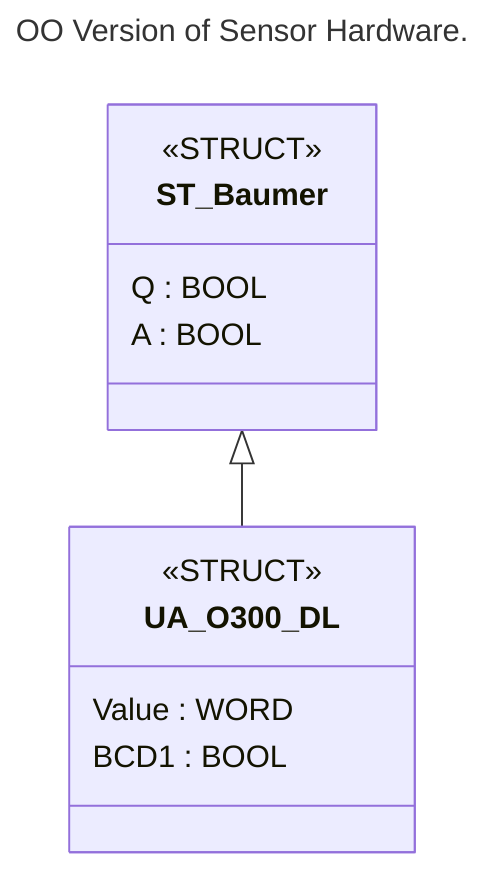

# AAut Module 02, OO in practice

## Table of Contents

- [AAut Module 02, OO in practice](#aaut-module-02-oo-in-practice)
  - [Table of Contents](#table-of-contents)
  - [About Exercise 2](#about-exercise-2)
      - [Step 1](#step-1)
      - [Step 2](#step-2)
      - [Step 3](#step-3)
      - [Step 4](#step-4)
        - [The Method](#the-method)
        - [One property](#one-property)
        - [monitoring](#monitoring)
        - [FB\_Init](#fb_init)
        - [VAR\_IN\_OUT](#var_in_out)
      - [Step 5](#step-5)
        - [DM\_O300\_DL\_optical](#dm_o300_dl_optical)
        - [You need](#you-need)
      - [Step 6](#step-6)
  - [Note about Final](#note-about-final)


## About Exercise 2

#### Step 1



---

#### Step 2
From the UML diagram, I create my structure in ctrlXPLC Engineering. Be careful when choosing the language, otherwise you'll have to start over.

--

#### Step 3

Note that methods don't have internal variables. Therefore, you need to add internal variables to the FB (Function Block), which will be static.

:bulb: To differentiate these variables, I declare them with an underscore, purely for convenience. This is the same way I name my variables with the variable prefix.

```iecst
FUNCTION_BLOCK ABSTRACT DM_Sensor IMPLEMENTS I_Sensor
VAR_INPUT
END_VAR
VAR_OUTPUT
END_VAR
VAR
    _xIsEnable        : BOOL;
    _uliEnableCounter : ULINT;
    _xAlarmBit        : BOOL;
    _xQualityBit      : BOOL; 
    _strSensorName    : STRING;
END_VAR
```

:bulb: Note that the FB has no output or input variables, this means that the type of work in OO is quite different from what can be done in standard IEC 61131-3.

#### Step 4
I implement my methods and properties.

##### The Method

```iecst
METHOD mSensorEnable : ULINT
VAR_INPUT
    enable : BOOL;
END_VAR
```

```iecst
IF enable THEN
    _xIsEnable := TRUE;
ELSE
    _xIsEnable := FALSE;
END_IF

// Optional, I use a counter to detect a call to the method.
// This is usefull when calling from outside.
_uliEnableCounter := _uliEnableCounter + 1;

mSensorEnable := _uliEnableCounter;
```

##### One property

```iecst
THIS^.GetAlarmBit := THIS^._xAlarmBit;
```

Same as:

```iecst
GetAlarmBit := _xAlarmBit;
// Option
GetAlarmBit := _xIsEnable AND _xAlarmBit;
```

##### monitoring

```iecst
{attribute 'monitoring' := 'call'}
PROPERTY GetAlarmBit : BOOL
```

##### FB_Init

```iecst
// FB_Init is always available implicitly and it is used primarily for initialization.
// The return value is not evaluated. For a specific influence, you can also declare the
// methods explicitly and provide additional code there with the standard initialization
// code. You can evaluate the return value.
METHOD FB_Init: BOOL
VAR_INPUT
    bInitRetains : BOOL; 	// TRUE: the retain variables are initialized (reset warm / reset cold)
    bInCopyCode  : BOOL;  	// TRUE: the instance will be copied to the copy code afterward (online change) 
    strName      : STRING;	// Name of the sensor  
END_VAR
```

```iecst
_strSensorName := strName;
```

A l'instantiation du FB, cela ressemble à ça:

```iecst
VAR
    dmO300_DL_optical : DM_O300_DL_optical(strName := 'O300.DL-11199079');
END_VAR
```

##### VAR_IN_OUT

:bulb: This FB has no hardware connection, because this connection is different for the different types of sensors.

:heavy_exclamation_mark: Could be possible to add a base structure for VAR_IN_OUT if all structs have the same base parent.



:bulb: This is a good example of why, in an object-oriented approach, it is/would be necessary to work with this approach from the outset. Reverting to object-oriented programming later can prove complicated or more or less pointless.

---

#### Step 5
Implementation of one sensor. DM_O300_DL_optical

##### DM_O300_DL_optical
If no change, you do not need to write again the properties and methods of I_Sensor.

##### You need


---

#### Step 6
We **must** test the FB with some variable.

---

## Note about Final
Purpose: The ``FINAL`` keyword is used to declare that a Function Block, Method, or Property can no longer be derived from or overridden. This is crucial for protecting the integrity of base classes and Ensuring that behavior cannot be changed in child classes.
Usage Contexts:

-   Function Blocks: A Function Block declared as ``FINAL`` cannot be extended by another Function Block.
-   Methods/Properties: A Method or Property declared as ``FINAL`` cannot be overridden in an inheriting Function Block.

<!-- Fin du fichier README.md -->