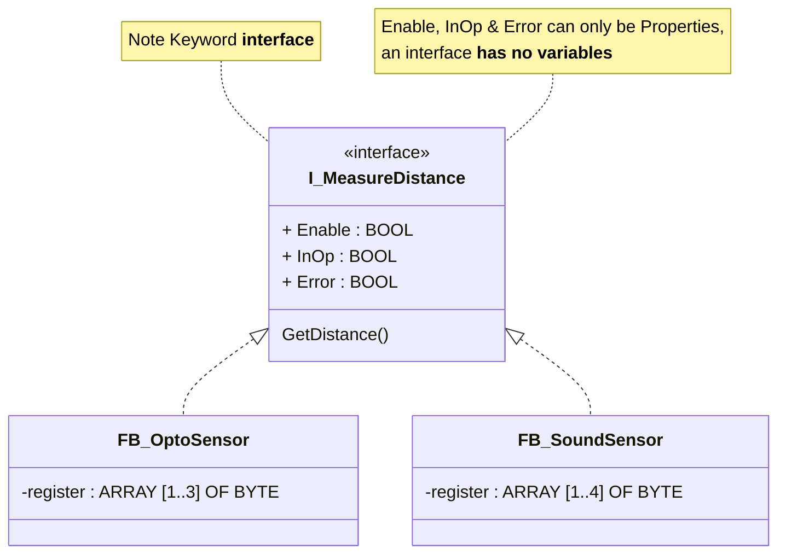
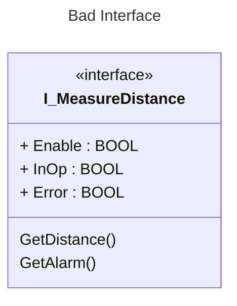
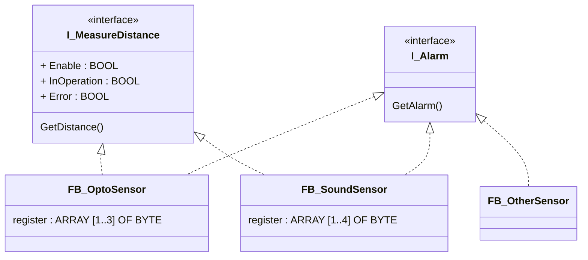

<h1 align="left">
   
  
   
  HEI-Vs Engineering School <h2>AAut Advanced Automation</h2>
   
</h1>

[Cédric Lenoir](mailto:cedric.lenoir@hevs.ch)

<strong style="color:red;">Nécessaire pour le lab 01 AAut:</strong>.
- Properties et Methods in an Interface.
- An abstract Function Block using a basic Interface for a device.
- La possibilité de faire une liste d'interfaces. I_Device, ARRAY OF I_Device
- Et la suite du module 1 pour hériter d'un Abstract Control Module.

# AAut Module 02 /  OOP in Practice

Nous avons vu dans le module précédent que IEC 61131-3 propose tous les outils standard liés à la programmation orienté objet. Faut-il dès lors nécessairement passer à la programmation orienté objet?

Le mieux est d'aborder la réponse par les 5 piliers de la programmation orienté objet avec la lorgnette du PLC.

## Les 5 piliers de la programmation orientée objet
Cette notion n'est pas révolutionnaire, puisque elle date des années 90, avec entre autre précurseur Grady Booch.

1.  L'**objet** : c'est un des piliers du IEC 61131-3, le Function Block. Extension OOP ou pas. la réponse est <strong style="color:green;">oui</strong>.

2. **Encapsulation**: l'Encapsulation se justifie dès lors qu'il y a création d'une librairie qui a pu être testée dans les détails pour une large diffusion, dans ce cas <strong style="color:green;">oui</strong>, mais cela dépasse le cadre de ce cours.
Pour du code pour une machine unique, ou une diffusion limitée, la réponse est **non**, il faut avoir accès rapidement au code pour des raisons de maintenance.

3. **Héritage**: l'héritage rend le code plus complexe et n'améliore pas la robustesse, ce sera souvent l'inverse. la réponse est <strong style="color:red;">non</strong>, on préférera la composition.

> C'est surtout au niveau du comportement, c'est à dire utilisé avec un bloc fonctionnel, que l'héritage peut devenir complexe, c'est pourquoi nous décrirons un petit exemple ci-dessous et que nous décrirons un exemple en travaux pratique. Par contre, l'utilisation pour une structure est simple à coder et à utiliser.

4. **Polymorphisme**: dans le cas du IEC 61131-3, l'Interface peut permettre de simplifier le code et de simplifier sa modularité. La réponse est <strong style="color:green;">oui</strong>. Avec une nuance, on oublie qu'il est en grande partie possible de remplacer une interface par des structures, voir des blocs fonctionnels passés via des variables **VAR_IN_OUT**.
*On admettra que VAR_IN_OUT n'offre pas autant de souplesse que l'interface.*

1. L'**abstraction**: voir l'héritage, la réponse est <strong style="color:red;">non</strong>.

# Un cas simple d'interface
Le principe de l'interface est de définir une seule fois l'interaction qu'un bloc fonctionnel aurra avec un autre.

Prenons l'exemple d'un capteur de distance, nous avons dans le laboratoire 2 capteurs de distance relativement similiaire, mais leur technologie est différente.

- Le premier est basé sur une technologie optique.
- Le deuxième est basé sur une technologie ultrason.

En interne, les registres des deux capteurs doivent être traités différement, par contre, du point de vue de l'interaction avec l'extérieur, la seule chose qui nous importe, est la mesure de la longueur.

Nous pourrions compléter nos Function Blocks de mesure de distance avec une interface pour traiter les alarmes. En théorie, il serait possible de traiter ou combiner plusieurs interface en une seule de ce type:

> L'interface ci-dessus n'est pas très heureux, car il mélange deux choses différentes, la mesure et l'alarme. Nous aurons intérêt à traiter l'alarme comme une entité séparée qui puisse être utilisée pour différents types de mesures.

# Un exemple d'héritage simple
Nous avons un exemple d'héritage pour expliquer les mots clés [THIS et SUPER dans le module précédent](../AAut_MOD_04_IEC_61131_OOP_TOOLS/README.md#using-the-super-and-this-pointers).

# Un exemple d'héritage pas très heureux
Le programme [PRG_Operation en annexe](PRG_Operation.md), fournit un exemple de Function Block dont l'héritage n'est pas très heureux.

# Un cas particulier
Présentation du labo du 12 mars