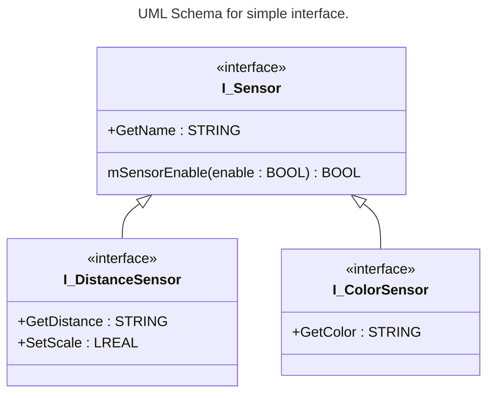
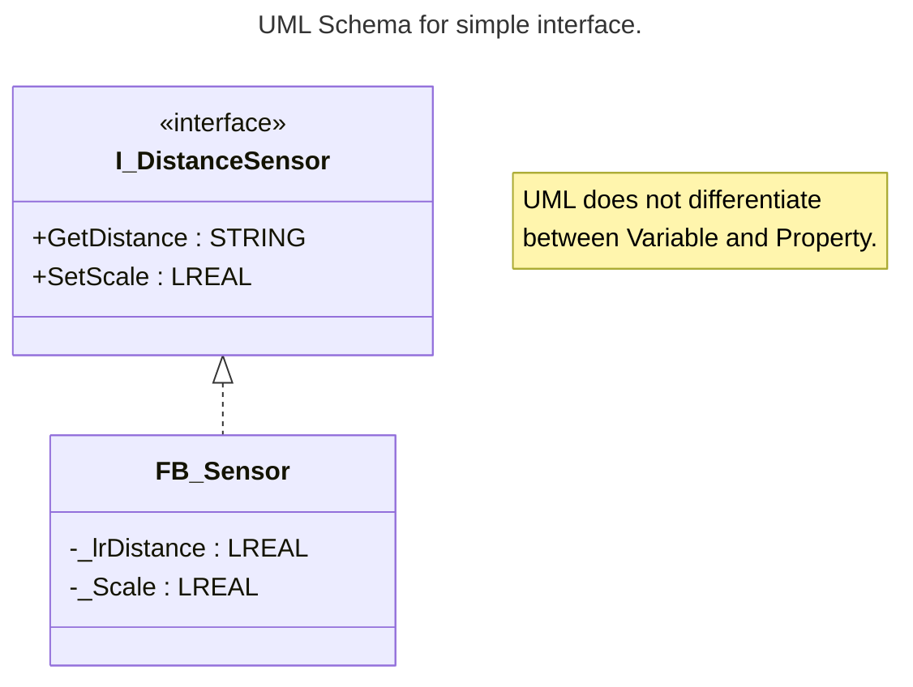
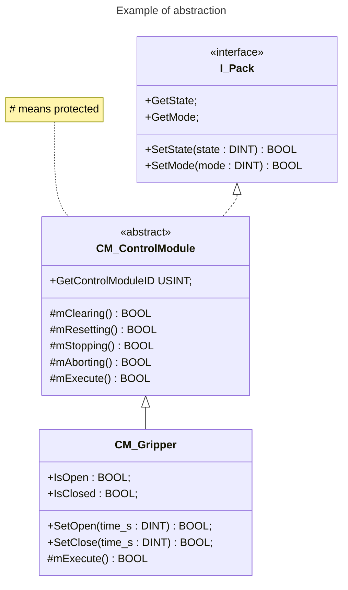

<h1 align="left">
  <br>
  
  <br>
  HEI-Vs Engineering School <h2>AAut Advanced Automation</h2>
  <br>
</h1>

[Cédric Lenoir](mailto:cedric.lenoir@hevs.ch)

<strong style="color:red;">Nécessaire pour le lab 01 AAut:</strong>.
- Properties et Methods in an Interface.
- An abstract Function Block using a basic Interface for a device.
- La possibilité de faire une liste d'interfaces. I_Device, ARRAY OF I_Device
- Et la suite du module 1 pour hériter d'un Abstract Control Module.

# AAut Module 02 /  OOP en pratique

L'objectif de ce module est de présenter une mise en pratique de la programmation orientée objet dans la perspective IEC 61131-3, en particulier par rapport à une programmation classique VAR_INPUT, VAR_OUTPUT, VAR_IN_OUT et adaptée au comportement purement cyclique d'un programme PLC.

Avec la programmation objet, tous les principes de la programmation objet que l'on retrouve dans d'autres langages de haut niveau tels que C, C++ ou C# sont disponibles, à l'exception de l'allocation dynamique. L'allocation dynamique ne fait toutefois pas partie des principes de base de la programmation orientée objet que sont: **Encapsulation**, **Inheritance**, and **Polymorphism**.

On peut résumer ainsi:
  - Encapsulataion :arrow_right: **Function Block**.
  - Inheritance :arrow_right: **Function_Block_Child** ``EXTENDS`` **Function_Block_Child**.
  - Polymorphism :arrow_right: **Method** or **Property** overriding. C'est ce que nous avons vu dans le cas des méthodes cycliques.
  
---

# Notion d'interface

## Interface d'objet

Une interface est un outil de programmation orientée objet. L'objet Interface décrit un ensemble de prototypes de `Method` et de `Property`. Dans ce contexte, le prototype signifie que la `Method` et la `Property` contiennent uniquement des déclarations, sans implémentation.

Ainsi, vous pouvez utiliser différents blocs de fonction avec des propriétés communes de la même manière.

Une interface est une représentation **sans codage**, mais aussi **sans variable** statique, des entrées et sorties d'un Function Block. *On fera ici abstraction d'un programme, puisque l'on ne peut pas hériter d'un autre programme*.

- Une **interface** contient des **propriétés** et des **méthodes**.
- Une interface peut **hériter** et **être héritée** d'autres interfaces.
- Un Function Block peut hériter d'**une ou plusieurs interfaces**.
- On peut créer des **tableaux d'interfaces**.

<div align="center">


```mermaid
---
title: UML Schema for simple interface.
---
classDiagram
    
    class I_Sensor{ 
        +GetName : STRING
        mSensorEnable(enable : BOOL) BOOL
    }
    <<interface>> I_Sensor

    class I_DistanceSensor{ 
        +GetDistance : STRING
        +SetScale : LREAL
    }
    <<interface>> I_DistanceSensor

    class I_ColorSensor{ 
        +GetColor : STRING
    }
    <<interface>> I_ColorSensor

    I_Sensor <|-- I_DistanceSensor
    I_Sensor <|-- I_ColorSensor
```

</div>


## Propriété d'objet, ``Property``

Une propriété est une extension de la norme CEI 61131-3 et un outil de programmation orientée objet. Elle comprend les méthodes d'accès `Get` et `Set`.

Une Property contient un header et un corp.
C'est le corp qui décrit comment la Property pourra accéder à la variable interne du Function Block

```iecst
{attribute 'monitoring' := 'call'}
PROPERTY GetDistance : LREAL
```

:bulb: ``{attribute 'monitoring' := 'call'}`` is not a programming language, that is an information to the compiler to ask him to generate artificially a static variable. This is for debug purpose in a watch window.


```iecst
// _lrDistance is the static internal variable of the Function Block
// optional underscore to indicate that the variable is used for set/get access.
GetDistance := _lrDistance;
```

:bulb: d'une certaine manière, une Property est une équivalence plus évoluée d'une variable ``VAR_OUTPUT``. De plus, il est possible de définir plusieurs niveaux d'accès, tels que ``PRIVATE``, ``PROTECTED``, ``PUBLIC``...

Si un Get peut être associé à une variable ``VAR_OUTPUT``, une variable Set peut être associée à une variable ``VAR_INPUT``.

```iecst
{attribute 'monitoring' := 'call'}
PROPERTY SetScale : LREAL
```

```iecst
// _Scale is the static variable of the function bloc
_Scale := SetScale;
```

Pour plus de détail, on peut se référer à la [documentation de référence du module 01](../AAut_MOD_01_IEC_61131_OOP_Introduction/Programmation_IEC_61131_3_FR.md).

### Use

- On créer un Function Block qui utilise une interface.
- L'implémentation des méthodes ne peut se faire que dans le Function Block qui implémente l'interface, ce qui est logique, puisque encore une fois, **une interface ne contient pas de variable statique**.

```iecst
FUNCTION_BLOCK FB_Sensor IMPLEMENTS I_DistanceSensor
VAR
  _lrDistance : LREAL;
  _Scale      : LREAL;
END_VAR
```

```iecst
PROGRAM Lab_01_AAut
VAR
  mySensor      : FB_Sensor;
  lrPrgDistance : LREAL;
END_VAR
```

```iecst
mySensor.SetScale := 0.2;
lrPrgDistance := mySensor.GetDistance;
```

<div align="center">


```mermaid
---
title: UML Schema for simple interface.
---
classDiagram
    
    class I_DistanceSensor{ 
        +GetDistance : STRING
        +SetScale : LREAL
    }
    <<interface>> I_DistanceSensor

    class FB_Sensor{
        -_lrDistance : LREAL
        -_Scale      : LREAL
    }

    note "UML does not differentiate 
          between Variable and Property."

    I_DistanceSensor <|.. FB_Sensor
```

</div>

## Méthode d'objet

Les méthodes sont une extension de la norme IEC 61131-3 et un outil de programmation orientée objet utilisé pour l'encapsulation des données. Une méthode contient une déclaration et une implémentation. Cependant, contrairement à une fonction, une méthode n'est pas un bloc de programmation indépendant, mais est subordonnée à un bloc de fonction ou à un programme. Une méthode peut accéder à toutes les variables valides du bloc de programmation de niveau supérieur.

Nous avons déjà introduit la notion de [Méthodes dans le module 01](../AAut_MOD_01_IEC_61131_OOP_Introduction/README.md#méthodes). Comme les propriétés, les méthodes peuvent être ``PRIVATE``, ``PUBLIC``, etc...

Pour les détails, on peut se référer au [paragraphe méthodes de la documentation de référence](../AAut_MOD_01_IEC_61131_OOP_Introduction/Programmation_IEC_61131_3_FR.md#object-method).

## Scope of interface

:warning: les méthodes et propriétés d'une interface, ou ``Interface Method`` et ``Interface Property``, sont **obligatoirement publiques**.

> Autrement dit, si la portée des méthodes ou des interfaces d'un bloc fonctionnel doit être limitée à un usage interne, elles ne peuvent pas être implémentées à partir d'une interface.

---

# Notion de abstract
Un Fonction Block peut être noté comme Abstract si il n'est pas destiné à être instancié. C'est, le terme est à prendre avec des pincettes, une sorte d'intermédiaire entre l'interface et le Function Block.

Voici un exemple

<div align="center">


```mermaid
---
title: Example of abstraction  
---
classDiagram
    class I_Pack {
        +GetState;
        +GetMode;
        +SetState(state : DINT) BOOL
        +SetMode(mode : DINT) BOOL
    }
    <<interface>> I_Pack

    class CM_ControlModule {
        +GetControlModuleID USINT;
        #mClearing() BOOL
        #mResetting() BOOL
        #mStopping() BOOL
        #mAborting() BOOL
        #mExecute() BOOL
    }
    <<abstract>> CM_ControlModule

    note for CM_ControlModule "# means protected"

    class CM_Gripper {
        +IsOpen   : BOOL;
        +IsClosed : BOOL;
        +SetOpen(time_s : DINT) BOOL;
        +SetClose(time_s : DINT) BOOL;
        #mExecute() BOOL
    }

    I_Pack <|.. CM_ControlModule
    CM_ControlModule <|-- CM_Gripper
```

</div>

> Symbol <b style='color:red;'>#</b> Protected : l'accès à la méthode est restreint au bloc de fonctions et à ses dérivées.

Pour revenir a l'exemple ci-dessus. On suppose dans le contexte de PackML qu'un Control Module doit obligatoirement pouvoir réagir en fonction de l'état ou le mode de la machine.

- Il implémente une interface ``I_Pack``.
- Les méthodes et les propriétés de cette interface seront publique.
- Un Function Block CM_Control Module qui ne contient rien d'autre que le fonctionnement générique via les méthodes : mClearing, mResetting, mExecute etc.. ne sert à rien, il n'est pas lié au harware et ne fournit aucune fonctionnalité, il est déclaré Abstract.
- Par contre CM_Gripper permet de piloter une pince. Il peut gràce au polymorphisme redéfinir le comportement de certains états comme mExecute.

---

### FB_Init
FB_Init, comme son nom ne l'indique pas **est une méthode** que le compilateur Codesys OO inclut automatiquement dans chaque Function Block.

Cette méthode, qui peut être surchargée, permet d'initialiser certaines variables internes du bloc fonctionnel au moment de son instanciation.

Cas particulièrement pratique, attribuer un numéro d'identification unique à une alarme au moment de sa déclaration.

---

# Un cas particulier
Présentation du labo du 5 mars

<!-- Fin du fichier README.md -->