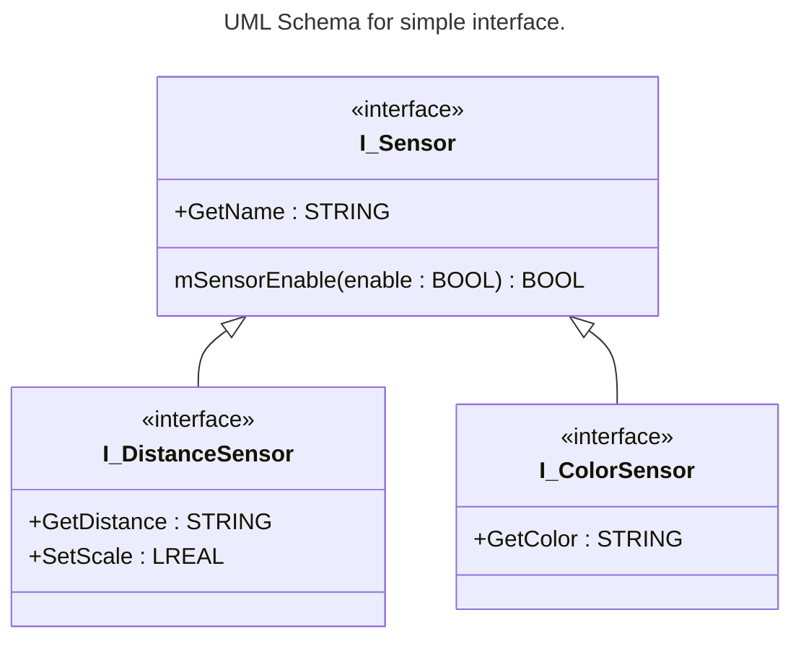
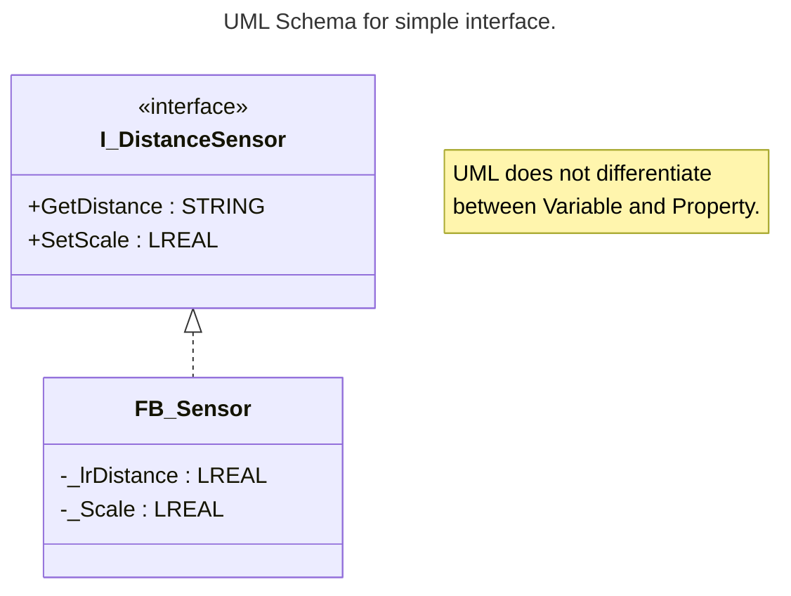
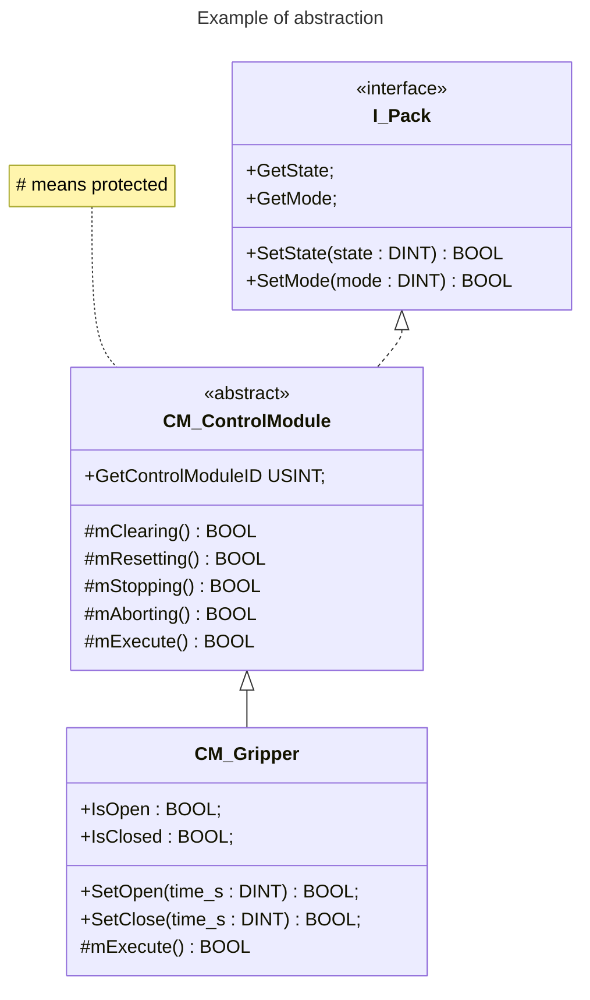

<h1 align="left">
  <br>
  
  <br>
  HEI-Vs Engineering School <h2>AAut Advanced Automation</h2>
  <br>
</h1>

[Cédric Lenoir](mailto:cedric.lenoir@hevs.ch)

<strong style="color:red;">Nécessaire pour le lab 01 AAut:</strong>.
- Properties et Methods in an Interface.
- An abstract Function Block using a basic Interface for a device.
- La possibilité de faire une liste d'interfaces. I_Device, ARRAY OF I_Device
- Et la suite du module 1 pour hériter d'un Abstract Control Module.

# AAut Module 02 /  OOP in der Praxis

Ziel dieses Moduls ist es, eine praktische Anwendung der objektorientierten Programmierung, **OOP**, aus der Perspektive von IEC 61131-3 vorzustellen, insbesondere im Vergleich zur klassischen VAR_INPUT-, VAR_OUTPUT- und VAR_IN_OUT-Programmierung, angepasst an das rein zyklische Verhalten eines SPS-Programms.

Mit der objektorientierten Programmierung stehen alle Prinzipien der objektorientierten Programmierung anderer Hochsprachen wie C, C++ oder C# zur Verfügung, mit Ausnahme der dynamischen Speicherverwaltung. Die dynamische Speicherverwaltung gehört jedoch nicht zu den fundamentalen Prinzipien der objektorientierten Programmierung. Diese sind: **Kapselung**, **Vererbung** und **Polymorphismus**.

Zusammengefasst:

- Kapselung: **Funktionsbaustein**.

- Vererbung: **Funktionsbaustein_Kind** erbt von **Funktionsbaustein_Kind**.

- Polymorphismus: Überschreiben von **Methoden** oder **Eigenschaften**. Dies haben wir im Fall von zyklischen Methoden beobachtet.
  
---

# Konzept einer Schnittstelle

## Objektschnittstelle

Eine Schnittstelle ist ein Werkzeug der objektorientierten Programmierung. Das Schnittstellenobjekt beschreibt eine Menge von Prototypen von `Methode` und `Eigenschaft`. In diesem Kontext bedeutet der Prototyp, dass die `Methode` und die `Eigenschaft` nur Deklarationen, aber keine Implementierung enthalten.

So können Sie verschiedene Funktionsblöcke mit gemeinsamen Eigenschaften auf dieselbe Weise verwenden.

Eine Schnittstelle ist eine Repräsentation **ohne Code**, aber auch **ohne statische Variablen**, der Ein- und Ausgaben eines Funktionsblocks. *Wir abstrahieren hier ein Programm, da man nicht von einem anderen Programm erben kann.*

- Eine **interface** enthält **Properties** und **Methoden**.

- Eine Schnittstelle kann von anderen Schnittstellen **erben** und von anderen Schnittstellen **vererbt werden**.

- Ein Funktionsblock kann von **einer oder mehreren Schnittstellen** erben.

- Es können **Arrays von Schnittstellen** erstellt werden.
- 
<div align="center">



</div>


## Objekteigenschaft, ``Property``

Eine Eigenschaft ist eine Erweiterung des IEC-61131-3-Standards und ein Werkzeug der objektorientierten Programmierung. Sie umfasst die Zugriffsmethoden `Get` und `Set`.

Eine Eigenschaft besteht aus einem Header und einem Rumpf.
Der Rumpf beschreibt, wie die Eigenschaft auf die interne Variable des Funktionsbausteins zugreifen kann.

```iecst
{attribute 'monitoring' := 'call'}
PROPERTY GetDistance : LREAL
```

:bulb: ``{attribute 'monitoring' := 'call'}`` is not a programming language, that is an information to the compiler to ask him to generate artificially a static variable. This is for debug purpose in a watch window.


```iecst
// _lrDistance is the static internal variable of the Function Block
// optional underscore to indicate that the variable is used for set/get access.
GetDistance := _lrDistance;
```

:bulb: Eine Property ist gewissermaßen eine erweiterte Entsprechung einer `VAR_OUTPUT`-Variable. Darüber hinaus lassen sich mehrere Zugriffsebenen definieren, z. B. `PRIVATE`, `PROTECTED`, `PUBLIC` usw.

Sowie eine Get-Funktion einer `VAR_OUTPUT`-Variablen zugeordnet werden kann, lässt sich eine Set-Funktion einer `VAR_INPUT`-Variablen zuordnen.

```iecst
{attribute 'monitoring' := 'call'}
PROPERTY SetScale : LREAL
```

```iecst
// _Scale is the static variable of the function bloc
_Scale := SetScale;
```

Weitere Einzelheiten entnehmen Sie bitte der [Referenzdokumentation zu Modul 01](../AAut_MOD_01_IEC_61131_OOP_Introduction/README%20Reference.md).

### Use

Wir erstellen einen Funktionsblock, der ein Interface verwendet.

Die Implementierung von Methoden kann nur innerhalb des Funktionsblocks erfolgen, der das Interface implementiert. Dies ist logisch, da **ein Interface keine statischen Variablen enthält**.

```iecst
FUNCTION_BLOCK FB_Sensor IMPLEMENTS I_DistanceSensor
VAR
  _lrDistance : LREAL;
  _Scale      : LREAL;
END_VAR
```

```iecst
PROGRAM Lab_01_AAut
VAR
  mySensor      : FB_Sensor;
  lrPrgDistance : LREAL;
END_VAR
```

```iecst
mySensor.SetScale := 0.2;
lrPrgDistance := mySensor.GetDistance;
```

<div align="center">



</div>

## Objektmethoden

Methoden sind eine Erweiterung des IEC-61131-3-Standards und ein Werkzeug der objektorientierten Programmierung zur Datenkapselung. Eine Methode besteht aus einer Deklaration und einer Implementierung. Im Gegensatz zu einer Funktion ist eine Methode jedoch kein eigenständiger Programmblock, sondern einem Funktionsblock oder Programm untergeordnet. Eine Methode kann auf alle gültigen Variablen des übergeordneten Programmblocks zugreifen.

Das Konzept der Methoden wurde bereits in [Modul 01 eingeführt](../AAut_MOD_01_IEC_61131_OOP_Introduction/README_DE.md#methoden). Ähnlich wie Eigenschaften können auch Methoden ``PRIVATE``, ``PUBLIC`` usw. sein.

Für nähere Informationen verweisen wir auf den [Methodenabschnitt der Referenzdokumentation](../AAut_MOD_01_IEC_61131_OOP_Introduction/README%20Reference.md).

## Scope of interface

:warning: Die Methoden und Eigenschaften einer Schnittstelle (auch „Schnittstellenmethode“ und „Schnittstelleneigenschaft“ genannt) sind **notwendigerweise öffentlich**.

Anders ausgedrückt: Wenn der Gültigkeitsbereich der Methoden oder Schnittstellen eines Funktionsbausteins auf die interne Verwendung beschränkt sein soll, können diese nicht über eine Schnittstelle implementiert werden.

---

# Konzept der Abstraktion
Ein Funktionsbaustein kann als abstrakt betrachtet werden, wenn er nicht zur Instanziierung vorgesehen ist. Dieser Begriff, der mit Vorsicht verwendet werden sollte, stellt eine Art Bindeglied zwischen der Schnittstelle und dem Funktionsbaustein dar.

Hier ist ein Beispiel.

<div align="center">



</div>

> Symbol <b style='color:red;'>#</b> ``Protected`` : Der Zugriff auf die Methode ist auf den Funktionsblock und seine Ableitungen beschränkt.

Um auf das obige Beispiel zurückzukommen: Im Kontext von PackML gehen wir davon aus, dass ein Steuermodul entsprechend dem Zustand oder Modus der Maschine reagieren kann.

- Es implementiert eine Schnittstelle namens ``I_Pack``.

- Die Methoden und Eigenschaften dieser Schnittstelle sind öffentlich.

- Ein Funktionsbaustein ``CM_Control Module``, der lediglich generische Funktionalität über Methoden wie ``mClearing``, ``mResetting``, ``mExecute`` usw. bereitstellt, ist nutzlos. Er ist nicht mit der Hardware verknüpft und bietet keine Funktionalität; er ist als abstrakt deklariert.

- ``CM_Gripper`` hingegen ermöglicht die Steuerung eines Greifers. Dank Polymorphismus kann er das Verhalten bestimmter Zustände, wie z. B. ``mExecute``, neu definieren.

---

### FB_Init
FB_Init, Wie der Name schon sagt, **ist dies eine Methode**, die der Codesys OO-Compiler automatisch in jeden Funktionsbaustein einbindet.

Diese Methode, die überschrieben werden kann, ermöglicht es Ihnen, bestimmte interne Variablen des Funktionsbausteins bei dessen Instanziierung zu initialisieren.

Ein besonders nützliches Anwendungsbeispiel ist die Zuweisung einer eindeutigen Identifikationsnummer zu einem Alarm bei dessen Deklaration.

---

# Ein Sonderfall
Laborpräsentation vom 5. März

<!-- Fin du fichier README.md -->