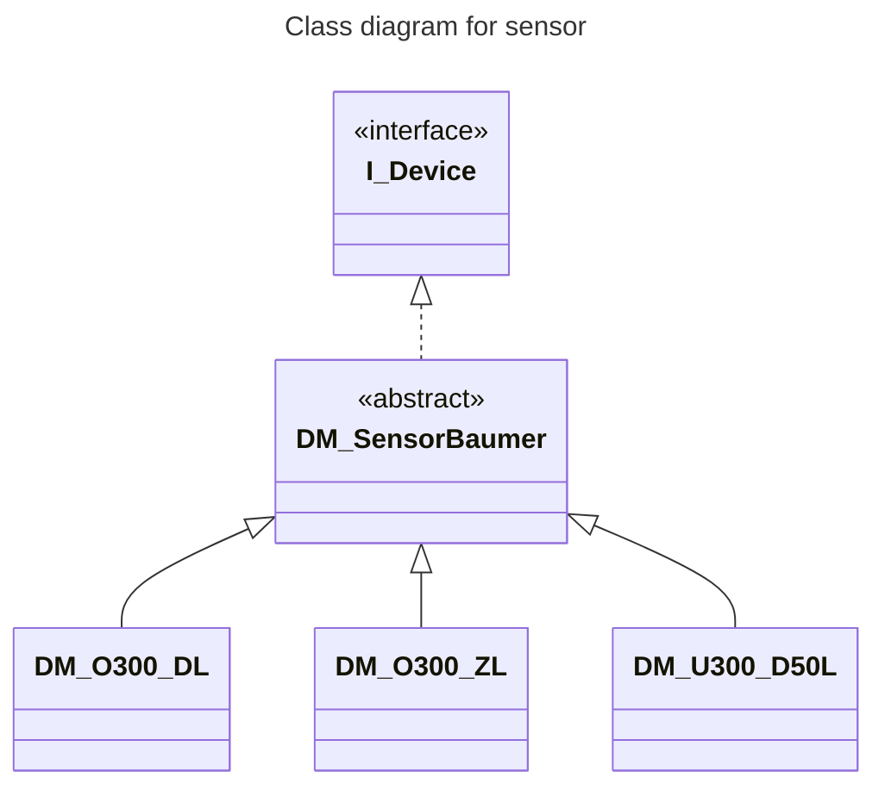

<h1 align="left">
  <br>
  
  <br> Advanced Automation Lab 01 Help
  <br>
</h1>

Author: [Cédric Lenoir](mailto:cedric.lenoir@hevs.ch)



```js
var newMsg = {};

newMsg.payload = {
    type: "object",
    value: {
        "xValue": true
    }
}

newMsg.payload.value.xValue = msg.payload;

return newMsg;

```

A priori, cela marche aussi si l'on fait comme ça

```js
var newMsg = {};

newMsg.payload = {
    type: "object",
    value: {
        "xValue": true
    }
}

newMsg.payload.value.xValue = msg.payload;

return newMsg;

```


Ce qui fonctionne actuellemet:
Dans PLC


### mCloseGripper

```iecst
METHOD PUBLIC mCloseGripper : BOOL
VAR_INPUT
	xValue	: BOOL;
END_VAR

// core
fbCloseGripper.Execute := xValue;
```

#### In NodeREd
```js
var newMsg = {};
newMsg.payload = {
    type: "object",
    value: {
        "xValue": true
    }
}
return newMsg;
```


### mOpenGripper

```iecst
METHOD  PUBLIC mOpenGripper : BOOL
VAR_INPUT
	xValue	: BOOL;
END_VAR

// Core
fbOpenGripper.Execute := xValue;
```

#### In NodeRED
```js
var newMsg = {};
newMsg.payload = {
    type: "object",
    value: {
        "xValue": true
    }
}
return newMsg;
```

#### In Debug

```js
msg.payload : Object
object
    type: "object"
value: object
    xValue: true

9/15/2025, 3:17:14 PMnode: debug 6
plc/app/Application/sym/PRG_Unit/cmGripper/mOpenGripper : msg.payload : Object
object
    type: "object"
value: object
    mOpenGripper: false
schema: "types/plc/app/Application/T_CM_Gripper__mOpenGripperCall_Out"
responseType: "read"
```

# With M_Enable
```js
var newMsg = {};
newMsg.payload = {
    type: "object",
    value: {
        "Enable": true
    }
}
return newMsg;
```