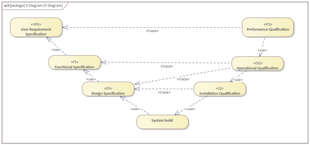
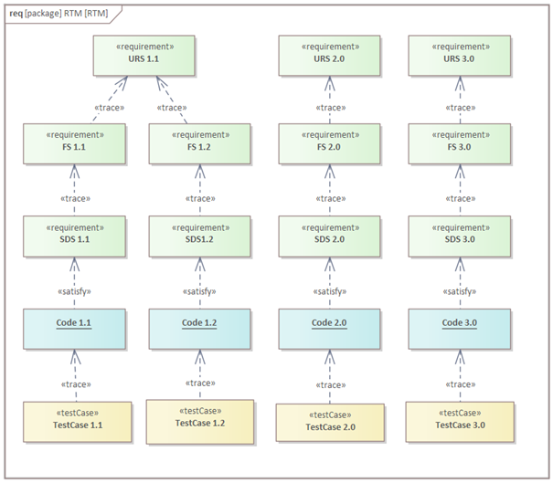
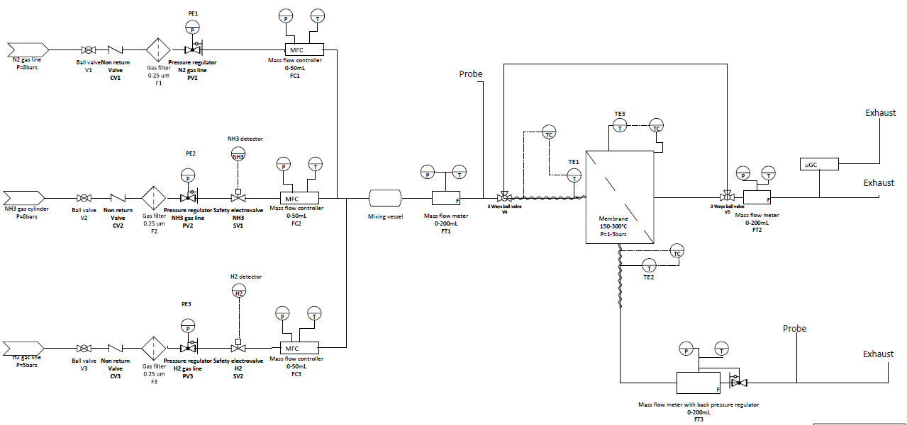
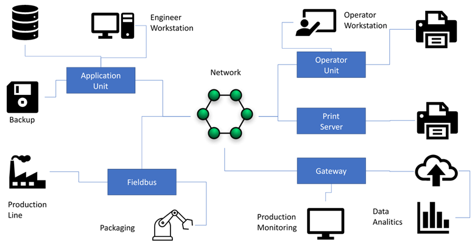
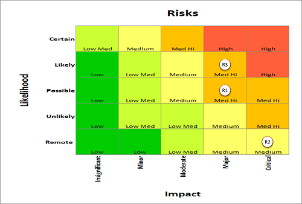
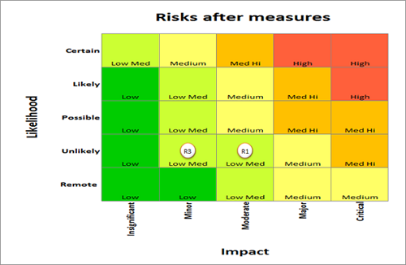

<h1 align="left">
   
  
   
  HEI-Vs Engineering School <h2>AAut Advanced Automation</h2>
   
</h1>

[Cédric Lenoir](mailto:cedric.lenoir@hevs.ch)

# Module 02 /  Process Specification

## Aperçu
Que l'on se place du côté du client qui veut automatiser un système, ou de l'ingénieur qui doit concevoir l'automatisation, la qualité dépend d'un facteur crucial, la réalisation et la compréhension des spécifications.

## Ce qu'il faut retenir
-   Si un projet échoue, que ce soit en termes de qualité technique, respect des délais et budget c'est beaucoup plus souvent en raison de mauvaises spécifications que pour des problèmes liés à la réalisation pratique.
-   Plus un défaut, c'est à dire une modification technique intervient tard dans le déroulement d'un projet, plus elle est compliquée à gérer et coûteuse.
-   Les deux paragraphes précédent sont suffisants pour justifier l'importance de cette phase du projet.
-   Prendre conscience que les spécifications sont destinées non pas à limiter la marge de manœuvre et la créativité de l’ingénieur automaticien, mais à améliorer la qualité de son travail en lui servant de guide tout au long du processus de développement.

## Ce qu'il faut savoir
- Identifier les différentes composantes d'un système de spécifications.
- Etablir une liste de spécifications simples.
- Comprendre le foncionnement du diagramme en V.
- Comprendre et appliquer quelques principes pour une Bonnes Pratiques de Fabrication Automatisées.
- Plus précisément être capable de construire les différents éléments d’un diagramme en V et une FMEA

## Mots clés
*	**URS (User Requirements Specification)**: Document décrivant les besoins et attentes des utilisateurs finaux.
	*	**NFS (Non Functional Specification)** : Document qui détermine les qualités des éléments de l'URS.
*	**FS (Functional Specification)**: Document détaillant les fonctionnalités que le système doit accomplir.
*	**DS (Design Specification)**: Document décrivant la conception technique du système.
*	**SDS (Software Design Specification)**: Document spécifiant la conception du logiciel.
*	**HDS (Hardware Design Specification)**: Document spécifiant la conception du matériel.
*	**IQ (Installation Qualification)**: Processus de vérification que l'installation du système est conforme aux spécifications.
*	**OQ (Operational Qualification)**: Processus de vérification que le système fonctionne correctement dans les conditions opérationnelles spécifiées.
*	**PQ (Performance Qualification)**: Processus de vérification que le système fonctionne de manière efficace et cohérente dans des conditions réelles.
*	**FAT (Factory Acceptance Test)**: Tests effectués en usine pour vérifier que le système répond aux spécifications avant expédition.
*	**SAT (Site Acceptance Test)**: Tests effectués sur site pour vérifier que le système fonctionne correctement après installation.
*	**FMEA (Failure Modes and Effects Analysis)**: Méthode d'analyse pour identifier et évaluer les modes de défaillance potentiels et leurs effets sur le système.

*	**GMP (Good Manufacturing Practices)** sont des directives qui fournissent un cadre pour garantir que les produits sont fabriqués de manière cohérente et contrôlée selon des normes de qualité appropriées. Dans le cadre de l'automatisation des processus, GMP se concentre sur la validation et la vérification des systèmes automatisés pour s'assurer qu'ils fonctionnent correctement et de manière fiable. Cela inclut la documentation rigoureuse des spécifications, des tests et des procédures de maintenance pour garantir que les systèmes automatisés répondent aux exigences réglementaires et de qualité tout au long de leur cycle de vie.

# Introduction
Le titre de ce chapitre aurait pu être, **Good Manufacturing Practices**, **GMP**, ou, Bonnes Pratiques de Fabrication BPF. Dans la pratique on retrouve l’utilisation de ces acronymes dans toute une série de publications qui sont destinées à garantir la bonne qualité de fabrication de produits. Elles ne sont pas utilisées dans tous les domaines, mais, dans de nombreux autres elles sont imposées par des normes destinées à satisfaire des réglementation.

## GMP
La terminologie GMP est surtout utilisée dans les domaines suivants :
- Produits pharmaceutiques
- Ingrédients pharmaceutiques.
- Produits de diagnostique
- Boisson et alimentation

Elle est destinée à permettre la validation de produit tels que la **FDA** : [Federal Drug Administration](https://www.fda.gov/) aux Etats Unis, l’**EMA** [European Medical Agency](https://www.ema.europa.eu/en/homepage) pour l’Union Européenne où [Swissmedic](https://www.swissmedic.ch/swissmedic/de/home.html) plus près de chez nous.

Il ne s’agit pas ici de donner un cours sur le GMP qui mériterai un cours uniquement dédié. J’utilise le GMP et sa version la plus connue GAMP® pour ce qu’il représente dans sa traduction : **Bonnes pratiques de fabrication automatisées**.

> Example: the Hamilton gas sensor say: Reporting and central data management of users and validation reports for the sensor’s
calibration, verification, configuration and communication, ready for compliance with the
GMP guidelines such as FDA CFR21 Part 11 and Eudralex Volume 4 Annex 11 (this requires
ArcAir Advanced App).

## GAMP® 5
Le terme GAMP® Good Automated Manufacturing Practice est une marque protégée de l’[ISPE®](https://ispe.org/). 5 pour la version actuelle. Il existe d’autre guides standard comme ASTM E2500

De manière plus générale, les processus d’assurance qualité menant à des certifications seront aussi présents selon des principes similaires dans les domaines suivants :

### Aéronautique
Pour prendre un exemple valaisan, la fabrication de l’aluminium.

### Composants pour l’automobile
Les contraintes sont particulièrement marquées pour la disponibilité de la machine.

> Dans la réalité, de nombreuses entreprises du monde de l'automation, continuent à utiliser les principes GMP après les avoir intégrés pour des projets dans le monde pharmaceutique. Le raisonnement est simple: *Une fois que l'entreprise et les collaborateurs ont assimilé les principaes de base GMP et que le système de qualité est prêt, la qualité des projets non liés au monde pharmaceutique bénéficient d'une amélioration de la qualité, ce qui permet souvent en finalité à l'entreprise d'améliorer sa rentabilité.*

#	Le cycle de vie

##	Motif
### Pourquoi commencer par parler du GMP dans un cours d’automatisation ?
Principalement parce que comme système de qualité, il décrit le cycle de vie de la machine automatisée. **L’ensemble du processus de développement** de l’automation fait partie du cycle de la machine. En d’autres termes et dans l’idéal, on ne peut pas valider un médicament si la partie automatique de la machine de production de ce médicament n’a pas été développé en tenant compte de ces impératifs.

La première chose que fera probablement un cabinet de conseil en qualité mandaté pour une journée de formation sera de vous parler de ce client qui leur téléphone un beau jour pour leur demander de venir valider la machine qu’ils destinent à l’emballage d’un médicament.
Il sera peut-être possible de faire valider cette machine « après coup », mais cela avec un coût plus élevé, mais surtout uniquement un coût, sans aucune valeur ajoutée à la machine.

###	Dans la pratique
Il est très peu probable qu’une machine ne soit validée que « après coup », ceci parce que la phase de validation est très certainement gérée par le client. La première préoccupation du client sera de vérifier que votre entreprise ait les compétences et le système qualité nécessaire à la validation de cette machine. Ce sera un audit.
Là encore, une mise en conformité du cycle de développement d’un projet de développement sera sans doute beaucoup plus couteuse si elle doit être greffer sur un processus existant, voire inexistant.

##	La certification n’est pas un frein à l’innovation
Pour prendre l’exemple de la FDA, loin d’être un frein à l’innovation en mettant des bâtons dans les rouages de la créativité des ingénieur fournit des programmes d’aide à l’innovation.
https://www.fda.gov/about-fda/cdrh-innovation/activities-support-medical-device-innovators
Les organes de certification ne sont pas des policiers, ce sont des partenaires pour aider les ingénieurs à améliorer leurs processus de développement.

### Deux exemples:
La fréquence du réseau électrique est de 50 [Hz]. Vous pouvez bien sur équiper votre machine d'un convertisseur AC/DC puis un générateur à 133 [Hz] pour différentes raisons, à voir si vos client seront intéressé par votre liberté novartrice.

La norme ISA-TR88.00.02-2022, Machine and Unit States: An implementation example of ISA-88.00.01 que nous aborderons par la suite. C'est un document de 112 pages qui décrit le fonctionnement d'une machine. Si vous décidez d'utiliser votre propre standard, il vous appartiendra à vous de définir et rédiger l'équivalent de ce document pour votre machine. A vous de voir si le temps consacré à ce document n'ampute pas le crédit que vous auriez pu consacrer à votre innovation...

#	Le système d’assurance qualité
## Pourquoi parler de l'assurance qualité en automation ?
Ce paragraphe est destiné à comprendre que la partie automation n'est qu'une des étapes de développement d'une machine qui non seulement devra fonctionner au moment de sa mise en service, mais que son fonctionnement devra être maintenu et amélioré tout au long de son cycle de vie et même au delà. Ce cycle de vie va d'une dizaine d'année dans l'industrie des machines, à plusieurs dizaines d'années dans la production d'énergie.

QMS Qualité Management Process décrit les processus.

A quality management system (QMS) is defined as a formalized system that documents processes, procedures, and responsibilities for achieving quality policies and objectives. A QMS helps coordinate and direct an organization’s activities to meet customer and regulatory requirements and improve its effectiveness and efficiency on a continuous basis.
(Source: American Society for Quality).

##	Activities / Activités
- Document management / Gestion documentaire
- Risk management / Gestion des risques
- Change management / Gestion des changements
- Configuration management / Gestion de la configuration
- Incident management / Gestion des incidents
- Supplier management / Gestion des fournisseurs
- Record management / Gestion des enregistrements
- Archiving / Archivage
- Training management / Gestion de la formation
- Periodic evaluation / Évaluation périodique
- Business continuity / Continuité des activités

## Processus de gestion de la qualité

### Gestion documentaire
La gestion documentaire implique la création, la révision, l'approbation, la distribution et l'archivage des documents nécessaires pour garantir la qualité et la conformité des processus.

### Gestion des risques
La gestion des risques consiste à identifier, évaluer et atténuer les risques potentiels qui pourraient affecter la qualité du produit ou du processus.

### Gestion des changements
La gestion des changements assure que toutes les modifications apportées aux processus, aux systèmes ou aux produits sont contrôlées et documentées de manière appropriée pour maintenir la qualité et la conformité.

### Gestion de la configuration
La gestion de la configuration implique le suivi et le contrôle des versions des produits et des systèmes pour garantir que les modifications sont correctement mises en œuvre et documentées.

### Gestion des incidents
La gestion des incidents consiste à identifier, documenter et résoudre les incidents qui pourraient affecter la qualité ou la conformité des produits ou des processus.

### Gestion des fournisseurs
La gestion des fournisseurs implique l'évaluation et la surveillance des fournisseurs pour garantir qu'ils respectent les normes de qualité et de conformité requises.

### Gestion des enregistrements
La gestion des enregistrements assure que tous les enregistrements nécessaires sont créés, conservés et accessibles pour démontrer la conformité et la qualité des processus.

### Archivage
L'archivage consiste à stocker et à protéger les documents et les enregistrements importants pour garantir leur disponibilité future et leur conformité aux exigences réglementaires.

### Gestion de la formation
La gestion de la formation assure que tous les employés reçoivent la formation nécessaire pour effectuer leurs tâches de manière conforme et efficace.

### Évaluation périodique
L'évaluation périodique implique la révision régulière des processus et des systèmes pour identifier les opportunités d'amélioration et garantir la conformité continue.

### Continuité des activités
La continuité des activités consiste à planifier et à mettre en œuvre des mesures pour garantir que les opérations peuvent continuer en cas de perturbations ou d'urgences.

## Quelques exemples.
> Si une machine produit des pièces pour l'industrie automobile, chaque pièce produite se vera attribuer un numéro de série que l'on pourra relier à un lot de pièces envoyées à un client. Dans le cas où un défaut détecté ultérieurement présenterait un défaut pour l'utilisateur final, on pourrait demander à consulter si les différents tests effectués lors de la production étaient conformes. Même si la machine a été mise en service entre temps. Voir ci-dessus, les notions d'archivage et d'enregistrement. L'automaticien aura donc du enregistrer et archiver les tests, mais aussi garantir que le format de données des enregistrements puisse être garanti sur le long terme.

> Dans un monde idéal, la machine sera parfaite. Dans la pratique, il est probable qu'à un moment donné il soit nécessaire d'analyser puis de modifier une composantes logicielle. La lisibilité d'un programme est autant importante que sa fonctionnalité. C'est pour cette raison que même un programme fonctionnel pourra être refusé si sa lisibilité ne présente pas un niveau de qualité suffisant.

> Comme il a été décrit ci-dessus, la durée de vie d'une machine ou d'une installation peut se compter en dizaines d'années. Au moment de sélectionner les éléments d'un système d'automation, il sera important de se poser la question suivante: le fournisseur sélectionné est-il apte à garantir un support, et le cas échéant un remplacement d'un élément dans dix ans? On peut ajouter la notion suivante, sachant que: Après moi le déluge n'est pas une option. La documentation est-elle suffisantes pour qu'un ingénieur avec une formation adéquate puisse intervenir sur la machine?

# Spécifications, principes généraux

##	URS, User Request Specification
L’URS défini les besoins. Quelles sont les principales fonctionnalités requises ?
L’URS doit refléter les critères d’acceptance futurs de l’utilisateur, qui seront validés par une procédure de Qualification des Performances « Performance Qualification » PQ.

> L'URS est le travail du client. La tâche de l'ingénieur en automation consiste à dire: **Je ne commence pas un travail tant que je n'ai pas pu valider l'URS fournie par le client**.
> L'URS défini la réponse à la question: **Quoi ?**

### NFS ou Non Functional Specification
On trouve parfois la notion de NFS comme annexe à l'URS. Elles décrivent les critères qui jugent le fonctionnement d'un système, mais qui ne sont pas directement liés aux fonctionnalités spécifiques qu'il doit accomplir. Elles se concentrent sur les aspects de qualité du système, tels que la performance, la sécurité, la fiabilité, la maintenabilité et l'évolutivité.

Voici quelques exemples de spécifications non fonctionnelles :

- **Performance** : Temps de réponse, débit, utilisation des ressources.
- **Sécurité** : Contrôles d'accès, protection des données, authentification.
- **Fiabilité** : Taux de défaillance, disponibilité, récupération après panne.
- **Maintenabilité** : Facilité de correction des défauts, modularité, documentation.
- **Évolutivité** : Capacité à gérer une augmentation de la charge de travail, flexibilité pour ajouter de nouvelles fonctionnalités.

Il appartient au client de définit les NFS qui seront ajoutées à la documentation et testés ou contrôles lors de la PQ.

## FS, Functional Specification
La FS défini le comportement, quelles sont les fonctionnalités requises ?
La FS défini comment le système devrait fonctionner et comment il devrait être utilisé.
La FS représente les critères d’acceptation opérationnels, qui seront validés par une procédure de Qualification Opérationnelle « Operational Qualification » OQ.

> La FS est principalement le travail de l'ingénieur. Il décrit comment il construira la machine afin de satisfaire à l'URS.

> La FS répond principalement à la question **Comment ?**

## DS, Design Specification
La DS défini les détails de l’implémentation.
La DS défini comment les fonctions sont implémentées. Elles seront validées par une procédure de Qualification d’Installation « Installation Qualification » **IQ**.

En pratique, on parle principalement de **DS** que l'on pourra séparer en **HDS** et **SDS**.

La **HDS**, ou Hardware Design Specification comporte tout ce qui va de capteur ou actuateur jusqu'à l'entrée de l'automate. Un bon exemple de ce que l'on retrouvera dans la HDS est le schéma électrique.

La **SDS** ou Software Design Specification comporte tout ce qui est lié à la partie logicielle, principalement les diagrammes de type **UML**.

Selon les domaines d'activité, on trouve aussi les définitions suivantes:
*	CS, Configuration Specification
*	SMS, Software Module Specification
*	NDS, Network Specification

# V-Diagram

<figure>
	
	<figcaption>V-Diagram</figcaption>
</figure>

## Origines du diagramme en V

Le diagramme en V est une méthode de gestion de projet et de développement de systèmes qui a été développée pour améliorer la traçabilité et la validation des exigences tout au long du cycle de vie du projet. Il est particulièrement utilisé dans les domaines de l'ingénierie des systèmes et du développement logiciel.

### Historique

Le diagramme en V trouve ses origines dans les méthodologies de développement de systèmes complexes, notamment dans les industries de l'aérospatiale et de la défense. Il a été conçu pour répondre aux besoins de ces industries en matière de rigueur et de traçabilité des exigences, ainsi que pour garantir que chaque phase de développement est correctement validée avant de passer à la suivante.

### Structure du diagramme en V

Le diagramme en V est structuré de manière à représenter les différentes phases du cycle de vie du développement de systèmes, avec une emphase sur la validation et la vérification à chaque étape. Voici comment il se décompose :

1. **Définition des exigences (URS, FS, DS)** :
	- **URS (User Requirements Specification)** : Décrit les besoins et attentes des utilisateurs finaux.
	- **FS (Functional Specification)** : Détaille les fonctionnalités que le système doit accomplir.
	- **DS (Design Specification)** : Décrit la conception technique du système.

2. **Développement et implémentation** :
	- Conception détaillée et développement du système basé sur les spécifications définies.

3. **Validation et vérification** :
	- Chaque phase de développement est associée à une phase de test correspondante pour vérifier que les exigences ont été correctement implémentées et que le système fonctionne comme prévu.

### Avantages du diagramme en V

- **Traçabilité** : Assure que chaque exigence est traçable à travers toutes les phases du développement.
- **Validation continue** : Permet une validation continue à chaque étape, réduisant ainsi les risques de défauts majeurs en fin de projet.
- **Clarté et rigueur** : Fournit une structure claire et rigoureuse pour le développement de systèmes complexes.

En résumé, le diagramme en V est une méthodologie éprouvée qui aide à garantir que les systèmes développés répondent aux exigences des utilisateurs et sont correctement validés à chaque étape du cycle de vie du projet.

# Traçabilité
La traçabilité est un élément fondamental pour démontrer la conformité réglementaire. Dans la terminologie ISO, Organisation internationale de normalisation, la traçabilité démontre que le design d’entrée est validé pour le design de sortie et a été vérifié.

Dans certains systèmes très complexes, on pourra aller jusqu'à utiliser une Matrice de traçabilité.

<figure>
	
	<figcaption>Matrice de traçabilité</figcaption>
</figure>

> Toute cette phase documentaire ne garanti pas que votre machine fonctionne bien, mais que vous ayez **vérifié** si chaque élément fonctionne.

> Il ne sert strictement à rien de rédiger ce genre de spécifications après avoir construit la machine. Le principe GMP veut vérifier que vous ayez construit votre machine dans les règles de l'art, **ce qui interdit une documentation rédigée à postériori** et empechera toute certification.

> **Les meilleurs projets de bachelor en automation sont ceux qui ont utilisé de la manière la plus stricte le principe GMP et le diagramme en V !**

# URS ou User Request Specification
|User Requirements Specification |Functional Specification |Design Specification |Test protocol|
|--------------------------------|-------------------------|---------------------|-------------|
|The system must prevent false alarms due to normal activities such as door opening. |(See FS…)	|(See DS…)	|(See Test…)|

L’URS est un travail **interdisciplinaire** qui concerne principalement le **client**, voir le chef de projet du côté de l’automation.
L’automaticien n’est pas nécessairement impliqué dans la rédaction de l’URS. Cependant, le travail de l’automaticien consiste à vérifier que l’URS existe et soit suffisamment précise et documentée.

L’URS est sans doute **le document le plus compliqué à rédiger**. Mais aussi, sans doute le document le plus important. L’URS se situe en début du cycle de vie de la machine, ce sont souvent des imperfections au niveau de l’URS qui auront les impacts les plus importants en termes de dépassement de délai et de coût.

L’’URS décrit les exigences de fonctionnalité de l'utilisateur, le niveau d'interaction de l'utilisateur, les interfaces avec d'autres systèmes et équipements, l'environnement d'exploitation et toutes les contraintes. Des exigences réglementaires spécifiques devraient être incluses, par exemple des exigences concernant l'utilisation des enregistrements électroniques et des signatures électroniques. La documentation constituant l'URS doit:

-	Permettre au développeur de comprendre les exigences de l'utilisateur,
-	Définir clairement les contraintes de conception,
-	Fournir des détails suffisants pour faciliter les tests d'acceptation,
-	Soutenir l'exploitation et la maintenance du système de commande et
.	Anticiper et faciliter l'élimination et la mise hors service du système de commande.

L'accent est mis sur les exigences des utilisateurs, et non sur la méthode de mise en œuvre, et ne devrait donc pas être spécifique au produit. Les exigences ne doivent pas être définies de telle sorte que les exigences individuelles puissent être identifiées (avec des critères d'acceptation) pour la traçabilité à travers le développement et les tests. Les diagrammes doivent être utilisés pour améliorer la lisibilité. Voire Matrice de traçabilité.

Parce que les URS sont écrits en langage conversationnel, plutôt que dans une notation plus formelle plus stricte, ils sont notoirement sujets à une expression imprécise et à une ambiguïté. Bien que ce soit une caractéristique de la conversation quotidienne, où ce n'est souvent pas un handicap, cela mine l'objectif même auquel l'URS est destiné. Des précautions doivent être prises lors de l'examen pour essayer de minimiser cette source d'erreur dans la mesure du possible.

## Example contents for User Requirements Specification
### Introduction
-	Author/organization
-	Authority
-	Purpose
-	Relationship with other documents

###	System Overview
-	Operator Interface
-	Control dependencies

###	Operational requirements
-	Major functions
-	Start-up and shutdown
-	Recovery and fallback
-	Data security, backup, and recovery

###	Design constraints
*	Hardware
	*	Interface
*	Software
	*	Standards and programming languages
	*	Interfaces
	*	Database
	*	Operating systems
###	Appendixes
*	Glossary
*	Others

##	Exemple pour un banc de test.
Ici, on suppose que les éléments ont déjà été sélectionnés par le client et que le client fournit un diagramme de type P&ID. **piping and instrumentation diagram** avec les différenta appareils. Le client fournit une spécification pour la réalisation du système de pilotage via un PLC.

<figure>
	
	<figcaption>P&ID Gas Unit</figcaption>
</figure>

Les différentes éléments **SV** Safety Valave, **FC** Flow Controller, **FT** Flow Transmitter, **TT** Temperature Transmitter et **TE** Temperature Element [sont définis selon un lexique P&ID](01%20S6%20Module%20Specification%20PandID%20Table.md).

Les abréviations **MFM** et **MFC** sont des des insturments de type Mass Flow Measurment et Mass Flow Controller. 

### Banc de test gaz, User Request Specification

1.	L'interface utilisateur doit offrir une vue d’ensemble du banc de test avec l’affichage des différentes grandeurs mesurées et du statut des instruments : SV1-2, FC1-3, FT1-3, TT.
2.	L'utilisateur doit pouvoir lire en temps réel les valeurs de pression, température et débit pour les MFC et MFM : FC1-3, FT1-3.
3.	L'utilisateur doit pouvoir modifier la composition des gaz pour les MFC et MFM : FC1-3, FT1-3 depuis l'interface utilisateur.
4.	L'utilisateur doit pouvoir régler le débit des MFC : FC1-3.
5.	L'utilisateur doit pouvoir régler la pression amont pour le MFM : FT3.
6.	L'utilisateur doit pouvoir lire la température des éléments chauffants : TE1-3.
7.	L'utilisateur doit pouvoir contrôler la température des éléments chauffants et la réguler.
8.	L'utilisateur doit pouvoir ouvrir/Fermer les vannes de sécurité : SV1-2.
9.	L'utilisateur doit pouvoir sauvegarder à intervalles réguliers les différentes valeurs mesurées dans un fichier de type ``*.txt`` ou ``*.csv``.
10.	L'utilisateur doit pouvoir sauvegarder et ouvrir un fichier de configuration pour les différents éléments du banc.

### Non Functional Specification.
1.	L'utilisateur doit pouvoir modifier l'intervalle de sauvegarde des mesures entre $1$ et $30 [s]$.
2.	L'utilisateur doit pouvoir modifier la température de consigne entre $0$ et $250 °C$.

### De bons URS sont objectifs et testables !
L'exemple ci-dessus contient de nombreux cas qui sont sujet à interprétation et peuvent compliquer notablement la tâche de l'ingénieur en automation. A vous de les rechercher.

#	 Writing “good” requirements
Le document [suivant donne quelques indications de syntaxe pour l'écriture correct des URS](01%20S6%20Module%20Specification%20Requirements%20Boilerplates.md).

On notera qu'il existe un débat chez les anglophones pour savoir si il convient d'utiliser le verbe **shall** ou **must**, débat qui n'existe pas chez les francophones, le verbe se traduisant dans les deux cas par **devoir**.

#	 FS Functional Specification
|User Requirements Specification |Functional Specification |Design Specification |Test protocol|
|--------------------------------|-------------------------|---------------------|-------------|
|The system must prevent false alarms due to normal activities such as door opening. |The system will have a configurable alarm delay function to prevent false alarm	|(See DS…)	|(See Test…)|

##	Généralités
La **FS** peut être vue comme l’interface entre le chef de projet et l’automaticien. La FS sera rédigée, ou pas par l’automaticien selon son implication dans le projet au sein de l’entreprise.

La spécification fonctionnelle est la réponse spécifique au système à l'URS, spécifiant une solution proposée à l'URS.

Un fournisseur externe ou un groupe de développement interne au sein de l'entreprise pharmaceutique ou de la santé prépare généralement des spécifications fonctionnelles.

##	Contenu
Dans la mesure du possible, la spécification fonctionnelle doit suivre la même structure de l'URS et peut faire référence à l'URS plutôt que de dupliquer les informations.

Une [matrice de traçabilité](#traçabilité) des exigences peut être développée. Les omissions de conformité et les non-conformités par rapport à l'URS devraient toutes être facilement identifiables.

La spécification fonctionnelle devrait, dans la mesure du possible, éviter une conception détaillée et se concentrer sur la définition du fonctionnement et des interactions de l'utilisateur avec le système. C'est généralement plus difficile que cela en a l’air. Dans certains cas, ce n'est même pas applicable parce que l'URS demande spécifiquement un équipement ou une conception particulière à utiliser.

> Il arrive souvent qu'une partie de la FS, voir DS soient inclus dans l'URS. Ceci pour plusieurs raisons.

> **Premier exemple**: le client connait déjà suffisament bien son processus et souhaite le reproduire.

> **Deuxième exemple**: le client dispose de personnel maintenance avec des connaissance avancée avec un type de PLC et souhaite rester dans la même gamme de produits.

De même, pour les petits projets, il est souvent plus pratique de combiner la spécification fonctionnelle et le document de conception dans ce que l'on appelle souvent Functional Design Specification ou System Definition ou System Description.

> Les termes URS, FS et DS ne sont pas normalisés, il est parfaitement possible de rencontrer d'autres termes, voir des diagrammes en V avec plus de niveau. Le principe reste toutefois le même.

##	Anticipate testing
En gros cela signifie que l’on écrit plus ou moins les IQ et OQ en même temps que les FS. Ou juste après.
On écrit la FS puis pour chaque point de la FS, on écrit comment on va tester. Nous y reviendrons plus bas dans les différents niveaux de test.

# DS Design Specification
|User Requirements Specification	|Functional Specification	|Design Specification	|Test protocol|
|-----------------------------------|---------------------------|-----------------------|--------|
|The system must prevent false alarms due to normal activities such as door opening.	|The system will have a configurable alarm delay function to prevent false alarm	|The alarm delay function will be configured for a 10-minute delay prior to alarm activation	|(See Test…)|

La conception logicielle et matérielle peut être séparée en deux activités distinctes, voir **SDS** et **HDS** ci-dessous, ou combinée.

Dans les deux cas, la conception décrit la mise en œuvre de la spécification fonctionnelle, la décrivant avec des niveaux de détail croissants jusqu'à ce que les composants de la conception (matériel ou logiciel) puissent être reliés directement sur un produit standard ou mis en œuvre en tant qu'éléments développé sur mesure.

Les niveaux de détail croissants peuvent être divisés en différents documents pour des systèmes plus importants.

<figure>
	
	<figcaption>DS Design Specification Overview</figcaption>
</figure>

## HDS Hardware Design Specification

##	Software and hardware design
La conception logicielle et matérielle peut être séparée en deux activités discrètes, comme décrit ici, ou combinées.
Si on fait le lien avec le model S88, il faut se représenter le fait que la SDS concerne principalement la réalisation des CM, Control Module. C’est-à-dire la description de toutes les entrées-sorties du système ainsi que leur comportement.

###	Software Design Specification
La SDS peut prendre un temps considérable si elle est complétée élément par élément.
Il est aussi à considérer dès le design, que chaque module software devra être testé. Dans la pratique, on pourra définir la SDS conjointement avec le document qui servira à le tester.
Un exemple concret est de concevoir la SDS sous la forme d’un tableur qui permettra ensuite d’exporter sous une forme imprimable la liste des fonctionnalité à tester.

###	Liste des entrées sorties
Toutes les entrées et sorties doivent être référencées et nommées. On peut par exemple aisément les réaliser sous forme de tableau Excel. Souvent il existe dans les environnement de développement des fonctionnalités qui permettent d’importer ou exporter ses listes, nommées par exemple « Tags ».

###	Alarmes
La liste de alarmes doit être complète et numérotée. Chaque alarme doit être testée. La aussi, dans les environnements de développement des PLC il est en général possible d’importer et/ou exporter des listes d’alarmes.

###	Fonctionnement en mode manuel 
Le fonctionnement en mode manuel doit être décrit. Dans ce cas de figure, on se référera au model PackML de ce cours

###	Forçage de certains paramètres qui permettent le test de l’élément.
A ce niveau, un concept modulaire peut fournir un avantage déterminant car les éléments à tester sont principalement regroupés sous la forme de « Control Module ».
Dans une large mesure, les « Equipment’s Modules » assurent des tâches fonctionnelles.
Voir model S88 de ce cours.

##	Hardware Design Specification
La HDS décrit l'architecture et la configuration matérielles, y compris les réseaux. Le HDS doit, par exemple, définir les points énumérés ci-dessous. Cette spécification est utilisée ultérieurement comme base de test pour la vérification.
*	Schéma de présentation du matériel, structure et organisation du système
*	Armoires de commande (noms des armoires de commande, configuration de l'onduleur, emplacement), armoires de commande de station PC, système d'automatisation avec CPU, cartes E / S, etc.
*	Composants PC pour serveur et client
*	Procédures d'installation et instructions pour serveurs, clients, ES
*	Structure de réseau pour Industrial Ethernet, par ex. commutateurs, technologie de transmission (électrique, optique, sans fil), noms et configuration Ethernet des stations (AS, stations PC, etc.), paramètres généraux du réseau
*	Synchronisation de l'heure pour le matériel (SICLOCK)
*	Configuration du lecteur de codes-barres
*	Appareils de terrain, capteurs, électrovannes, moteurs,

#	 Design Review

##	FMEA Failure Mode Effects Analysis

###	AMDEC
Il existe le terme français AMDEC **Analyse des Modes de Défaillance, de leurs Effets, et de leur Criticité**. Dans la pratique, le terme français est peu utilisé et on se gardera dans le cadre de ce cours le terme anglais.

###	FMEA Définition
Une FMEA est un outil de conception et d'ingénierie qui analyse les modes de défaillance potentiels au sein d'un système afin de déterminer l'impact de ces défaillances.

Il a d'abord été développé par le département américain de la Défense pour être utilisé dans la conception de systèmes. La technique FMEA a depuis été adoptée par les industries commerciales dans le but de minimiser les défaillances et de réduire la sécurité, ainsi que les impacts environnementaux et économiques qui pourraient résulter de ces défaillances.

On trouve aussi la définition suivante : FMECA, Failure Mode, Effects, and Criticality Analysis, qui correspond effectivement à la traduction de AMDEC.

De manière générale et simplifiée, c’est une matrice d’analyse de risque.

###	Méthode
Le principe de la méthode FMEA consiste à recenser toutes les causes potentielles de chaque mode de défaillance. Ensuite, il est nécessaire d’évaluer la criticité des mode de défaillance. La criticité est obtenue par une triple cotation.

*	La Gravité **G** ou sévérité de l’effet du défaut ou de la défaillance.
*	L’Occurrence **O** ou fréquence d’apparition de la cause,
*	La Détection **D** : probabilité de non-détection de la cause.
$$Criticité = Gravité \times  Occurrence \times  Détection$$

###	Evaluation
Il serait sans doute possible d’écrire un cours uniquement sur la FMEA. Ici afin de pouvoir garder un exemple utilisable dans le cadre de ce cours, nous allons prendre un exemple simplifié, mais parfaitement utilisable basé sur un canevas d’Innosuisse pour la soumission de projets d’innovation.

**Innosuisse utilise une simple matrice avec un calcul** :

$$Risk score = Probability \times Impact$$

### Occurrence
|Probability |  | |
|------------|--|-|		
|Remote 	 |1	|Probability of less than 10%.|
|Unlikely	 |2	|Probability between 10% and 35%|
|Possible	 |3	|Probability between 36% to 64%.|
|Likely	     |4	|Probability 65% to 90%.|
|Certain	 |5	|Probability above 90%.|

### Gravité
|Impact		 |  | |
|------------|--|-|		
|Insignificant |1|Easily handled within the normal course of operations with no additional costs|
|Minor 	|2|Some disruption within the normal functions. Manageable risk with minimum estimated cost|
|Moderate	|3	|Immediate time/resource reallocation will be necessary with a moderate estimated cost|
|Major	|4	|Operations are severely disrupted and significant risk of failure to part of the business is possible|
|Critical 	|5	|Significant going concerns exists with the business and the risk is classified as critical|

### Phase 1, évaluer le risque initial
|ID	|Title	|Description|Responsible|Category|Indicators of occurence|Probability|Impact|Risk score|
|---|-------|-----------|-----------|--------|-----------------------|-----------|------|---|
|R1	|Power Motor Axis X	|The power of the electric motor is too low.|	Mechanical engineer|	Technical|The speed of the process cannot be achieved.|Possible|Major|12|
|R2	|Processor of PLC	|The calculation capacity of the PLC is too low	|Electrical engineer|	Technical|	Crash of PLC|	Remote 	|Critical 	|5|
|R3	|Delivery time of safety relay|Due to critical situation on the market of semi-conductors, the safety relay cannot be delivered on time|Buyer	|Project management|Unable to deliver the system on time |Likely	|Major|16|

<figure>
	
	<figcaption>FMEA Initial Risk</figcaption>
</figure>

On constate que les risques **R1**, **R3** ont un niveau qui n’est pas acceptable. Il faut donc définir des mesures qui permettent d’atténuer ces risques.

### Phase 2, réduire le risque

|ID	|Preventive Measure	|Corrective Measure	|Success factors	|Probability|Impact|Risk score|
|---|-------------------|-------------------|-------------------|-----------|------|----------|
|R1	|Contact specialist for better calculation|	Order new motor	|The final speed is achieved|Unlikely|	Moderate|	6|
|R2	|None|
|R3	|Contact the supplier to know the delivery times|Select another product|Device delivered on time|Unlikely|Minor|4|

<figure>
	
	<figcaption>FMEA Final Risk</figcaption>
</figure>

### Commentaire
Mieux vaut une analyse de risque relativement simple mais qui sera utilisée, qu'une analyse trop complexe qui ne sera pas mise en oeuvre, justement en raison de sa complexité. Le canevas Excel basé sur Innosuisse est [mis à disposition dans la documentation en ligne de ce cours](./documentation/An_Exemple_Of_FMEA_From_Innosuisse.xlsx).

#	Tests
Dans un projet de validation, les plans de test ou les protocoles de test sont utilisés pour démontrer qu'un système répond aux exigences précédemment établies dans les documents de spécification, de conception et de configuration.

Les plans de test documentent la stratégie générale de test.

Les protocoles de test sont les documents de test réels !

Le plan de test décrit les exigences et la stratégie de test. Il doit inclure le processus général de réalisation des tests, la documentation des preuves des tests et le processus de gestion des échecs de test !

La validation logicielle utilise généralement trois protocoles de test spécifiques :

|User Requirements Specification	|Functional Specification	|Design Specification	|Test protocol|
|-----------------------------------|---------------------------|-----------------------|------|
|The system must prevent false alarms due to normal activities such as door opening.	|The system will have a configurable alarm delay function to prevent false alarm	|The alarm delay function will be configured for a 10-minute delay prior to alarm activation	|Alarm Delay Testing|

##	 IQ Installation Qualifications
Vérifie que les systèmes se trouvent sur des machines adaptées pour exécuter le logiciel, que le système a été correctement installé et que la configuration est correcte. Ces exigences sont décrites dans les DS, Design Specification ou spécifications de conception.

##	OQ Operational Qualifications
Vérifie que les systèmes fonctionnent comme prévu. Les OQ testent les FS, Functional Specification, ou exigences fonctionnelles.

##	PQ Performance Qualifications
Vérifie que les systèmes exécutent des tâches dans des conditions réelles. Les tests PQ vérifient les fonctionnalité décrites dans les URS, User Requirements Specification ou exigences de l'utilisateur.

##	FAT Factory Acceptance Test
Signifie le test d’acceptance du client dans la fabrique. Ici, fabrique est à comprendre dans le sens du site de fabrication de la machine dans le cas où une machine est assemblée chez le fournisseur de la machine. Le terme FAT est en partie relié au PQ et à l’OQ.
Il faut comprendre cette notion en se représentant une machine destinée à être intégrée comme unité dans une chaîne de production. Il paraît ensuite plus clair qu’une partie des OQ, voir PQ ne pourront être testés et acceptés qu’une fois la machine intégrée dans son environnement final.
Vu du point de vue du comptable, la réussite de la FAT conditionne parfois pour le fournisseur l’étape à laquelle le client payera, une partie non négligeable de la facture finale…

##	SAT Site Acceptance Test
Test acceptance sur site, cela correspond à valider dans l’environnement final les tests OQ et PQ qui n’auraient pas pu être réalisé sur le site de fabrication de la machine.

#	 Coût des changements
##	Coût pendant le cycle de vie
De manière générale, [voir l'exercice 1](#exercice-1---urs), on considère que plus un problème est découvert tard dans le cycle de vie de la machine, plus le coût de changement sera élevé.

Une erreur détectée au moment de l’écriture de l’URS aura un impact beaucoup moins important sur le projet que si cette erreur est détectée au moment de la FAT !

###	Risques et coûts techniques
Contrairement à ce que l’on pourrait penser, les risques techniques au moment de l’implémentation « Bug » on impact négligeable sur le développement du projet par rapport aux défauts liés aux URS.

> En d’autres termes et pour répéter la même chose, une erreur majeur pendant l’écriture de l’URS, ou une URS incomplète conduira très probablement à un dépassement du budget ou dépassement des délais établis.

#### Un petit exemple concret
Si un moteur de 110 kW pour une pompe de refroidissement, soit un beau bébé de l’ordre de 750 kg est sous dimensionné en raison d’une erreur dans la spécification, le dépassement de budget et du délai seront probablement garantis. Cependant, il y a extrêmement peu de risque de détruire le même moteur en raison d’une erreur au niveau du codage du PLC de commande.

# Annexes
Les documents de type URS, FS et autres font en général partie du savoir faire d'une entreprise et sont rarement disponibles en ligne. Des exemples utilisés dans des travaux pratiques et quelques travaux de bachelor à la HEVS sont disponibles en ligne [URS](./documentation/AAut_URS_Template.docx), [FS](./documentation/AAut_FS_Template.docx), [SDS](./documentation/AAut_SDS_Template.docx), [HDS](./documentation/AAut_HDS_Template.docx), [PQ](./documentation/AAut_PQ_Template.docx), [OQ](./documentation/AAut_OQ_Template.docx) et [IQ](./documentation/AAut_IQ_Template.docx) .

### SDS
On donne en [exemple une SDS pour un projet](./documentation/TestBenchSpecification.xlsx). Le terme DS, SDS, HDS peut varier d'une entreprise à l'autre. Dans l'exemple fournit en annexe, on trouve en principe suffisament d'éléments pour passer à la phase de réalisation électrique et la définition logicielle.
 
# Exercice 1 - URS
Dans le cas des [URS du diagramme P&ID de mesure de gaz](#banc-de-test-gaz-user-request-specification), rechercher les éléments qui peuvent compliquer la tâche de l'ingénieur.

[Commentaires rédigés sur l'URS, à l'aide de Copilot et dans la réalité. Il est intéressant de constater que Copilot a mis en évidence une bonne partie des problèmes qui ont été effectivement rencontrés dans la réalité.](01%20S6%20Commentaires%20exercice%201%20URS.md)

# Exercice 2 - FS

On a demandé à copilot de rédiger une URS pour la fabrication d'une configure de fraises maison.
**On vous demande de proposer une FS limitée à dix points, uniqument pour la phase de cuisson.**

## Spécification des Besoins Utilisateurs (URS) pour la Confiture de Fraises

### Introduction
- **Auteur/organisation**: [Votre Nom/Organisation]
- **Autorité**: [Votre Autorité]
- **Objectif**: Définir les exigences pour la fabrication de confiture de fraises maison.
- **Relation avec d'autres documents**: Aucune

### Aperçu du Système
- **Interface Utilisateur**: L'utilisateur suivra les étapes de la recette manuellement.
- **Dépendances de Contrôle**: Aucune

### Exigences Opérationnelles
1. **Ingrédients**:
	- Fraises fraîches : 1 kg
	- Sucre granulé : 800 g
	- Jus de citron : 2 cuillères à soupe
2. **Préparation**:
	- Laver et équeuter les fraises.
	- Couper les fraises en moitiés ou en quartiers.
3. **Cuisson**:
	- Combiner les fraises, le sucre et le jus de citron dans une grande casserole.
	- Cuire à feu moyen en remuant de temps en temps jusqu'à ce que le sucre soit dissous.
	- Augmenter le feu à vif et porter le mélange à ébullition.
	- Réduire le feu à moyen et laisser mijoter en remuant fréquemment jusqu'à ce que le mélange épaississe (environ 20-30 minutes).
4. **Test**:
	- Tester la consistance de la confiture en plaçant une petite quantité sur une assiette froide. Si elle se ride lorsqu'on la pousse avec un doigt, elle est prête.
5. **Mise en Pot**:
	- Stériliser les pots et les couvercles en les faisant bouillir dans de l'eau pendant 10 minutes.
	- Verser la confiture chaude dans les pots stérilisés en laissant un espace de 1/4 de pouce en haut.
	- Essuyer les bords des pots avec un chiffon propre et humide.
	- Placer les couvercles sur les pots et visser les bandes jusqu'à ce qu'elles soient serrées du bout des doigts.
6. **Scellage**:
	- Traiter les pots dans un bain d'eau bouillante pendant 10 minutes.
	- Retirer les pots de l'eau et les laisser refroidir complètement.
7. **Stockage**:
	- Conserver les pots scellés dans un endroit frais et sombre pendant un an maximum.
8. **Étiquetage**:
	- Étiqueter les pots avec la date de production et le contenu.

### Contraintes de Conception
- **Matériel**:
	- Grande casserole
	- Cuillère pour remuer
	- Assiette froide pour tester
	- Pots et couvercles stérilisés
	- Stérilisateur à bain-marie
- **Logiciel**:
	- Aucun

### Annexes
- **Glossaire**:
	- **Équeuter**: Retirer les feuilles vertes des fraises.
	- **Mijoter**: Cuire doucement juste en dessous du point d'ébullition.
- **Autres**:
	- Aucun

### Spécification Non Fonctionnelle
1. La confiture doit avoir une consistance lisse et tartinable.
2. La confiture doit avoir une durée de conservation allant jusqu'à un an lorsqu'elle est correctement stockée.

# Exercice 3 - DS 
Reprende l'exemple de la [SDS fournie en annexe](./documentation/TestBenchSpecification.xlsx).

1.	Déterminer les éléments qui selon vous sont des éléments critiques.
2.	Faire votre propre évaluation du temps nécessaire pour le codage de ce banc de test.