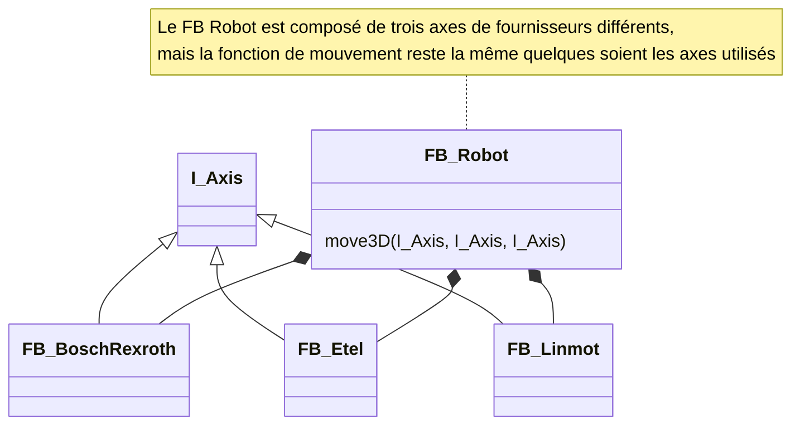
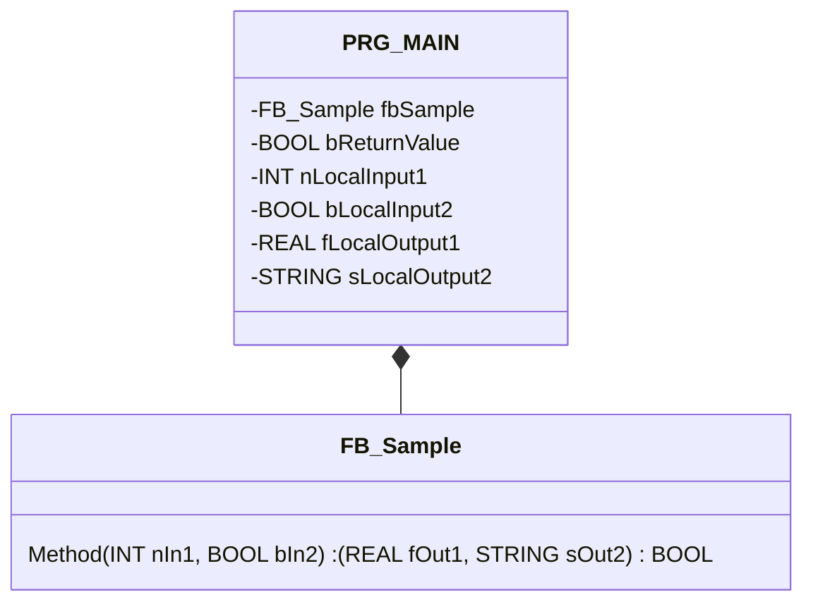
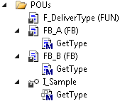
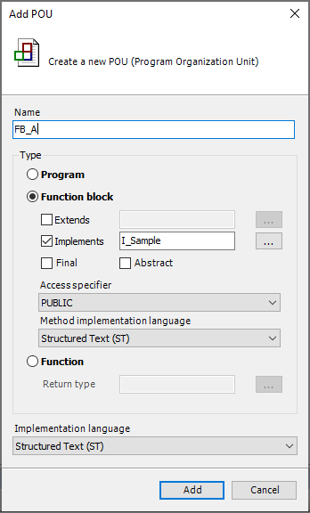
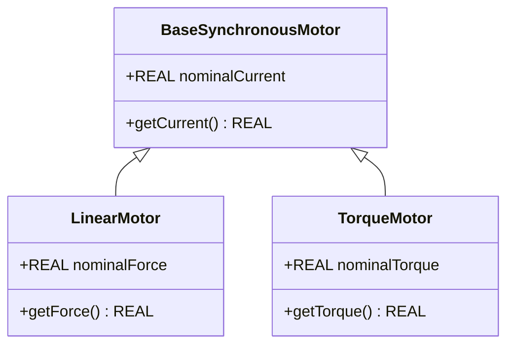
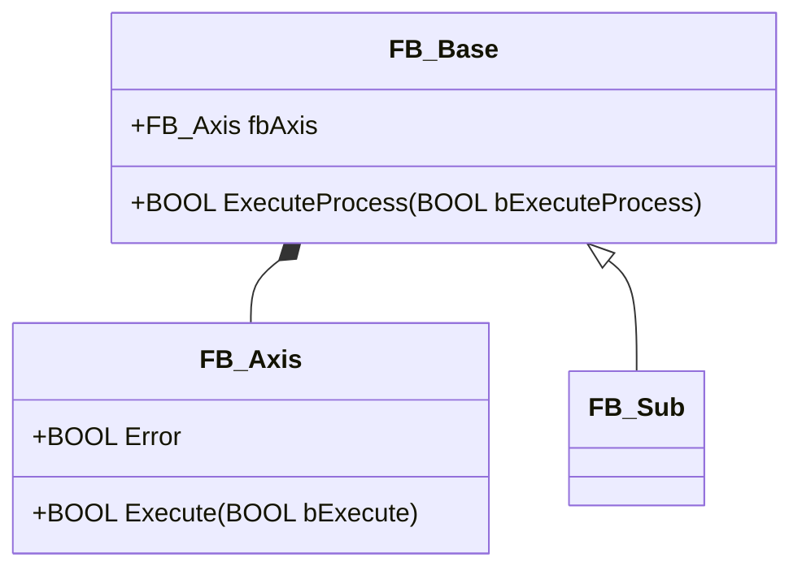
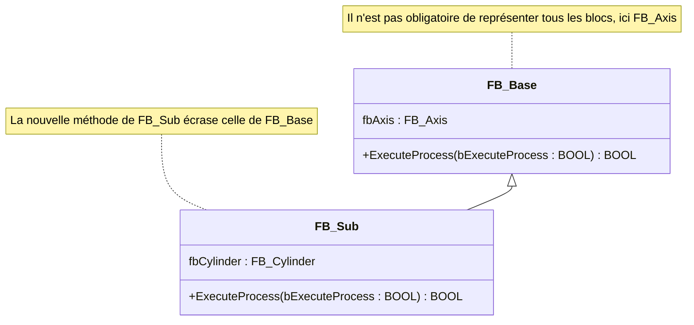
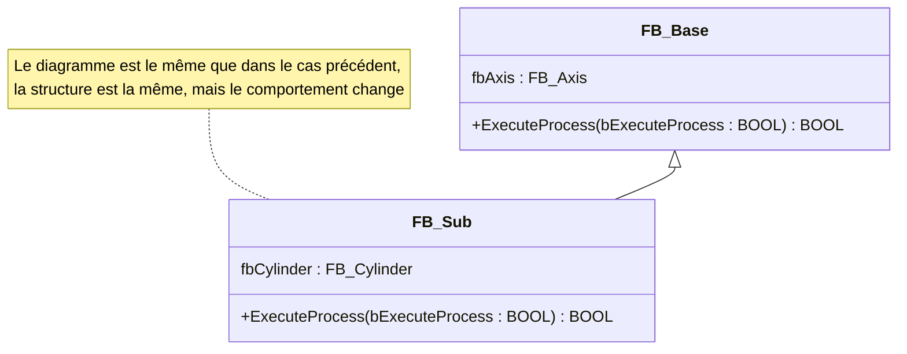
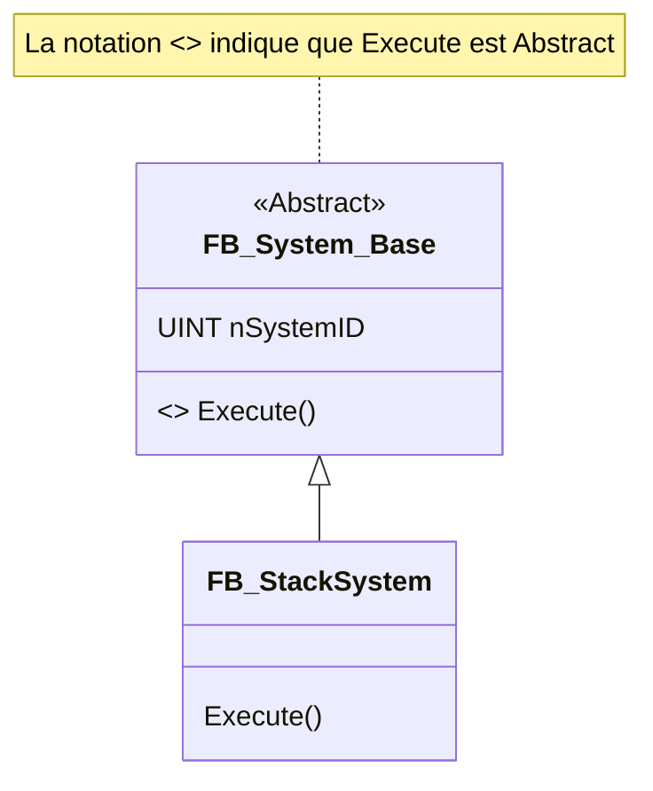

<h1 align="left">
  <br>
  
  <br>
  HEI-Vs Engineering School <h2>AAut Advanced Automation</h2>
  <br>
</h1>

[Cédric Lenoir](mailto:cedric.lenoir@hevs.ch)

# AAut Module 04 Overview /  IEC-61131-3 les outils OOP

## Sommaire

- [AAut Module 04 Overview /  IEC-61131-3 les outils OOP](#aaut-module-04-overview---iec-61131-3-les-outils-oop)
  - [Sommaire](#sommaire)
  - [Préambule](#préambule)
  - [Aperçu](#aperçu)
  - [Ce qu'il faut retenir](#ce-quil-faut-retenir)
  - [Ce qu'il faut savoir](#ce-quil-faut-savoir)
  - [Mots clés](#mots-clés)
- [Introduction](#introduction)
  - [Notions de programmation orientée objet, ou rappel...](#notions-de-programmation-orientée-objet-ou-rappel)
    - [Principes de base](#principes-de-base)
    - [Avantages de la programmation orientée objet](#avantages-de-la-programmation-orientée-objet)
    - [Les différents éléments](#les-différents-éléments)
    - [Condition de la programmation orientée objet](#condition-de-la-programmation-orientée-objet)
  - [La base, le Function Block](#la-base-le-function-block)
    - [La structure, STRUCT](#la-structure-struct)
  - [Object Method](#object-method)
  - [Object Property](#object-property)
  - [Object Interface](#object-interface)
  - [Differences in OOP languages](#differences-in-oop-languages)
  - [Interface](#interface)
  - [Abstract Function Block](#abstract-function-block)
  - [Mots clés orientés objet du IEC 61131-3](#mots-clés-orientés-objet-du-iec-61131-3)
- [Détails des extensions OOP du 61131-3](#détails-des-extensions-oop-du-61131-3)
  - [Object Method](#object-method-1)
    - [Notes à propos des méthodes:](#notes-à-propos-des-méthodes)
      - [Exemple](#exemple)
      - [Exemple](#exemple-1)
        - [Déclaration de la méthode](#déclaration-de-la-méthode)
        - [MAIN Program](#main-program)
      - [Access modifier](#access-modifier)
      - [Abstract](#abstract)
  - [Object Property](#object-property-1)
    - [Implementation sample](#implementation-sample)
      - [Access modifier](#access-modifier-1)
      - [Abstract](#abstract-1)
  - [Object Interface](#object-interface-1)
    - [Method *d'une interface*](#method-dune-interface)
    - [Property *d'une interface* ou Set() Get()](#property-dune-interface-ou-set-get)
    - [Vérification de la déclaration d'interface via le compilateur](#vérification-de-la-déclaration-dinterface-via-le-compilateur)
    - [Appel de méthodes et de propriétés d'une instance de bloc fonctionnel via une variable d'interface](#appel-de-méthodes-et-de-propriétés-dune-instance-de-bloc-fonctionnel-via-une-variable-dinterface)
    - [Notes](#notes)
    - [Exemple d'interface](#exemple-dinterface)
        - [Déclaration d'interface :](#déclaration-dinterface)
      - [Implémentation d'interface :](#implémentation-dinterface-)
      - [Interface application:](#interface-application)
- [Inheritance](#inheritance)
  - [Héritage d'un bloc fonctionnel](#héritage-dun-bloc-fonctionnel)
    - [Nombre d'extensions pour chaque bloc fonctionnel de base](#nombre-dextensions-pour-chaque-bloc-fonctionnel-de-base)
    - [L'héritage multiple n'est pas autorisé](#lhéritage-multiple-nest-pas-autorisé)
  - [Principe d'héritage](#principe-dhéritage)
    - [Contenu de l'héritage](#contenu-de-lhéritage)
  - [Extension ou écrasement d'éléments hérités](#extension-ou-écrasement-déléments-hérités)
  - [Use Cases pour l'héritage](#use-cases-pour-lhéritage)
    - [Utilisation inchangée](#utilisation-inchangée)
      - [Exemple :](#exemple-2)
        - [Bloc fonctionnel FB\_Base :](#bloc-fonctionnel-fb_base-)
        - [Method FB\_Base.ExecuteProcess:](#method-fb_baseexecuteprocess)
        - [Function block FB\_Sub:](#function-block-fb_sub)
        - [Method FB\_Sub.ExecuteProcess:](#method-fb_subexecuteprocess)
    - [Overwrite](#overwrite)
      - [Exemple :](#exemple-3)
        - [Bloc fonctionnel FB\_Base :](#bloc-fonctionnel-fb_base)
        - [Method FB\_Base.ExecuteProcess:](#method-fb_baseexecuteprocess-1)
        - [Function block FB\_Sub:](#function-block-fb_sub-1)
        - [Method FB\_Sub.ExecuteProcess:](#method-fb_subexecuteprocess-1)
    - [Extension](#extension)
      - [Exemple :](#exemple-)
        - [Function block FB\_Base:](#function-block-fb_base)
        - [Method FB\_Base.ExecuteProcess:](#method-fb_baseexecuteprocess-2)
        - [Function block FB\_Sub:](#function-block-fb_sub-2)
        - [Method FB\_Sub.ExecuteProcess:](#method-fb_subexecuteprocess-2)
- [Abstract](#abstract-2)
  - [Application de l'abstraction](#application-de-labstraction)
  - [Règles d'utilisation du mot-clé ABSTRACT](#règles-dutilisation-du-mot-clé-abstract)
    - [Exemple](#exemple-4)
      - [Abstract basic class:](#abstract-basic-class)
      - [Non-abstract sub-class:](#non-abstract-sub-class)
  - [Différences entre un FB abstrait et une interface](#différences-entre-un-fb-abstrait-et-une-interface)
- [Référence principale](#référence-principale)
- [Autres références](#autres-références)

## Préambule
*En tant que rédacteur, de ce module, il me semble nécessaire de préciser que bien qu'ayant plusieurs années d'expérience en programmation orienté objet, Delphi et C++, je n'ai pas la prétention d'être un expert en IEC-61131-3 OOP que je juge avec un regard critique. Ce module est donc à prendre comme un aperçu de cette technologie qui mériterait à elle seule un cours complet pour être abordée dans les détails.*


<strong style="color:red;">Les parties à connaître seront adaptées au contenu des travaux pratiques et seront précisées en cours.</strong>

## Aperçu
- Présentation des principaux éléments de OOP pour IEC 61131-3

- Avantages et inconvénient de OOP

- Quelques notions d'UML/SysML

> *IEC 61131-3 ne permet pas en principe d'allouer dynamiquement des objets. Nous préciserons l'utilisation des symboles UML adaptés à ce cours.*

- Use Case avec Enable et Execute dans le module suivant.

## Ce qu'il faut retenir
-   Disponible mais pas forcément nécessaire.
-   Surtout utiler pour des machines produites en série mais qui doivent être adaptées à différentes applications.
-   La notion OOP est surtout utile pour la création de librairies, **notion qui n'est pas abordée dans le cadre de ce cours**. On se référa au document [Creating PLCopen Compliant Libraries V1_0](https://plcopen.org/node/90?file=166)
-   Attention: peut augmenter la complexité du code, poser des problèmes de maintenance et de robustesse.
-   OOP n'est pas qu'un problème de syntaxe, c'est aussi une méthode de travail qui peut se faire sans les extensions OOP du 61131-3.

> A ma connaissance, au 18 février 2025, il n'existe pas d'autre implémentation de la norme IEC-61131-3 OOP que celle de [Codesys](https://www.codesys.com/) qui est un compilateur largement utilisé par de nombreux fournisseurs de solution PLC.
> > *Il semble que [BR-Automation, ABB Group](https://www.br-automation.com) ait présenté un produit en novembre 2024.*

## Ce qu'il faut savoir
-   Les différents éléments de OOP 61131-3.
-   Principal intéret, le polymorphisme.
-   Utiliser une interface et des méthodes.
-   Le monde Siemens TIA Portal travaille sans OOP.

## Mots clés
-   **inheritance** : Mécanisme permettant à une classe de dériver les propriétés et méthodes d'une autre classe.
-   **interface** : Définition d'un ensemble de méthodes et de propriétés sans implémentation, que les classes peuvent implémenter.
-   **method** : Fonction ou procédure définie dans une classe ou un bloc fonctionnel pour manipuler ses données.
-   **override** : Redéfinition d'une méthode héritée dans une classe dérivée pour en modifier le comportement.
-   **polymorphism** : Capacité à traiter des objets de différentes classes de manière uniforme via des interfaces ou des classes de base.
-   **properties** : Attributs d'une classe ou d'un bloc fonctionnel qui peuvent être lus ou écrits via des méthodes d'accès.
-   **abstract** : Déclaration d'une classe ou d'une méthode qui ne peut pas être instanciée directement et doit être implémentée par une classe dérivée.
-   **encapsulation** : Regroupement des données et des méthodes au sein des classes, avec contrôle d'accès pour protéger les données.
-   **IDE** : Environnement de développement intégré, outil logiciel qui fournit des fonctionnalités complètes pour le développement de logiciels.
- **UML**, **U**nified **M**odeling **L**anguage : Un langage de modélisation standardisé utilisé pour spécifier, visualiser, construire et documenter les artefacts d'un système logiciel. UML offre une façon de représenter graphiquement les concepts de programmation orientée objet, tels que les classes, les objets, les interfaces, les relations, les états et les activités. Il est largement utilisé pour la conception et l'analyse des systèmes logiciels complexes.

- **SysML**, **S**ystems **M**odeling **L**anguage : Un langage de modélisation généraliste utilisé pour spécifier, analyser, concevoir et vérifier des systèmes complexes. SysML est une extension de UML (Unified Modeling Language) et est utilisé pour modéliser des systèmes qui peuvent inclure des éléments matériels, logiciels, de données, de personnel, de procédures et de facilités. Il est particulièrement utile pour les systèmes d'ingénierie qui nécessitent une approche interdisciplinaire.


# Introduction
Nous allons commencer par expliquer dans quelle mesure le language IEC-61131-3 Structured Text est déjà orienté objet, mais sans les extensions spécifiques OOP, Object Oriented Programming.


## Notions de programmation orientée objet, ou rappel...

### Principes de base

Dans la programmation **orientée objet**, le logiciel est divisé en **objets**. Toutes les descriptions relatives à un objet sont regroupées dans un élément, un bloc fonctionnel, par exemple. Les descriptions comprennent les données et les procédures associées à l'objet. De plus, une interface d'accès à l'objet peut être définie via des méthodes et des propriétés.

Cette approche de programmation permet ainsi de développer des objets qui peuvent être réutilisés de manière autonome et indépendamment des conditions spécifiques. Les éléments peuvent être utilisés sans modification dans une ou plusieurs applications.

### Avantages de la programmation orientée objet

La méthode de programmation orientée objet offre de nombreux avantages.

En divisant le logiciel en objets, il est possible de développer une application **claire** et **bien structurée**. Ainsi, l'application et les éléments individuels sont facilement **compréhensibles** et faciles à **étendre**. La **réutilisabilité** des objets de programmation permet de gagner **du temps** et de réduire **les coûts** de développement et de maintenance des applications.

### Les différents éléments
Un langage orienté objet, **OOP**, **Object-oriented programming** se caractérise par les éléments suivants :

- **Classes et Objets** : Les classes définissent des types de données abstraits, et les objets sont des instances de ces classes.
- **Encapsulation** : Les données et les méthodes sont regroupées au sein des classes, et l'accès aux données est contrôlé via des méthodes.
- **Héritage** : Les classes peuvent hériter des propriétés et des méthodes d'autres classes, permettant la réutilisation du code.
- **Polymorphisme** : Les objets peuvent être traités comme des instances de leur classe de base, permettant des méthodes et des propriétés communes.
- **Abstraction** : Les détails complexes sont cachés, ne montrant que les fonctionnalités essentielles.

### Condition de la programmation orientée objet
Comme il est illusoir de prétendre développer un bon projet d'automation sans des spécications correctes, il est illusoir de vouloir développer un bon logiciel sans spécifications correctes, dont diagramme **UML**. Par chance nous disposons maintenant d'un outil puissant et intégré, le **duo Mermaid Class Diagram et Copilot**...

> Ces concepts permettent de structurer le code de manière modulaire et réutilisable, facilitant ainsi la maintenance et l'évolution des logiciels.

## La base, le Function Block
La base de la programmation orientée objet du IEC 61131-3 est un object connu, puisqu'il s'agit du **Function Block**. Il fournit les éléments principaux que sont les **Classes et Objets** ainsi que la notion d'**Encapsulation**.

> Pour être précis:
> > Un Function Block est une classe tant qu'il n'est pas instancié. On utilise par défaut le préfixe **FB_**.
> > Un Function Block devient un objet quand il est déclaré. On utilise par défaut le préfixe **fb**.

```iecst
PROGRAM PRG_Test
VAR
	fbU300_D50	  : FB_U300_D50;
	fbO300_DL	    : FB_O300_DL;
	fbMMS_22_IOL  : FB_MMS_22_IOL;
END_VAR
```
Un bloc fonctionnel est un **POU**, **Program Organization Unit**, qui renvoie une ou plusieurs valeurs lors de son exécution. Les valeurs des variables de sortie et des variables internes sont conservées jusqu'à la prochaine exécution. **Cela signifie que le bloc fonctionnel peut ne pas renvoyer les mêmes valeurs de sortie s'il est appelé plusieurs fois avec les mêmes variables d'entrée**.

### La structure, STRUCT
La structure au même titre que le bloque fonctionnel **est une classe**.

> Pour être précis:
> > Une structure est une classe tant qu'elle n'est pas instanciée. On utilise par défaut le préfixe **ST_**.
> > Une structure devient un objet quand elle est déclarée. On utilise par défaut le préfixe **st**.

```ìecst
TYPE ST_ActiveSensor
   STRUCT
      S_PushButon    : BOOL;
      B_SensorActive : BOOL;
      H_LedStation   : BOOL;
   END_STRUCT;
END_TYPE
```

```iecst
PROGRAM PRG_Test
VAR
  stActiveSensor    : ST_ActiveSensor
END_VAR
```
---

Les extensions OOP du 61131-3. Pour plus de détails, [se référer aux notes tirées de la documentation de Beckhoff](#détails-des-extensions-oop-du-61131-3).
## Object Method 
Les ``Method`` sont une extension de la norme IEC 61131-3 et un moyen de programmation orientée objet utilisé pour l'encapsulation des données. Une méthode contient une déclaration et une implémentation. Cependant, contrairement à une fonction, une méthode n'est pas un bloc de programmation indépendant, mais est subordonnée à un bloc fonctionnel ou à un programme. Une méthode peut accéder à toutes les variables valides du bloc de programmation de niveau supérieur.

## Object Property
Une propriété est une extension de la norme IEC 61131-3 et constitue un moyen de programmation orientée objet. Elle se compose des ``Method`` d'accès **Get** et **Set**.

## Object Interface
Une interface est un outil de programmation orientée objet. L'objet Interface décrit un ensemble de prototypes de ``Method`` et de Property. Dans ce contexte, le prototype signifie que les ``Method`` et les ``Property`` ne contiennent que des déclarations, mais pas d'implémentation.

De cette façon, vous pouvez utiliser de la même manière différents blocs de fonctions ayant des propriétés communes.

## Differences in OOP languages

Selon moi, le language le plus proche est le Delphi, suivi du C#.

Je ne suis pas vraiment d'accord sur le principe d'associer une méthode à une action, c'est très différent !

Attention à la notion d'allocation dynamique des objets à partir des classes ! Il n'y a **pas d'allocation dynamique en IEC 61131-3**.


|Language Properties |IEC 61131-3 2nd edition |IEC 61131-3 3rd Edition |C++ |Java |C#|
|--------------------|------------------------|------------------------|----|-----|--|
|Multi languages     | +                      |+                       |-   |-    |- |
|OOP/procedural mixed|-                       |+                       |+   |-    |- |
|Classes             |~ (FB)                  |+                       |+   |+    |+ |
|Methods             |~ (Actions)             |+                       |+   |+    |+ |
|Interfaces          |-                       |+                       |-   |+    |+ | 
|Polymorphism        |-                       |+                       |+/- |+    |+ |
|Semantic Reference  |-                       |+ (Interfaces)          |-   |+    |+ |
|Constructor/Destructor|-/+                   |-/+                     |+   |+    |+ |
|Properties          |-                       |-                       |-   |-    |+ |
|Dyn. Memory *new*   |-                       |-                       |+   |+    |+ |
|Access control      |~ (Variables)           |~ (Variables)           |+   |+    |+ |


> It is advised to read the document PLCopen Software Creation Guidelines: [Creating PLCopen Compliant Libraries V1_0](https://plcopen.org/node/90?file=166), Version 1.0 of May 4, 2017, which is downloadable from the PLCopen website. As part of this, we will use the **SOLID** principles in the automation technology environment. SOLID stands for:

- SRP — Single Responsibility Principle
- OCP — Open/Closed Principle
- LSP — Liskov Substitution Principle
- IPS — Interface Segregation Principle
- DIP — Dependency Inversion Principle

Selon Copilot:
- **SRP — Single Responsibility Principle**: Une classe doit avoir une seule responsabilité ou raison de changer.
- **OCP — Open/Closed Principle**: Les entités logicielles doivent être ouvertes à l'extension mais fermées à la modification.
- **LSP — Liskov Substitution Principle**: Les objets d'une classe dérivée doivent pouvoir remplacer les objets de la classe de base sans altérer le fonctionnement du programme.
- **IPS — Interface Segregation Principle**: Il vaut mieux avoir plusieurs interfaces spécifiques plutôt qu'une seule interface générale.
- **DIP — Dependency Inversion Principle**: Les modules de haut niveau ne doivent pas dépendre des modules de bas niveau. Les deux doivent dépendre d'abstractions.

## Interface

- Une interface en programmation orientée objet, est une définition d'un ensemble de **méthodes et de propriétés sans implémentation**.
- Les classes ou blocs fonctionnels qui implémentent cette interface doivent fournir les implémentations concrètes de ces méthodes et propriétés.
- En automation, c'est une manière de séparer la partie gestion des appareils, de la gestion du processus. Les appareils fournissent des interfaces au processus.



## Abstract Function Block
- Un **Function Block Abstract** est un bloc fonctionnel **qui ne peut pas être instancié directement** et sert de modèle pour d'autres blocs fonctionnels.
- Il peut contenir des méthodes et des propriétés abstraites, sans implémentation, ainsi que des méthodes et des propriétés non abstraites. Les blocs fonctionnels dérivés doivent implémenter les méthodes et propriétés abstraites ou être eux-mêmes définis comme abstraits.


## Mots clés orientés objet du IEC 61131-3

- **Function Block (FB)** : Unité de programmation qui encapsule des données et des algorithmes.
- **Methods** : Fonctions ou procédures définies dans un FB pour manipuler ses données.
- **Properties** : Attributs d'un FB qui peuvent être lus ou écrits.
- **Inheritance** : Capacité d'un FB à hériter des caractéristiques d'un autre FB.
- **Interfaces** : Définition de méthodes sans implémentation, que les FB peuvent implémenter.
- **Polymorphism** : Capacité à traiter des objets de différentes classes de manière uniforme.
- **Encapsulation** : Regroupement des données et des méthodes au sein des FB, avec contrôle d'accès.
- **Abstract Function Block** : FB qui ne peut pas être instancié directement et sert de modèle pour d'autres FB.
- **Dynamic Memory Allocation** : Allocation dynamique de mémoire, bien que limitée dans IEC 61131-3.

Ces mots clés permettent de structurer et de gérer le code de manière modulaire et réutilisable dans les systèmes d'automatisation industrielle.

# Détails des extensions OOP du 61131-3

> extraits de la [documentation en ligne de Beckhoff](https://infosys.beckhoff.com). Existe en allemand et en anglais.

## Object Method
Les méthodes sont une extension de la norme IEC 61131-3 et un moyen de programmation orientée objet utilisé pour l'encapsulation de données. Une méthode contient une déclaration et une implémentation. Cependant, contrairement à une fonction, une méthode n'est pas un bloc de programmation indépendant, mais est subordonnée à un bloc de fonction ou à un programme. Une méthode peut accéder à toutes les variables valides du bloc de programmation de niveau supérieur.

### Notes à propos des méthodes:
- Toutes les données d'une méthode sont temporaires et valides **uniquement pendant l'exécution de la méthode**,variables de pile ou stack. Cela signifie que le système réinitialise toutes les variables et tous les blocs de fonctions que vous avez déclarés dans une méthode à chaque appel de la méthode.

- Comme les fonctions, les méthodes peuvent renvoyer une valeur de retour.
Selon la norme IEC 61131-3, les méthodes peuvent avoir des entrées et des sorties supplémentaires, comme les fonctions normales. Vous attribuez les entrées et les sorties lorsque la méthode est appelée.

- Les entrées sans valeur initiale explicitement spécifiée doivent être attribuées lorsque la méthode est appelée. Les entrées avec une valeur initiale explicitement spécifiée peuvent être éventuellement attribuées ou ignorées lorsque la méthode est appelée.

- L'accès à l'instance du bloc de fonctions ou aux variables de programme est autorisé dans la partie implémentation d'une méthode.

- Utilisez le pointeur ``THIS`` pour pointer vers votre propre instance.

- Il n'est pas possible d'accéder aux variables ``VAR_TEMP`` du bloc de fonctions dans une méthode.

- Vous pouvez déclarer des variables ``VAR_INST`` pour lesquelles aucune réinitialisation n'a lieu lors du nouvel appel des méthodes (voir également le chapitre Variables d'instance).

- En utilisant le type de retour **REFERENCE TO** <type structuré>, vous pouvez accéder directement à un élément unique du type de données structuré renvoyé par la méthode lors de l'appel de la méthode. 

- En principe, l'accès aux variables ``VAR_IN_OUT`` d'un bloc de fonctions est possible dans une méthode. Comme cet accès est potentiellement risqué, il doit être utilisé à bon escient. Pour éviter un warning du compilateur, il est conseillé de passer par une variable intermédiaire.

#### Exemple
Soit un variable de type ``VAR_IN_OUT`` utilisée pour l'accès au hardware.
```iecst
FUNCTION_BLOCK PUBLIC FB_U300_D50 IMPLEMENTS I_DeviceMeasureLength
VAR_IN_OUT
	hw		: UA_U300_D50;
END_VAR
```
L'accès à une variable de ``hw`` via une méthode provoquera un *Warning* du compilateur. 
```iecst
METHOD GetLength : LREAL
```
Code
```iecst
  GetLength := hw.Value * EXPT(10,-3);
```
**Warning** : *Access to VAR_IN_OUT ``hw`` declared in ``FB_U300_D50`` from external context ``GetLength``*. 

**Explication**: La méthode est prévue pour accéder à des variables internes de ``FB_U300_D50``, ce qui n'est pas le cas de hw qui provient d'une source externe.

**Conseil**: pour les variables de type VAR_IN_OUT qui doivent être utilisées dans une méthode, passer par une variable inerne intemédiaire identifiées par un _underscore.

Dans le corps du FB:
```iecst
VAR
  _hw_Value : DINT;
END_VAR

// Code
// Isolate In_Out variable for the interface
  _hw_Value := hw.Value ;
```
Dans la méthode
```iecst
  GetLength := _hw_Value * EXPT(10,-3);
```

> Cet exemple illustre bien le fait que si certaines fonctionalité OOP peuvent être utiles sur le long terme, elles sont plus lourdes à mettre en place à court terme.

- Les méthodes définies dans une interface ne peuvent définir que des variables d'entrée, de sortie et ``VAR_IN_OUT``, mais elles ne peuvent pas contenir d'implémentations.

#### Exemple



##### Déclaration de la méthode
```iecst
METHOD Method : BOOL
VAR_INPUT
    nIn1  : INT;
    bIn2  : BOOL;
END_VAR
VAR_OUTPUT
    fOut1 : REAL;
    sOut2 : STRING;
END_VAR
```

```ìecst
// <method implementation code>
```

> Lors de la création de la méthode via l'IDE, le pragma suivant est ajouté : *{warning 'Add method implementation '}*. Il est destiné au programmeur, il peut être supprimé pour la version définitive.

##### MAIN Program
```iecst
PROGRAM PRG_MAIN
VAR
    fbSample      : FB_Sample;
    bReturnValue  : BOOL;
    nLocalInput1  : INT;
    bLocalInput2  : BOOL;
    fLocalOutput1 : REAL;
    sLocalOutput2 : STRING;
END_VAR
```

```iecst
bReturnValue := fbSample.Method(nIn1  := nLocalInput1,
                                 bIn2  := bLocalInput2,
                                 fOut1 => fLocalOutput1,
                                 sOut2 => sLocalOutput2);
```


#### Access modifier

> Les notions de type **Access Modifier** sont à titre indicatif dans le cadre de ce cours. On peut survoller cet aspect, dans le sens où nous ne visons pas ici la création de librairies.

Régule l'accès aux données
- PUBLIC : l'accès n'est pas restreint, équivalent à ne spécifier aucun modificateur d'accès.
- PRIVATE : l'accès à la méthode est restreint au bloc de fonctions ou au programme respectivement.
- PROTECTED : l'accès à la méthode est restreint au programme ou au bloc de fonctions et à ses dérivés respectivement.
- INTERNAL : l'accès à la méthode est limité à l'espace de noms, la bibliothèque.

En plus de ces modificateurs d'accès, vous pouvez ajouter manuellement le modificateur FINAL à une méthode :

- FINAL : l'écrasement de la méthode dans un dérivé du bloc de fonctions n'est pas autorisé. Cela signifie que la méthode ne peut pas être écrasée/étendue dans une sous-classe éventuellement existante.

#### Abstract
Indique que la méthode n'a pas d'implémentation et que l'implémentation est fournie par le FB dérivé.

## Object Property
### Implementation sample
Declaration of the function block FB_Sample
```iecst
FUNCTION_BLOCK FB_Sample
VAR
    _Var : INT;
END_VAR
```

> Bonne pratique, identifier une variable destinée à être accédé via une ``Property`` ou ``Method`` avec le symbole *underscore* **_Var**.

```iecst
_Var := _Var + 1;
```
Declaration of the property nValue
```iecst
PROPERTY PUBLIC nValue : INT
```
Implementation of the accessor method ``FB_Sample.nValue.``**Set**

```iecst
// With Set, the value is written on _Var
_Var := nValue;
```
Implementation of the accessor method **FB_Sample.nValue.****Get**
```iecst
// With Get, the value is read from _Var
nValue := _Var;
```
Calling the property nValue
```iecst
PROGRAM MAIN
VAR
    fbSample : FB_Sample;
END_VAR
```

```iecst
fbSample();
If fbSample.nValue > 500 THEN
    fbSample.nValue := 0;
END_IF;
```

#### Access modifier

> Les notions de type **Access Modifier** sont à titre indicatif dans le cadre de ce cours. On peut survoller cet aspect, dans le sens où nous ne visons pas ici la création de librairies.

Régule l'accès aux données
- PUBLIC : l'accès n'est pas restreint, équivalent à ne spécifier aucun modificateur d'accès.
- PRIVATE : l'accès à la propriété est restreint au bloc de fonctions ou au programme respectivement.
- PROTECTED : l'accès à la propriété est restreint au programme ou au bloc de fonctions et à ses dérivés respectivement.
- INTERNAL : l'accès à la propriété est limité à l'espace de noms, la bibliothèque.

En plus de ces modificateurs d'accès, vous pouvez ajouter manuellement le modificateur FINAL à une méthode :

- FINAL : l'écrasement de la propriété dans un dérivé du bloc de fonctions n'est pas autorisé. Cela signifie que la méthode ne peut pas être écrasée/étendue dans une sous-classe éventuellement existante.

#### Abstract
Indique que la méthode n'a pas d'implémentation et que l'implémentation est fournie par le FB dérivé.

> L'objet **Property**, se retrouve à la base dans les languages **Delphi** et **C#**. A noter que le développement de ces deux languages a été dirigé par la même personne: Anders Hejlsberg.
> > ``Property`` n'est que moyennement utile en 61131-3 puisque nous disposons déjà des notions de ``VAR_INPUT`` et ``VAR_OUTPUT``. Par contre property est indispensable à la création d'interfaces, ou par extension de Function Blocks ``Abstract``.

## Object Interface

Une interface est composée de deux composantes:
- Les méthodes, **Method**.
- Les propriétés, **Property**

### Method *d'une interface*
Si une méthode est ajoutée sous une interface, vous ne pouvez ajouter et instancier que des déclarations de variables, ``VAR_INPUT``, ``VAR_OUTPUT`` et ``VAR_IN_OUT`` dans cette méthode.

Le code du programme ne peut être ajouté à la méthode qu'une fois qu'un bloc de fonction **implémente l'interface** qui appartient à la méthode.

### Property *d'une interface* ou Set() Get()

Aucun code d'implémentation n'est inclus pour les méthodes d'accès dans la propriété d'interface. Si vous supprimez l'accesseur Set, seul l'accès en lecture est disponible pour la propriété, pas l'accès en écriture.

- L'accesseur **Get()** est utilisé pour l'accès en lecture à la propriété.
- L'accesseur **Set()** est utilisé pour l'accès en écriture à la propriété

### Vérification de la déclaration d'interface via le compilateur

- Dans une interface, par ex. ``I_Sample``, vous déclarez les méthodes et propriétés, y compris le type de retour, les entrées, etc. qui doivent être associées à cette interface.

- Dans les blocs de fonctions qui doivent correspondre à cette interface et doivent donc mettre à disposition les méthodes et propriétés correspondantes, vous implémentez l'interface ``I_Sample``.

  - Le bloc de fonctions contient l'interface dans la liste ``IMPLEMENTS`` dans sa partie déclaration, par ex. ``FB_Sample IMPLEMENTS I_Sample``.

  - Un bloc de fonctions peut implémenter une ou plusieurs interfaces, par ex. ``FB_Sample IMPLEMENTS I_Sample1, I_Sample2``.

- Un bloc de fonctions qui implémente une interface doit contenir **toutes les méthodes et propriétés définies dans cette interface**, méthodes et propriétés d'interface. La déclaration des méthodes et propriétés doit correspondre exactement à la déclaration dans l'interface, nom, type de retour, entrées, sorties.

- Les blocs de fonctions ajoutent du code spécifique au bloc de fonctions aux méthodes et propriétés d'interface. Si une interface est implémentée par plusieurs blocs fonctionnels, vous pouvez utiliser la même méthode avec les paramètres mais un code d'implémentation différent dans différents blocs fonctionnels.

- Pour les blocs fonctionnels qui implémentent une ou plusieurs interfaces, le compilateur vérifie si les blocs fonctionnels respectent les déclarations d'interface respectives. Si les déclarations d'éléments dans l'interface et dans le bloc fonctionnel diffèrent, ou si l'interface contient d'autres éléments qui ne sont pas inclus dans le bloc fonctionnel, le compilateur signale une erreur.

### Appel de méthodes et de propriétés d'une instance de bloc fonctionnel via une variable d'interface

En plus de la vérification automatique de la déclaration d'interface via le compilateur, vous pouvez utiliser des interfaces pour appeler une méthode d'interface ou une propriété d'interface d'une instance de bloc fonctionnel via une variable d'interface.

- Tout d'abord, instanciez l'interface (par exemple ``iSample : I_Sample;``) et le ou les blocs fonctionnels qui implémentent correctement l'interface, [voir cas d'utilisation précédent](#vérification-de-la-déclaration-dinterface-via-le-compilateur): Vérification de la déclaration d'interface via le compilateur.

- Vous pouvez ensuite affecter la variable d'interface à chaque instance d'un bloc fonctionnel qui implémente correctement l'interface. Si aucune variable d'interface n'a encore été affectée, la variable contient la valeur 0 en mode en ligne.

- Dans la dernière étape, vous pouvez appeler une méthode ou une propriété d'interface via la variable d'interface. La méthode ou la propriété est appelée pour le bloc de fonctions auquel l'interface fait référence.

- Une telle implémentation permet d'utiliser de manière cohérente des blocs de fonctions différents mais similaires via la variable d'interface. En fonction de l'état du projet, vous pouvez par exemple affecter une instance de bloc de fonctions particulière à la variable d'interface, de sorte que l'appel des méthodes et des propriétés d'interface soit identique, bien qu'une instance de bloc de fonctions différente soit utilisée en fonction de l'état du projet.

### Notes
**Vous ne pouvez pas déclarer de variables dans une interface**. Une interface n'a pas de partie implémentation ni d'actions. Seule une collection de méthodes et de propriétés est définie, qui contient du code de déclaration, mais **pas de code d'implémentation**.

### Exemple d'interface

<figure>
  
  <figcaption>Exemple d'interface selon Beckhoff</figcaption>
</figure>

##### Déclaration d'interface :

- Vous avez ajouté l'interface ``I_Sample`` à votre projet. Ajoutez la méthode ``GetType`` avec le type de retour ``STRING`` à l'interface.
- ``I_Sample`` et GetType ne contiennent aucun code d'implémentation. La méthode ``GetType`` contient uniquement les déclarations, variables, requises, par exemple, le type de retour. Vous pouvez programmer la méthode ``GetType`` ultérieurement dans le bloc de fonctions qui implémente l'interface ``I_Sample``.

```iecst
INTERFACE I_Sample
```
Method I_Sample.GetType:
```iecst
METHOD GetType : STRING
```

#### Implémentation d'interface :

- Si vous ajoutez ensuite un bloc de fonctions au projet et que vous saisissez l'interface I_Sample dans le champ Implémente de la boîte de dialogue Ajouter, l'IDE ajoute également automatiquement la méthode GetType à ce bloc de fonctions. Vous pouvez ici implémenter le code spécifique au bloc de fonctions dans les méthodes.
- Les blocs de fonctions ``FB_A`` et ``FB_B`` implémentent tous deux l'interface ``I_Sample ``:

<figure>
  
  <figcaption>Ajouter un FB avec Interface</figcaption>
</figure>

```iecst
FUNCTION_BLOCK FB_A IMPLEMENTS I_Sample
```

```iecst
FUNCTION_BLOCK FB_B IMPLEMENTS I_Sample
```
- Les deux blocs de fonctions doivent donc contenir une méthode avec le nom GetType et le type de retour STRING. Sinon, le compilateur signale une erreur, voir [Vérification de la déclaration d'interface via le compilateur](#vérification-de-la-déclaration-dinterface-via-le-compilateur).

**Method FB_A.GetType**
```iecst
METHOD GetType : STRING
```
```iecst
GetType := 'FB_A';
```
**Method FB_B.GetType**
```iecst
METHOD GetType : STRING
```
```iecst
GetType := 'FB_B';
```
#### Interface application:

- A function ``F_DeliverType`` contains the declaration of an input variable of the type of interface ``I_Sample``. Within the function, the interface method GetType is called via the interface variable ``iSample``. In this case, whether ``FB_A.GetType`` or ``FB_B.GetType`` is called depends on the transferred function block type, voir: [Appel de méthodes et de propriétés d'une instance de bloc fonctionnel via une variable d'interface](#appel-de-méthodes-et-de-propriétés-dune-instance-de-bloc-fonctionnel-via-une-variable-dinterface).

```iecst
FUNCTION F_DeliverType : STRING
VAR_INPUT
    iSample : I_Sample;
END_VAR

F_DeliverType := iSample.GetType();
```

- Les instances de blocs fonctionnels qui implémentent l'interface ``I_Sample``, par exemple ``FB_A`` et ``FB_B``, peuvent être affectées à la variable d'entrée de la fonction ``F_DeliverType``.
- Exemples d'appels de fonction :
  - Si l'instance de bloc fonctionnel ``fbA`` est transférée à la fonction ``F_DeliverType``, la méthode ``fbA.GetType`` est appelée à l'intérieur de la fonction puisque la variable d'interface ``iSample`` pointe vers l'instance de bloc fonctionnel ``fbA``. Cet appel de méthode fournit la valeur de retour *FB_A*, qui est à son tour renvoyée par la fonction ``F_DeliverType`` et affectée dans le programme principal à la variable sResultA.

  - En conséquence, ``sResultB`` reçoit la valeur *FB_B*, puisque la méthode ``fbB.GetType`` est appelée à l'intérieur de la fonction ``F_DeliverType``.

```iecst
PROGRAM MAIN
VAR
    fbA       : FB_A;
    fbB       : FB_B;
    sResultA  : STRING;
    sResultB  : STRING;
END_VAR

sResultA := F_DeliverType(iSample := fbA); // call with instance of type FB_A
sResultB := F_DeliverType(iSample := fbB); // call with instance of type FB_B
```
# Inheritance
Nous avions déjà partiellement vu l'héritage pour une structure lors du cours du 4ème semestre. Nous allons étendre ce concept.

L'héritage peut-etre appliqué:
- à un Function Block.
- à une structure.
- à une interface.

## Héritage d'un bloc fonctionnel

L'extension d'un bloc fonctionnel repose sur le concept d'héritage dans la programmation orientée objet. Un bloc fonctionnel dérivé **étend** à cet effet un bloc fonctionnel de base et obtient ainsi, hérite des propriétés et fonctionnalités du bloc fonctionnel de base, en plus de ses propres propriétés et fonctionnalités.

<div align="center">



</div>


> Le lien d'héritage fait partie des quelques lien que l'étudiant **doit** connaître.

En IEC 61131-3, le terme **bloc fonctionnel** peut être utilisé de manière interchangeable avec **classe**. Un bloc fonctionnel dérivé peut donc être appelé **sous-classe** et le bloc fonctionnel de base **classe de base**.

### Nombre d'extensions pour chaque bloc fonctionnel de base

Le nombre d'extensions pour chaque bloc fonctionnel de base est illimité. Un bloc fonctionnel peut donc être étendu et personnalisé avec plusieurs autres blocs fonctionnels.

Possible:
```iecst
FUNCTION_BLOCK FB_Sub EXTENDS FB_Base
FUNCTION_BLOCK FB_SubSub EXTENDS FB_Sub
FUNCTION_BLOCK FB_SubSubSub EXTENDS FB_SubSub
...
```

### L'héritage multiple n'est pas autorisé

**L'héritage multiple n'est pas autorisé pour les blocs fonctionnels**. Un bloc fonctionnel ne peut pas étendre plus d'un autre bloc fonctionnel.

Exception : un bloc fonctionnel peut implémenter plusieurs interfaces et une interface peut étendre plusieurs autres interfaces.

**Not possible**
```iecst
FUNCTION_BLOCK FB_Sub EXTENDS FB_Base1, FB_Base2
```
**Possible**
```iecst
FUNCTION_BLOCK FB_Sample IMPLEMENTS I_Sample1, I_Sample2
```
**Possible**
```iecst
INTERFACE I_Sub EXTENDS I_Base_1, I_Base_2 
```

## Principe d'héritage
### Contenu de l'héritage

Un bloc fonctionnel dérivé hérite de toutes les données, méthodes, propriétés, actions et transitions définies dans le bloc fonctionnel de base. Notez les options d'accès aux éléments hérités, qui sont définies via des modificateurs d'accès.
Options d'accès aux éléments hérités

La mesure dans laquelle une sous-classe peut accéder aux méthodes ou propriétés héritées dans son champ d'application dépend du modificateur d'accès avec lequel la méthode ou la propriété est définie dans la classe de base.

Les méthodes et propriétés définies dans la classe de base avec le modificateur d'accès PRIVATE ne peuvent pas être appelées dans le champ d'application de la sous-classe, ni être écrasées ou étendues par la sous-classe.
Les méthodes et propriétés privées ne sont disponibles pour la sous-classe que dans la mesure où elles sont exécutées pour l'instance de la sous-classe, si elles sont appelées dans l'implémentation de la classe de base.

> Les notions de type **Access Modifier** sont à titre indicatif dans le cadre de ce cours. On peut survoller cet aspect, dans le sens où nous ne visons pas ici la création de librairies.

**Exemple** :

La classe de base possède une méthode ``PUBLIC`` et une méthode ``PRIVATE``. La méthode ``PUBLIC`` appelle la méthode ``PRIVATE`` dans son implémentation. La méthode ``PUBLIC`` peut être appelée par la sous-classe appelée, de sorte que la méthode ``PRIVATE`` est appelée implicitement en même temps. Cependant, la méthode ``PRIVATE`` ne peut pas être appelée, écrasée ou étendue activement par la sous-classe.

Les modificateurs d'accès suivants sont disponibles pour spécifier les options d'accès à une méthode ou une propriété :

|Access Modifier  |Comment |
|-----------------|------------------------------------------------|
|PUBLIC|Correspond à la spécification d'aucun modificateur d'accès. L'élément (méthode ou propriété) peut être appelé depuis l'extérieur du bloc de fonctions. Par conséquent, l'élément peut également être accessible par une sous-classe.|
|PRIVATE|L'accès à l'élément est limité au bloc de fonctions. L'accès depuis l'extérieur du bloc de fonctions n'est pas possible. Cela signifie qu'une sous-classe ne peut pas non plus accéder à l'élément. La sous-classe ne peut donc ni appeler l'élément, ni l'écraser ou l'étendre.|
|PROTECTED|L'accès à l'élément est limité au bloc de fonctions et à ses dérivés. Une sous-classe peut accéder à l'élément et peut donc l'appeler, l'étendre ou l'écraser. L'accès depuis l'extérieur de cette « famille d'héritage » n'est pas possible.|
|INTERNE|L'accès à l'élément est limité à l'espace de noms (la bibliothèque). L'accès depuis l'extérieur de l'espace de noms n'est pas possible. Par conséquent, l'élément ne peut pas être écrasé ou étendu depuis l'extérieur de l'espace de noms.|

## Extension ou écrasement d'éléments hérités

- Un bloc de fonction dérivé peut étendre ou écraser les méthodes, propriétés, actions et transitions définies dans le bloc de fonction de base, si un modificateur d'accès correspondant pour les éléments est utilisé dans la classe de base.

- Pour pouvoir étendre ou écraser un élément, l'élément doit être déclaré dans la sous-classe de la même manière que dans la classe de base :
  - même nom
  - même modificateur d'accès, pour les méthodes et les propriétés.
  - même interface de variable, par exemple, entrées/sorties de méthode.
  - même type de retour, pour les méthodes et les propriétés.

- Lorsqu'un élément est étendu ou écrasé, dans la sous-classe, seule la partie implémentation est ajustée, afin d'ajuster le comportement de l'élément.

---

## Use Cases pour l'héritage

En général, les éléments hérités auxquels la sous-classe a un accès approprié peuvent être utilisés de trois manières différentes :

- Les éléments hérités peuvent être utilisés sans modification.
- Les éléments hérités peuvent être écrasés.
- Les éléments hérités peuvent être étendus.

Ces trois cas d'utilisation sont expliqués ci-dessous à l'aide de l'exemple de l'élément **Method**.

---

### Utilisation inchangée

- Exigence : la sous-classe nécessite exactement les mêmes implémentations que celles déjà programmées dans la méthode de la classe de base.
- Implémentation : dans ce cas, la méthode n'est pas créée pour la sous-classe.
- Conséquence : la sous-classe utilise l'implémentation de méthode de la classe de base.


#### Exemple :
  - La classe de base doit contrôler un axe pour exécuter un processus.
  - La même exigence s'applique à la sous-classe : la sous-classe doit également contrôler l'axe.
  - Dans ce cas, la méthode ``ExecuteProcess`` n'est pas créée pour la sous-classe. Si la méthode est appelée pour une instance de la sous-classe ``fbSub.ExecuteProcess (...)``, l'implémentation de base de la méthode est automatiquement appelée ``FB_Base.ExecuteProcess``. La sous-classe bénéficie ainsi des implémentations déjà implémentées dans la classe de base.

<div align="center">



</div>

##### Bloc fonctionnel FB_Base :
```ìecst
FUNCTION_BLOCK FB_Base
VAR
    fbAxis  : FB_Axis;
END_VAR
```
##### Method FB_Base.ExecuteProcess:
```iecst
METHOD ExecuteProcess : BOOL
VAR_INPUT
    bExecuteProcess  : BOOL; 
END_VAR
```

```iecst
// Calling axis module by passing input parameter "bExecuteProcess" of this method to the input parameter "bExecute" of method "Execute"
fbAxis.Execute(bExecute := bExecuteProcess);
 
// Setting the return value of this method as inverted error signal of the axis module
ExecuteProcess := NOT fbAxis.Error;
```
##### Function block FB_Sub:
```ìecst
FUNCTION_BLOCK FB_Sub EXTENDS FB_Base
VAR
END_VAR
```

##### Method FB_Sub.ExecuteProcess:

> *n'existe pas, FB_Sub utilisera la méthode de FB_Base*

---

### Overwrite

- Condition requise : par rapport à la classe de base, la sous-classe requiert des instructions complètement différentes dans la méthode.
- Implémentation : dans ce cas, la méthode de la sous-classe est créée et remplie avec d'autres instructions dans la partie implémentation. Par rapport à la méthode de la classe de base, seule la partie implémentation diffère – la partie déclaration doit être identique.
- Conséquence : la sous-classe utilise sa propre implémentation de la méthode. La sous-classe a écrasé la méthode de la classe de base.

#### Exemple :
  - La classe de base doit contrôler un axe pour exécuter un processus.
  - En revanche, la sous-classe ne doit pas contrôler un axe mais un cylindre pendant l'exécution du processus.
  - Dans ce cas, la méthode ``ExecuteProcess`` est créée pour la sous-classe. La partie implémentation de la méthode est programmée avec les instructions requises, qui ont un effet complètement différent par rapport à l'implémentation de base.

<div align="center">


</div>

##### Bloc fonctionnel FB_Base :
```iecst
FUNCTION_BLOCK FB_Base
VAR
    fbAxis  : FB_Axis;
END_VAR
```

##### Method FB_Base.ExecuteProcess:
```iecst
METHOD ExecuteProcess : BOOL
VAR_INPUT
    bExecuteProcess  : BOOL; 
END_VAR
```

```iecst
// Calling axis module by passing input parameter "bExecuteProcess" of this method to the input parameter "bExecute" of method "Execute"
fbAxis.Execute(bExecute := bExecuteProcess);
 
// Setting the return value of this method as inverted error signal of the axis module
ExecuteProcess := NOT fbAxis.Error;
```

##### Function block FB_Sub:
```iecst
FUNCTION_BLOCK FB_Sub EXTENDS FB_Base
VAR
    fbCylinder  : FB_Cylinder;
END_VAR
```

##### Method FB_Sub.ExecuteProcess:
```iecst
METHOD ExecuteProcess : BOOL
VAR_INPUT
    bExecuteProcess  : BOOL; 
END_VAR
```

```iecst
// Calling cylinder module by passing input parameter "bExecuteProcess" of this method to the input parameter "bExecute" of method "Execute"
fbCylinder.Execute(bExecute := bExecuteProcess);
 
// Setting the return value of this method as inverted error signal of the cylinder module
ExecuteProcess := NOT fbCylinder.Error;
```

### Extension

- Exigence : La sous-classe requiert à la fois l'implémentation déjà implémentée dans la classe de base, ainsi que des instructions supplémentaires spécifiques à la sous-classe.

- Implémentation : Dans ce cas, la méthode de la sous-classe est créée et complétée avec les instructions supplémentaires requises dans la partie implémentation. À l'emplacement souhaité dans la méthode de la sous-classe, la méthode de la classe de base est appelée via ``SUPER^.SampleMethod (...)``. Cet appel exécute la méthode de la classe de base d'origine. Les instructions supplémentaires dans la méthode de la sous-classe exécutent également des instructions supplémentaires spécifiquement requises pour la sous-classe.

- Conséquence : La sous-classe utilise sa propre implémentation supplémentaire ainsi que l'implémentation de la classe de base, en appelant le pointeur ``SUPER``. La sous-classe a étendu la méthode de la classe de base.

#### Exemple :
  - La classe de base doit contrôler un axe pour exécuter un processus.
  - La sous-classe doit également contrôler un axe pendant l'exécution du processus. **De plus**, la sous-classe doit contrôler un cylindre.
  - Dans ce cas, la méthode ExecuteProcess est créée pour la sous-classe. La partie implémentation de la méthode est programmée avec les instructions supplémentaires requises. La méthode de la classe de base ``FB_Base.ExecuteProcess`` est appelée à un moment approprié dans la séquence de la méthode de la sous-classe à l'aide du pointeur ``SUPER``, ``SUPER^.ExecuteProcess (...)``. Par conséquent, la sous-classe bénéficie des implémentations qui ont déjà été implémentées dans la classe de base. De plus, elle peut étendre ou personnaliser les implémentations avec des instructions requises par la sous-classe.



##### Function block FB_Base:
```iecst
FUNCTION_BLOCK FB_Base
VAR
    fbAxis  : FB_Axis;
END_VAR
```

##### Method FB_Base.ExecuteProcess:
```iecst
METHOD ExecuteProcess : BOOL
VAR_INPUT
    bExecuteProcess  : BOOL; 
END_VAR
```

```iecst
// Calling axis module by passing input parameter "bExecuteProcess" of this method to the input parameter "bExecute" of method "Execute"
fbAxis.Execute(bExecute := bExecuteProcess);
 
// Setting the return value of this method as inverted error signal of the axis module
ExecuteProcess := NOT fbAxis.Error;
```


##### Function block FB_Sub:
```iecst
FUNCTION_BLOCK FB_Sub EXTENDS FB_Base
VAR
    fbCylinder  : FB_Cylinder;
END_VAR
```

##### Method FB_Sub.ExecuteProcess:
```iecst
METHOD ExecuteProcess : BOOL
VAR_INPUT
    bExecuteProcess    : BOOL; 
END_VAR
```

```iecst
// Extension: Calling cylinder module by passing input parameter "bExecuteProcess" of this method to the input parameter "bExecute" of method "Execute"
fbCylinder.Execute(bExecute := bExecuteProcess);
 
// Setting the return value of this method as inverted error signal of the cylinder module PLUS calling the base method and analyzing its return value 
ExecuteProcess := NOT fbCylinder.Error AND SUPER^.ExecuteProcess(bExecuteProcess := bExecuteProcess);
```
---

# Abstract
Voir à ce sujet l'article très intéressant de Stefan Henneken, [Abstract vs Interface](https://stefanhenneken.net/2020/12/13/iec-61131-3-abstract-fb-vs-interface/). Existe aussi en allemand: [Abstrakter FB vs. Schnittstelle](https://stefanhenneken.net/2020/09/21/iec-61131-3-abstrakter-fb-vs-schnittstelle/)

Le mot clé ``ABSTRACT`` est disponible pour les blocs fonctionnels, les méthodes et les propriétés. Il permet la mise en œuvre d'un projet PLC avec des niveaux d'abstraction.

L'abstraction est un concept clé de la programmation orientée objet. Différents niveaux d'abstraction contiennent des aspects d'implémentation généraux ou spécifiques

## Application de l'abstraction

Il est utile d'implémenter des fonctions de base ou des points communs de différentes classes dans une classe de base abstraite. Vous implémentez des aspects spécifiques dans des sous-classes non abstraites.

>Le principe est similaire à l'utilisation d'une interface.
>- **Les interfaces correspondent à des classes purement abstraites qui ne contiennent que des méthodes et des propriétés abstraites**.
>
>- **Une classe abstraite peut également contenir des méthodes et des propriétés non abstraites**.

## Règles d'utilisation du mot-clé ABSTRACT

- Les blocs de fonctions abstraits ne peuvent pas être instanciés.
- Les blocs de fonctions abstraits peuvent contenir des méthodes et des propriétés abstraites et non abstraites.
- Les méthodes ou propriétés abstraites ne contiennent aucune implémentation (uniquement la déclaration).
- Si un bloc de fonctions contient une méthode ou une propriété abstraite, il doit lui-même être abstrait.
- Les blocs de fonctions abstraits doivent être étendus pour pouvoir implémenter les méthodes ou propriétés abstraites.
- Par conséquent : Un bloc de fonctions dérivé doit implémenter les méthodes/propriétés de son bloc de fonctions de base ou il doit également être défini comme abstrait.

### Exemple

<div align="center">



</div>

#### Abstract basic class:
```iecst
FUNCTION_BLOCK ABSTRACT FB_System_Base
```

Les points communs de tous les modules système sont implémentés dans cette classe de base abstraite. Elle contient la propriété non abstraite ``nSystemID`` et la méthode abstraite ``Execute`` pour cela :
```iecst
PROPERTY nSystemID : UINT
```
```iecst
METHOD ABSTRACT Execute
```

alors que l'implémentation de ``nSystemID`` est la même pour tous les systèmes, l'implémentation de la méthode ``Execute`` diffère pour les systèmes individuels. 

> Execute est déclaré ``ABSTRACT``.

#### Non-abstract sub-class:
```iecst
FUNCTION_BLOCK FB_StackSystem EXTENDS FB_System_Base
```
Les classes non abstraites dérivées de la classe de base sont implémentées pour les systèmes spécifiques. Cette sous-classe représente une pile. Comme elle n'est pas abstraite, elle doit implémenter la méthode ``Execute`` qui définit l'exécution de la pile spécifique :
```iecst
METHOD Execute
```

## Différences entre un FB abstrait et une interface

|                            |Interface	|Abstract FB|
|----------------------------|----------|-----------|
|supports multiple inheritance|+	|–|
|can contain local variables	|–	|+|
|can contain non-abstract methods	|–	|+|
|can contain non-abstract properties	|–	|+|
|supports further access modifiers besides public	|–	|+|
|applicable with array	|+	|only via POINTER|

Source: [Stefan Henneken](https://stefanhenneken.net/2020/12/13/iec-61131-3-abstract-fb-vs-interface/)


# Référence principale
1.  [Système d'information de Beckhoff](https://infosys.beckhoff.com).
2.  [TwinCAT 3 | PLC Object-oriented programming](https://infosys.beckhoff.com/content/1033/tc3_plc_intro/2527303819.html) 


# Autres références
Les références ci-dessous, dans un ordre personnel de préférence:
  1.  [Stefan Henneken: Chief Spaghetti Coder](https://stefanhenneken.net)
  2.  [Gerhard Barteling: The ABSTRACT keyword](https://www.plccoder.com/abstract/)
  3.  Systems Engineering with SysML/UML Modeling, Analysis, Design, Tim Weilkiens, 2011.
  4.  A Practical Guide to SysML The Systems Modeling Language By Sanford Friedenthal, Alan Moore, Rick Steiner, 2009


<!-- Fin du fichier README.md -->