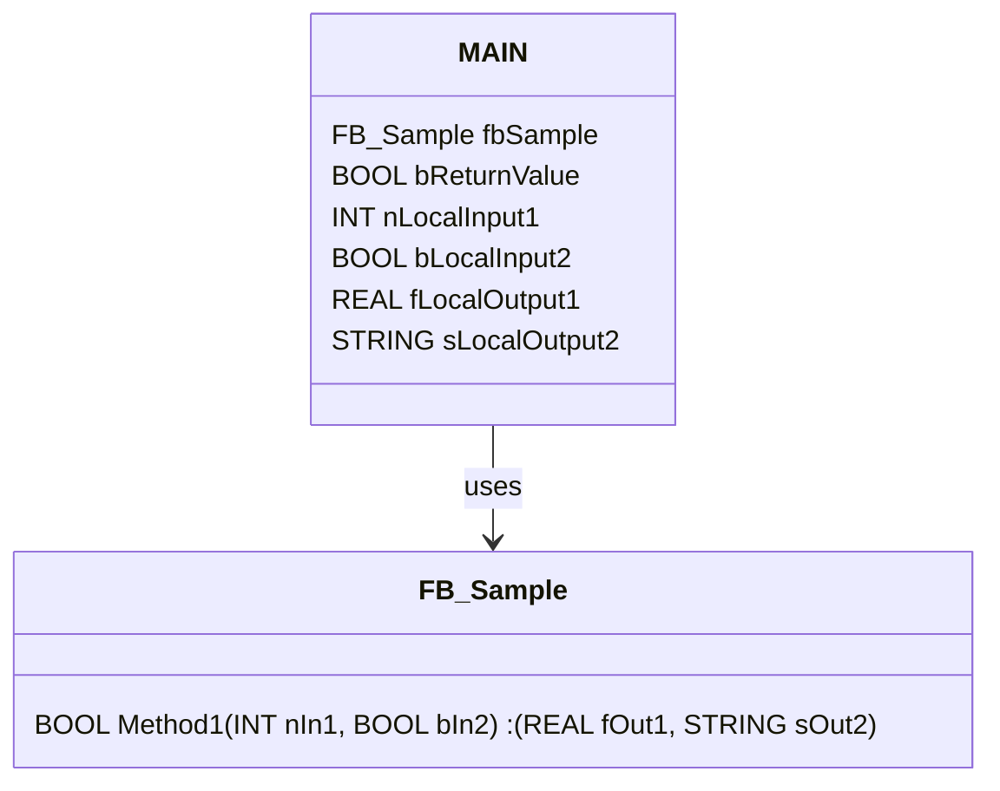

```iecst
METHOD Method1 : BOOL
VAR_INPUT
    nIn1  : INT;
    bIn2  : BOOL;
END_VAR
VAR_OUTPUT
    fOut1 : REAL;
    sOut2 : STRING;
END_VAR
// <method implementation code>
PROGRAM MAIN
VAR
    fbSample      : FB_Sample;
    bReturnValue  : BOOL;
    nLocalInput1  : INT;
    bLocalInput2  : BOOL;
    fLocalOutput1 : REAL;
    sLocalOutput2 : STRING;
END_VAR

bReturnValue := fbSample.Method1(nIn1  := nLocalInput1,
                                 bIn2  := bLocalInput2,
                                 fOut1 => fLocalOutput1,
                                 sOut2 => sLocalOutput2);
```

