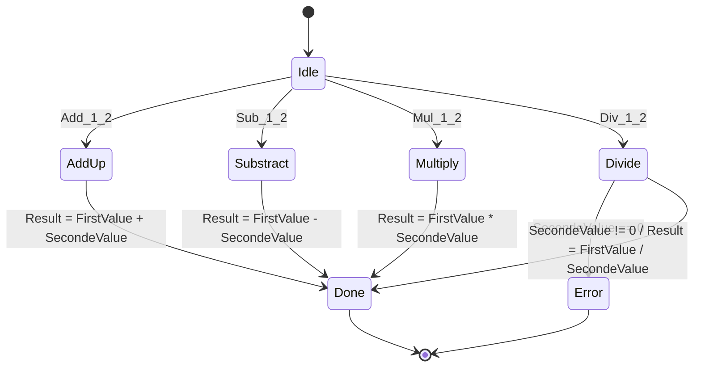
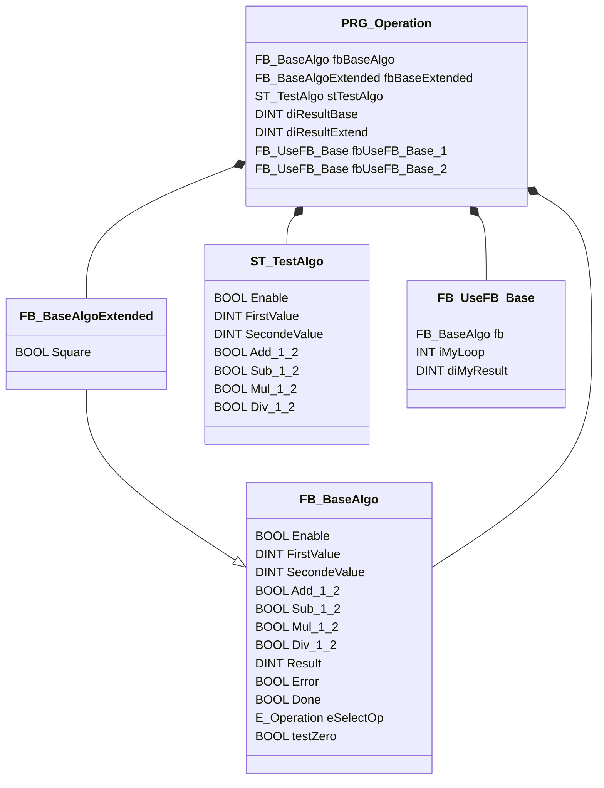

<h1 align="left">
  <br>
  
  <br>
  HEI-Vs Engineering School <h2>AAut Advanced Automation</h2>
  <br>
</h1>

[Cédric Lenoir](mailto:cedric.lenoir@hevs.ch)

# AAut Module 05: Exemple de code, ``PRG_Operation``

Ci-dessous, on a écrit un petit programme pour faire des opérations en utilisant une machine d'état.

On souhait illustrer la problématique de l'héritage d'un code qui n'aurait pas été conçu dans une optique OOP.

## Machine d'état
```iecst
TYPE E_Operation :
(
    Idle        := 999,
    AddUp       := 10,
    Substract   := 20,
    Multiply    := 30,
    Divide      := 40,
    Done        := 50,
    Error       := 666
) UINT := Idle;
END_TYPE
```

## Diagramme d'état de la machine
> La machine d'état générée par Copilot **est fausse, au sens strict**, mais illustre bien le processus.



## Structure du code


## FB_BaseAlgo Header
```iecst
FUNCTION_BLOCK FB_BaseAlgo
VAR_INPUT
    Enable          : BOOL;
    FirstValue      : DINT;
    SecondeValue    : DINT;
    // Operation
    Add_1_2         : BOOL;
    Sub_1_2         : BOOL;
    Mul_1_2         : BOOL;
    Div_1_2         : BOOL;
END_VAR
VAR_OUTPUT
    Result          : DINT;
    Error           : BOOL;
    Done            : BOOL;
END_VAR
VAR
    eSelectOp       : E_Operation;
    testZero        : BOOL;
END_VAR

```

## FB_BaseAlgo Core
```iecst
IF Enable THEN
    IF Add_1_2 THEN
        eSelectOp := E_Operation.AddUp;
    ELSIF Sub_1_2 THEN
        eSelectOp := E_Operation.Substract;
    ELSIF Mul_1_2 THEN
        eSelectOp := E_Operation.Multiply;
    ELSIF Div_1_2 THEN
        eSelectOp := E_Operation.Divide;
    END_IF
ELSE
    eSelectOp := E_Operation.Idle;
END_IF

CASE eSelectOp OF
    E_Operation.Idle 		:
        ;
    E_Operation.AddUp	 	:
        Result := FirstValue
		Result := FirstValue - SecondeValue; 
	E_Operation.Multiply	:
		Result := FirstValue * SecondeValue; 
	E_Operation.Divide		:
		IF SecondeValue = 0 THEN
			eSelectOp := E_Operation.Error;
		ELSE
			Result := FirstValue / SecondeValue; 			
		END_IF
	E_Operation.Done        :
		;
	E_Operation.Error		:
		;
END_CASE
```


## Structure pour tester l'algorithme
```iecst
TYPE ST_TestAlgo :
STRUCT
	Enable          : BOOL;
	FirstValue      : DINT;
	SecondeValue    : DINT;
	// Operation
	Add_1_2         : BOOL;
	Sub_1_2         : BOOL;
	Mul_1_2         : BOOL;
	Div_1_2         : BOOL;
END_STRUCT
END_TYPE
```

## FB_BaseAlgoExtended Header
```iecst
FUNCTION_BLOCK FB_BaseAlgoExtended EXTENDS FB_BaseAlgo
VAR_INPUT
	Square		: BOOL;
END_VAR
VAR_OUTPUT
END_VAR
VAR
END_VAR

```

## FB_BaseAlgoExtended Core
```iecst
SUPER^();

// What to do with Square ?
// On option is to rewrite the core of FB_BaseAlgo...
```

<h3 align="center"><strong style="color:red;">Problème: le code de FB_BaseAlgo ne convient pas à l'héritage!</strong></h3>

> Il faudrait réécrire le code la machine d'état, ou réécrir le code de base.

## PRG_Operation, header
```ìecst
PROGRAM PRG_Operation
VAR
	fbBaseAlgo          : FB_BaseAlgo;
	fbBaseExtended      : FB_BaseAlgoExtended;
	
	stTestAlgo          : ST_TestAlgo;
	diResultBase        : DINT;
	diResultExtend      : DINT;
	
	// Using FB_BaseAlgo
	fbUseFB_Base_1      : FB_UseFB_Base;
	fbUseFB_Base_2      : FB_UseFB_Base;
END_VAR
```

## PRG_Operation, core
```ìecst
// Set Base Inputs
fbBaseAlgo.Enable := stTestAlgo.Enable;
fbBaseAlgo.FirstValue := stTestAlgo.FirstValue;
fbBaseAlgo.SecondeValue := stTestAlgo.SecondeValue;

fbBaseAlgo.Add_1_2 := stTestAlgo.Add_1_2;
fbBaseAlgo.Sub_1_2 := stTestAlgo.Sub_1_2;
fbBaseAlgo.Mul_1_2 := stTestAlgo.Mul_1_2;
fbBaseAlgo.Div_1_2 := stTestAlgo.Div_1_2;

// Extended Algo
fbBaseAlgo();
diResultBase := fbBaseAlgo.Result;

// Set Base Inputs
fbBaseExtended.Enable := stTestAlgo.Enable;
fbBaseExtended.FirstValue := stTestAlgo.FirstValue;
fbBaseExtended.SecondeValue := stTestAlgo.SecondeValue;

fbBaseExtended.Add_1_2 := stTestAlgo.Add_1_2;
fbBaseExtended.Sub_1_2 := stTestAlgo.Sub_1_2;
fbBaseExtended.Mul_1_2 := stTestAlgo.Mul_1_2;
fbBaseExtended.Div_1_2 := stTestAlgo.Div_1_2;

// Call base Algo
fbBaseExtended();
diResultExtend := fbBaseExtended.Result;

fbUseFB_Base_1(fb := fbBaseAlgo);
fbUseFB_Base_2(fb := fbBaseExtended);

// End of code
```

> On peut toutefois vérifier que le code hérité peut être utilisé exactemement de la même façon que le code de base.

## FB_UseFB_Base Header
```iecst
FUNCTION_BLOCK FB_UseFB_Base
VAR_IN_OUT
	fb			: FB_BaseAlgo;	
END_VAR
VAR
	iMyLoop		: INT;
	diMyResult	: DINT;
END_VAR
```

## FB_UseFB_Base Core
```iecst
iMyLoop := iMyLoop + 1;

fb();
diMyResult := fb.Result;
```
> L'exemple avec FB_UseFB_Base montre une utilisation possible d'un Function Block hérité.
> > FB_UseFB_Base est défini en utilisant un FB_BaseAlgo passé en VAR_IN_OUT.
>  > De fait, il est parfaitement possible de passer FB_BaseAlgoExtended en lieu et place.

**La grande question**: Et si le comportement du Function Block hérité, à savoir: FB_BaseAlgoExtended est complètement différent.  

<h3 align="center"><strong style="color:red;">Est-ce que le code aura encore un sens ?</strong></h3>

> Idéalement, un Function Block hérité doit respecter le **L** du principe SO**L**ID, à savoir le principe de substitution de *L*iskov.

Le principe de substitution de Liskov, *Liskov Substitution Principle*, est l'un des cinq principes SOLID de la programmation orientée objet. Il stipule que **les objets d'une classe dérivée doivent pouvoir remplacer les objets de la classe de base sans altérer le bon fonctionnement du programme**. En d'autres termes, si une classe S est une sous-classe de T, alors les objets de type T peuvent être remplacés par des objets de type S sans que cela ne change le comportement attendu du programme.

### Définition formelle :

> Si q(x) est une propriété démontrable des objets x de type T, alors q(y) doit être vrai pour les objets y de type S où S est une sous-classe de T.

En pratique, cela signifie que les sous-classes doivent respecter le contrat établi par leurs super-classes. Les méthodes des sous-classes doivent donc se comporter de manière cohérente avec celles des super-classes, et ne pas introduire de comportements inattendus ou incompatibles.

<h3 align="center"><strong style="color:red;">Quitte à se répéter</strong></h3>

Le but ici est de présenter quelques aspects techniques des extensions OOP de IEC-61131-3. Le développement d'une plateforme IEC 61131-3 OOP est un travail compliqué.