<h1 align="left">
  <br>
  
  <br>
  HEI-Vs Engineering School <h2>AAut Advanced Automation</h2>
  <br>
</h1>

[Cédric Lenoir](mailto:cedric.lenoir@hevs.ch)

# AAut Module 05 /  UML Basis for this course

## List of UML relations from Mermaid.js
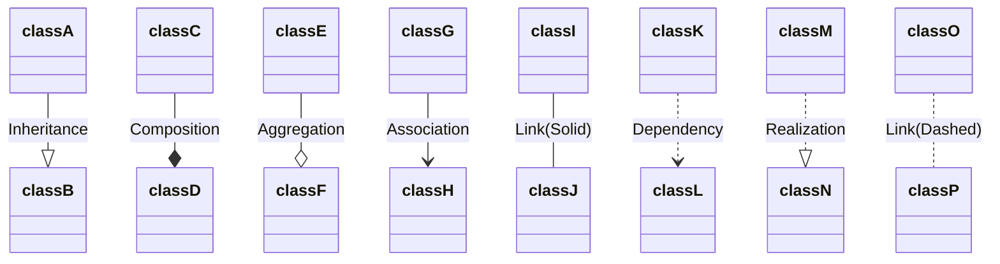

> You **MUST** know **Inheritance**, **Composition**, **Aggregation**, **Realization**.
> > If you do not know what kind of link to choose, it's better to use the **dashed link**. That means: *There is some link...*

- **Inheritance** : it's clear.
- **Composition** : you build a class from other, like a ``STRUCT`` in a ``FUNCTION BLOCK``
- **Aggregation** : mainly for **VAR_IN_OUT** representation.
- **Realization** : for **interfaces**.
- **Dashed Link** : some link...

### Exemples

<div align="center">

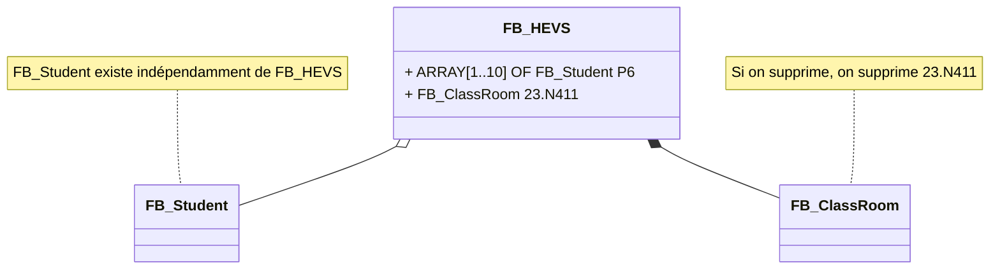
</div>

## A simple Structure

<div align="center">

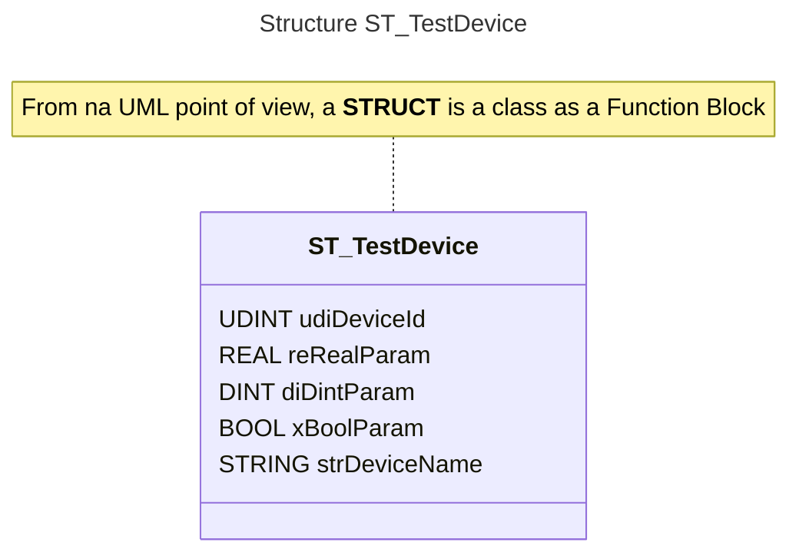
</div>

#### ST_TestDevice
```iecst
TYPE ST_TestDevice :
STRUCT
	udiDeviceId		: UDINT;
	reRealParam		: REAL;
	diDintParam		: DINT;
	xBoolParam		: BOOL;
	strDeviceName	: STRING;
END_STRUCT
END_TYPE
```

## A simple Function Block
```iecst
FUNCTION_BLOCK FB_WithInOut
VAR_INPUT
	Enable		  : BOOL;
END_VAR
VAR_IN_OUT
	ioDevice	  : ST_TestDevice;
END_VAR
VAR_OUTPUT
	Done		    : BOOL;
	Active		  : BOOL;
	Error		    : BOOL;
	ErrorID		  : ERROR_CODE;
	ErrorIdent	: ERROR_STRUCT;
END_VAR
VAR
	eMyStates	  : E_MyStates;
  _position   : LREAL;
END_VAR
```
<div align="center">

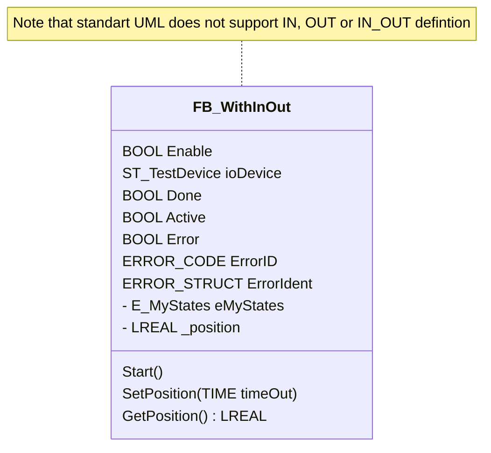
</div>

> We could edit ``VAR_INPUT BOOL`` for ``Enable``, or **+** *Public* or **-** *Private* notation, but this is not very important. The goal is to build an overview of the software.
> >  **we don't really need to go into details.** In some cases we can even afford to represent classes without their internal variables.
> > We have added 3 Methods to ``FB_WithInOut``.

### STRUCT Composition

<div align="center">

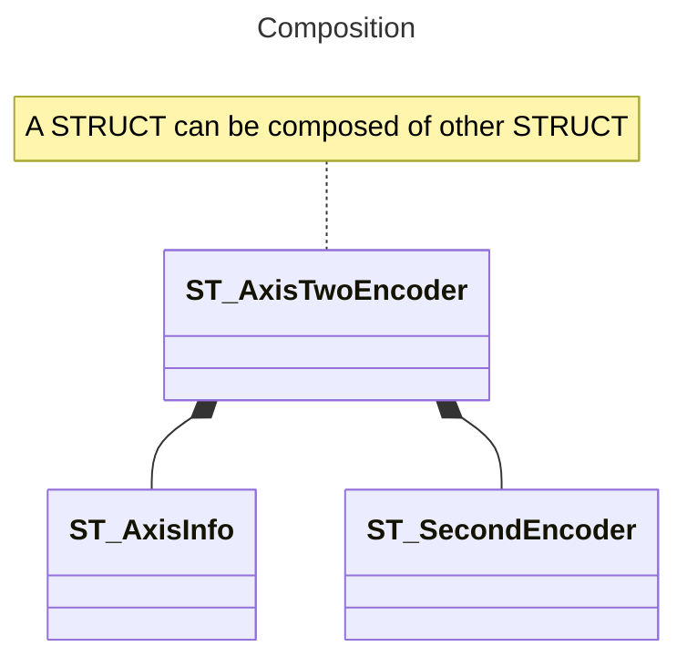
</div>

### FUNCTION BLOCK Composition

<div align="center">

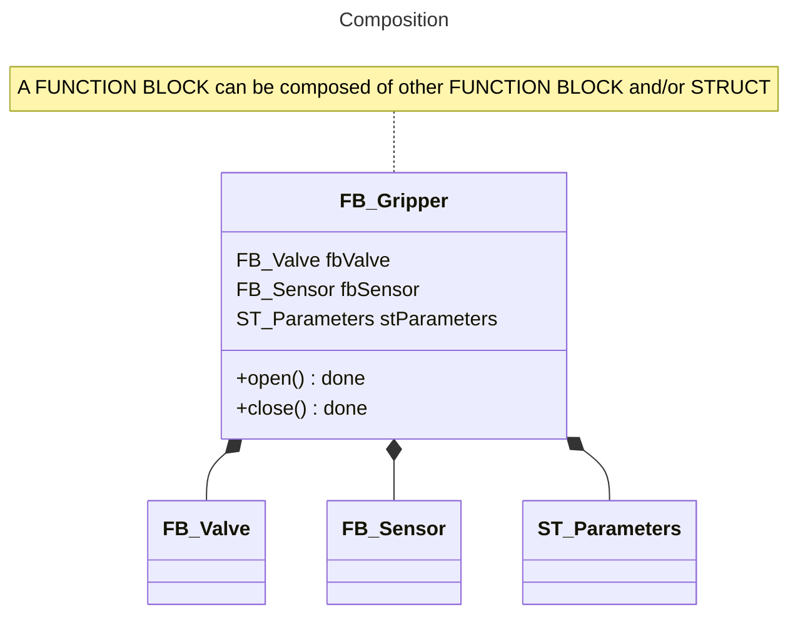
</div>

### The function block with VAR_IN_OUT
As VAR_IN_OUT is not known for IEC-61131-3 **we define** that VAR_IN_OUT uses AGREGATION. **This constrution is to know !**

<div align="center">

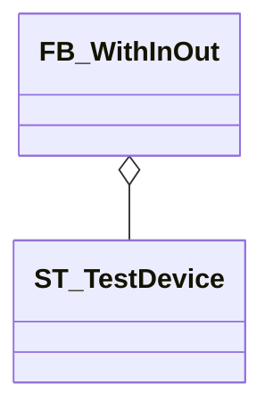
</div>

> This is correct, because the ``ST_TestDevice`` structure has **no memory space of its own in** ``FB_WithInOut``, but it will be instantiated outside the Function Block. This is called passing a variable by reference.

> We could imagine other constructions, but once again: **The goal is not to go into depth into details but to obtain a simple and quick to build representation of our software**.

> As the goal is to use generative AI to help code building, I made the test with ChatGPT. Its proposition is to use an Association for IN_OUT. I do not agree with that. The advantage of Copilot, in our case, is that **it uses the ressources of your environement**. That is, it will build what you uses to do. In my case, he will build again a construction with an **Aggregation**. 

## An Interface
<div align="center">

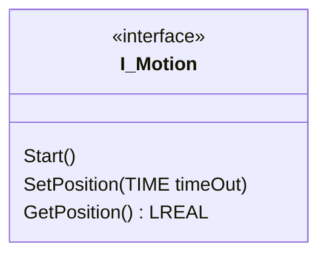
</div>

## A Function Block with one or more interfaces.
> That's a good practice to use correct prefixes, like **I_** or **ITF_**, **FB_**, **ST_**. so you understand at first glance what type of class it is.
> > It exists other prefixes, like **MC_** for motion control. I use **DM_**, **CM_**, **EM_** respectively for Device Module, Control Module, Equipment Module.
> > When you instanciate your class to an object, that is : you declare the variable, **always** use the **lowercase** version. Exemple: **mc**MoveAbs for **MC**_MoveAbsolute

<div align="center">

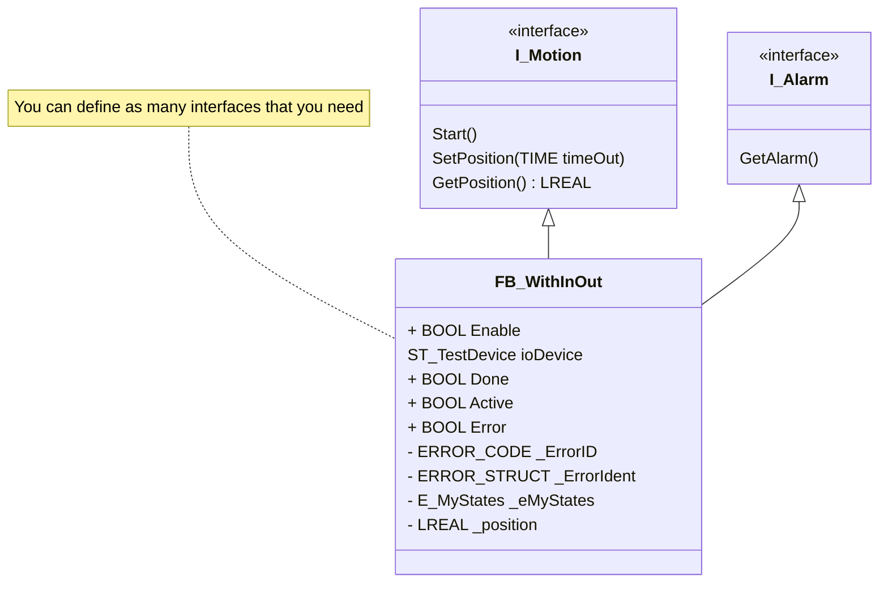
</div>

## Inheritance of a structure

#### ST_TestDevice
```iecst
TYPE ST_TestDevice :
STRUCT
	udiDeviceId		: UDINT;
	reRealParam		: REAL;
	diDintParam		: DINT;
	xBoolParam		: BOOL;
	strDeviceName	: STRING;
END_STRUCT
END_TYPE
```
#### ST_TestDeviceMoreParam
```iecst
TYPE ST_TestDeviceMoreParam EXTENDS ST_TestDevice :
STRUCT
	xMoreBoolParam	: BOOL;
	reMoreRealParam	: REAL;
	dtElapsedTime	: TIME;
END_STRUCT
END_TYPE
```
<div align="center">

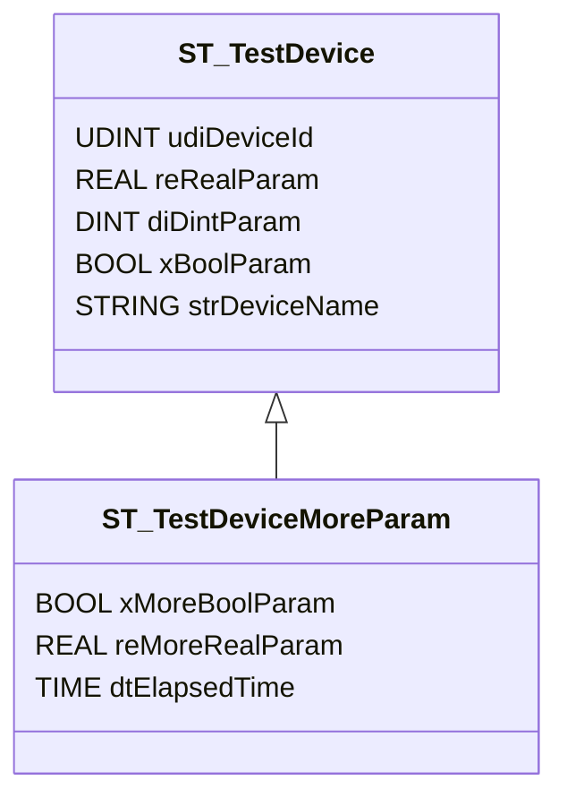
</div>

Variant of Inheritance

> With copilot: Can you generate uml class diagram from the IEC 61131-3 code above ? 

# UML for an ENUM
```iecst
{attribute 'qualified_only'}
{attribute 'strict'}
TYPE E_MyStates :
(
	IDLE 	:= 999,
	INIT	:= 10,
	INOP	:= 20,
	DONE	:= 30,
	ERROR	:= 40
) WORD := IDLE;
END_TYPE
```
<div align="center">

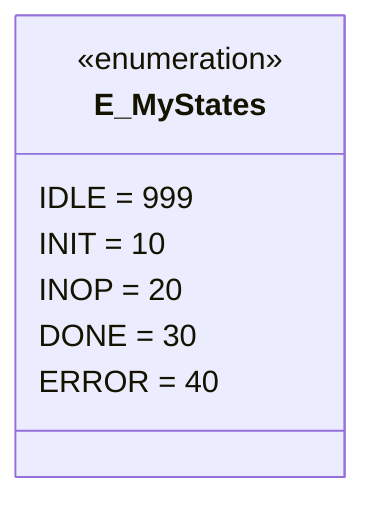

</div>

