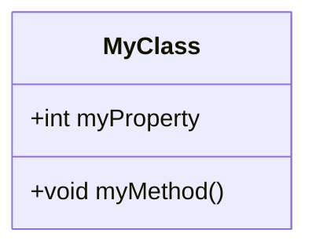

<h1 align="left">
   
  
   
  HEI-Vs Engineering School <h2>AAut Advanced Automation</h2>
   
</h1>

[Cédric Lenoir](mailto:cedric.lenoir@hevs.ch)

# AAut Lab 01 / URS

## Objectifs
-   Mettre en pratique le digramme en V, en particulier FS et DS.
-   Mettre en pratique une interface IEC-61131-3 OOP
-   Note 1 sur 3

## User Request Specification (URS)
<strong style="color:red;">L'URS peut être précisée d'entente entre le client et les fournisseurs jusqu'à 10 minutes après le début du labo du mrecredi matin.</strong>

### Functional Requirements
- **URS-01**: L’opérateur peut ouvrir ou fermer une pince depuis une interface.
- **URS-02**: L’opérateur doit pouvoir piloter la position de la pince depuis une interface utilisateur.
- **URS-03**: L’opérateur peut paramétrer les informations suivantes :
    - **URS-03.1**: Ecartement maximal en unité capteur quand la pince est fermée.
    - **URS-03.2**: Ecartement minimal en unité capteur quand la pince est ouverte.
    - **URS-03.3**: Délais maximal en ms pour une séquence d’ouverture ou de fermeture.

### Non-Functional Requirements
- **NFD-01**: L’interface utilisateur est fournie. Il utilise une interface au sens UML qui est imposée.
- **NFD-02**: Les défauts sont fournis à l’interface sous forme de texte, STRING.

## Votre,job 3 lignes par points
•	Décrire la FS en décrivant les éléments présents dans le laboratoire.
•	Décrire les tests OP de votre FS.
•	Décrire la HDS du système.
•	Décrire les tests IQ du système.

> Il y a des exemples [dans le répértoire documentation du module 02](../AAut_MOD_02_Specification/documentation).

-   Décrire le schéma UML du système quant à son comportement **et** sa structure.

.   Le rapport sur fichier MD, , sauf la feuille de tests FS/OP et DS/IQ qui doit être signée pour chaque éléments testé. Si un test échoue, le résultat est mentionné et signé à la main sur la feuille de test.

> Délais de remise sur Moodle : 17 mars.

### Class Diagram with Property

