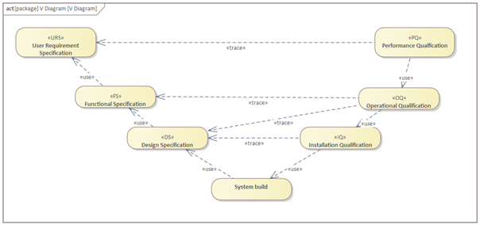
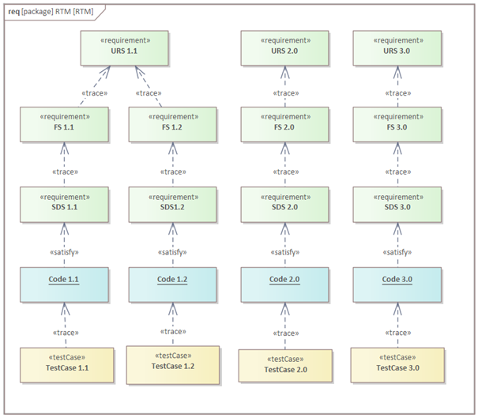
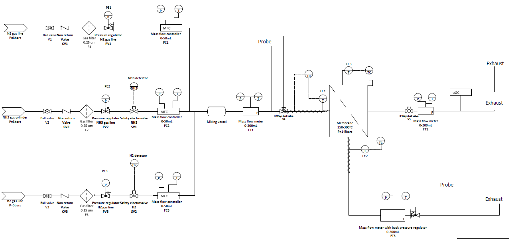
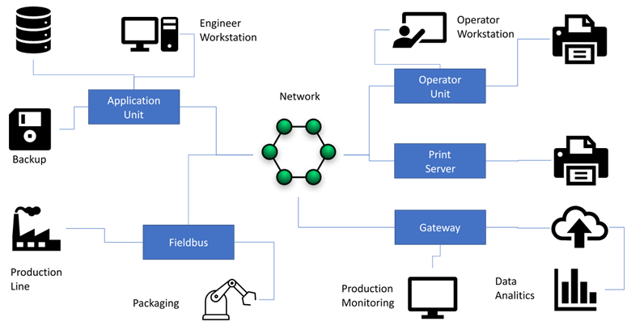
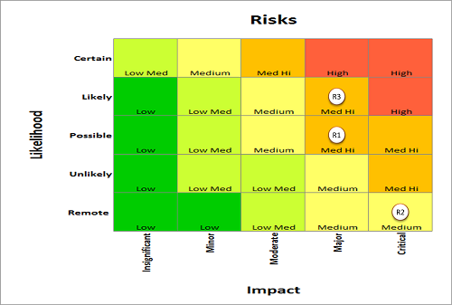
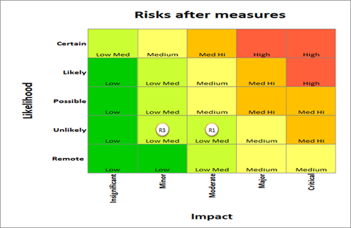

<h1 align="left">
   
  
   
  HEI-Vs Engineering School <h2>AAut Advanced Automation</h2>
   
</h1>

[Cédric Lenoir](mailto:cedric.lenoir@hevs.ch)

# AAut Module 06 Process Specification

- [Introduction](#introduction)
- [GMP](#gmp)
- [GAMP® 5](#gamp-5)
- [Le cycle de vie](#le-cycle-de-vie)
- [Le système d’assurance qualité](#le-système-dassurance-qualité)
- [Spécifications, principes généraux](#spécifications-principes-généraux)
- [V-Diagram](#v-diagram)
- [Traçabilité](#traçabilité)
- [URS ou User Request Specification](#urs-ou-user-request-specification)
- [FS Functional Specification](#fs-functional-specification)
- [DS Design Specification](#ds-design-specification)
- [Design Review](#design-review)
- [Tests](#tests)
- [Coût des changements](#coût-des-changements)
- [Exercices](#exercices)
- [Annexes](#annexes)

## Überblick
Ob Sie nun auf der Seite des Kunden stehen, der ein System automatisieren möchte, oder auf der Seite des Ingenieurs, der die Automatisierung entwerfen muss – die Qualität hängt von einem entscheidenden Faktor ab: der Umsetzung und dem Verständnis der Spezifikationen.

## Wichtigste Erkenntnisse

- Wenn ein Projekt scheitert, sei es hinsichtlich der technischen Qualität, der Einhaltung von Fristen oder des Budgets, liegt dies viel häufiger an mangelhaften Spezifikationen als an Problemen bei der praktischen Umsetzung.

- Je später ein Fehler, d. h. eine technische Änderung, im Projekt auftritt, desto komplexer und kostspieliger ist seine Behebung.

- Die beiden vorangegangenen Absätze verdeutlichen die Bedeutung dieser Projektphase.

- Spezifikationen sollen den Handlungsspielraum und die Kreativität des Automatisierungsingenieurs nicht einschränken, sondern die Qualität seiner Arbeit verbessern, indem sie als Leitfaden durch den gesamten Entwicklungsprozess dienen.

## Was Sie wissen müssen

- Die verschiedenen Komponenten eines Spezifikationssystems identifizieren.

- Eine Liste einfacher Spezifikationen erstellen.

- Die Funktionsweise des V-Diagramms verstehen.

- Einige Prinzipien der Guten Herstellungspraxis (GMP) für die automatisierte Fertigung verstehen und anwenden.

- Insbesondere die verschiedenen Elemente eines V-Diagramms und einer FMEA (Fehlermöglichkeits- und Einflussanalyse) erstellen können.

## Mots clés
*	**URS (User Requirements Specification)**: Dokument, das die Bedürfnisse und Erwartungen der Endbenutzer beschreibt.
  *	**NFS (Non Functional Specification)** : Dokument, das die Eigenschaften der Elemente in der URS definiert.
*	**FS (Functional Specification)**: Dokument, das die vom System zu erbringenden Funktionalitäten detailliert beschreibt.
*	**DS (Design Specification)**: Dokument, das den technischen Entwurf des Systems beschreibt.
*	**SDS (Software Design Specification)**: Dokument, das den Softwareentwurf spezifiziert.
*	**HDS (Hardware Design Specification)**: Dokument, das den Hardwareentwurf spezifiziert.
*	**IQ (Installation Qualification)**: Prozess zur Überprüfung, ob die Systeminstallation den Spezifikationen entspricht.
*	**OQ (Operational Qualification)**: Prozess zur Überprüfung, ob das System unter den spezifizierten Betriebsbedingungen korrekt funktioniert.
*	**PQ (Performance Qualification)**: Prozess zur Überprüfung, ob das System unter realen Bedingungen effizient und zuverlässig funktioniert.
*	**FAT (Factory Acceptance Test)**: Tests, die im Werk durchgeführt werden, um sicherzustellen, dass das System vor dem Versand den Spezifikationen entspricht.
*	**SAT (Site Acceptance Test)**: Tests, die vor Ort durchgeführt werden, um sicherzustellen, dass das System nach der Installation ordnungsgemäß funktioniert.
*	**FMEA (Failure Modes and Effects Analysis)**: Eine Analysemethode zur Identifizierung und Bewertung potenzieller Fehlermöglichkeiten und ihrer Auswirkungen auf das System.

*	**GMP (Good Manufacturing Practices)** Diese Richtlinien bilden den Rahmen für eine konsistente und kontrollierte Herstellung von Produkten gemäß den geltenden Qualitätsstandards. Im Kontext der Prozessautomatisierung konzentriert sich GMP auf die Validierung und Verifizierung automatisierter Systeme, um deren korrekten und zuverlässigen Betrieb sicherzustellen. Dies umfasst die sorgfältige Dokumentation von Spezifikationen, Tests und Wartungsverfahren, um zu gewährleisten, dass die automatisierten Systeme während ihres gesamten Lebenszyklus die regulatorischen und Qualitätsanforderungen erfüllen.

---

# Einleitung
Der Titel dieses Kapitels hätte auch **Gute Herstellungspraxis**, **Good Manufacturing Practices**, **GMP**, lauten können. In der Praxis werden diese Akronyme in einer ganzen Reihe von Publikationen verwendet, die die hohe Qualität hergestellter Produkte gewährleisten sollen. Sie werden nicht in allen Bereichen eingesetzt, sind aber in vielen anderen durch Normen vorgeschrieben, die der Einhaltung von Vorschriften dienen.

## GMP
Die GMP-Terminologie wird hauptsächlich in folgenden Bereichen verwendet:
- Pharmazeutische Produkte
- Pharmazeutische Wirkstoffe
- Diagnostische Produkte
- Lebensmittel und Getränke

Es soll die Produktvalidierung ermöglichen, beispielsweise durch die **FDA** [Federal Drug Administration]((https://www.fda.gov/)) in den Vereinigten Staaten, die **EMA** [European Medical Agency](https://www.ema.europa.eu/en/homepage)) für die Europäische Union oder [Swissmedic](https://www.swissmedic.ch/swissmedic/de/home.html) in der Nähe.

Dies ist kein Kurs über GMP, der einen eigenen Kurs erfordern würde. Ich verwende GMP und seine bekannteste Variante, GAMP®, in ihrer wörtlichen Bedeutung: **Gute automatisierte Herstellungspraxis**.

> Example: the Hamilton gas sensor say: Reporting and central data management of users and validation reports for the sensor’s
calibration, verification, configuration and communication, ready for compliance with the
GMP guidelines such as FDA CFR21 Part 11 and Eudralex Volume 4 Annex 11 (this requires
ArcAir Advanced App).

## GAMP® 5
Der Begriff GAMP® (Good Automated Manufacturing Practice) ist eine eingetragene Marke der ISPE® (https://ispe.org/). Die aktuelle Version umfasst fünf Abschnitte. Es existieren weitere Standardrichtlinien, wie beispielsweise ASTM E2500.

Generell gibt es Qualitätssicherungsprozesse, die zu Zertifizierungen führen und auf ähnlichen Prinzipien basieren, auch in folgenden Bereichen:

### Luftfahrt
Nehmen wir als Beispiel die Aluminiumverarbeitung aus dem Wallis.

### Automobilkomponenten
Besonders ausgeprägt sind die Einschränkungen hinsichtlich der Maschinenverfügbarkeit.

> Tatsächlich wenden viele Unternehmen im Automatisierungssektor die GMP-Prinzipien weiterhin an, nachdem sie diese in Projekte der Pharmaindustrie integriert haben. Die Begründung ist einfach: *Sobald das Unternehmen und seine Mitarbeiter die grundlegenden GMP-Prinzipien verinnerlicht haben und das Qualitätssystem etabliert ist, profitieren auch Projekte außerhalb der Pharmabranche von der verbesserten Qualität, was dem Unternehmen letztendlich oft zu einer höheren Rentabilität verhilft.*

---

# Der Lebenszyklus

## Grund
### Warum sollte man GMP in einem Automatisierungskurs behandeln?
Vor allem, weil es als Qualitätssystem den Lebenszyklus von automatisierten Maschinen beschreibt. **Der gesamte Entwicklungsprozess** der Automatisierung ist Teil des Lebenszyklus der Maschine. Anders ausgedrückt: Idealerweise kann ein Arzneimittel nicht validiert werden, wenn der automatisierte Teil der Maschine, der dieses Arzneimittel herstellt, nicht unter Berücksichtigung dieser Anforderungen entwickelt wurde.

Das Erste, was ein für einen Schulungstag beauftragtes Qualitätsberatungsunternehmen Ihnen wahrscheinlich erzählen wird, ist von einem Kunden, der sich eines Tages meldet und um die Validierung der Maschine bittet, die er zum Verpacken eines Medikaments einsetzen möchte. Es wäre zwar möglich, diese Maschine nachträglich zu validieren, aber zu höheren Kosten und – was noch wichtiger ist – es entstehen dadurch nur Kosten, ohne dass die Maschine an Wert gewinnt.

### In der Praxis
Es ist höchst unwahrscheinlich, dass eine Maschine erst im Nachhinein validiert wird, da die Validierungsphase mit hoher Wahrscheinlichkeit vom Kunden durchgeführt wird. Das Hauptanliegen des Kunden ist die Überprüfung, ob Ihr Unternehmen über die notwendigen Kompetenzen und das erforderliche Qualitätssicherungssystem zur Validierung der Maschine verfügt. Dies wird ein Audit sein.
Die Anpassung des Entwicklungszyklus eines Projekts an die geltenden Vorschriften ist zweifellos deutlich teurer, wenn sie in einen bestehenden oder gar nicht vorhandenen Prozess integriert werden muss.

## Zertifizierung ist kein Innovationshindernis
Nehmen wir beispielsweise die FDA. Anstatt Innovationen durch die Einschränkung der Kreativität von Ingenieuren zu behindern, bietet sie Programme zur Innovationsförderung an.

https://www.fda.gov/about-fda/cdrh-innovation/activities-support-medical-device-innovators
Zertifizierungsstellen sind keine Kontrollinstanzen, sondern Partner, die Ingenieure bei der Verbesserung ihrer Entwicklungsprozesse unterstützen.

### Zwei Beispiele:
1.  Die Netzfrequenz beträgt 50 Hz. Sie könnten Ihre Maschine natürlich aus verschiedenen Gründen mit einem AC/DC-Wandler und einem 133-Hz-Generator ausstatten. Überlegen Sie, ob Ihre Kunden an Ihrer kreativen Freiheit interessiert sind.

2.  Der Standard ISA-TR88.00.02-2022, „Maschinen- und Gerätezustände: Ein Implementierungsbeispiel von ISA-88.00.01“, den wir später besprechen werden, ist ein 112-seitiges Dokument, das die Funktionsweise einer Maschine beschreibt. Wenn Sie sich für einen eigenen Standard entscheiden, sind Sie dafür verantwortlich, das Äquivalent dieses Dokuments für Ihre Maschine zu definieren und zu verfassen. Überlegen Sie, ob der Zeitaufwand für dieses Dokument Ressourcen reduziert, die Sie für Ihre Innovation hätten einsetzen können.

---

# Das Qualitätssicherungssystem
## Warum Qualitätssicherung in der Automatisierung?

Dieser Abschnitt erläutert, dass Automatisierung nur eine Phase in der Entwicklung einer Maschine darstellt. Sie muss nicht nur nach der Inbetriebnahme einwandfrei funktionieren, sondern ihr Betrieb muss auch während ihres gesamten Lebenszyklus und darüber hinaus aufrechterhalten und verbessert werden. Dieser Lebenszyklus reicht von etwa zehn Jahren in der Maschinenbauindustrie bis zu mehreren Jahrzehnten in der Energieerzeugung.

Das Qualitätsmanagementsystem (QMS) beschreibt die Prozesse.

Ein Qualitätsmanagementsystem (QMS) ist ein formalisiertes System, das Prozesse, Verfahren und Verantwortlichkeiten zur Erreichung von Qualitätsrichtlinien und -zielen dokumentiert. Ein QMS hilft, die Aktivitäten einer Organisation zu koordinieren und zu steuern, um Kunden- und behördliche Anforderungen zu erfüllen und ihre Effektivität und Effizienz kontinuierlich zu verbessern.

(Quelle: American Society for Quality)

## Aktivitäten
- Dokumentenmanagement
- Risikomanagement
- Änderungsmanagement
- Konfigurationsmanagement
- Störungsmanagement
- Lieferantenmanagement
- Datensatzverwaltung
- Archivierung
- Schulungsmanagement
- Periodische Evaluierung
- Geschäftskontinuität
- 
## Qualitätsmanagementprozess

### Dokumentenmanagement
Das Dokumentenmanagement umfasst die Erstellung, Prüfung, Genehmigung, Verteilung und Archivierung von Dokumenten, die zur Sicherstellung der Prozessqualität und -konformität erforderlich sind.

### Risikomanagement
Das Risikomanagement umfasst die Identifizierung, Bewertung und Minderung potenzieller Risiken, die die Produkt- oder Prozessqualität beeinträchtigen könnten.

### Änderungsmanagement
Das Änderungsmanagement stellt sicher, dass alle Änderungen an Prozessen, Systemen oder Produkten ordnungsgemäß kontrolliert und dokumentiert werden, um Qualität und Konformität zu gewährleisten.

### Konfigurationsmanagement
Das Konfigurationsmanagement umfasst die Nachverfolgung und Kontrolle von Produkt- und Systemversionen, um sicherzustellen, dass Änderungen korrekt implementiert und dokumentiert werden.

### Störungsmanagement
Das Störungsmanagement umfasst die Identifizierung, Dokumentation und Behebung von Störungen, die die Produkt- oder Prozessqualität oder -konformität beeinträchtigen könnten.

### Lieferantenmanagement
Das Lieferantenmanagement umfasst die Bewertung und Überwachung von Lieferanten, um sicherzustellen, dass diese die erforderlichen Qualitäts- und Konformitätsstandards erfüllen.

### Dokumentenmanagement
Das Dokumentenmanagement stellt sicher, dass alle notwendigen Dokumente erstellt, gepflegt und zugänglich sind, um die Prozesskonformität und -qualität nachzuweisen.

### Archivierung
Die Archivierung umfasst das Speichern und Schützen wichtiger Dokumente und Aufzeichnungen, um deren zukünftige Verfügbarkeit und die Einhaltung gesetzlicher Bestimmungen zu gewährleisten.

### Schulungsmanagement
Das Schulungsmanagement stellt sicher, dass alle Mitarbeitenden die notwendigen Schulungen erhalten, um ihre Aufgaben effektiv und effizient zu erfüllen.

### Regelmäßige Evaluierung
Die regelmäßige Evaluierung umfasst die Überprüfung von Prozessen und Systemen, um Verbesserungspotenziale zu identifizieren und die fortlaufende Einhaltung der Vorschriften sicherzustellen.

### Geschäftskontinuität
Geschäftskontinuität umfasst die Planung und Umsetzung von Maßnahmen, um die Aufrechterhaltung des Betriebs im Falle von Störungen oder Notfällen zu gewährleisten.

## Einige Beispiele.

> Produziert eine Maschine Teile für die Automobilindustrie, erhält jedes gefertigte Teil eine Seriennummer, die mit einer an einen Kunden gelieferten Teilecharge verknüpft werden kann. Wird später ein Defekt entdeckt, der für den Endnutzer zum Problem wird, kann die Überprüfung der während der Produktion durchgeführten Tests verlangt werden, selbst wenn die Maschine zwischenzeitlich in Betrieb genommen wurde. Siehe oben zu den Konzepten der Archivierung und Aufzeichnung. Der Automatisierungsingenieur muss daher die Tests aufzeichnen und archivieren sowie sicherstellen, dass das Datenformat der Aufzeichnungen langfristig gewährleistet ist.

> Im Idealfall ist die Maschine perfekt. In der Praxis ist es jedoch wahrscheinlich, dass irgendwann eine Softwarekomponente analysiert und gegebenenfalls angepasst werden muss. Die Lesbarkeit eines Programms ist ebenso wichtig wie seine Funktionalität. Daher kann selbst ein funktionsfähiges Programm abgelehnt werden, wenn seine Lesbarkeit nicht ausreichend ist.

> Wie oben beschrieben, kann die Lebensdauer einer Maschine oder Anlage in Jahrzehnten gemessen werden. Bei der Auswahl der Komponenten eines Automatisierungssystems ist es wichtig, sich folgende Frage zu stellen: Kann der gewählte Lieferant innerhalb von zehn Jahren Support und gegebenenfalls den Austausch einer Komponente gewährleisten? Hinzu kommt die Überlegung: Ist die Dokumentation ausreichend, damit ein entsprechend geschulter Techniker die Maschine bedienen kann?

---

# Spezifikationen, Allgemeine Prinzipien

## URS, Benutzeranforderungsspezifikation
Die **URS** definiert die Anforderungen. Welche Hauptfunktionalitäten werden benötigt?

Die URS muss die zukünftigen Akzeptanzkriterien des Benutzers widerspiegeln, die durch ein Performance-Qualifizierungsverfahren **PQ** validiert werden.

> Die URS ist Aufgabe des Kunden. Die Aufgabe des Automatisierungsingenieurs besteht darin, zu sagen: **Ich beginne erst mit der Arbeit, nachdem ich die vom Kunden bereitgestellte URS validiert habe.**

> Die URS definiert die Antwort auf die Frage: **Was?**

### NFS, Nicht-funktionale Spezifikation
Das Konzept der NFS findet sich manchmal als Anhang zur URS. **NFS** beschreiben Kriterien, die die Funktionsweise eines Systems beurteilen, aber nicht direkt mit den spezifischen Funktionalitäten zusammenhängen, die es erfüllen muss. Sie konzentrieren sich auf Aspekte der Systemqualität wie Leistung, Sicherheit, Zuverlässigkeit, Wartbarkeit und Skalierbarkeit.

Hier sind einige Beispiele für nicht-funktionale Spezifikationen:

- **Leistung**: Reaktionszeit, Durchsatz, Ressourcennutzung.

- **Sicherheit**: Zugriffskontrollen, Datenschutz, Authentifizierung.

- **Zuverlässigkeit**: Ausfallrate, Verfügbarkeit, Wiederherstellung nach Ausfällen.

- **Wartbarkeit**: Einfache Fehlerbehebung, Modularität, Dokumentation.

- **Skalierbarkeit**: Fähigkeit zur Bewältigung erhöhter Arbeitslasten, Flexibilität zur Integration neuer Funktionen.

Es obliegt dem Kunden, die nicht-funktionalen Spezifikationen **NFS** zu definieren, die der Dokumentation hinzugefügt und während der Produktionsqualifizierung **PQ** getestet bzw. verifiziert werden.

## FS, Funktionale Spezifikation
Die FS definiert das Verhalten; welche Funktionalitäten sind erforderlich?

Die FS definiert die Funktionsweise und die Nutzung des Systems.

Die FS stellt die Kriterien für die Betriebsabnahme dar, die durch ein Verfahren zur Funktionsqualifizierung (OQ) validiert werden.

> Die FS ist primär Aufgabe des Ingenieurs. Sie beschreibt, wie die Maschine gebaut wird, um die URS (Unified Requirements Specification) zu erfüllen.

> Die FS beantwortet primär die Frage: **Wie?**

## DS, Designspezifikation
Die DS definiert die Implementierungsdetails.

Die DS legt fest, wie die Funktionen implementiert werden. Sie werden durch ein Installationsqualifizierungsverfahren (IQ) validiert.

In der Praxis sprechen wir hauptsächlich von der DS, die in HDS und SDS unterteilt werden kann.

Die HDS (Hardware-Designspezifikation) umfasst alles von Sensoren und Aktoren bis hin zu den SPS-Eingängen. Ein gutes Beispiel für einen Inhalt der HDS ist der Schaltplan.

Die SDS (Software-Designspezifikation) umfasst alles, was mit der Software zusammenhängt, hauptsächlich UML-Diagramme.

Je nach Branche können auch folgende Definitionen enthalten sein:
*	CS, Configuration Specification
*	SMS, Software Module Specification
*	NDS, Network Specification

# V-Diagram

  <figure>
    
    <figcaption>V-Diagram</figcaption>
  </figure>

## Ursprung des V-Diagramms

Das V-Diagramm ist eine Projektmanagement- und Systementwicklungsmethodik, die entwickelt wurde, um die Rückverfolgbarkeit und Validierung von Anforderungen über den gesamten Projektlebenszyklus hinweg zu verbessern. Es wird insbesondere im Systems Engineering und in der Softwareentwicklung eingesetzt.

### Geschichte

Das V-Diagramm entstand aus Methodiken zur Entwicklung komplexer Systeme, insbesondere in der Luft- und Raumfahrt- sowie der Verteidigungsindustrie. Es wurde entwickelt, um den Bedarf dieser Branchen an Strenge und Rückverfolgbarkeit von Anforderungen zu decken und sicherzustellen, dass jede Entwicklungsphase vor dem Übergang zur nächsten ordnungsgemäß validiert wird.

### Struktur des V-Diagramms

Das V-Diagramm ist so strukturiert, dass es die verschiedenen Phasen des Systementwicklungszyklus darstellt, wobei der Schwerpunkt auf Validierung und Verifizierung in jeder Phase liegt. Die Struktur ist wie folgt:

1. **Anforderungsdefinition (URS, FS, DS)**:

- **URS (User Request Specification)**: Beschreibt die Bedürfnisse und Erwartungen der Endbenutzer.

- **Funktionale Spezifikation (FS)**: Beschreibt die vom System zu erbringenden Funktionalitäten.

- **Designspezifikation (DS)**: Beschreibt den technischen Entwurf des Systems.

2. **Entwicklung und Implementierung**:

- Detaillierter Entwurf und Entwicklung des Systems basierend auf den definierten Spezifikationen.

3. **Validierung und Verifizierung**:

- Jeder Entwicklungsphase ist eine entsprechende Testphase zugeordnet, um zu überprüfen, ob die Anforderungen korrekt implementiert wurden und das System wie erwartet funktioniert.

### Vorteile des V-Modells

- **Rückverfolgbarkeit**: Gewährleistet die Rückverfolgbarkeit jeder Anforderung in allen Entwicklungsphasen.

- **Kontinuierliche Validierung**: Ermöglicht die kontinuierliche Validierung in jeder Phase und reduziert so das Risiko schwerwiegender Fehler am Projektende.

- **Klarheit und Strenge**: Bietet eine klare und stringente Struktur für die Entwicklung komplexer Systeme.

Zusammenfassend lässt sich sagen, dass das V-Modell eine bewährte Methodik ist, die sicherstellt, dass entwickelte Systeme die Benutzeranforderungen erfüllen und in jeder Phase des Projektlebenszyklus ordnungsgemäß validiert werden.

# Rückverfolgbarkeit
Rückverfolgbarkeit ist ein grundlegendes Element für den Nachweis der Einhaltung gesetzlicher Vorschriften. In der ISO-Terminologie (Internationale Organisation für Normung) belegt die Rückverfolgbarkeit, dass das Eingangsdesign für das Ausgangsdesign validiert und verifiziert wurde.

Bei sehr komplexen Systemen kann eine Rückverfolgbarkeitsmatrix verwendet werden.

  <figure>
    
    <figcaption>Rückverfolgbarkeitsmatrix</figcaption>
  </figure>

> Diese gesamte Dokumentationsphase garantiert zwar nicht die korrekte Funktion Ihrer Maschine, aber sie stellt sicher, dass Sie die einwandfreie Funktion jeder Komponente überprüft haben.

> Es ist völlig sinnlos, solche Spezifikationen erst nach dem Bau der Maschine zu erstellen. Das GMP-Prinzip zielt darauf ab, sicherzustellen, dass Ihre Maschine gemäß bewährten Verfahren gebaut wurde. Dies verbietet nachträglich erstellte Dokumentation und verhindert jegliche Zertifizierung.

> Die besten Bachelorarbeiten im Bereich Automatisierung zeichnen sich durch die strikte Einhaltung des GMP-Prinzips und des V-Modells aus!

---

# URS ou User Request Specification
|User Requirements Specification |Functional Specification |Design Specification |Test protocol|
|--------------------------------|-------------------------|---------------------|-------------|
|The system must prevent false alarms due to normal activities such as door opening. |(See FS…)	|(See DS…)	|(See Test…)|

Die Anforderungsspezifikation (User Requirements Specification, URS) ist ein **interdisziplinäres** Projekt, das primär den **Auftraggeber** bzw. den Projektmanager im Bereich Automatisierung betrifft.

Der Automatisierungsingenieur ist nicht zwingend an der Erstellung der URS beteiligt. Seine Aufgabe ist es jedoch, sicherzustellen, dass die URS existiert und ausreichend präzise und gut dokumentiert ist.

Die URS ist zweifellos **das komplexeste Dokument in der Entwicklung**, aber wohl auch das wichtigste. Sie wird zu Beginn des Lebenszyklus der Maschine erstellt, und Unvollständigkeiten in der URS haben oft die größten Auswirkungen auf Verzögerungen und Kosten.

Die URS beschreibt die funktionalen Anforderungen des Benutzers, den Grad der Benutzerinteraktion, die Schnittstellen zu anderen Systemen und Geräten, die Betriebsumgebung sowie alle Einschränkungen. Spezifische regulatorische Anforderungen, beispielsweise zur Verwendung elektronischer Aufzeichnungen und elektronischer Signaturen, sollten berücksichtigt werden. Die Dokumentation der Benutzeranforderungsspezifikation (URS) muss Folgendes gewährleisten:

- Dem Entwickler das Verständnis der Benutzeranforderungen ermöglichen,
- Die Designbeschränkungen klar definieren,
- Ausreichend Details für die Abnahmetests bereitstellen,
- Den Betrieb und die Wartung des Steuerungssystems unterstützen und
- Die Entsorgung und Stilllegung des Steuerungssystems berücksichtigen und erleichtern.

Der Fokus liegt auf den Benutzeranforderungen, nicht auf der Implementierungsmethode. Daher sollte die Dokumentation nicht produktspezifisch sein. Anforderungen sollten nicht so definiert werden, dass einzelne Anforderungen (mit Abnahmekriterien) zur Rückverfolgbarkeit während der Entwicklung und des Testens identifiziert werden können. Diagramme sollten die Lesbarkeit verbessern. Siehe Rückverfolgbarkeitsmatrix.

Da URSs in Alltagssprache und nicht in einer strengeren, formalen Notation verfasst sind, neigen sie bekanntermaßen zu unpräzisen Formulierungen und Mehrdeutigkeiten. Obwohl dies typisch für die Alltagssprache ist und dort oft kein Hindernis darstellt, untergräbt es den eigentlichen Zweck der URS. Bei der Prüfung muss sorgfältig darauf geachtet werden, diese Fehlerquelle so weit wie möglich zu minimieren.

## Example contents for User Requirements Specification
### Introduction
-	Author/organization
-	Authority
-	Purpose
-	Relationship with other documents

###	System Overview
-	Operator Interface
-	Control dependencies

###	Operational requirements
-	Major functions
-	Start-up and shutdown
-	Recovery and fallback
-	Data security, backup, and recovery

###	Design constraints
*	Hardware
  *	Interface
*	Software
  *	Standards and programming languages
  *	Interfaces
  *	Database
  *	Operating systems
###	Appendixes
*	Glossary
*	Others

## Beispiel für einen Prüfstand.
Hier gehen wir davon aus, dass die Komponenten bereits vom Kunden ausgewählt wurden und dass der Kunde ein R&I-**piping and instrumentation diagram** mit den verschiedenen Geräten bereitstellt. Der Kunde liefert außerdem eine Spezifikation für die Implementierung des Steuerungssystems mittels einer SPS.

<figure>
  
  <figcaption>P&ID Gas Unit</figcaption>
</figure>

Die verschiedenen Komponenten **SV** Safety Valve, **FC** Flow Controller, **FT** Flow Transmitter, **TT** Temperature Transmitter und **TE** Temperature Element sind [gemäß einem P&ID-Lexikon](AAut_MOD_02_Specification_PandID_Table.md) definiert.

Die Abkürzungen **MFM** und **MFC** bezeichnen Messgeräte der Typen Mass Flow Measurment & Mass Flow Controller.

### Gasprüfstand, Benutzeranforderungsspezifikation

1. Die Benutzeroberfläche muss eine Übersicht des Prüfstands bieten und die verschiedenen Messparameter sowie den Status der Instrumente SV1-2, FC1-3, FT1-3 und TT anzeigen.
2. Der Benutzer muss die Druck-, Temperatur- und Durchflusswerte für MFC und MFM (FC1-3, FT1-3) in Echtzeit ablesen können.
3. Der Benutzer muss die Gaszusammensetzung für MFC und MFM (FC1-3, FT1-3) über die Benutzeroberfläche ändern können.
4. Der Benutzer muss den Durchfluss von MFC (FC1-3) anpassen können.
5. Der Benutzer muss den Vordruck für MFM (FT3) anpassen können.
6. Der Benutzer muss die Temperatur der Heizelemente (TE1-3) ablesen können.
7. Der Benutzer muss die Temperatur der Heizelemente steuern und regeln können.
8. Der Benutzer muss die Sicherheitsventile SV1 und SV2 öffnen und schließen können.
9. Der Benutzer muss die verschiedenen Messwerte in regelmäßigen Abständen in einer Datei vom Typ „*.txt“ oder „*.csv“ speichern können.
10. Der Benutzer muss eine Konfigurationsdatei für die verschiedenen Komponenten des Prüfstands speichern und öffnen können.

### Nicht-funktionale Spezifikation

1. Der Benutzer muss das Messspeicherintervall zwischen 1 und 30 Sekunden einstellen können.

2. Der Benutzer muss die Solltemperatur zwischen 0 und 250 °C einstellen können.

### Gute URS sind objektiv und testbar!

Das obige Beispiel enthält viele Fälle, die interpretationsbedürftig sind und die Arbeit des Automatisierungsingenieurs erheblich erschweren können. Es liegt in Ihrer Verantwortung, diese zu recherchieren.

### Formulierung guter Anforderungen
Das folgende Dokument (AAut_MOD_02_Specification_Requirements_Boilerplates.md) enthält Syntaxrichtlinien für die korrekte Formulierung von URS.

Beachten Sie, dass es im Englischen eine Diskussion darüber gibt, ob das Verb **shall** oder **must** verwendet werden sollte. Im Französischen gibt es diese Diskussion nicht, da das Verb in beiden Fällen mit **devoir** (müssen/müssen) übersetzt wird.

---

#	 FS Functional Specification
|User Requirements Specification |Functional Specification |Design Specification |Test protocol|
|--------------------------------|-------------------------|---------------------|-------------|
|The system must prevent false alarms due to normal activities such as door opening. |The system will have a configurable alarm delay function to prevent false alarm	|(See DS…)	|(See Test…)|

## Allgemeine Informationen
Die **Funktionsspezifikation** dient als Schnittstelle zwischen Projektmanager und Automatisierungsingenieur. Die Erstellung der Funktionsspezifikation obliegt dem Automatisierungsingenieur oder einem anderen Ingenieur, abhängig von dessen Beteiligung am Projekt im Unternehmen.

Die Funktionsspezifikation ist die systemspezifische Antwort auf die Benutzeranforderungsspezifikation (URS) und beschreibt einen Lösungsvorschlag.

Funktionsspezifikationen werden üblicherweise von einem externen Lieferanten oder einem internen Entwicklungsteam des Pharma- oder Gesundheitsunternehmens erstellt.

## Inhalt
Die Funktionsspezifikation sollte nach Möglichkeit dieselbe Struktur wie die URS aufweisen und auf diese verweisen, anstatt Informationen zu duplizieren.

Eine Anforderungsrückverfolgungsmatrix kann erstellt werden. Auslassungen und Abweichungen von der URS sollten leicht erkennbar sein.

Die Funktionsspezifikation sollte möglichst auf eine detaillierte Konstruktion verzichten und sich auf die Definition des Systembetriebs und der Benutzerinteraktionen konzentrieren. Dies ist in der Regel schwieriger als es scheint. In manchen Fällen ist dies gar nicht anwendbar, da die Benutzeranforderungsspezifikation (URS) ein bestimmtes Gerät oder Design explizit vorschreibt.

Es kommt häufig vor, dass Teile der Funktionsspezifikation (FS) oder sogar der Systembeschreibung (DS) in die URS einfließen. Dies hat mehrere Gründe.

**Erstes Beispiel:** Der Kunde kennt seinen Prozess bereits gut und möchte ihn replizieren.

**Zweites Beispiel:** Das Wartungspersonal des Kunden verfügt über fundierte Kenntnisse eines bestimmten SPS-Typs und möchte innerhalb derselben Produktpalette bleiben.

Ebenso ist es bei kleineren Projekten oft praktischer, die Funktionsspezifikation und das Designdokument in einer sogenannten Funktionsspezifikation, Systemdefinition oder Systembeschreibung zusammenzufassen.

:bulb: Die Begriffe URS, FS und DS sind nicht standardisiert; es können durchaus andere Bezeichnungen oder auch V-förmige Diagramme mit mehr Ebenen verwendet werden. Das Prinzip bleibt jedoch dasselbe.

##	Anticipate testing
Das bedeutet im Prinzip, dass wir die **IQs** und **OQs** ungefähr gleichzeitig mit den **FSs** erstellen. Oder direkt im Anschluss.

Wir schreiben die **FSs** und beschreiben dann für jeden Punkt darin, wie wir ihn testen werden. Darauf kommen wir später im Abschnitt über die verschiedenen Teststufen zurück.

---

# DS Design Specification
|User Requirements Specification	|Functional Specification	|Design Specification	|Test protocol|
|-----------------------------------|---------------------------|-----------------------|--------|
|The system must prevent false alarms due to normal activities such as door opening.	|The system will have a configurable alarm delay function to prevent false alarm	|The alarm delay function will be configured for a 10-minute delay prior to alarm activation	|(See Test…)|

Software- und Hardwareentwicklung lassen sich in zwei separate Aktivitäten unterteilen, siehe **SDS** und **HDS** unten, oder kombinieren.

In beiden Fällen beschreibt die Entwicklung die Umsetzung der funktionalen Spezifikation und führt diese mit zunehmendem Detaillierungsgrad aus, bis die Designkomponenten (Hardware oder Software) direkt mit einem Standardprodukt verknüpft oder als kundenspezifisch entwickelte Elemente implementiert werden können.

Diese Detaillierungsgrade können bei größeren Systemen in separaten Dokumenten festgehalten werden.

<figure>
  
  <figcaption>DS Design Specification Overview</figcaption>
</figure>

### Software- und Hardwareentwicklung
Software- und Hardwareentwicklung lassen sich, wie hier beschrieben, in zwei separate Aktivitäten unterteilen oder kombinieren.
Im Kontext des S88-Modells wird deutlich, dass die Softwareentwicklung (SDS) primär die Implementierung von Steuermodulen (CMs) betrifft. Dies umfasst die Beschreibung aller Systemeingaben und -ausgaben sowie deren Verhalten.

## Software-Designspezifikation (SDS)
Die Erstellung der SDS kann, wenn sie Element für Element erfolgt, sehr zeitaufwendig sein.

Bereits in der Entwurfsphase sollte berücksichtigt werden, dass jedes Softwaremodul getestet werden muss. In der Praxis kann die SDS zusammen mit dem Testdokument definiert werden.

Ein konkretes Beispiel ist die Erstellung der SDS als Tabellenkalkulation, die anschließend in einem druckbaren Format exportiert werden kann, um eine Liste der zu testenden Funktionen zu erstellen.

### Eingabe-/Ausgabeliste
Alle Ein- und Ausgaben müssen referenziert und benannt werden. Dies lässt sich beispielsweise einfach mit einer Excel-Tabelle realisieren. Entwicklungsumgebungen bieten häufig Funktionen zum Importieren und Exportieren dieser Listen, die oft als „Tags“ bezeichnet werden.

### Alarme
Die Alarmliste muss vollständig und nummeriert sein. Jeder Alarm muss getestet werden. Auch hier ist es in SPS-Entwicklungsumgebungen in der Regel möglich, Alarmlisten zu importieren und/oder zu exportieren.

### Manueller Modus
Der manuelle Modus muss beschrieben werden. Beachten Sie hierzu das PackML-Modell in diesem Kurs.

### Erzwingen bestimmter Parameter zur Aktivierung von Elementtests
Auf dieser Ebene kann ein modulares Konzept einen entscheidenden Vorteil bieten, da die zu testenden Elemente primär als „Steuermodule“ gruppiert sind.

Die „Gerätemodule“ erfüllen größtenteils funktionale Aufgaben.

Siehe Modell S88 in diesem Kurs.

## Hardware-Designspezifikation (HDS)
Die HDS beschreibt die Hardwarearchitektur und -konfiguration, einschließlich der Netzwerkarchitektur. Die HDS sollte beispielsweise die unten aufgeführten Punkte definieren. Diese Spezifikation dient anschließend als Testgrundlage für die Verifizierung.

* Hardware-Layoutdiagramm, Systemstruktur und -organisation
* Schaltschränke (Schaltschrankbezeichnungen, Wechselrichterkonfiguration, Standort), PC-Stationsschaltschränke, Automatisierungssystem mit CPU, E/A-Karten usw.

* PC-Komponenten für Server und Client
* Installationsverfahren und -anweisungen für Server, Clients und das Engineering-System (ES)
* Netzwerkstruktur für Industrial Ethernet, z. B. Switches, Übertragungstechnologie (elektrisch, optisch, drahtlos), Ethernet-Stationsbezeichnungen und -konfiguration (AS, PC-Stationen usw.), allgemeine Netzwerkparameter
* Zeitsynchronisation für die Hardware (SICLOCK)
* Barcode-Lesegerät-Konfiguration
* Feldgeräte, Sensoren, Magnetventile, Motoren

---

#	 Design Review

##	FMEA Failure Mode Effects Analysis

###	AMDEC
Der französische Begriff FMEA steht für **Analyse des Modes de Défaillance, de leurs Effets, et de leur Criticité**, das ist: **Fehlermöglichkeits-, Einfluss- und Kritikalitätsanalyse**. In der Praxis wird die französische Bezeichnung selten verwendet; daher verwenden wir in diesem Kurs die englische.

### FMEA-Definition
Eine FMEA ist ein Konstruktions- und Entwicklungswerkzeug, das potenzielle Fehlermöglichkeiten in einem System analysiert, um deren Auswirkungen zu bestimmen.

Sie wurde ursprünglich vom US-Verteidigungsministerium für die Systementwicklung entwickelt. Die FMEA-Methode wird seither von der Wirtschaft eingesetzt, um Fehler zu minimieren und die Sicherheit sowie die daraus resultierenden ökologischen und wirtschaftlichen Folgen zu reduzieren.

Eine weitere Definition lautet: FMECA, Fehlermöglichkeits-, Einfluss- und Kritikalitätsanalyse. Dies ist eine Übersetzung von FMEA.

Vereinfacht ausgedrückt handelt es sich um eine Risikoanalysematrix.

### Methode
Das Prinzip der FMEA-Methode besteht darin, alle potenziellen Ursachen jedes Fehlermodus zu identifizieren. Anschließend muss die Kritikalität der Fehlermodi bewertet werden. Die Kritikalität wird anhand eines dreiteiligen Bewertungssystems ermittelt.

* Schweregrad **G**: die Schwere der Auswirkungen des Fehlers oder Ausfalls.

* Auftreten **O**: die Häufigkeit des Auftretens der Ursache.

* Entdeckung **D**: die Wahrscheinlichkeit, die Ursache nicht zu entdecken.
$$Kritikalität = Schweregrad × Auftreten × Entdeckung$$

### Bewertung
Es wäre zweifellos möglich, einen ganzen Kurs über FMEA zu schreiben. Um hier ein praxisnahes Beispiel im Rahmen dieses Kurses zu verwenden, nutzen wir ein vereinfachtes, aber dennoch gut anwendbares Beispiel, das auf einer Vorlage von Innosuisse zur Einreichung von Innovationsprojekten basiert.

**Innosuisse verwendet eine einfache Matrix mit einer Berechnung** :

$$Risk score = Probability \times Impact$$

### Auftreten
|Probability |  | |
|------------|--|-|		
|Remote 	 |1	|Probability of less than 10%.|
|Unlikely	 |2	|Probability between 10% and 35%|
|Possible	 |3	|Probability between 36% to 64%.|
|Likely	     |4	|Probability 65% to 90%.|
|Certain	 |5	|Probability above 90%.|

### Schwerkraft
|Impact		 |  | |
|------------|--|-|		
|Insignificant |1|Easily handled within the normal course of operations with no additional costs|
|Minor 	|2|Some disruption within the normal functions. Manageable risk with minimum estimated cost|
|Moderate	|3	|Immediate time/resource reallocation will be necessary with a moderate estimated cost|
|Major	|4	|Operations are severely disrupted and significant risk of failure to part of the business is possible|
|Critical 	|5	|Significant going concerns exists with the business and the risk is classified as critical|

### Phase 1, Bewertung des anfänglichen Risikos
|ID	|Title	|Description|Responsible|Category|Indicators of occurence|Probability|Impact|Risk score|
|---|-------|-----------|-----------|--------|-----------------------|-----------|------|---|
|R1	|Power Motor Axis X	|The power of the electric motor is too low.|	Mechanical engineer|	Technical|The speed of the process cannot be achieved.|Possible|Major|12|
|R2	|Processor of PLC	|The calculation capacity of the PLC is too low	|Electrical engineer|	Technical|	Crash of PLC|	Remote 	|Critical 	|5|
|R3	|Delivery time of safety relay|Due to critical situation on the market of semi-conductors, the safety relay cannot be delivered on time|Buyer	|Project management|Unable to deliver the system on time |Likely	|Major|16|

<figure>
  
  <figcaption>FMEA Initial Risk</figcaption>
</figure>

Stellen Sie sicher, dass die Risiken **R1**, **R3** auf einem Niveau liegen, das nicht akzeptabel ist. Sie müssen unbedingt Maßnahmen festlegen, um diese Risiken zu vermeiden.

### Phase 2, Risiko reduzieren

|ID	|Preventive Measure	|Corrective Measure	|Success factors	|Probability|Impact|Risk score|
|---|-------------------|-------------------|-------------------|-----------|------|----------|
|R1	|Contact specialist for better calculation|	Order new motor	|The final speed is achieved|Unlikely|	Moderate|	6|
|R2	|None|
|R3	|Contact the supplier to know the delivery times|Select another product|Device delivered on time|Unlikely|Minor|4|

<figure>
  
  <figcaption>FMEA Final Risk</figcaption>
</figure>

### Kommentar
Ich habe eine Analyse des Risikos durchgeführt, das einfach ist, aber nicht verwendet wird, sondern eine komplexe Analyse, die nicht in der Arbeit versäumt wurde, nur weil sie komplex ist. Die auf Innosuisse basierenden Excel-Dateien sind [bereits in der Online-Dokumentation](./documentation/A%20exemple%20of%20FMEA%20from%20Innosuisse.xlsx).

---

# Testen
In einem Validierungsprojekt werden Testpläne oder Testprotokolle verwendet, um nachzuweisen, dass ein System die zuvor in den Spezifikations-, Design- und Konfigurationsdokumenten festgelegten Anforderungen erfüllt.

Testpläne dokumentieren die gesamte Teststrategie.

Testprotokolle sind die eigentlichen Testdokumente!

Der Testplan beschreibt die Anforderungen und die Teststrategie. Er muss den allgemeinen Ablauf der Testdurchführung, die Dokumentation der Testergebnisse und den Umgang mit Testfehlern beinhalten!

Für die Softwarevalidierung werden typischerweise drei spezifische Testprotokolle verwendet:

|User Requirements Specification	|Functional Specification	|Design Specification	|Test protocol|
|-----------------------------------|---------------------------|-----------------------|------|
|The system must prevent false alarms due to normal activities such as door opening.	|The system will have a configurable alarm delay function to prevent false alarm	|The alarm delay function will be configured for a 10-minute delay prior to alarm activation	|Alarm Delay Testing|

##	 IQ Installation Qualifications
Prüfen Sie, ob die Systeme auf für die Software geeigneten Rechnern installiert sind, ob das System korrekt installiert wurde und ob die Konfiguration korrekt ist. Diese Anforderungen sind in der Designspezifikation **DS** beschrieben.

##	OQ Operational Qualifications
Überprüft, ob die Systeme wie vorgesehen funktionieren. OQs testen die FS (Funktionsspezifikation) bzw. die funktionalen Anforderungen.

##	PQ Performance Qualifications
Prüft, ob Systeme Aufgaben unter realen Bedingungen erfüllen. PQ-Tests verifizieren die in der URS (User Requirements Specification) bzw. den Benutzeranforderungen beschriebenen Funktionalitäten.

###	FAT Factory Acceptance Test
Dies bezieht sich auf die Werksabnahmeprüfung (FAT) durch den Kunden. Unter „Werk“ ist hier der Produktionsstandort der Maschine zu verstehen, sofern diese beim Lieferanten montiert wird. Der Begriff FAT steht in engem Zusammenhang mit PQ und OQ.

Um dieses Konzept zu verstehen, stellt man sich eine Maschine vor, die als Einheit in eine Produktionslinie integriert werden soll. Dadurch wird deutlicher, dass manche OQs oder sogar PQs erst nach der Integration der Maschine in ihre endgültige Umgebung geprüft und abgenommen werden können. Aus buchhalterischer Sicht entscheidet der Erfolg der FAT mitunter darüber, zu welchem ​​Zeitpunkt der Kunde einen wesentlichen Teil der Schlussrechnung begleicht.

###	SAT Site Acceptance Test
Bei der Abnahmeprüfung vor Ort werden die OQ- und PQ-Tests, die am Maschinenherstellungsstandort nicht durchgeführt werden konnten, in der endgültigen Umgebung validiert.

---

# Kosten von Änderungen
## Kosten während des Lebenszyklus
Generell gilt: Je später ein Problem im Lebenszyklus der Maschine entdeckt wird, desto höher sind die Änderungskosten (siehe Übung 1).

Ein Fehler, der während der Erstellung der Benutzeranforderungen (URS) entdeckt wird, hat deutlich geringere Auswirkungen auf das Projekt als ein Fehler, der erst während des FAT-Prozesses (Full Acceptance Test) entdeckt wird!

### Technische Risiken und Kosten
Anders als man vielleicht vermuten würde, haben technische Risiken in der Implementierungsphase („Bugs“) im Vergleich zu Fehlern in den URS einen vernachlässigbaren Einfluss auf die Projektentwicklung.

> Anders ausgedrückt: Ein schwerwiegender Fehler bei der Erstellung der URS oder eine unvollständige URS führt sehr wahrscheinlich zu einer Budgetüberschreitung oder einer Verzögerung des festgelegten Zeitplans.

#### Ein konkretes Beispiel
Wenn ein 110-kW-Motor für eine Kühlpumpe – ein schweres Bauteil mit einem Gewicht von rund 750 kg – aufgrund eines Spezifikationsfehlers unterdimensioniert ist, sind Budget- und Terminüberschreitungen wahrscheinlich. Das Risiko, denselben Motor aufgrund eines Fehlers in der SPS-Steuerung zu zerstören, ist hingegen äußerst gering.
 
---

# Exercices
## Exercice 1 - URS
Dans le cas des [URS du diagramme P&ID de mesure de gaz](#banc-de-test-gaz-user-request-specification), rechercher les éléments qui peuvent compliquer la tâche de l'ingénieur.

[Commentaires rédigés sur l'URS, à l'aide de Copilot et dans la réalité. Il est intéressant de constater que Copilot a mis en évidence une bonne partie des problèmes qui ont été effectivement rencontrés dans la réalité.](AAut_MOD_02_Commentaires_exercice_1_URS.md)

---

## Übung 2 – Benutzeranforderungsspezifikation (URS)

Copilot wurde beauftragt, eine Benutzeranforderungsspezifikation (URS) für die Herstellung von hausgemachter Erdbeermarmelade zu erstellen.

Sie sollen eine URS mit maximal zehn Punkten erstellen, die sich ausschließlich auf die Kochphase bezieht.

### Benutzeranforderungsspezifikation (URS) für Erdbeermarmelade

#### Einleitung
- **Autor/Organisation:** [Ihr Name/Ihre Organisation]
- **Zuständigkeit:** [Ihre Zuständigkeit]
- **Ziel:** Definition der Anforderungen für die Herstellung von hausgemachter Erdbeermarmelade.

- **Beziehung zu anderen Dokumenten:** Keine

#### Systemübersicht
- **Benutzeroberfläche:** Der Benutzer folgt den Rezeptschritten manuell.

- **Abhängigkeiten von Steuerelementen:** Keine.

#### Zubereitung
1. **Zutaten**:
- Frische Erdbeeren: 1 kg
- Kristallzucker: 800 g
- Zitronensaft: 2 EL
2. **Zubereitung**:
- Erdbeeren waschen und entstielen.
- Erdbeeren halbieren oder vierteln.
3. **Kochen**:
- Erdbeeren, Zucker und Zitronensaft in einen großen Topf geben.
- Bei mittlerer Hitze unter gelegentlichem Rühren kochen, bis sich der Zucker aufgelöst hat.
- Die Hitze erhöhen und die Mischung zum Kochen bringen.
- Die Hitze reduzieren und die Mischung unter häufigem Rühren köcheln lassen, bis sie eindickt (ca. 20-30 Minuten).
4. **Probe**:
- Die Konsistenz der Marmelade prüfen, indem man etwas davon auf einen kalten Teller gibt. Wenn sie beim Andrücken mit dem Finger Falten wirft, ist sie fertig.
5. **Abfüllen**:
- Sterilisieren Sie die Gläser und Deckel, indem Sie sie 10 Minuten lang in Wasser auskochen.
- Füllen Sie die heiße Marmelade in die sterilisierten Gläser und lassen Sie dabei 6 mm (1/4 Zoll) Platz bis zum Rand.
- Wischen Sie die Glasränder mit einem sauberen, feuchten Tuch ab.
- Setzen Sie die Deckel auf die Gläser und schrauben Sie die Ringe handfest an.
6. **Verschließen**:
- Sterilisieren Sie die Gläser 10 Minuten lang im Wasserbad.
- Nehmen Sie die Gläser aus dem Wasserbad und lassen Sie sie vollständig abkühlen.
7. **Aufbewahren**:
- Lagern Sie die verschlossenen Gläser bis zu einem Jahr an einem kühlen, dunklen Ort.
8. **Etikettieren**:
- Beschriften Sie die Gläser mit dem Produktionsdatum und dem Inhalt.

#### Designvorgaben
- **Materialien**:
- Großer Topf
- Rührlöffel
- Kühlplatte zum Testen
- Sterilisierte Gläser und Deckel
- Wasserbadsterilisator
- **Software**:
- Keine

#### Anhänge
- **Glossar**:
- **Entfernen**: Entfernen Sie die grünen Blätter von den Erdbeeren.
- **Köcheln lassen**: Vorsichtig köcheln lassen, knapp unter dem Siedepunkt.
- **Sonstiges**:
- Keine

#### Nicht-funktionale Spezifikationen
1. Die Marmelade muss eine glatte, streichfähige Konsistenz haben.
2. Die Marmelade muss bei korrekter Lagerung bis zu einem Jahr haltbar sein.

---

## Übung 3 - DS
Schauen Sie sich das Beispiel aus dem [im Anhang bereitgestellten SDS] noch einmal an(./documentation/TestBenchSpecification.xlsx).

1. Bestimmen Sie, welche Elemente Sie als kritisch einstufen.
2. Schätzen Sie den Zeitaufwand für die Programmierung dieser Testumgebung.

# Anhänge
Dokumente wie URS, FS usw. gehören in der Regel zum Know-how eines Unternehmens und sind selten online verfügbar. Beispiele aus praktischen Übungen und einigen Bachelorarbeiten der HEVS sind online verfügbar [URS].(./documentation/Mct2%20PW10%20URS%20Template.docx), [FS](./documentation/Mct2%20PW10%20FS%20Template.docx), [SDS](./documentation/Mct2%20PW10%20SDS%20Template.docx), [HDS](./documentation/Mct2%20PW10%20HDS%20Template.docx), [PQ](./documentation/Mct2%20PW10%20PQ%20Template.docx), [OQ](./documentation/Mct2%20PW10%20OQ%20Template.docx) et [IQ](./documentation/Mct2%20PW10%20IQ%20Template.docx) .

### SDS
Es wird ein Beispiel für ein Sicherheitsdatenblatt [SDS für ein Projekt gegeben].(./documentation/TestBenchSpecification.xlsx). Die Bezeichnungen DS, SDS und HDS können von Unternehmen zu Unternehmen variieren. Das im Anhang enthaltene Beispiel sollte grundsätzlich genügend Elemente enthalten, um mit der elektrischen Implementierungsphase und der Softwaredefinition fortzufahren.

- [Module Specification Requirements Boilerplates](AAut_MOD_02_Specification_Requirements_Boilerplates.md)
- [Module Specification PandID Table](AAut_MOD_02_Specification_PandID_Table.md)

<!-- End of file -->