<h1 align="left">
   
  
   
  HEI-Vs Engineering School <h2>AAut Advanced Automation</h2>
   
</h1>

[Cédric Lenoir](mailto:cedric.lenoir@hevs.ch)

# Module 06 /  Pack Model

## Aperçu
La conception d'une unité au sens ISA-88, ou d'une machine du point de vue logicielle est un processus complexe. Partir d'une feuille blanche est un pari risqué, même pour un ingénieur expérimenté. L'idée est donc de partir d'un modèle.

-   Il est bien sûr possible de s'inspirer d'une machine existante ou de poser la question à une intelligence artificielle. Au mieux une intelligence artificielle ira picorer à gauche à droite des informations qui lui semblent liées entre elles.
-   Il y a de fortes chances qu'une partie de cette information soit partiellement liée au standard PackML. C'est ce standard que nous allons présenter.

## Ce qu'il faut retenir
-   Il est très peu probable de réussir à concevoir une machine complète utilisable dans l'industrie et en respectant des délais raisonables sans partir d'une modèle.
-   Le concept PackML qui est développé ci-dessous, même si il est initialement développé pour des machines du type **Discrete parts manufacturing processes**, est parfaitement utilisable comme base pour des processus du type **Batch** ou **Continuous Manufacturing**.

## Ce qu'il faut savoir
-   Etre capable de créer le modèles de l'architecture d'une machine à l'aide dee PackML.
-   Etre capable de déterminer les différents états et modes de fonctionnement d'une machine selon le standard PackML.
-   Comprendre et implémenter quelques éléments simples basés sur le standard PackML dans un environnement de développement PLC.

## Mots clés
- **PackML**: PackML is an automation standard developed by the OMAC and adopted by [ISA as TR88.00.02](https://www.isa.org/products/isa-tr88-00-02-2022-machine-and-unit-states-an-imp) that makes it easier to transfer and retrieve consistent machine data. The primary goals of PackML are to encourage a common “look and feel” across a plant floor, and to enable and encourage industry innovation. / *PackML est une norme d'automatisation développée par l'OMAC et adoptée par l'ISA sous la référence TR88.00.02. Elle facilite le transfert et la récupération de données machine cohérentes. Les principaux objectifs de PackML sont d'encourager une « apparence et une convivialité » communes dans toute l'usine et de permettre et d'encourager l'innovation industrielle.*

-   **OMAC**, Organisation for Machine Automation and Control's PackML group is recognized globally and consists of control vendors, OEM’s, system integrators, universities, and end users, which collaborate on definitions to be consistent with the ISA88 standards and the technology and changing needs of a majority of automated machinery. / *Le groupe PackML de l'Organisation pour l'automatisation et le contrôle des machines est reconnu mondialement et se compose de fournisseurs de contrôle, d'OEM, d'intégrateurs de systèmes, d'universités et d'utilisateurs finaux, qui collaborent sur des définitions cohérentes avec les normes ISA88 et la technologie et les besoins changeants de la majorité des machines automatisées.*

-   **OEM**, An Original Equipment Manufacturer or OEM is a company that manufactures and sells products or parts of a product that their buyer, another company, sells to its own customers while putting the products under its own branding. / Un fabricant d'équipement d'origine ou OEM est une entreprise qui fabrique et vend des produits ou des pièces d'un produit que son acheteur, une autre entreprise, vend à ses propres clients tout en mettant les produits sous sa propre marque.

# Introduction
> Le standard PackML est normalisé sous l'appelation [ISA-TR88.00.02-2022, Machine and Unit States: An implementation example of ISA-88.00.01](https://www.isa.org/products/isa-tr88-00-02-2022-machine-and-unit-states-an-imp). Comme la plupart des documents de normalisation, ces documents ne sont pas libres de droit. 180 USD au 28 janvier 2025. Il n'est donc pas possible de mettre à disposition librement ce document dans le cadre de ce cours. **Dans ce document nous utiliserons principalement le terme machine, mais les termes machine et unité sont interchangeables dans le cadre de PackML**.

Par contre, il existe de nombreuses implémentations basées sur ce standard.

>   Dans le monde Siemens: [SIMATIC OMAC PackML V2022 Mode&State Management and Machine Data Interface](https://support.industry.siemens.com/cs/document/109821198/simatic-omac-packml-v2022-mode-state-management-and-machine-data-interface?dti=0&lc=en-CH).

> Dans le monde Schneider Electric, qui utilise le même type de compilateur Codesys que ceux utilisés dans les cours d'automation de la HEVS. [EcoStruxure Machine Expert - PackML, Library Guide](https://www.se.com/sg/en/download/document/EIO0000002809/)

> Il existe un base [chez Codesys, mais un peu rudimentaire](https://store.codesys.com/de/omac-packml-state-machine.html).

> Ou finalement encore chez Beckhoff. [TwinCAT 3 | PLC Library: Tc3_PackML_V2](https://infosys.beckhoff.com/english.php?content=../content/1033/tcplclib_tc3_packml_v2/index.html&id=)

#	PackML
Dans le laboratoire d'automation nous utilisons une base PackML développée par la HEVS, entièrement ouverte et libre de droits.

## Finalement qu'est ce que PackML ?
A la base, PackML pour Packaging Machine Language, n'est pas un language, mais une approche qui doit simplifier et accélérer la conception du système d'automation d'une machine.

> Cette simplification se fait dans deux directions:

### Au niveau de la machine,

elle permet à l'ingénieur de se concentrer sur le processus au coeur de la machine, plutôt que son environnement. Dans l'exemple ci-dessous, le coeur du processus est constitué de l'état **Execute**.

  <figure>
    
    <figcaption>PackML State Model Version 2022, source Siemens</figcaption>
  </figure>

### Entre les machines
elle facilite la communication entre machines ce qui facilite leur intégration.   

  <figure>
    
    <figcaption>PackML production Line, source OPC-UA</figcaption>
  </figure>

##	PackML State Machine

###	Identifier unne Unit/Machine (rappel et extension)
-   Une **Unit** / machine, est définie comme un ensemble d'équipements physiques et de fonctions de commande qui exécutent une ou plusieurs fonctions de traitement majeures.
  

-   Une unité / machine peut être une seule machine ou un sous-ensemble d'une ligne d'emballage entière.

-   Une Unit / machine est définie fonctionnellement ou physiquement via une interface unité / machine commune. Le gestionnaire d'état de l'interface PackML fournit une interface de communication unique entre les HMI, Human Machine Interface ou autres systèmes de commande externe et l'unité / la machine, comme illustré à la Figure *Bumotec S1000C*.

  <figure>
    
    <figcaption>Bumotec S1000C, on identifie souvent une machine/unité à son HMI, source Bumotec</figcaption>
  </figure>

Il est sans doute plus simple de chercher à comprendre les différents equipements d'une machine à partir de quelques exemples tirés de l'industrie.

La machine [Mikron G05](https://www.mikron.com/en/automation/systems/platforms-technologies/high-volume/g05) est une machine d'assemblage. On trouve notamment les équipements suivants:
-   Un convoyeur en entrée.
-   Un convoyeur en sortie.
-   Une série de stations de travail qui exécutent exactement une phase de travai que l'on considère comme des équipements.
-   Un système de transfert qui fait passer des palettes de travail d'une unité à l'autre.

> Les équipements peux exécuter plusieurs types de phase, comme **visser**, **souder**, **sertir**, **contrôler**.

> Les equipements peuvent être constitués de plusieur **Control Module**, un module [Pick and Place](#pick-and-place), d'un gripper, une visseuse, une soudeuse, un module de mesure, etc....

  <figure>
    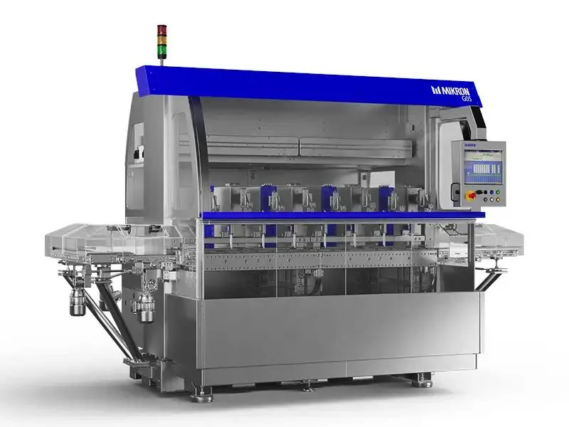
    <figcaption>Machine Mikron G05, Source: Mikron</figcaption>
  </figure>

### Pick and Place

Un **Pick and Place** est un type de module de contrôle utilisé dans les machines d'assemblage automatisées. Il est conçu pour saisir un objet à un emplacement spécifique et le déplacer vers un autre emplacement. Ce module est souvent utilisé pour des tâches répétitives et précises, telles que le placement de composants sur une carte de circuit imprimé ou le transfert de pièces d'une station de travail à une autre.

Les modules Pick and Place sont équipés de bras robotiques ou de mécanismes similaires qui peuvent être programmés pour effectuer des mouvements spécifiques. Ils sont essentiels pour améliorer l'efficacité et la précision des processus de fabrication automatisés.

  <figure>
      
      <figcaption>Exemple d'un robot Pick and Place, source Linmot</figcaption>
  </figure>

 
Un autre example de machine, ici, un palettiseur / dépalettiseur. Cette machine sert à envoyer des composants sur une ligne d'assemblage à partir de composants situés sur la droite, puis quand ces composants sont assemblés, on les ressort de la machine sur la gauche. Un robot au mileu permet de charger ou décharger les composants qui seront envoyés vers la machine via un convoyeur.

On notera l'intérêt ici d'une construction modulaire. Le module central peut être utilisé en toute indépendance comme simple Pick and Place. Il peux être accompagné soit du module de droite, soit du module de gauche, soit des deux.

  <figure>
      
      <figcaption>Palettiseur / dépalettiseur, source Mikron</figcaption>
  </figure>

##	The PackML interface State Model
La syntaxe du PackML State Model
Le modèle d'état de l'interface PackML repose sur deux éléments principaux, les commandes, [commands](#commands) et les états, [States](#states).

###	Commands
•	Un déclencheur qui fait passer la machine d'un état à un autre, par exemple un bouton poussoir **Start** sur la machine ou une commande interne ou une alarme.

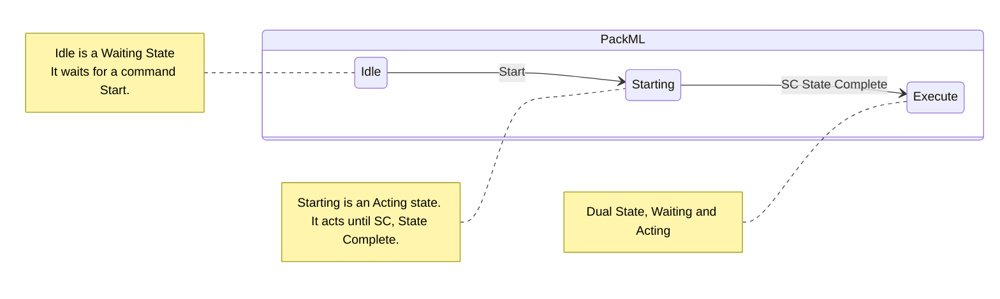

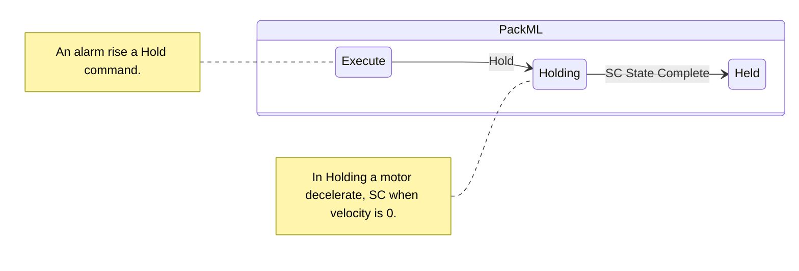

###	States
-   **Acting States**, ci-dessous en **blanc** un état dans lequel la machine effectue une action)
-   **Waiting States**, ci-dessous en **bleu** situation stable pour la machine. Un état d'attente nécessite une **commande** pour entrer dans l'état suivant.
-   **Execute** est un état particulier, car même si il est considéré comme un **Acting State**, il ne possède pas la notion de **SC**, **State Complete**. Il continue à s'exécuter tant qu'il n'a pas reçu de commande,

> Attention, la norme a changé en **2022**. Une bonne partie des exemples de machine d'état PackML que vous trouverez sur le Web correspondent à une ancienne version, 2008 ou 2015.
 

 
  <figure>
      
      <figcaption>PackML Full State Machine 2022, Source: Beckhoff USA.</figcaption>
  </figure>

### Minimum state machine
La norme ISA-88 décrit aussi un machine d'état. Les états sont approximativement les mêmes et si vous avez compris le principe de la machine d'état du PackML, vous aurez compris la machine d'état de ISA 88.

Dans ce même esprit, il est fort probable que votre machine ne nécessite pas l'utilisation d'autant d'états. Ce n'est pas un problème, la norme permet de supprimer un certain nombre d'états, **mais pas d'en rajouter**.

Ci-dessous, les états minimaux selon PackML:

  <figure>
      
      <figcaption>PackML Minimum State Machine, source: Beckhoff USA.</figcaption>
  </figure>

De manière générale, pendant un **Wait state**, rien ne se passe, ou du moins, il n’y a pas d’action de la machine au niveau **Procedural**. Cependant, rien n’empêche qu’une bande d’alimentation continue à avancer, et même qu’elle s’arrête, si la commande d’arrêt est interne au module qui la contrôle.

-   Il suffit qu’un seul module lance une commande, par exemple **Start**, pour que tous les modules passent dans l’état suivant en même temps.
-   Lorsque les modules sont en **Acting State**, on a une action concrète des modules, ils exécutent la séquence programmée pour cet état. Par exemple, depuis **Idle** les différents actionneurs se positionnent pendant le **Starting** pour être prêt pour le **Execute**.
-   Lorsque tous les modules ont terminé leur séquence et activé leur statut **SC**, **State Complete**, et seulement à cet instant, tous les modules passent à l’état suivant.

##	Le PackML Interface State Model
Il est recommandé d’implémenter l’ensemble des **17 états du State Model**. Le guide OMAC, dit que l' utilisateur final peuvent accepter une déviation de ses 17 états. Dans la plupart des implémentations, et c'est le cas de la version **HEVS**, la machine d'état est configurable. C'est à dire qu'**il est possible de désactiver certaines états**.

###	Suppression d’états
-   Les 17 états sont implémentés.
-   Selon les implémentation, il est possible de désactiver certains états, parmi lesquels Complete, Completing, Suspending, Suspended, Unsupending, Holding, Held et Unhoding, notamment en mode manuel.

Certaines implémentations, comme Siemens, permettent de configurer les états actifs.
Dans le plus simple cas, uniquement les états Stopped et Execute sont implémentés.
De manière générale, tous les états Acting, sauf **Execute**, peuvent être supprimés. Avec les conditions suivantes :

### PackML states Precondition & Requierment

|Precondition	|Requierment|
|---------------|-----------|
|If **Completing** state available...	|**Complete** state mandatory.|
|If **Suspending** state available...	|**Suspended** state mandatory.|
|If **Unsuspending** state available...	|**Suspended** state mandatory.|
|If **Aborting** state available...	|**Aborted** state mandatory.|
|If **Clearing** state available...	|**Aborted** state mandatory.|
|If **Resetting** state available...	|**Idle** state mandatory.|
|If **Idle** state available...	|**Resetting** state mandatory.|

###	Etats supplémentaires
Je conseille de les encapsuler dans des états intermédiaires. Mais **en aucun cas** de modifier la configuration générale.

###	Implémentation Custom
Il est bien entendu possible de partir d’une feuille blanche pour écrire une implémentation particulière.
Le but du PackML est de gagner en efficacité. Je conseille donc de partir d’une implémentation existante, y compris au niveau de sa documentation.

##	Résumé

|State	|Description|
|-------|-----------|
|EXECUTE	|**Acting State** - La machine est dans un état de fonctionnement stable - la machine est en train de produire.|
|STOPPED IDLE COMPLETE	|**Wait State** - Un état stable utilisé pour identifier qu'une unité / machine a atteint un ensemble défini de conditions. Dans un tel état, la machine maintient un état jusqu'à ce qu'une commande provoque une transition vers un **Acting State**. La machine est alimentée et stationnaire.|
|RESETTING STARTING SUSPENDING UNSUSPENDING COMPLETING HOLDING UNHOLDING ABORTING CLEARING STOPPING	|**Acting State** - Un état qui représente une activité de traitement, par exemple l'accélération de la vitesse. Cela implique l'exécution unique ou répétée d'étapes de traitement dans un ordre logique, pendant un temps fini ou jusqu'à ce qu'une condition spécifique soit atteinte, par exemple dans l'état Starting, la qualité et la validité des données reçues sont vérifiées, avant de monter en vitesse pour exécution.
|HELD ABORTED	|**Waiting State** - Un état qui représente un défaut sur l'unité qui générera une alarme ou un avertissement. Dans cet état, l'unité / la machine ne produit pas, jusqu'à ce que l'opérateur effectue une transition vers l'état **EXECUTE**. L'état maintient les opérations de l'unité / de la machine pendant que le blocage du matériau est éliminé, ou une correction sûre d'un défaut d'équipement avant la reprise de la production.|
|SUSPENDED	|**Waiting State** - Dans cet état, l'unité / la machine ne produit rien. Elle s'arrêtera de fonctionner ou continuera à fonctionner sans produire jusqu'à ce que les conditions de processus externes reviennent à la normale, moment auquel l'état **SUSPENDED** passera à l'état **UNSUSPENDING**, généralement sans aucune intervention de l'opérateur.|

La différence entre **Held** et **Suspended** est surtout à comprendre du point de vue de l’analyse de la performance de la machine.

  <figure>
      
      <figcaption>Held vs Suspended</figcaption>
  </figure>

Dans le cas du **Suspended**, la machine est en attente de conditions externes. Par exemple, alimentation en produit, machine en amont ou en aval pas prête. Cela signifie que quand on analyse la performance de la machine, même si la machine passe 50% de son temps en Suspended, la machine, l’unité elle-même n’est pas en cause.

Dans le cas du **Held**, cela signifie en général qu’un des élément de la machine a produit un évènement qui a emmené la machine dans cet état. Si la machine passe 50% de son temps en **Held**, il sera sans doute nécessaire d’analyser la cause de cet état.

 
##	En détail
Le guide [PackML_Unit_Machine_Implementation_Guide](./documentation/PackML_Unit_Machine_Implementation_Guide%20V2-03.pdf) est fourni en annexe. Il est disponible en téléchargement libre moyennant identification sur le site de l'[OMAC](https://www.omac.org/packml). Une bonne partie de la suite de ce document en est inspirée.

###	Aborted
State Type: Wait

 
  <figure>
      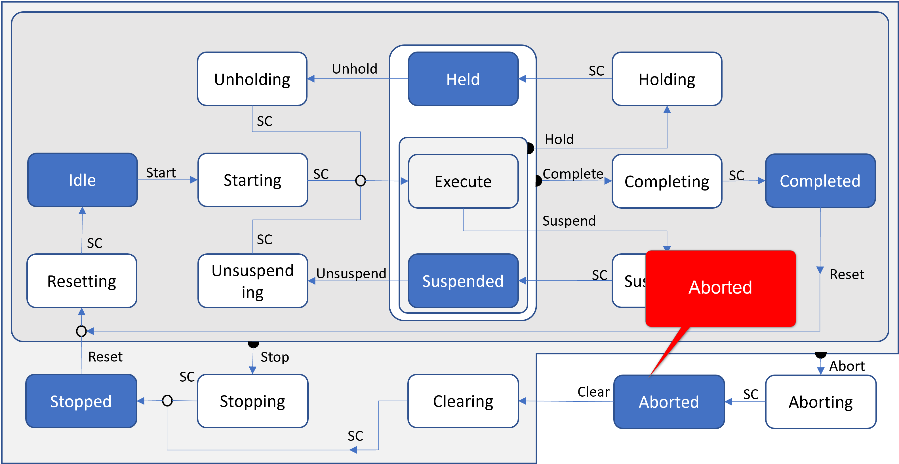
      <figcaption>PackML State Aborted, Source of base image: Beckhoff USA.</figcaption>
  </figure>

Cet état conserve les informations sur l'état de la machine relatives à la condition d'abandon. La machine ne peut sortir de l'état ABORTED qu'après une commande Clear explicite, puis une intervention manuelle pour corriger et réinitialiser les défauts machine détectés.

###	Clearing 
State Type: Acting
Initié par une commande d'état pour effacer les défauts qui ont pu se produire lors de l'**Aborting**, et qui sont présents dans l'état **Aborted** avant de passer à l'état **Stopped**.

 
  <figure>
      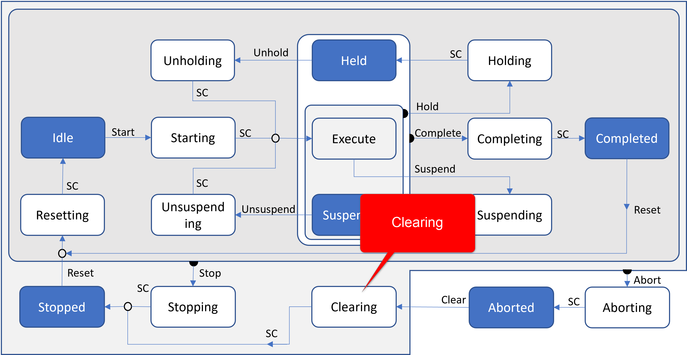
      <figcaption>PackML State Clearing, Source of base image: Beckhoff USA.</figcaption>
  </figure>

> Remarque : dans le cas de commandes d’entrainement électriques, l’état **Aborted** signifie souvent que les moteurs sont mis hors couple, **STO**, **Safe Torque Off** qui signifie une absence de couple, donc de courant, par le circuit de sécurité. Une des activité de la commande **Clearing** peut être de remettre les moteurs sous tension.

###	Stopped
> State Type: Wait
> > La machine est en état sécurisé contrôlé. Les énergies sont présentes, mais on garantit qu’aucun mouvement ne puisse être exécuté.

 
  <figure>
      
      <figcaption>PackML State Stopped, Source of base image: Beckhoff USA.</figcaption>
  </figure>

La machine est alimentée et stationnaire après avoir terminé l'état **STOPPING**. Toutes les communications avec les autres systèmes fonctionnent, le cas échéant. Une commande **RESET** provoquera une sortie de **STOPPED** à l'état **RESETTING**.

###	Resetting
State Type: Acting

 
  <figure>
      
      <figcaption>PackML State Resetting, Source of base image: Beckhoff USA.</figcaption>
  </figure>

Cet état est le résultat d'une commande **Reset** à partir de l'état **Stopped** ou **Complete**. **Resetting** amènera généralement une machine générer un signal visuel ou sonore et à placer la machine dans un état où les composants sont sous tension en attendant une commande **Start**.

> Exemple : dans l’état **Stopped** ou **Complete** la machine peut être mise dans un état de basse consommation, *et de bas volume sonore*.
> Dans l’exemple d’un vibreur rotatif et/ou linéaire on pourra mettre en action les différents éléments avec **Resetting**.
> **Starting** servira à emmener les pièces jusqu’en sortie du vibreur linéaire pour commencer la production en **Execute**.
 
 
 
  <figure>
      
      <figcaption>PackML Resetting, source www.icm-automation.com</figcaption>
  </figure>

###	Idle
State Type: Wait

 
  <figure>
      
      <figcaption>PackML State Idle, Source of base image: Beckhoff USA.</figcaption>
  </figure>

C'est un état qui indique que la **RESETTING** est terminée. Cet état maintient les conditions de la machine qui ont été atteintes pendant l'état de **RESETTING** et effectue les opérations requises lorsque la machine est au repos.

###	Starting
> State Type: Acting

 
  <figure>
      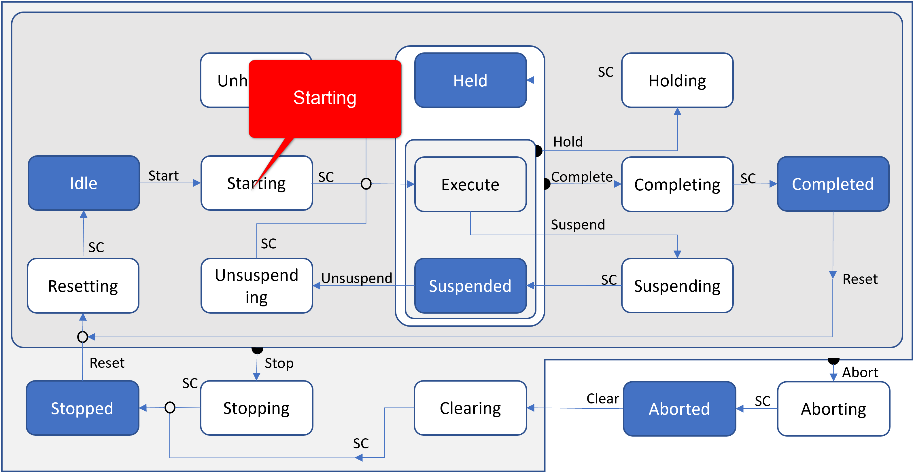
      <figcaption>PackML State Starting, Source of base image: Beckhoff USA.</figcaption>
  </figure>

Cet état fournit les étapes nécessaires pour passer dans l'état final **EXECUTE** et est le résultat d'une commande de type de **STARTING**, locale ou distante. Suite à cette commande, la machine commencera à s'exécuter.

###	Execute
State Type: Acting

 
  <figure>
      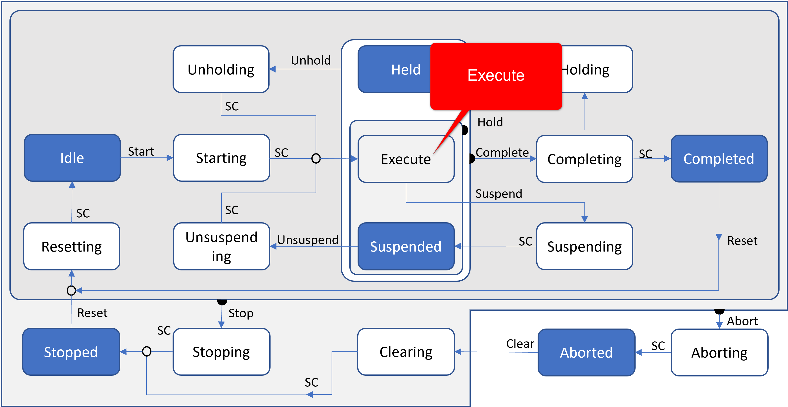
      <figcaption>PackML State Execute, Source of base image: Beckhoff USA.</figcaption>
  </figure>

Une fois que la machine traite des composants, elle est considérée comme étant en cours d'exécution ou dans l'état **EXECUTE**. Différents modes de la machine entraîneront des types spécifiques d'activités **EXECUTE**. Par exemple, si la machine est en mode Production, **EXECUTE** entraînera la production de produits, tandis qu'en mode Clean Out, l'état **EXECUTE** se réfère à l'action de nettoyage de la machine.

###	Holding
State Type: Acting

 
  <figure>
      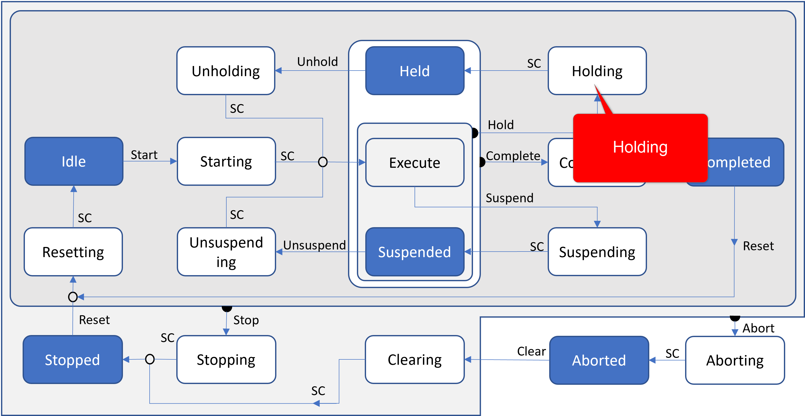
      <figcaption>PackML State Holding, Source of base image: Beckhoff USA.</figcaption>
  </figure>

Il s'agit principalement d'une cause interne à la machine qui ne nécessite pas de la stopper, pour résoudre le problème.

Remarque : Une des difficulté de l’état **Holding** est d’amener la machine dans un état suffisamment stable pour permettre un retour à l’état **Execute** sans devoir repasser par une phase d’initialisation, **Resetting**.

La commande Holding **doit** être activée par l'opérateur, elle **ne peut pas être automatique**.

###	Held
State Type: Wait

 
  <figure>
      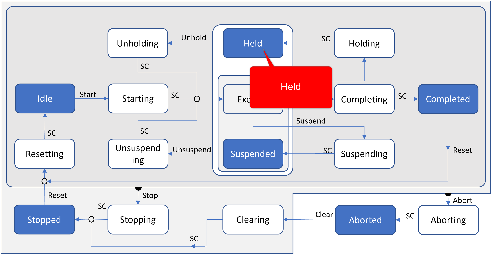
      <figcaption>PackML State Held, Source of base image: Beckhoff USA.</figcaption>
  </figure>

L'état **Hold** maintient le fonctionnement de la machine pendant que les blocages de matériau sont éliminés, ou pour arrêter le débit pendant qu'un problème en aval est résolu, ou pour permettre la correction sûre d'un défaut d'équipement avant que la production puisse reprendre.

###	Unholding
State Type: Acting

 
  <figure>
      
      <figcaption>PackML State Unholding, Source of base image: Beckhoff USA.</figcaption>
  </figure>

L'état **Unholding** est une réponse à une commande d'opérateur pour reprendre l'état **Execute**. L'émission de la commande **Unhold** récupérera les points de consigne enregistrés et renverra les conditions d'état pour préparer la machine à revenir à l'état **Execute** normal.

> Remarque : Une commande d'opérateur **Unhold** est toujours requise et Unholding ne peut jamais être lancé automatiquement.

###	Suspending
State Type: Acting

 
  <figure>
      
      <figcaption>PackML State Suspending, Source of base image: Beckhoff USA.</figcaption>
  </figure>

Cet état est le résultat d'un changement des conditions surveillées en raison des conditions ou des facteurs **externes** à la machine. L'événement déclencheur entraînera une suspension temporaire de l'état **EXECUTE**.
**SUSPENDING** est généralement le résultat de la privation de matières en amont, alimentation du conteneur, alimentation en boisson, alimentation en couronne, alimentation en lubrifiant.

###	Suspended
State Type: Wait

 
  <figure>
      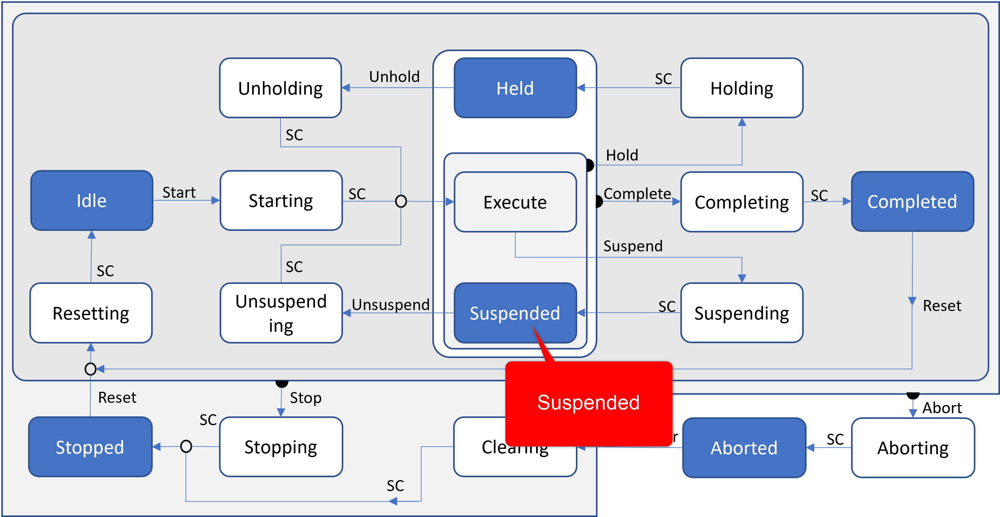
      <figcaption>PackML State Suspended, Source of base image: Beckhoff USA.</figcaption>
  </figure>

Dans certains cas, la machine peut continuer à fonctionner, *presque* comme en **EXECUTE**, mais ne produit rien.

###	Unsuspending
State Type: Acting

 
  <figure>
      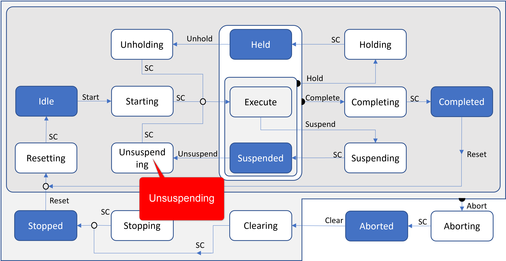
      <figcaption>PackML State Unsuspending, Source of base image: Beckhoff USA.</figcaption>
  </figure>

Cet état est le résultat d'une demande de type machine depuis l'état SUSPENDED pour revenir à l'état EXECUTE. Les actions de cet état peuvent inclure l'accélération des vitesses, la mise en marche des aspirateurs et le réengagement des embrayages. Cet état est effectué avant l'état EXECUTE et prépare la machine à l'état EXECUTE.

Remarque : **à la différence de l’action UNHOLD, UNSUSPENDING peut être initié automatiquement**. Par exemple lorsque des pièces sont à nouveau disponibles à l’entrée de la machine.

###	Completing
State Type: Acting

 
  <figure>
      
      <figcaption>PackML State Completing, Source of base image: Beckhoff USA.</figcaption>
  </figure>

Cet état est une réponse automatique de l'état **Execute**. Le fonctionnement normal est terminé, c'est à dire, le traitement à l'entrée s'arrêtera.

> Exemple : *une machine doit produire 2000 assemblages, une fois que ce nombre atteint, une procédure est mise en route pour évacuer les pièces qui se trouvent encore dans la machine et ne sont plus nécessaires pour produire ces assemblages*.

###	Complete
State Type: Wait

 
  <figure>
      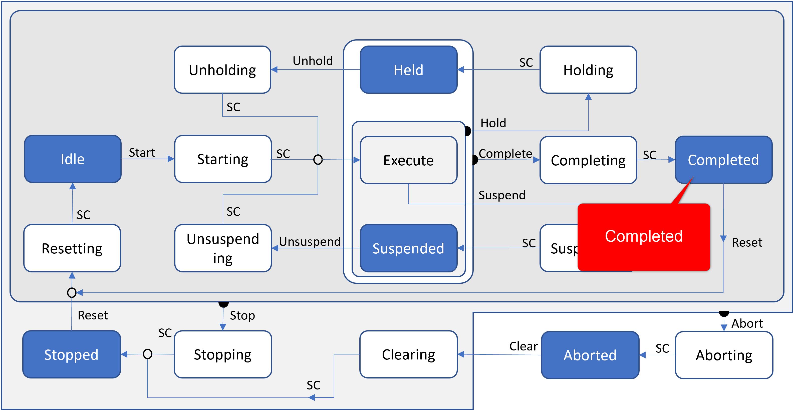
      <figcaption>PackML State Completed, Source of base image: Beckhoff USA.</figcaption>
  </figure>

La machine a terminé l'état **Completing** et attend maintenant une commande **Reset** avant de passer à l'état **Resetting**.

###	Stopping
State Type: Acting

 
  <figure>
      
      <figcaption>PackML State Stopping, Source of base image: Beckhoff USA.</figcaption>
  </figure>

Cet état exécute la logique qui amène la machine à un arrêt contrôlé tel que reflété par l'état **STOPPED**.
Remarque : dans le domaine de la sécurité des entraînements, on retrouve la notion de **SOS**, Safe Operating Stop. **SOS** est à différentier du **STO**, Safe Operating Stop de l’arrêt d’urgence ou commande Abort qui implique en général une mise « hors couple » des entraînements.

###	Aborting
State Type: Acting

 
  <figure>
      
      <figcaption>PackML State Aborting, Source of base image: Beckhoff USA.</figcaption>
  </figure>

L'état **ABORTED** peut être entré à tout moment en réponse à la commande Abort ou à l'apparition d'un défaut machine. La logique d'**ABORTING** amènera la machine à un arrêt sûr et rapide. Le fonctionnement de l'arrêt d'urgence entraînera le déclenchement de la machine par son système de sécurité. Il fournira également un signal pour déclencher l'état **ABORTING**.

> **Remarque** : Dans le domaine des entrainements électriques, la commande Abort amène en général les entraînement dans l’état STO, Safe Operating Stop. Voir aussi la remarque pour Stopping.
Au niveau de la logique interne du système, l’état **ABORTING** devrait avoir passé par la même logique que l’état **STOPPING**, ceci afin d’arrêter les axes de manière contrôlée.
Le délai accordé par le système pour exécuter l’état **ABORTING** dépend de critères de sécurité.

##	Les commandes
Les commandes sont au nombre de 9. Il suffit de se référer à la figure du PackML State Model. 
Toute description supplémentaire semble superflue. Dans la formalisation du PackTag, leur valeur va de 0, pas de commande, à 9.

Le tableau ci-dessous est donné à titre indicatif.

Certaines commandes peuvent être des combinaisons logiques, par exemple les commandes Clear et Reset peuvent utiliser le même bouton.

Beaucoup de commandes, par exemple Hold, Stop, Abort sont générées par des niveaux d’alarmes.

Pour rappel, dans une machine, chaque alarme doit posséder un numéro d’identification unique. De même, chaque alarme liée à une commande générera une commande unique.

|Command	|N° |
|---------|---|
|No Command|0|
|Reset	|1	|
|Start	|2	|
|Stop	|3	|
|Hold	|4	|
|Unhold	|5	|
|Suspend	|6|
|Unsuspend	|7|
|Abort	|8|
|Clear	|9|

###	PACKML STATE MODEL, EXEMPLE DE BOUTONS DE COMMANDE

Les boutons sont un exemple d’extension, ils sont par exemple présents dans l’implémentation Siemens. Ces boutons sont simplement l’équivalent de commandes PackML
- Vert	Start
- Noir	Stop
- Bleu	Reset ou Clear
- Rouge	Abort (E-Stop)

#### Remarque générale
Un diagnostic rapide de la bonne qualité de la gestion de la machine d’état d’une installation peut être souvent fait rapidement avec une commande. Abort.

L’arrêt d’une installation via un arrêt d’urgence est une procédure normale qui doit être maitrisée. Si un ou plusieurs éléments se trouvent dans un état signalant une erreur après une procédure d’arrêt d’urgence, c’est que cette procédure est mal maîtrisée.

Dans le cas d’entrainements avec des masses ou des inerties importantes, un mise hors couple mal maîtrisée peut s’avérer plus dangereuse que l’évènement ayant généré la commande Abort.

Un opérateur usant et abusant régulièrement de la commande Abort pour arrêter ou réinitialiser sa machine en cas d’erreur est aussi un symptôme malheureusement trop fréquent d’une machine d’état mal maîtrisée.

##	Unit Control Mode, modes et transitions
Une unité / machine peut être dans différents modes, par exemple Production, Maintenance, Manuel, Nettoyage, Mode Jog, etc.

Un mode de contrôle d'unité est un sous-ensemble ordonné d'états et de commandes qui détermine la stratégie à exécuter par le processus unité / machine.

Cela signifie que le modèle d'état de l'interface PackML ci-dessus peut être représenté différemment dans différents modes. Le modèle d'état de l'interface PackML doit être entièrement implémenté pour le mode Production et peut être partiellement implémenté pour les modes manuel et maintenance. En mode manuel, toutes les communications avec les systèmes externes qui peuvent manipuler l'unité / la machine sont désactivées. En mode manuel, l'opérateur peut prendre le contrôle de l'unité via le HMI de l'unité sans connexion à un système externe.

Le fournisseur de la machine doit spécifier les modes disponibles en plus de la production, du manuel et de la maintenance.

Il appartient au fournisseur de la machine et à l'utilisateur final de définir le mode de démarrage après la mise sous tension, par exemple STOPPED ou IDLE.

###	Principes
- Le tableau des modes est donné à titre indicatif. Seul le mode PRODUCTION est obligatoire.
- Le passage d’un mode à l’autre ne peut se faire que dans des états bien définis, en général l’état STOPPED.
- Le passage d’un mode à l’autre ne peut se faire que quand les états d’arrivée et de départ sont présents.
- Dans certaines implémentations, les autorisations d’accès d’un mode à l’autre peuvent être paramétrés.
 

|PackML tag value	|Mode	PackML State Model|	Restricted access	||Use|
|-----------------|-----------------------|-------------------|-|---| 
|1	|PRODUCTION	|Mandatory	|No	|Mode principal utilisé pour toutes les activités de production, tous les états du modèle PackML seront utilisés. Les PackTags sont actifs. L'unité / la machine exécute la logique appropriée en réponse à des commandes provenant principalement de systèmes externes ou entrées directement par l'opérateur.|
|2	|MAINTENANCE	|Optional	|Yes	|Utilisé pour la maintenance préventive de routine ou la maintenance planifiée. Doit être utilisé pour documenter l'occurrence et la durée de la maintenance planifiée. Ce mode permet au personnel autorisé de faire fonctionner l'unité / la machine indépendamment des autres systèmes. Ce mode est généralement utilisé pour la recherche de pannes, les essais de machines ou les tests d'améliorations opérationnelles. Par exemple : Le nettoyage d'une tête d'impression est de la maintenance.|
|3	|MANUAL	|Optional	|Yes	|Utilisé pour le diagnostic des pannes d'une intervention technique imprévue. **Remarque** : en mode de commande manuelle, il n'est pas nécessaire d’implémenter tous les états PackML.|
|4	|CHANGE OVER	|Optional	|No	|Peut être utilisé spécifiquement pour le changement de format ou de recette, comprend les opérations de « nettoyage».
|5	|CLEAN	|Optional	|No	|Peut être utilisé pour les exigences de nettoyage de routine, par exemple : comme spécifié par les procédures de maintenance d'usine.|
|6	|SET UP	|Optional	|Optional restriction	|Peut être utilisé pour un exemple de configuration ou de réglage : réglages et tests mécaniques
|7	|EMPTY OUT	|Optional	|No	|Serait utilisé pour vider la machine par exemple : fin d'un bloc de quarts de travail avant l'arrêt de l'usine le week-end, vider le produit résidant dans la machine qui pourrait être envoyé au produit fini et minimiser le «retravail» de la pièce finie.
|…	|OEM specific	|Optional	|Yes	|Serait utilisé pour l'OEM UNIQUEMENT, tous les paramètres requis pour la machine et ne seront probablement JAMAIS nécessaires à un client.
|…	|?|	?	|?	|?|

###	Mode maintenance
Ici, les boucles Suspend et Complete sont désactivées.
Dans la pratique, cela signifie principalement que la machine est isolée des éléments externes.

 
  <figure>
      
      <figcaption>PackML Mode Maintenance, Source of base image: Beckhoff USA.</figcaption>
  </figure>

###	Mode manuel
Le mode manuel n’est pas un mode « Debug », il permet d’exécuter des procédures (Phases), pour piloter individuellement les équipements.
 

 
  <figure>
      
      <figcaption>PackML Mode Manual, Source of base image: Beckhoff USA.</figcaption>
  </figure>

###	Timing
Dans certaines implémentations, on trouve des limites de temps qui déclenchent des évènements lors du passage d’un état à un autre, ou d’un mode à un autre.

La surveillance du temps d’un module pour activer le SC peut permettre de détecter rapidement un défaut lors d’une phase de démarrage, surtout dans les cas imprévus qui ne serait pas liés à une alarmes particulière.

##	PackTag, Automated Machine Functional Tag Description
###	Introduction
Les PackTags fournissent un ensemble uniforme de conventions de dénomination pour les éléments de données utilisés dans les éléments procéduraux du modèle d'état de base. 

<h1 style="color:red;">PackTag To be completed</h1>

Comme vu précédemment dans le document, le modèle d'état de base fournit un ensemble uniforme d'états de la machine, de sorte que toutes les machines automatisées puissent être vues de manière commune. Les PackTags sont des éléments de données nommés utilisés pour une architecture ouverte, l'échange de données interopérable dans des machines automatisées.
Ce document comprend les noms fondamentaux des éléments de données ainsi que le type de données, les valeurs, les plages et, le cas échéant, les structures de données. Les PackTags sont utiles pour les communications de machine à machine (inter machine) ; par exemple entre un « Filler » et un « Capper ». Les PackTags peuvent également être utilisés pour l'échange de données entre les machines et les systèmes d'information de niveau supérieur comme la gestion des opérations de fabrication et les systèmes d'information d'entreprise (Voir ISA-95).
Ce rapport définit tous les PackTags nécessaires pour naviguer dans un modèle d'état, ainsi que ceux qui sont nécessaires pour définir et manipuler le mode de contrôle de l'unité. Ce rapport définit également une liste de PackTags qui fourniront les informations nécessaires qui peuvent être disponibles à partir d'une machine. L'utilisation de tous les PackTags est nécessaire pour être cohérente avec les principes de connectivité intégrée avec les systèmes utilisant cette même méthode de mise en œuvre.

###	Types
Les PackTags sont répartis en trois groupes ; **Command**, **Statut** et **Admin**.

Les **tags de commande** et d'état contiennent les données nécessaires à l'interfaçage entre les machines et la commande de ligne pour la coordination, ou pour le téléchargement de recette / paramètre. Les tags de commande sont écrits et utilisés par le programme machine, en tant que « récepteur d'informations », tandis que les **tags d'état** sont produits et **lus** à partir du programme machine.

Les **tags d'administration** contiennent des données collectées par des systèmes de niveau supérieur pour l'analyse des performances de la machine ou des informations pour l'opérateur. En général, les données d'information sont transmises à l'aide d'OPC / OPC UA sur un réseau de communication Ethernet standard.

-   Les tags de commande sont précédés de « Command ».
-   Les tags d'état sont préfixés par « State ».
-   Les tags d'administration sont précédés de « Admin ».

PackTag, aperçu
 
Figure 39 PackTag overview
Command, aperçu
 
Figure 40 PackTag Command Overview
Admin, aperçu
 
Figure 41 PackTag Admin Overview
Product, aperçu
 
Figure 42 PackTag Product Overview

##	OPC UA
On se réfèrera pour une description détaillée à : 
Part 2: Standard Representation of PackTags in an OPC UA Server
(Disponible sur le site de OMAC)

# PackML à la sauce HEVS.