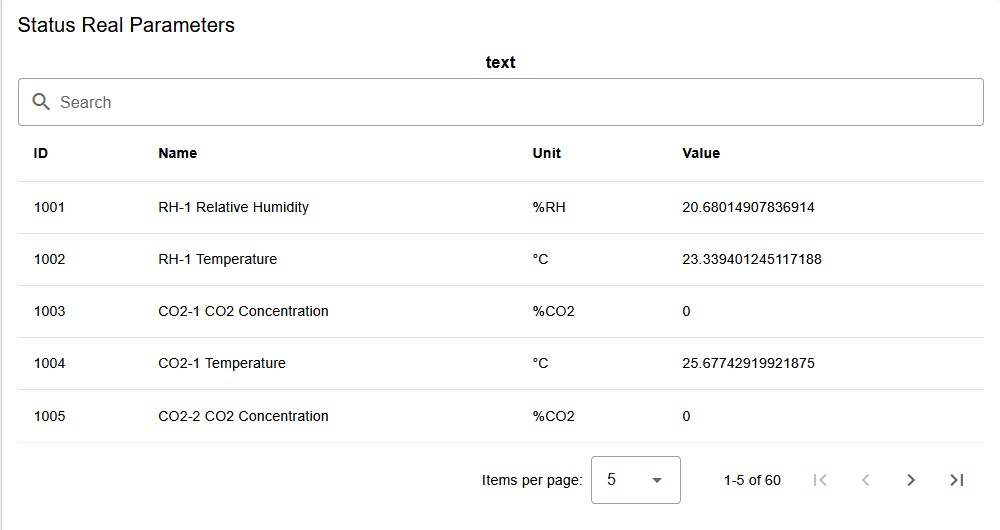

<h1 align="left">
  <br>
  
  <br>
  HEI-Vs Engineering School <h2>AAut Advanced Automation</h2>
  <br>
</h1>

[Cédric Lenoir](mailto:cedric.lenoir@hevs.ch)

# Module 07 /  Pack Components


## Aperçu
-   Les différentes composantes de PackML
-   Le PackTag
-   Mode et changement de mode
-   Etat et changement d'état.

## Table des matières
- [Module 07 /  Pack Components](#module-07---pack-components)
  - [Aperçu](#aperçu)
  - [Table des matières](#table-des-matières)
  - [Ce qu'il faut retenir](#ce-quil-faut-retenir)
    - [Parutions scientifiques.](#parutions-scientifiques)
    - [Documentations de fournisseurs.](#documentations-de-fournisseurs)
- [Les états](#les-états)
  - [Pour simplifier](#pour-simplifier)
  - [Notion de sécurité](#notion-de-sécurité)
    - [Aborted](#aborted)
    - [Stopped](#stopped)
- [Les transitions](#les-transitions)
  - [SC, State Complete](#sc-state-complete)
    - [Exemple de codage clearing](#exemple-de-codage-clearing)
      - [Explication](#explication)
  - [Command](#command)
    - [E\_PackCmd](#e_packcmd)
    - [Les activations par l'opérateur,](#les-activations-par-lopérateur)
    - [Les activations par les alarmes](#les-activations-par-les-alarmes)
      - [Les événements](#les-événements)
      - [Warning](#warning)
      - [Alarm](#alarm)
      - [Exemple de codage.](#exemple-de-codage)
- [Les modes](#les-modes)
- [Implémentation HEVS\_CtrlX\_Pack](#implémentation-hevs_ctrlx_pack)
  - [Configuration](#configuration)
      - [Exemple pour HEVS\_Pack\_2022](#exemple-pour-hevs_pack_2022)
  - [FB\_PackMasterState](#fb_packmasterstate)
  - [FB\_PackMasterMode](#fb_packmastermode)
  - [Fonctions auxiliaires](#fonctions-auxiliaires)
    - [FB\_HEVS\_StopReason](#fb_hevs_stopreason)
    - [FB\_GetActualBoolState](#fb_getactualboolstate)
    - [FB\_PackStateCmdBoolInterface](#fb_packstatecmdboolinterface)
    - [FB\_PackModeBoolInterface](#fb_packmodeboolinterface)
    - [FB\_PackStatistic](#fb_packstatistic)
- [PRG\_PackModule\_Template](#prg_packmodule_template)
  - [PLC\_PACK](#plc_pack)
  - [The template](#the-template)
    - [Template header](#template-header)
    - [Template Core](#template-core)
- [PackTag](#packtag)
  - [Aperçu Général](#aperçu-général)
    - [Admin](#admin)
      - [Display of Alarms](#display-of-alarms)
    - [Status](#status)
      - [Use of Status Parameters](#use-of-status-parameters)
    - [Command](#command-1)
      - [Use of command parameters](#use-of-command-parameters)
- [Conclusion](#conclusion)
- [Lien](#lien)


## Ce qu'il faut retenir
-   PackML est basé sur la pratique.
-   PackML est conçu à la base pour des applications de packaging relativement complexes, mais peut aussi être utilisée pour des applications simples.
-   PackML peut permettre de gagner plusieurs semaines de travail pour le développement d'une nouvelle machine. C'est un des objectifs de la norme.

### Parutions scientifiques.
Il existe bien quelques parutions scientifiques, mais elles sont relativement pauvres. Elles ne sont en outre pas tout à fait à jour, dans la mesure où elles se réfèrent à la version PackML de 2015.

-   [A PackML-based Design Pattern for Modular PLC Code](https://www.sciencedirect.com/science/article/pii/S2405896315009957)
-   [A low-cost PackML-based control solution for a modular production line](https://www.sciencedirect.com/science/article/pii/S2405896315009969)

Il existe un ouvrage intéressant, probablement plus édité: Applying ISA-88 in Discrete and Continuous Manufacturing: *ISBN: 160650200X / 9781606502006, 2011*.

### Documentations de fournisseurs.
Il existe de nombreuses implémentations basée sur la norme révisée de 2022. Nous en citons deux car elles sont complète, bien documentées et directement uilisables, l'une dans le monde Siemens, l'autre dans le monde Codesys.

-   SIMATIC OMAC PackML V2022 Mode&State Management and Machine Data Interface.
-   Schneider Electric EcoStruxure Machine Expert PackML Library Guide


L'implémentation HEVS est complète et fonctionnelle basée sur la version 2022, elle est disponible via les projets fournit en exemple pour les travaux pratique, la documentation est en cours. Elle offre l'avantage d'être complètement ouverte.

# Les états

<div align="center">
    <figure>
        
        <figcaption>PackML State machine 2022, source Beckhoff USA</figcaption>
    </figure>
</div>

Pour rappel, selon la norme 2022, seuls les états Aborted, Stopped, Idle et Execute sont obligatoires.

<div align="center">


</div>

## Pour simplifier
-   **Aborted** : Pas d'énergie sur la machine.
    -   Par exemple: pas de couple sur les moteurs.
    -   Selone les cas, pas de pression sur un cylindre
-   **Stopped** : Tous les éléments sont sous tension et stables.
    -   Par exemple: un moteur synchrone est sous couple, mais imobile.
    -   Un cylindre pneumatique est sous pression, mais la position est inconnue.
-   **Idle** : Position initiale, prèt à démarrer.
    -   Un moteur synchrone avec codeur relatif a terminé sa séquence de référencement, la position est connue,
    -   Un cylindre pneumatique est dans sa position initiale, pour une pince pneumatique, on aura déterminé si la position initiale et ouverte ou fermée et si cette position est atteinte.
- **Execute**: phase de prodution de la machine.

## Notion de sécurité
Comme nous le verrons dans un module ulérieur, une machine, est soumise à des contraintes de sécurité. La gestion de PackML simplifie la gestion de la sécurité.

### Aborted
La machine est dans un état sûr. Il y a une garantie que dans cet état, l'opérateur peux *mettre les mains*, dans la machine.

### Stopped
Les éléments mobiles sont contrôlés en vitesse nulle, l'opérateur peut *mettre les mains* dans la machine sous condition, par exemple en appuyant sur une commande de type poignées de sécurité *homme mort*.

---

# Les transitions
## SC, State Complete
Se sont les états actifs de la machine. Ils concernent les Equipement Modules et les Control Modules.

> La norme ne précise pas de différence de comportement entre ces deux types de modules. On peut donc appliquer autant la notion de SC, State Complete à un Control Module qu'à un Equipement Module


### Exemple de codage clearing

Extrait de code pour la mise sous tension d'un axe.

```iecst
IF actualState = E_PackState.eClearing THEN
	CASE axisClearing OF
		E_AxisClearing.eIdle :
			IF mcReadStatus.Standstill THEN
				axisClearing := E_AxisClearing.eEnabled;
			ELSIF mcReadStatus.ErrorStop THEN
				axisClearing := E_AxisClearing.eErrorStop;
			ELSE
				axisClearing := E_AxisClearing.eDisabled;
			END_IF
		
		E_AxisClearing.eErrorStop :
			// Some code
		
		E_AxisClearing.eDisabled  :
            IF mcReadStatus.Standstill THEN
			    axisClearing := E_AxisClearing.eEnabled;
			// Some code
		
		E_AxisClearing.eEnabled   :
			IF mcReadStatus.ErrorStop THEN
				axisClearing := E_AxisClearing.eErrorStop;
			END_IF
	END_CASE
	stActing.Clearing_SC := (axisClearing = E_AxisClearing.eEnabled);
ELSE
	stActing.Clearing_SC := FALSE;
	axisClearing := E_AxisClearing.eIdle; 
END_IF
```

#### Explication
-   Le flag ``Clearing_SC`` de **Clearing** sera activé uniquement pendant la phase de **Clearing** du module.
-   ``actualState`` est déterminé par la logique du module de contrôle des états de la machine.
-   Lorsque la machine n'est pas en mode Clearing, le flag **Clearing_SC**, est inactif.
-   Noter dans la construction de ce code, la machine d'état est initialisée à ``E_AxisClearing.eIdle`` si l'état de la machine n'est pas en Clearing.

> La variable ``stActing`` est propre à chaque module. Ce n'est que lorsque tous les modules auront activé leur propre flag **SC** à **TRUE** que la machine passera en **Stopped**.

Pseudo code

```iecst
Unit.SC := CM_Axis_X.SC    AND
           CM_Axis_Y.SC    AND
           CM_Axis_Y.SC    AND
           CM_AirSupply.SC AND
           EM_Feeded.SC;
```

## Command
Les commandes peuvent être de deux types principaux.

### E_PackCmd
```iecst
TYPE E_PackCmd :
(
	eUndefined := 0,
	eReset := 1,
	eStart := 2,
	eStop := 3,
	eHold := 4,
	eUnhold := 5,
	eSuspend := 6,
	eUnsuspend := 7,
	eAbort := 8,
	eClear := 9,
	eComplete := 10
) DINT;
END_TYPE
```


### Les activations par l'opérateur, 
Principalement:

-   Abort
-   Clear
-   Reset
-   Start
-   Hold / Unhold

> Certaines activations peuvent être groupées sur une même activation. Dans le cas du laboratoire, **Clear** et **Reset** utilisent le même bouton. Il n'y a pas de confusion possbile car les deux états de départ, **Aborted** et **Stopped** sont différents.

Les commandes générées par la machine ou externes
-   Suspend / Unsuspend
-   Complete

### Les activations par les alarmes
Les alarmes, **Alarm**, sont en principe destinée à générer des événements. A contrario, les informations qui ne génèrent aucune action sur la machine sont des avertissements, **Warning**.

#### Les événements
L'implémentation HEVS propose 6 catégories d'événements

```iecst
TYPE E_EventCategory :
(
	Warning := 0,
	Complete:= 6,
	Abort   := 4,
	Stop    := 3,
	Hold    := 2,
	Suspend := 1
) DINT := Warning;
END_TYPE
```

<div align="center">


</div>


#### Warning
Utilisé pour les Function Block ``FB_HEVS_SetWarning``, informe l'opérateur si nécessaire.
Exemple:
    -   Une porte est ouverte.
    -   Une sauveagardee de paramètres est terminée.
    -   Un batch est terminé, état Complete.

#### Alarm
Utilisé pour les Function Block ``FB_HEVS_SetAlarm``, informe l'opérateur **ET** agit sur l'état de la machine.

-   Suspend:    La machine passe en état Suspending.
-   Hold:       La machine passe en état Holding.
-   Stop:       La machine passe en état Stopping.
-   Abort:      La machine passe en état Aborting.
-   Completing  La machine passe en état Completing.

> La numérotation de l'ENUM ``E_EventCategory`` ne conditionne pas la priorité de l'événement.

#### Exemple de codage.
Il est important de souliger que en principe, chaque type d'événement est unique. C'est à dire que chaque Alarm ou Warning est attributé à une seule instance de ``FB_HEVS_SetWarning`` ou ``FB_HEVS_SetAlarm`` et se voir attribuer **un numéro d'identification unique**.

Header
```iecst
	fbSetAlarm_2	 : FB_HEVS_SetAlarm;
	
	fbSetWarning_0	 : FB_HEVS_SetWarning;
```

Core

```iecst
fbSetAlarm_2(bSetAlarm := PackTag.hevsPackAlarm_UI.uiSetAlarm_2,
             bAckAlarmTrig := PackTag.hevsPackAlarm_UI.uiAckAlarm_2,
             ID := 7,
             Value := 37,
             Message := 'Hold 2, Gripper not closed',
             Category := E_EventCategory.Hold,
             // Reference to plc time from PackTag
             plcDateTimePack	:= PackTag.Admin.PLCDateTime,
             // Link to PackTag Admin
             stAdminAlarm := PackTag.Admin.Alarm,
             stAdminAlarmHistory := PackTag.Admin.AlarmHistory);	


fbSetWarning_0(bSetWarning := PackTag.hevsPackAlarm_UI.uiSetWarning_0,
              bAckWarningTrig := PackTag.hevsPackAlarm_UI.uiAckWarning_0,
              // Warning Parameters
              ID := 1,
              Value := 31,
              Message := 'Warning 0, Door Open',
              Category := E_EventCategory.Warning,
              // Reference to plc time from PackTag
              plcDateTimePack	:= PackTag.Admin.PLCDateTime,
              // Link to PackTag Admin
              stAdminWarning := PackTag.Admin.Warning);

```

> Les alarmes ont la même action que les commandes équivalents, à savoir **Abort**, **Stop**, **Hold**...

---

# Les modes
PackML définit plusieurs mode de fonctionnement. Ceux ci se distingues principalement les un des autres par les états existants et les transitions autotisées, voir [Configuration](#configuration).

> Sauf erreur, la norme ne rend aucun mode obligatoire, même si l'implémentation Siemens rend le mode **manuel** obligatoire.

L'implémentation HEVS prévoit 8 modes de base qui peuvent être étendus à **32(DINT)** si nécessaire.

```iecst
TYPE E_PackModes :
(
    Invalid     := 0,
    Production  := 1,
    Maintenance := 2,
    Manual      := 3,
    Test        := 4,
    User_05     := 5,
    User_06     := 6,
    User_07     := 7,
    User_08     := 8
) DINT;
END_TYPE

```

<div align="center">


</div>

---

# Implémentation HEVS_CtrlX_Pack
Il n'est en principe pas nécessaire de comprendre le détail de l'utilisation de chaque Function Block. L'implémentation HEVS, comme d'autres implémentations est fournie avec un canevas, exemple de codage.

Les différents modules sont donnés à titre d'information.

## Configuration
POur comprendre la relative complexité du module de gestion des états, il faut savoir que la norme définit un cadre qui permet de paramétrer:

-   Les états existants ou non.
-   Les états pour lequels le passage d'un mode à l'autre est autorisé.

Nous reproduisons ci-dessous une image tirée de la documentation de Beckhoff:

<div align="center">
    <figure>
        
        <figcaption>State Mode Manager, Source: Beckhoff.</figcaption>
    </figure>
</div>

-   L'image représente 3 modes différents avec la liste des états existants pour chaque mode.
-   Les flèches bleues représentent les états à partir desquels les changement de mode sont autorisés.

#### Exemple pour HEVS_Pack_2022
Les configurations sont regroupées dans une **Action** ACT_SetDefaultSettings qui est exécutée une seule fois au démarrage du code.

```iecst
IF NOT defaultSettingsDone THEN
	// Todo only once
	defaultSettingsDone := TRUE;
	(*
		Define list of available modes
		Check C_ADMIN_MAXMODESTRANSITION too.
	*)
	uListOfModesConfig.boolMode.Invalid := FALSE;
	uListOfModesConfig.boolMode.Maintenance := TRUE;
	uListOfModesConfig.boolMode.Manual := TRUE;
	uListOfModesConfig.boolMode.Production := TRUE;
	uListOfModesConfig.boolMode.Test := TRUE;
	uListOfModesConfig.boolMode.UserDefinable_5 := FALSE;
	uListOfModesConfig.boolMode.UserDefinable_6 := FALSE;
	uListOfModesConfig.boolMode.UserDefinable_7 := FALSE;
	uListOfModesConfig.boolMode.UserDefinable_8 := FALSE;

    (*
        A value of 1 in a certain bit location indicates that
        the corresponding state number is disabled.
        
        Init disabled states in Production
    *)
    uDisabledStatesProduction.boolState.Aborted := FALSE;
    uDisabledStatesProduction.boolState.Aborting := FALSE;
    uDisabledStatesProduction.boolState.Clearing := FALSE;
    uDisabledStatesProduction.boolState.Completed := FALSE;
    uDisabledStatesProduction.boolState.Completing := FALSE;
    uDisabledStatesProduction.boolState.Execute := FALSE;
    uDisabledStatesProduction.boolState.Held := FALSE;
    uDisabledStatesProduction.boolState.Holding := FALSE;
    uDisabledStatesProduction.boolState.Unholding := FALSE;
    uDisabledStatesProduction.boolState.Idle := FALSE;
    uDisabledStatesProduction.boolState.Resetting := FALSE;
    uDisabledStatesProduction.boolState.Starting := FALSE;
    uDisabledStatesProduction.boolState.Stopped := FALSE;
    uDisabledStatesProduction.boolState.Stopping := FALSE;
    uDisabledStatesProduction.boolState.Suspended := FALSE;
    uDisabledStatesProduction.boolState.Suspending := FALSE;
    uDisabledStatesProduction.boolState.Unsuspending := FALSE;
    // For Maintenance
    uDisabledStatesMaintenance.boolState.Aborted := FALSE;
    uDisabledStatesMaintenance.boolState.Aborting := FALSE;
    uDisabledStatesMaintenance.boolState.Clearing := TRUE;
    uDisabledStatesMaintenance.boolState.Completed := TRUE;
    uDisabledStatesMaintenance.boolState.Completing := TRUE;
    uDisabledStatesMaintenance.boolState.Execute := FALSE;
    uDisabledStatesMaintenance.boolState.Held := FALSE;
    uDisabledStatesMaintenance.boolState.Holding := FALSE;
    uDisabledStatesMaintenance.boolState.Unholding := FALSE;
    uDisabledStatesMaintenance.boolState.Idle := FALSE;
    uDisabledStatesMaintenance.boolState.Resetting := FALSE;
    uDisabledStatesMaintenance.boolState.Starting := FALSE;
    uDisabledStatesMaintenance.boolState.Stopped := FALSE;
    uDisabledStatesMaintenance.boolState.Stopping := FALSE;
    uDisabledStatesMaintenance.boolState.Suspended := TRUE;
    uDisabledStatesMaintenance.boolState.Suspending := TRUE;
    uDisabledStatesMaintenance.boolState.Unsuspending := TRUE;
    // For Manual
    uDisabledStatesManual.boolState.Aborted := FALSE;
    uDisabledStatesManual.boolState.Aborting := FALSE;
    uDisabledStatesManual.boolState.Clearing := FALSE;
    uDisabledStatesManual.boolState.Completed := TRUE;
    uDisabledStatesManual.boolState.Completing := TRUE;
    uDisabledStatesManual.boolState.Execute := FALSE;
    uDisabledStatesManual.boolState.Held := TRUE;
    uDisabledStatesManual.boolState.Holding := TRUE;
    uDisabledStatesManual.boolState.Unholding := TRUE;
    uDisabledStatesManual.boolState.Idle := FALSE;
    uDisabledStatesManual.boolState.Resetting := FALSE;
    uDisabledStatesManual.boolState.Starting := TRUE;
    uDisabledStatesManual.boolState.Stopped := FALSE;
    uDisabledStatesManual.boolState.Stopping := FALSE;
    uDisabledStatesManual.boolState.Suspended := TRUE;
    uDisabledStatesManual.boolState.Suspending := TRUE;
    uDisabledStatesManual.boolState.Unsuspending := TRUE;
    // For various test
    uDisabledStatesTest.boolState.Aborted := FALSE;
    uDisabledStatesTest.boolState.Aborting := FALSE;
    uDisabledStatesTest.boolState.Clearing := TRUE;
    uDisabledStatesTest.boolState.Completed := FALSE;
    uDisabledStatesTest.boolState.Completing := FALSE;
    uDisabledStatesTest.boolState.Execute := FALSE;
    uDisabledStatesTest.boolState.Held := FALSE;
    uDisabledStatesTest.boolState.Holding := FALSE;
    uDisabledStatesTest.boolState.Unholding := FALSE;
    uDisabledStatesTest.boolState.Idle := FALSE;
    uDisabledStatesTest.boolState.Resetting := FALSE;
    uDisabledStatesTest.boolState.Starting := FALSE;
    uDisabledStatesTest.boolState.Stopped := FALSE;
    uDisabledStatesTest.boolState.Stopping := FALSE;
    uDisabledStatesTest.boolState.Suspended := FALSE;
    uDisabledStatesTest.boolState.Suspending := FALSE;
    uDisabledStatesTest.boolState.Unsuspending := FALSE;
    
    (*
        A value of 1 in a bit location indicates that a mode 
        transition FROM the corresponding state number is allowed
        
        Init transition states in Production
    *)
    uTransitionsProduction.boolState.Aborted := TRUE;
    uTransitionsProduction.boolState.Aborting := FALSE;
    uTransitionsProduction.boolState.Clearing := FALSE;
    uTransitionsProduction.boolState.Completed := TRUE;
    uTransitionsProduction.boolState.Completing := FALSE;
    uTransitionsProduction.boolState.Execute := FALSE;
    uTransitionsProduction.boolState.Held := TRUE;
    uTransitionsProduction.boolState.Holding := FALSE;
    uTransitionsProduction.boolState.Unholding := FALSE;
    uTransitionsProduction.boolState.Idle := FALSE;
    uTransitionsProduction.boolState.Resetting := FALSE;
    uTransitionsProduction.boolState.Starting := FALSE;
    uTransitionsProduction.boolState.Stopped := TRUE;
    uTransitionsProduction.boolState.Stopping := FALSE;
    uTransitionsProduction.boolState.Suspended := FALSE;
    uTransitionsProduction.boolState.Suspending := FALSE;
    uTransitionsProduction.boolState.Unsuspending := FALSE;
    // For Maintenance
    uTransitionsMaintenance.boolState.Aborted := TRUE;
    uTransitionsMaintenance.boolState.Aborting := FALSE;
    uTransitionsMaintenance.boolState.Clearing := FALSE;
    uTransitionsMaintenance.boolState.Completed := FALSE;
    uTransitionsMaintenance.boolState.Completing := FALSE;
    uTransitionsMaintenance.boolState.Execute := FALSE;
    uTransitionsMaintenance.boolState.Held := TRUE;
    uTransitionsMaintenance.boolState.Holding := FALSE;
    uTransitionsMaintenance.boolState.Unholding := FALSE;
    uTransitionsMaintenance.boolState.Idle := FALSE;
    uTransitionsMaintenance.boolState.Resetting := FALSE;
    uTransitionsMaintenance.boolState.Starting := FALSE;
    uTransitionsMaintenance.boolState.Stopped := TRUE;
    uTransitionsMaintenance.boolState.Stopping := FALSE;
    uTransitionsMaintenance.boolState.Suspended := FALSE;
    uTransitionsMaintenance.boolState.Suspending := FALSE;
    uTransitionsMaintenance.boolState.Unsuspending := FALSE;
    // For Manual Mode
    uTransitionsManual.boolState.Aborted := TRUE;
    uTransitionsManual.boolState.Aborting := FALSE;
    uTransitionsManual.boolState.Clearing := FALSE;
    uTransitionsManual.boolState.Completed := FALSE;
    uTransitionsManual.boolState.Completing := FALSE;
    uTransitionsManual.boolState.Execute := FALSE;
    uTransitionsManual.boolState.Held := FALSE;
    uTransitionsManual.boolState.Holding := FALSE;
    uTransitionsManual.boolState.Unholding := FALSE;
    uTransitionsManual.boolState.Idle := TRUE;
    uTransitionsManual.boolState.Resetting := FALSE;
    uTransitionsManual.boolState.Starting := FALSE;
    uTransitionsManual.boolState.Stopped := TRUE;
    uTransitionsManual.boolState.Stopping := FALSE;
    uTransitionsManual.boolState.Suspended := FALSE;
    uTransitionsManual.boolState.Suspending := FALSE;
    uTransitionsManual.boolState.Unsuspending := FALSE;
    // For Test Mode
    uTransitionsTest.boolState.Aborted := TRUE;
    uTransitionsTest.boolState.Aborting := FALSE;
    uTransitionsTest.boolState.Clearing := FALSE;
    uTransitionsTest.boolState.Completed := TRUE;
    uTransitionsTest.boolState.Completing := FALSE;
    uTransitionsTest.boolState.Execute := FALSE;
    uTransitionsTest.boolState.Held := FALSE;
    uTransitionsTest.boolState.Holding := FALSE;
    uTransitionsTest.boolState.Unholding := FALSE;
    uTransitionsTest.boolState.Idle := FALSE;
    uTransitionsTest.boolState.Resetting := FALSE;
    uTransitionsTest.boolState.Starting := FALSE;
    uTransitionsTest.boolState.Stopped := TRUE;
    uTransitionsTest.boolState.Stopping := FALSE;
    uTransitionsTest.boolState.Suspended := FALSE;
    uTransitionsTest.boolState.Suspending := FALSE;
    uTransitionsTest.boolState.Unsuspending := FALSE;

    (*
        Init PackTag
        Invalid := 0, Production := 1, Maintenance := 2, Manual := 3, Test := 4
    *)
	PackTag.Admin.EnabledModesCfg := uListOfModesConfig.dwMode;
	
    PackTag.Admin.DisabledStatesCfg[1] := uDisabledStatesProduction.dwState;
    PackTag.Admin.DisabledStatesCfg[2] := uDisabledStatesMaintenance.dwState;
    PackTag.Admin.DisabledStatesCfg[3] := uDisabledStatesManual.dwState;
    PackTag.Admin.DisabledStatesCfg[4] := uDisabledStatesTest.dwState;
   
    PackTag.Admin.ModeTransitionCfg[1] := uTransitionsProduction.dwState;
    PackTag.Admin.ModeTransitionCfg[2] := uTransitionsMaintenance.dwState;
    PackTag.Admin.ModeTransitionCfg[3] := uTransitionsManual.dwState;
    PackTag.Admin.ModeTransitionCfg[4] := uTransitionsTest.dwState;
END_IF
```

## FB_PackMasterState
Ce bloc fonctionnel gère le passage d'un état à l'autre en fonction:
-   Des commandes.
-   Du retour des modules **SC**.
-   De l'état actuel.
-   De la configuration.
-   Le cas échéant d'une alarme sélectionnée par [FB_HEVS_StopReason](#fb_hevs_stopreason).

```iecst
FUNCTION_BLOCK FB_PackMasterState
VAR_INPUT
	Enable                      : BOOL;
	// Current Acting state of each module is finished.
	SC_StateComplete            : BOOL;
	Command_CntrlCmd            : E_PackCmd;
	Command_CmdChangeRequest    : BOOL;
	// This input is used to transform a Stop Reason to cmd.
	// If not used, set it to 0 or E_PackCmd.eUndefined
	StopReasonCntrlCmd          : E_PackCmd := E_PackCmd.eUndefined;
    // In 32 bits, list of disabled states, by default: 0
	Admin_CurDisabledStates     : DWORD := 0;
END_VAR
VAR_OUTPUT
	Active                      : BOOL;
	Status_StateRequested       : DINT;
	Status_StateChangeInProcess : BOOL;
	Status_StateCurrent         : DINT;
	// TRUE if SC State Complete not present for more than timeTimeOut
	// Could be used for a Warning.
	timeOut                     : BOOL;
	// For UI diagnostic and info
	strState                    : STRING := 'FB not Active';
	strDiagnostic               : STRING := 'FB not active';
END_VAR
```

## FB_PackMasterMode
Ce bloc gère les changements de mode, en particulier:
-   Le mode au démarrage de la machine.
-   Le mode sélectionné.

Il autorise le changement de mode en fonction de la configuration et de l'état présent.

```iecst
FUNCTION_BLOCK FB_PackMasterMode
VAR_INPUT
	Enable                      : BOOL;
	// Unit Mode Change Complete, must be TRUE when all Module have finiched Change.
	// If no delay requested, could be set to TRUE by default
	UMCC_UnitModeChangeComplete : BOOL := TRUE;
	// Read once at first cycle, cannot be changed later.
	StartupMode                 : DINT := E_PackModes.Production;
	// Command selected Mode, must be present when Cmd_UnitModeChangeRequest is activated. 
	Cmd_UnitMode                : DINT;
	// Command is set upon rising edge of the boolean.
	Cmd_UnitModeChangeRequest   : BOOL;
	// The actual state is needed to determine if transition is possible in Admin_ModeTransitionCfg
	Sts_StateCurrent            : DINT := E_PackState.eAborted;
END_VAR
VAR_IN_OUT
	// Need to adjust some admin when changing mode, like available states
	Admin_ref                   : HEVS_PackTag_Admin;
END_VAR
VAR_OUTPUT
	// FB Active
	Active                      : BOOL;
	// Invalid := 0, Production := 1, Maintenance := 2, Manual := 3, Test := 4
	Sts_UnitModeCurrent         : DINT;
	// Invalid if not Cmd_UnitModeChangeRequest
	Sts_UnitModeRequested       : DINT;
	Sts_UnitModeChangeInProcess : BOOL;
	// UnitModeCurrent in STRING format
	// Actually set in the code of This FB.
	stringUnitModeCurrent       : STRING;
	// Change mode Help, some info				
	stringModeInfo              : STRING;
```


## Fonctions auxiliaires

### FB_HEVS_StopReason
Cee bloc récupère la liste des alarmes et sélectionne l'âlarme la plus critique pour déterminer une commande. Cette commande, le cas échéant doit être transmise à [FB_PackMasterState](#fb_packmasterstate).

```iecst

FUNCTION_BLOCK FB_HEVS_StopReason
VAR_INPUT
	SuspendCategory     : DINT := 1;	// With default value 1
	HoldCategory        : DINT := 2;	// With default value 2
	StopCategory        : DINT := 3;	// With default value 3
	AbortCategory       : DINT := 4;	// With default value 4

	CompleteCategory    : DINT := 6;	// With default value 6
END_VAR
VAR_IN_OUT
	stStopReason        : HEVS_PackTag_Event;
	stAdminAlarm        : ARRAY[0..HEVS_PackTag_GVL.C_ADMIN_MAXALARMS] OF HEVS_PackTag_Event;	
END_VAR
VAR_OUTPUT
	SuspendCmd          : BOOL;
	HoldCmd             : BOOL;
	StopCmd             : BOOL;
	AbortCmd            : BOOL;

	CompleteCmd         : BOOL;	

	// Use to activate Stop Reason on FB_PackMasterState
	stopReasonToMaster  : E_PackCmd := E_PackCmd.eUndefined;
END_VAR

```


### FB_GetActualBoolState
Convertit l'état actuel de type ENUM en BOOL.

```iecst
FUNCTION_BLOCK FB_GetActualBoolState
VAR_INPUT
    Enable          : BOOL;
    ePackState      : E_PackState;
END_VAR
VAR_OUTPUT
    Active          : BOOL;
    Clearing        : BOOL;
    Stopped         : BOOL;
    Starting        : BOOL;
    Idle            : BOOL;
    Suspended       : BOOL;
    Execute         : BOOL;
    Stopping        : BOOL;
    Aborting        : BOOL;
    Aborted         : BOOL;
    Holding         : BOOL;
    Held            : BOOL;
    Unholding       : BOOL;
    Suspending      : BOOL;
    Unsuspending    : BOOL;
    Resetting       : BOOL;
    Completing      : BOOL;
    Completed       : BOOL;  
END_VAR
```
### FB_PackStateCmdBoolInterface
Ce bloc convertit une commande de BOOL, par exemple pour des boutons, en ENUM de type [E_PackCmd](#e_packcmd).

```iecst
FUNCTION_BLOCK FB_PackStateCmdBoolInterface
VAR_INPUT
    Reset               : BOOL;
    Start               : BOOL;
    Stop                : BOOL;
    Hold                : BOOL;
    Unhold              : BOOL;
    Suspend             : BOOL;
    Unsuspend           : BOOL;
    Abort               : BOOL;
    Clear               : BOOL;
    Complete            : BOOL;
END_VAR
VAR_OUTPUT
    eCntrlCmd           : E_PackCmd;
    bCmdChangeRequest   : BOOL;
END_VAR
```

### FB_PackModeBoolInterface
Ce bloc convertit un mode de type BOOL en ENUM de type [E_PackModes](#les-modes).

```iecst
FUNCTION_BLOCK FB_PackModeBoolInterface
VAR_INPUT
    Production                  : BOOL;
    Maintenance                 : BOOL;
    Manual                      : BOOL;
    Test                        : BOOL;
    User_05                     : BOOL;
    User_06                     : BOOL;
    User_07                     : BOOL;
    User_08                     : BOOL;
    // Check change
    eActualPackMode             : E_PackModes;
END_VAR
VAR_OUTPUT
    eCmdUnitMode                : E_PackModes;
    bCmdUnitModeChangeRequest   : BOOL;
END_VAR
```

### FB_PackStatistic
Ce bloc calcul une série de statistiques qui seront écrites dans le [PackTag](#packtag).

Il calcule principelement le temps passé dans chaque état et chaque mode.

```iecst
FUNCTION_BLOCK FB_PackStatistic
VAR_INPUT
	Enable             : BOOL;
END_VAR
VAR_IN_OUT
	// E.g from PackTag.hevsPackTime.Local_date_time_seconds
	plcCurrentTime_s   : UDINT;
	unitCurrentMode    : E_PackModes;
	unitCurrentState   : E_PackState;
	unitAdmin          : HEVS_PackTag_Admin;
END_VAR
VAR_OUTPUT
	Active             : BOOL;
END_VAR

```

# PRG_PackModule_Template
Programming a PackML from scratch could be time consuming, as other implementations, the best way is to start from a model and customize it to your needs.

This implementation is made from experience and use of various implementations, Allen Bradley, Siemens. The philosophy is the same.

## PLC_PACK
This program use the Function Blocks described above.

It contains a portion of code where the different SC, State Complete of various modules have to be integrated.

```iecst
(*
	Manage states and mode.
    Receive a AND of SC of each module
*)
whatSC := fbModuleTest.SC 	AND
          fbModuleOne.SC  	AND
          fbModuleTwo.SC  	AND
          fbModuleThree.SC	AND
          // Try to integrate 3 FB_ModuleAxis from another program
          // But other Task
          PRG_Process.fbModuleAxis_X.SC AND
          PRG_Process.fbModuleAxis_Y.SC AND
          PRG_Process.fbModuleAxis_Z.SC AND
          PRG_PackModule_Template.SC;
```

## The template
-   The main idea is to program the differents states in Actions. **ACT**.
-   Usually, only acting states have to be considered.
-   If you do not need a state, leave the action with default code.


```iecst
(*
    Manage Completing
*)
IF actualState = E_PackState.eCompleting THEN
    // Set to TRUE if no action requested
    stActing.Completing_SC := TRUE;
ELSE
    stActing.Completing_SC := FALSE;
END_IF

```

### Template header
You can use the template as a Program or as a Function Block

```iecst
PROGRAM PRG_PackModule_Template
VAR_IN_OUT
	Status_StateCurrent: DINT;			// has to take the PackTag Status.StateCurrent
END_VAR
VAR
	/// Store last cycle at the en of FB call to detect and state change
	/// Used to force minimum of one testSC.In = 0 and reset SC once between each SC
	stateLastCycie  : E_PackState := E_PackState.eUndefined;
	actualState     : E_PackState := E_PackState.eAborted;
	uliLoop         : ULINT;
	init            : BOOL;
	testSC          : TON;
	// This Flag is used as result on SC State complete.
	setSC           : BOOL;
	stActing        : ST_Acting;
	// For test, wait variable TRUE for resetting SC
	LockResetting   : BOOL;
END_VAR
```

### Template Core
-   There is a timer to delay **SC**, you can remove this timer if needed.

```iecst
IF NOT init THEN
    init := TRUE;
END_IF
actualState := Status_StateCurrent;

(*
	Your code here
	For code in States, modify the actions. ACT
	
	Code for mode is still not impletemented
*)

ACT_Aborting();
ACT_Clearing();
ACT_Completing();
ACT_Execute();
ACT_Holding();
ACT_Resetting();
ACT_Starting();
ACT_Stopping();
ACT_Suspending();
ACT_Unholding();
ACT_Unsuspending();

(*
	Footer, do not modify the code below.

	For test of State Machine, we use a timer.
	Its allow to have some time to visualise it
	We should remove this timer in production version
*)
testSC(IN := stActing.Clearing_SC       OR
             stActing.Starting_SC      	OR
             stActing.Execute_SC       	OR
             stActing.Stopping_SC      	OR
             stActing.Aborting_SC      	OR
             stActing.Holding_SC       	OR
             stActing.Unholding_SC     	OR
             stActing.Suspending_SC     OR
             stActing.Unsuspending_SC   OR
             stActing.Resetting_SC     	OR
             stActing.Completing_SC,
        PT := T#500MS); 
           
// State Complete if setSC is TRUE,
setSC := testSC.Q AND (stateLastCycie = actualState);

// This Statement MUST be written AFTER evaluation of setSC
stateLastCycie := actualState;
```

---

# PackTag
PackTag est une structure standard qui permet à l'unité, la machine de communiquer avec d'autres systèmes, qu'ils soient humains ou artificiels.

## Aperçu Général
<div align="center">


</div>

### Admin
**Contain**
    -   Alarms
    -   Warnings
    -   Configuration structures
    -   Statistics

<div align="center">


</div>

#### Display of Alarms
Avec le protocole ADS Beckhoff et Node-RED, il est très facile d'afficher des **ARRAY OF STRUCT**, ``ARRAY[0..HEVS_PackTag_GVL.C_ADMIN_MAXALARMS] ``. Malheureusement ,au 21 mars 2025, il n'est pas encore possible de le faire *autant simplement* avec le système CtrlX Core du labo.

Cependant, on peut très bien utiliser un serveur OPC-UA pour faire le même travail.

**Dans Node-RED**
<div align="center">
    <figure>
        
        <figcaption>Subscribe to Array of Struct to Node-RED Table.</figcaption>
    </figure>
</div>

**Affichage avec** [Node-RED](https://nodered.org/) et [FlowFuse](https://flowfuse.com/Node).

<div align="center">
    <figure>
        
        <figcaption>Display of FlowFuse Table.</figcaption>
    </figure>
</div>

**Stop Reason**
<div align="center">
    <figure>
        
        <figcaption>Display of FlowFuse Table.</figcaption>
    </figure>
</div>

### Status
**Contain**
    -   Actual state and mode
    -   Status parameters

Affichage de l'état de la machine simplifiée avec Node-RED.

<div align="center">
    <figure>
        
        <figcaption>Current State and commands with Node-RED.</figcaption>
    </figure>
</div>

<div align="center">


</div>

#### Use of Status Parameters

```iecst
PackTag.Status.Parameter_String[6].ID := 1306;
PackTag.Status.Parameter_String[6].Name := 'SV-5';
PackTag.Status.Parameter_String[6].Unit := 'N/A';
PackTag.Status.Parameter_String[6].Value := BOOL_TO_STRING(PRG_DeviceManager.dmSV_5.Active);

(*  Status Parameter_Dint   *)
PackTag.Status.Parameter_Dint[1].ID := 1112;
PackTag.Status.Parameter_Dint[1].Name := 'CSV Time written';
PackTag.Status.Parameter_Dint[1].Unit := 's';
PackTag.Status.Parameter_Dint[1].Value := GVL_CSV_CMD.stsTimeWrittenInSeconds;

(*  Status Parameter_READ   Modbus devices  *)
PackTag.Status.Parameter_Real[1].ID := 1001;
PackTag.Status.Parameter_Real[1].Name := 'RH-1 Relative Humidity';
PackTag.Status.Parameter_Real[1].Unit := '%RH';
PackTag.Status.Parameter_Real[1].Value := PRG_DeviceManager.fb_RH_1_ModbusRTU_Vaisala.reRelativeHumidity;
```

Il est tout autant simple avec Node-RED, FlowFuse et Beckhoff ADS d'afficher une liste de paramètres.
<div align="center">
    <figure>
        
        <figcaption>Display array of parameters using Node-RED FlowFuse and ADS protocol.</figcaption>
    </figure>
</div>

Et finalement l'affichage avec FlowFuse
<div align="center">
    <figure>
        
        <figcaption>Display array Real parameters using Node-RED FlowFuse.</figcaption>
    </figure>
</div>

### Command
**Contain**
    -   Commands
    -   Command parameters

<div align="center">


</div>

#### Use of command parameters

```iecst
(*	Command Parameter_Dint  *)
PackTag.Command.Parameter_Dint[1].ID := 101;
PackTag.Command.Parameter_Dint[1].Name := 'Time limit of logger';
PackTag.Command.Parameter_Dint[1].Unit := 'h';
GVL_CSV_CMD.timeLimitInHours := PackTag.Command.Parameter_Dint[1].Value;

(*  Command Parameter_Read  *)
PackTag.Command.Parameter_Real[1].ID := 1;
PackTag.Command.Parameter_Real[1].Name := 'MFC-1 Command Flow';
PackTag.Command.Parameter_Real[1].Unit := 'slpm';
PRG_DeviceManager.fb_MFC_1.M_SetFlowrate(Flowrate := PackTag.Command.Parameter_Real[1].Value);

```

---

# Conclusion
Avec les outils présentés, il est vrai sans rentrer dans les détails, il est possible de développer une machine complexe pour une application industrielle.

Les principaux éléments sont présents, ou disponibles facilement.

Les logiciels tels que HEVS Pack 2022 et Node-RED sont Open-Source.
-   Ils doivent encore être validés pour des applications industrielles.
-   Une analyse détaillée pour la sécurité OT, type IEC-62443 doit être entreprise.
-   Le principe de développement présenté ici a été réelemement utilisé pour des applications validées pour l'industrie médicale, avec des exigences de développement particulièrement courts et la nécessité de produire une solution logicielle configurable.

Si nécessaire, les outils équivalents sont disponibles chez les principaux fournisseurs de solutions IEC-61131-3.

---


<!--End of file-->
