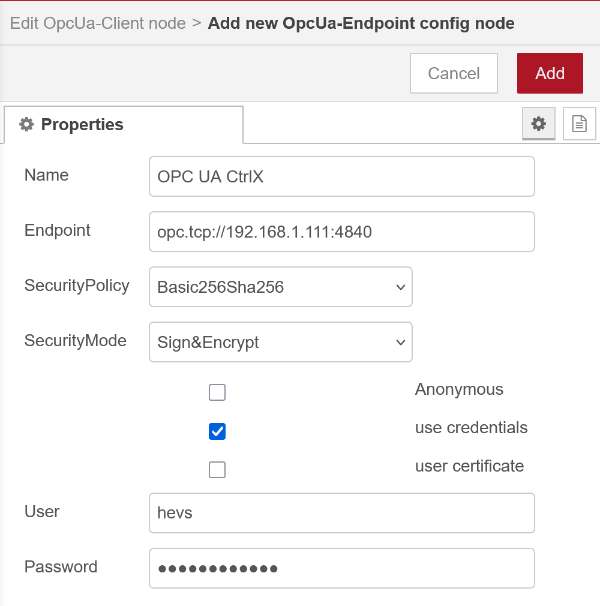
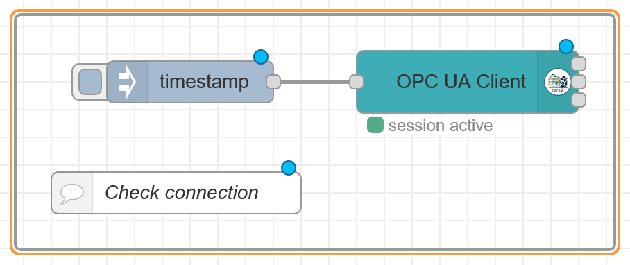
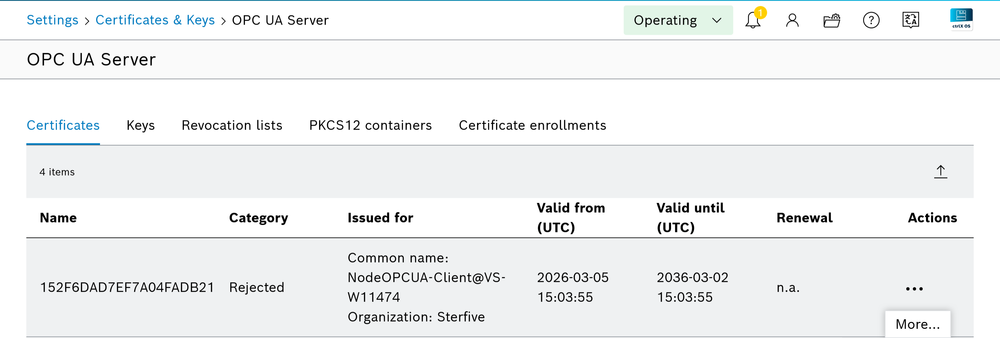
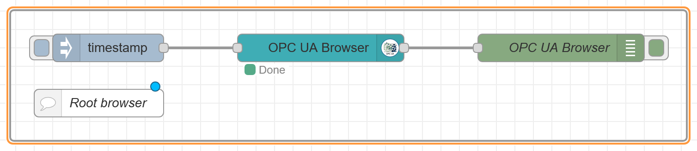
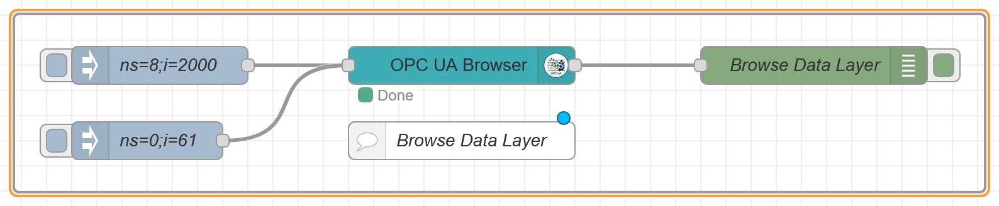
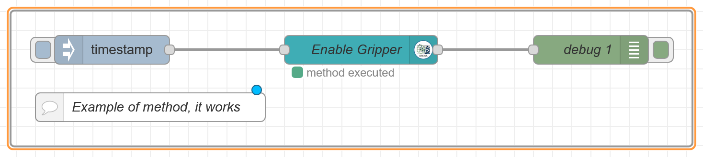
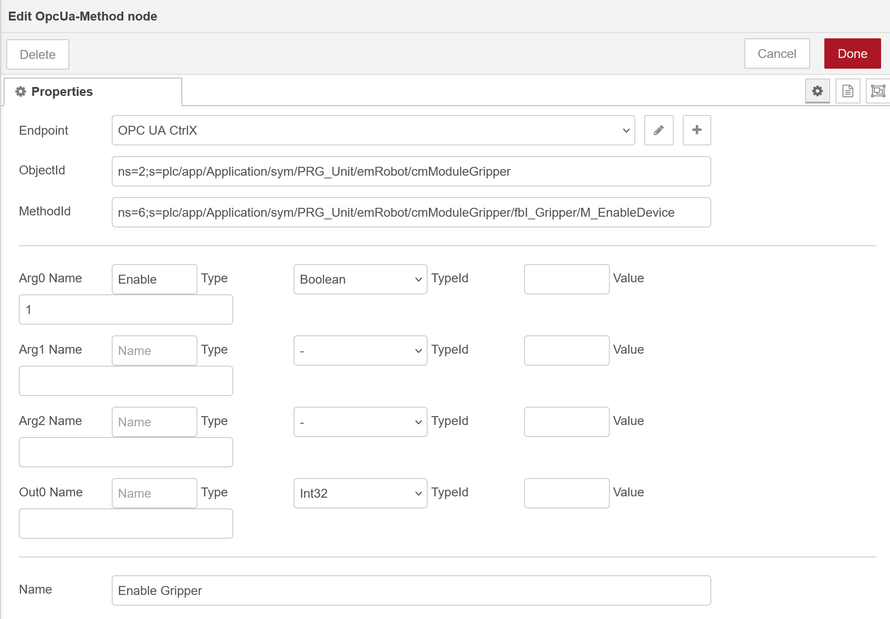

Free OPC-UA Library 


# OPC UA Tutorial
Connect and Exchange Data with Industrial Equipment
A practical guide to accessing industrial data through OPC UA server gateways.

## Tools for this tutorial
CtrlX
Node-RED
[node-red-contrib-opcua](https://flows.nodered.org/node/node-red-contrib-opcua) the actual, March 17, 2026, tool for Node-RED with OPC-UA.

**node-red-contrib-opcua** is not only a tool, this is a good introduction to understand some concepts of OPC-UA clients. It's an intermediate level between a coded solution, for example using official or open-source OPC C/C++ , see [Free OPC-UA Library](https://github.com/FreeOpcUa/), and fully integrated solutions like TIA Portal.

### Hands-on
This hands-on guide walks you through building your first OPC UA integration using Node-RED and FlowFuse:

-   Connect to any OPC UA server—CtrlX Core.
-   Browse available tags and discover Node IDs from your equipment
-   Read real-time values from PLCs, sensors, and industrial devices
-   Write control signals and setpoints back to your systems

#### Information, Not Just Data
**Keyword :** metadata.

> Metadata is data about data"—structured information that describes, explains, or locates an information resource, making it easier to retrieve, use, or manage. It provides essential context, such as author, creation date, file size, and format. Metadata is crucial for organizing digital files, improving searchability, and ensuring data longevity. **Source**: [IBM What is metadata ?](https://www.ibm.com/think/topics/metadata) 

Reading a temperature value from OPC UA does not just give you "42.5"—it gives the full context: 42.5 °C, measured at 14:32:15.625 with "Good" quality, from "Tank_01/Temperature", and includes alarm limits (10 °C / 80 °C). This context reduces guesswork and helps prevent costly mistakes.

#### Security Built for Industry

While protocols like Modbus transmit everything in plain text, OPC UA uses enterprise-grade security. It supports X.509 certificates, 256-bit encryption, and robust user authentication to safeguard critical infrastructure from cyber threats.

#### Future-Proof Investment

OPC UA is the foundation of Industry 4.0 initiatives around the world. It is not just another protocol—it is the one major vendors are standardizing on. Choosing OPC UA today ensures long-term compatibility and ROI.

---

## What You’ll Need

Before diving into the flow-building process, make sure you have the following:

-   An OPC UA server, typically OPA UA Server for CtrlX Core.
-   A FlowFuse Node-RED instance running on your edge device, or lab desktop.
-   A TCP-IP connection between Node-RED and the PLC.

## Installing OPC UA Support in FlowFuse

To work with OPC UA in FlowFuse Node-RED, you will first need to install the required nodes.
Install the OPC UA Node Package

1.  Open the FlowFuse Node-RED editor.
1.  Click the menu in the top-right and choose Manage palette.
1.  Navigate to the Install tab and search for **node-red-contrib-opcua**.
1.  Click Install.

Once installed, you will find new nodes for OPC UA communication in your palette, including Client, Item, and Browser and other OPC UA nodes.

---

## Connecting to Your OPC UA Server

To begin accessing industrial data, create a client connection using the OPC UA Client node.

1.  Drag an OPC UA Client node onto the canvas.
1.  Double-click to configure it.
1.  Click the + icon to create a new endpoint configuration.
1.Enter your OPC UA server address, for example: opc.tcp://192.168.0.200:4840
1.  Set the security policy to Basic256Sha256 and Security Mode de Sign&Encript.
2.  Select use credentials, the you will have to enter login and password of the Unit. As any other PLC lab, or ask to the supervisor of the lab.

In production environments, always use appropriate security—typically "Sign & Encrypt" with certificates.

<div align="center">
    
    <figcaption>Node OPC-UA Client</figcaption>
</div>

<div align="center">
    
    <figcaption>Node-RED OpcUa endpoint config node</figcaption>
</div>

<div align="center">
    
    <figcaption>Node-RED OpcUa check your connection</figcaption>
</div>

If you cannot connect, check the password and the certificate. For OT security reasons, we do not allow certificate-free access to CtrlX PLCs.

### Validate certificate
The first time you connect to the PLC, you will have to trust the certificate.
1.  Login in CtrlX Core and go to settings > Certificates & Keys, OPC UA Server.
2.  On the rejected certificate, select: **...** and click **Trusted**.


<div align="center">
    
    <figcaption>OpcUa server certificate validation</figcaption>
</div>

### Browse
At this step we suppose you have have a secure connection to the OpcUa server of the PLC.

Browse is facultative, but it helps to understand some concept of an OPC UA server.

In an OPC UA server, **ns=0;i=85** is the standard NodeId for the Objects Folder, or Objects node, which acts as the root node for most functional data, variables, and devices in the server's address space. Defined by the OPC Foundation, ns=0 indicates the core namespace, and i=85 is the numeric identifier.

Insert the nodes below with topic of OpcUa Browser : ``ns=0;i=85``.

<div align="center">
    
    <figcaption>Node-RED OpcUa browser</figcaption>
</div>

Display in the debug window what you get when running the node with insert.

We are interested in reading from the datalayer.

If we select object with index 3, we get:

```js
{"item":{"referenceTypeId":"ns=0;i=35",
         "isForward":true,
         "nodeId":"ns=8;i=2000",
         "browseName":{"namespaceIndex":8,
                       "name":"Datalayer"},
         "displayName":{"text":"Datalayer"},
         "nodeClass":1,
         "typeDefinition":"ns=0;i=61",
         "value":null,
         "dataType":"Null"}}
```

En détail:

Ces informations correspondent à un **résultat de “browse” OPC UA** (navigation dans l’espace d’adressage d’un serveur OPC UA). Chaque champ décrit une relation et un nœud cible. Voici le détail :

---

#### 🔗 Relation entre nœuds

* **`referenceTypeId: "ns=0;i=35"`**
  → Type de relation entre le nœud courant et celui-ci.
  `ns=0;i=35` correspond à **Organizes**
  👉 Donc : le nœud courant *organise* ce nœud enfant.

* **`isForward: true`**
  → La relation est dans le sens parent → enfant. *A ne pas confondre avec la notion d'héritage en UML*.

---

#### 🆔 Identification du nœud

* **`nodeId: "ns=8;i=2000"`**
  → Identifiant unique du nœud dans le serveur OPC UA

  * `ns=8` = namespace 8 (souvent spécifique au fournisseur, ex: ctrlX, Siemens, etc.)
  * `i=2000` = identifiant numérique dans ce namespace

---

#### 🏷️ Nom du nœud

* **`browseName`**
  → Nom technique utilisé pour naviguer

  * `namespaceIndex: 8`
  * `name: "Datalayer"`

* **`displayName`**
  → Nom lisible (UI / affichage)

  * `"Datalayer"`

👉 Ici les deux sont identiques.

---

#### 🧱 Type de nœud

* **`nodeClass: 1`**
  → Type de nœud
  `1` correspond à **Object**

👉 Donc ce n’est pas une variable mais un objet (conteneur).

---

#### 🧬 Type de définition

* **`typeDefinition: "ns=0;i=61"`**
  → Type OPC UA standard du nœud
  `ns=0;i=61` = **FolderType**

👉 Donc ce nœud est un **dossier (folder)** dans l’espace d’adressage.

---

#### 📊 Valeur et type de données

* **`value: null`**
* **`dataType: "Null"`**

👉 Normal, car :

* un **Object / Folder** n’a pas de valeur (contrairement à une Variable)

---

### 🧩 Interprétation globale

Ce JSON décrit donc :

👉 Un **dossier OPC UA nommé "Datalayer"**

* organisé sous un nœud parent
* de type standard Folder
* servant à structurer les données
* sans valeur propre

---

### 💡 Contexte typique

Dans l'environnements **ctrlX & Node-RED OPC UA**, ce genre de nœud :

* sert de **point d’entrée dans un modèle de données**, ici le datalayer.
* contient ensuite des variables, objets, méthodes, etc.

---

Si l'on fait un browse sur les noeud du Datalayer

<div align="center">
    
    <figcaption>Node-RED OpcUa browse datalayer</figcaption>
</div>

Dans le cas du ``ns=0;i=61``, ``typeDefinition``, on obtiendra toute une série d'information sur le **type** lié au datalayer. Cela dépasse le cadre de notre utilisation dans ce cours. Par contre, si l'on teste le ``ns=8;i=2000``, on constatera que l'on a accès à toute une arborescence qui nous permettrait ensuite d'accéder au PLC puis aux variables de l'application.

Browse ns=8;i=2000m :arrow-left: array[7]
```js
{"item":{"referenceTypeId":"ns=0;i=35",
         "isForward":true,
        "nodeId":"ns=8;s=plc",
        "browseName":{"namespaceIndex":8,
                      "name":"plc"},
        "displayName":{"text":"plc"},
        "nodeClass":1,"typeDefinition":
        "ns=0;i=61",
        "value":null,
        "dataType":"Null"}}
```

On pourrait poursuivre l'exercice en utilisant ``ns=8;s=plc`` et ainsi de suite, ``ns=8;s=plc/app`` et ainsi de suite jusqu'à trouver l'accès aux différentes variables du PLC.

On aura par exemple accès à l'arborescence des symboles via : ``ns=8;s=plc/app/Application/sym``.

### Intérêt du browser
Même si il est probablement plus simple de passer par un client OpcUa de haut niveau du type UaExpert, il peut être inétressant de vérifier certaines variables directement depuis Node-RED.

Un browse sur une variable pourra par exemple nous fournir une information sur le type de la variable.

Par exemple: ``diMyLoop:Int32``.

```js
{"item":{"referenceTypeId":"ns=0;i=35",
         "isForward":true,
         "nodeId":"ns=2;s=plc/app/Application/sym/PRG_Conveyor/diMyLoop",
         "browseName":{"namespaceIndex":2,
                        "name":"diMyLoop"},
         "displayName":{"text":"diMyLoop"},
         "nodeClass":2,
         "typeDefinition":"ns=0;i=63",
         "value":715748,
         "dataType":"Int32"}}
```

---

## Reading Tag Values

Once you know the Node IDs, you can start reading data from your industrial equipment through the OPC UA server.

### Reading a Single Tag

Here’s how to read a single value in real time:

1.  Drag an Inject node onto the canvas (this will trigger the read operation).

2.  Add an OPC UA Item node and configure:
        Node ID: Enter the tag’s identifier (e.g., ns=3;i=1003)
        Data Type: Select the appropriate type (e.g., Boolean)


> Relativemnt simple

---

### Mutliple
Peut-être mieux de passer par JavaScript


---

### Les Méthodes
Sympas, mais probablement mieux de passer par javaScript

<div align="center">
    
    <figcaption>Node-RED example of method</figcaption>
</div>

And the method configuration to enable a gripper.

<div align="center">
    
    <figcaption>Node-RED example of method edit</figcaption>
</div>

---