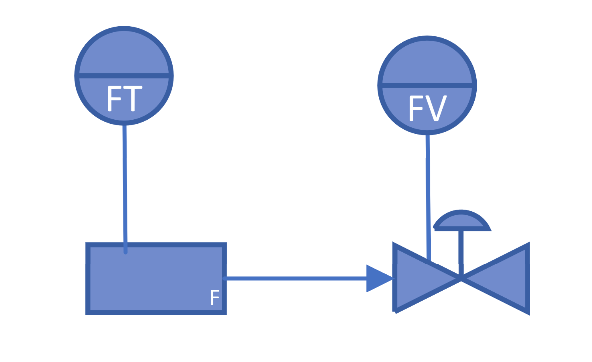
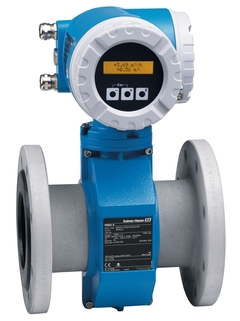
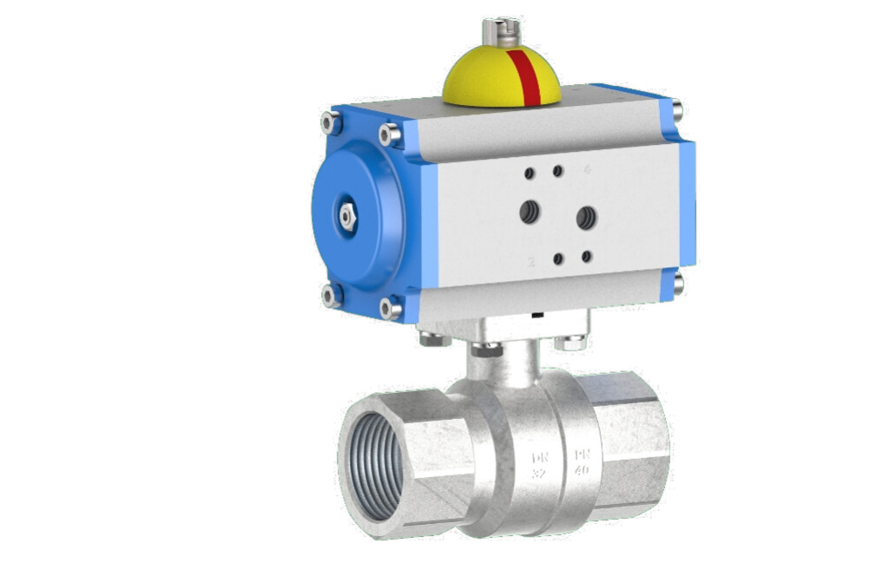
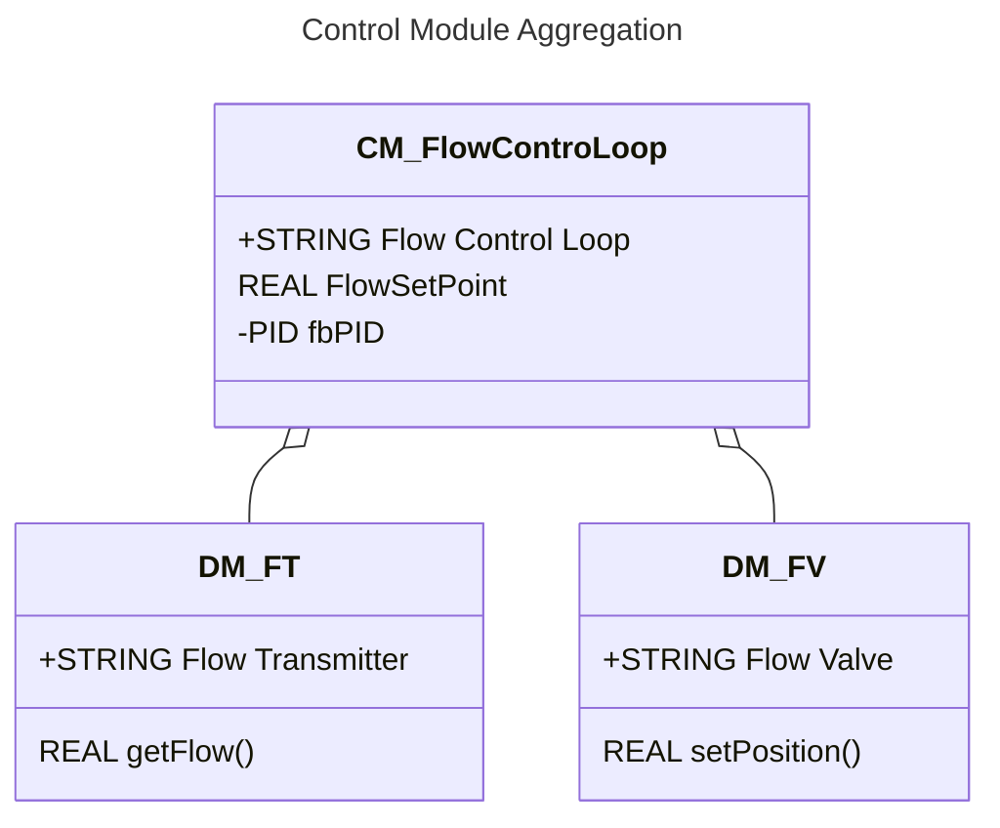
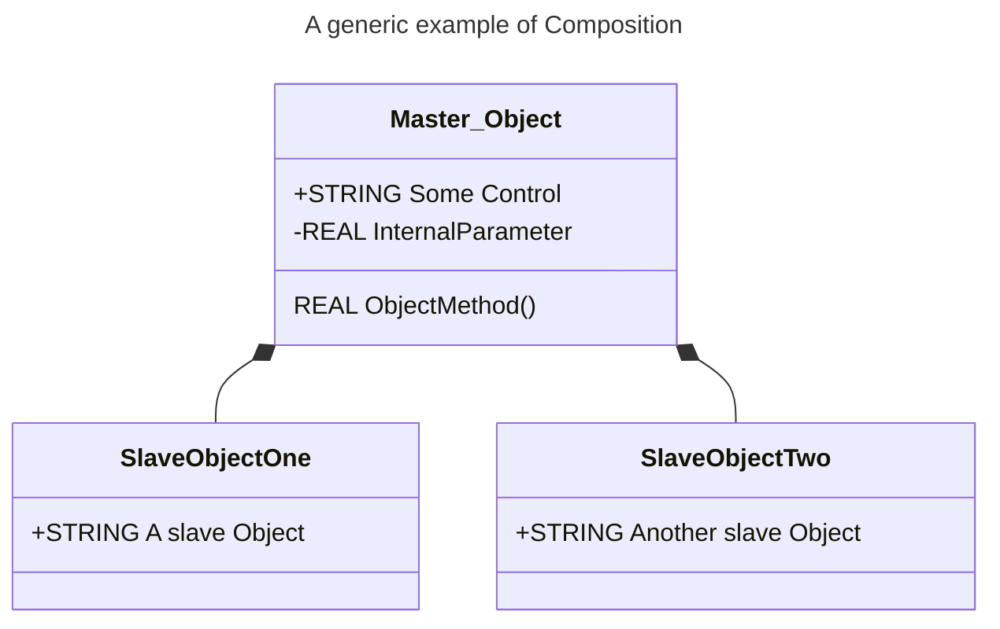
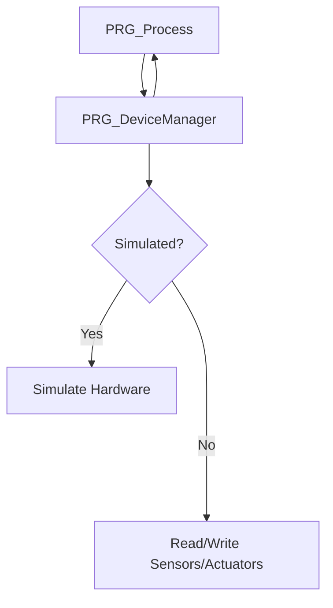

<h1 align="left">
  <br>
  
  <br>
  <p style="color:grey;">Institute Systems Engineering</p>
  <br>
</h1>

Author: [Cédric Lenoir](mailto:cedric.lenoir@hevs.ch)

# Control Module
The lowest level grouping of equipment in the physical model that can carry out basic control.

## Définition
A control module is typically a collection of sensors, actuators, other control modules, and
associated processing equipment that, from the point of view of control, is operated as a single
entity. A control module can also be made up of other control modules. For example, a header
control module could be defined as a combination of several on/off automatic block valve control
modules.

### Some example of control modules are:
- a regulating device consisting of a transmitter, a controller, and a control valve that is
operated via the set point of the device;
- a state-oriented device that consists of an on/off automatic block valve with position
feedback switches, that is operated via the set point of the device; or
- a header that contains several on/off automatic block valves and that coordinates the
valves to direct flow to one or several destinations based upon the set point directed to the
header control module.

Dans la pratique, un Control Module peut être composé de plusieurs instruments d'un diagram P&ID. Par exemple, comme nous le décrivons dans cet exemple, une mesure de température et un élément chauffant.

Dans la suite de ce cours et pour tenter de généralise le tout, nous allons utiliser le terme générique de **Device**, **appareil** en français, **Gerät** auf deutsch. Pour maintenir une certaine unité de language, nous allons utiliser le terme de **Device Module**, **DM**.

### Notion d'agrégation
Optons pour la première définition française de Larousse: *Action d'agréger, de réunir des éléments distincts pour former un tout homogène ; son résultat.*
Du point de vue logicielle et relation UML, nous trouvons selon IBM: *An aggregation is a special type of association in which objects are assembled or configured together to create a more complex object. An aggregation describes a group of objects and how you interact with them. Aggregation protects the integrity of an assembly of objects by defining a single point of control, called the aggregate, in the object that represents the assembly. Aggregation also uses the control object to decide how the assembled objects respond to changes or instructions that might affect the collection*.

### Utilisation et niveau logiciel
> Les appareils, ou objets, c'est à dire les Devices Modules, existent indépendament du Control Module.

Dans le diagramme d'agrégation **CM_FlowControLoop**, nous avons deux appareils distincts.
Une mesure de débit, P&ID **FT**, ainsi qu'une vanne, P&ID **FV**.

<figure>
    
    <figcaption>P&ID Diagaram Control Module'</figcaption>
</figure>

<figure>
    
    <figcaption>Proline Promag 51W electromagnetic flowmeter, source E+H'</figcaption>
</figure>

<figure>
    
    <figcaption>BACHOFEN Pneumatic actuated ball valve, source Bachofen'</figcaption>
</figure>



Ce qui nous intéresse ici, c'est que nous pouvons créer des Devices, **FT** et **FV**, les raccorder à notre IACS, Industrial Automation and Control System, puis les tester indépendamment de l'existence du logicel de contrôle sur la couche supérieure, à savoir le Control Module.

Distinction avec le symbole UML de composition. La disctinction entre le symbole d'aggrégation, **diamant blanc**, et le symbole de composition, **diamant noir** est fondamentale dans l'approche logicielle via IEC 61131-3.


En composition, les objets **SlaveObjectOne** et **SlaveObjectTwo** sont des variables internes de Master_Object. Cela signifient qu'**ils n'existent pas sans Master_Object**.

> En programmation IEC-61131 Structured Text, un objet, c'est à dire un Bloc Fonctionnel, ou une structure de données doivent être instanciés avant de pouvoir être utilisés. Concrêtement, cela signifie que l'on doit leur alouer un espace mémoire propre.

> En **composition**, les objets qui pointent vers un objet se voient allouer un espace mémoire à l'**intérieur** de celui-ci, comme une pièce dans une maison.

> En **agrégation**, les objets qui pointent vers un objet lui transmettent une adresse. Ils doivent donc se voir allouer un espace mémoire **extérieur** à l'objet vers lequel ils points.

# Différence Aggregation et Composition sur le plan du code.

En langage structuré IEC 61131-3, la notion d'**objet** avec un comportement interne, par exemple un régulateur PID, à ne pas confondre avec schmal P&ID, est un **bloc fonctionnel** ou **FB**.

```iecst
// With Composition
FUNCTION_BLOCK FB_Master_Object
VAR_INPUT
END_VAR
VAR_IN_OUT
END_VAR
VAR_OUTPUT
END_VAR
VAR
    SlaveObjectOne: FB_SlaveObject;
    SlaveObjectTwo: FB_SlaveObject;
END_VAR
```

```iecst
// With Aggregation
FUNCTION_BLOCK CM_FlowControLoop
VAR_INPUT
END_VAR
VAR_IN_OUT
    dmFT_1  : DM_FT;
    dmFV_1  : DM_FV;
END_VAR
VAR_OUTPUT
END_VAR
VAR
    fbPID   : FB_PID_Controller; 
END_VAR
```

# Intérêt principal: Modularité
Dans un projet qui prend une certaine ampleur, c'est à dire, rapidement si l'on sort de son laboratoirem, un projet d'automation et son programme atteindra une taille critique difficile à maitriser si l'on ne découpe pas le projet en entités plus petites et plus facile à maitriser et tester.

Dans cette approche, nous séparons la partie gestion des instruments de celle de la gestion du processus.

A tel point que nous allons séparer le programme en deux parties distinctes.

**PRG_Process** et **PRG_DeviceManager**.

# Program Device Manager
Dans cette partie du programme, nous allons uniquement nous préocupper de la gestion des appareils. Dans le monde du Process, la liaison avec le schéma P&ID, dans le monde des machines la liaison avec les différents capteurs et actuateurs électromécaniques.

> En d'autres termes: **l'ensemble des appareils de la machine seront connectés uniquement au programme PRG_DeviceManager**.

# Notion de simulation
Dans la pratique, il sera souvent nécessaire de pouvoir commencer à travailler sur le programme du processus, **PRG_Process**, alors que le hardware n'est pas encore disponbiles.

> La notion de simulation se fait au niveau du gestionnaire d'appareils. **PRG_DeviceManager**.



Cela signifie que la programmation du processus, PRG_Process est indépendante de l'activation ou non de la simulation.

## Encapsulation
A la notion de modularité, s'ajoute celle d'encapsulation. Idéalement, si il est nécessaire de changer physiquement un type d'appareil, il ne devrait pas être nécessaire de modifier le processus en aucune manière.

<!--- End of file --->