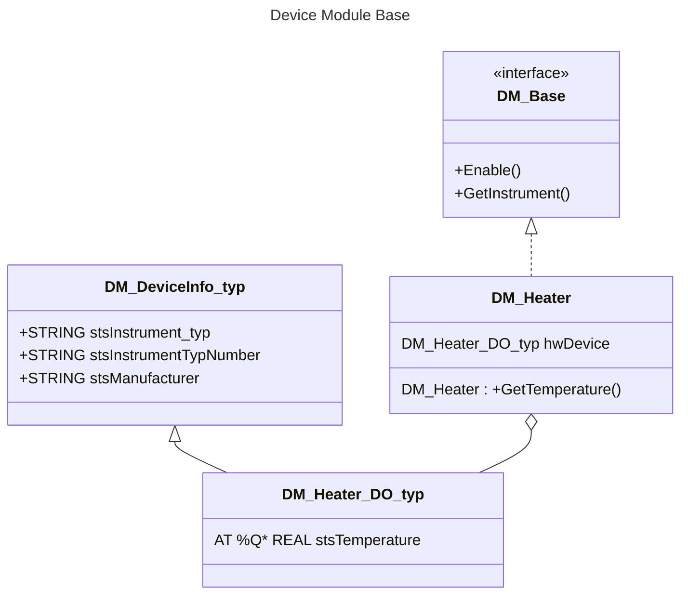

<h1 align="left">
  <br>
  
  <br>
  <p style="color:grey;">Institute Systems Engineering</p>
  <br>
</h1>

Author: [Cédric Lenoir](mailto:cedric.lenoir@hevs.ch)

# Temperature Controller

# Control Module
The role of the Control Module 



## Commentaire sur la construction UML du DM
- On utilise un interface ``DM_Base`` afin de pouvoir si nécessaire faire facilement un tableau de Device Modules. Par exemple pour obtenir la lise des Device Modules.

- Le ``HW_MF_Voegtlin_EC_typ`` est une structure principalement utilisée pour faire un link du harware, ``AT %Q*``.

- On intègre **pas** ``DM_DeviceInfo_typ`` en référence à ``DM_Base`` car **on ne veut surtout pas** que les classes qui héritent de l'interface **DM_Base** puissent recevoir un lien vers un hardware qui ne serait pas le bon.


### Note à propos d'une méthode utilisant hwDevice
La variable ``IN_OUT`` étant externe au **FB** ``DM_RED_Y_EC``, une méthode ne devrait pas pouvoir y accéder directement. Ceci pour une raison de séparation des couches. Une approche est de passer par une variable interne strictement interne, par exemple ``_Temperature`` pour ``_Temperature := hwDevice.Temperature``;

La méthode accède ainsi à _Temperature et non pas à hwDevice.Temperature. **Si l'on accède directement à ``hwDevice.Temperature``, le compilateur le signal avec un Warning**.

### Méthode M_GetTemperature

```iecst
METHOD M_GetTemperature : REAL
VAR_INPUT
END_VAR
```

```iecst
    M_GetTemperature := _Temperature;
```

<!--- End of file --->