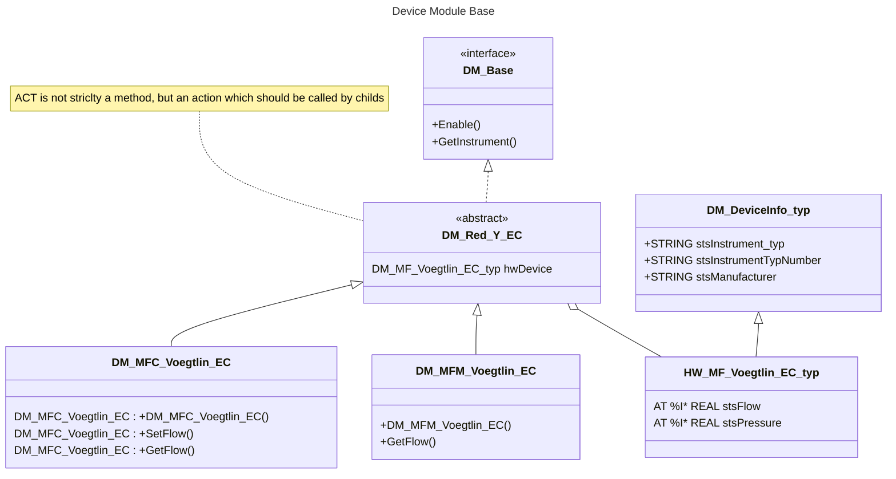

<h1 align="left">
  <br>
  
  <br>
  <p style="color:grey;">Institute Systems Engineering</p>
  <br>
</h1>

Author: [Cédric Lenoir](mailto:cedric.lenoir@hevs.ch)

# Device Module for CO2skid

# Device Module
Le device module ne fait rien, il récupère les informations du hardware.
Dans sa version de base.

Il ne contient pas de méthode spécifique.

# Exemple pour Device Module Flow Meter Vögtlin
Dans de FB de base, je ne fais que lire les informations depuis un device donné par l'interface Vögtlin qui est toujours le même.
Cependant, les 

|P&ID   |Equipement Module  |Description sont différents|
|-------|-------------------|---------------------------|
|MFC-4	|Feed	            |Massflow controller - Flue gas|
|MFM-1	|Feed	            |Mass flow meter with pressure regulator - feed|

Ils ne varie que par les méthodes qui utilisent différentes fonctions du ``DM_FlowMeter_voegtlin``.

En simple héritage, je pourrais mettre.

> Intéressant, l'idée de faire la différence entre un ``STRUCT`` et un ``FUNCTION BLOCK`` avec la notation DM_Base: ``DM_Base()``. Qui indique que le Function Block doit être appelé, c'est sa propre méthode.

> mermaid permet parfaitement de mentionner un interface vers le hardware, avec la notation: ``DM_Voegtlin_typ: AT %I* REAL stsFlow``, soit **AT %I*** **REAL stsFlow**,

> Notation **abstract**, Reset()*, *Reset()*,

Pour une aide à la syntaxe d'un diagramme de classe à l'aide de mermaid, on se référera à [mermaid.js class diagrams](https://mermaid.js.org/syntax/classDiagram.html#class-diagrams)



## Commentaire sur la construction UML du DM
- On utilise un interface ``DM_Base`` afin de pouvoir si nécessaire faire facilement un tableau de Device Modules. Par exemple pour obtenir la lise des Device Modules.

- On utilise pour le device ``DM_Red_Y_EC`` an ``Abstract``, car ce FB ne peut être utilisé tel quel puisqu'il ne fournit aucun service ou méthode vers l'extérieur. Il ne fait que procéder au transfert de données via Ethercat et les mettre en forme grâce à une action.

- Le ``HW_MF_Voegtlin_EC_typ`` est une structure principalement utilisée pour faire un link du harware, ``AT %I*``.

- On intègre **pas** ``DM_DeviceInfo_typ`` en référence à ``DM_Base`` car **on ne veut surtout pas** que les classes qui héritent de l'interface **DM_Base** puissent recevoir un lien vers un hardware qui ne serait pas le bon.


# SUPER 

Le truc qui me manquait, trouvé chez Beckhoff.

> Il est ainsi parfaitement possible de mettre du code dans un FB Abstract.
> Il est nécessaire d'appeler le FB Abstract via SUPER^() afin d'exécuter son code.
> Si le FB Abstract contien une référence IN_OUT, il est nécessaire d'utiliser cette référence lors de l'appel de SUPER.

## Exemple de FB *abstract* avec IN_OUT

```iecst
FUNCTION_BLOCK ABSTRACT DM_RED_Y_EC
VAR_INPUT
END_VAR
VAR_IN_OUT
	hwDevice		: DM_MF_Voegtlin_EC_typ;
END_VAR
VAR_OUTPUT
END_VAR
VAR
	...
END_VAR
```
## Héritage du FB *abstract*

```iecst
FUNCTION_BLOCK DM_MFC_Voegtlin_EC EXTENDS DM_RED_Y_EC
VAR_INPUT
END_VAR
VAR_OUTPUT
END_VAR
VAR
	_Temperature	: REAL;
END_VAR
```
### Utilisation du code du FB **abstract**

```iecst
// SUPER^.ACT_ConvertStringData();
SUPER^(hwDevice := hwDevice);

```
### Note à propos d'une méthode utilisant hwDevice
La variable ``IN_OUT`` étant externe au **FB** ``DM_RED_Y_EC``, une méthode ne devrait pas pouvoir y accéder directement. Ceci pour une raison de séparation des couches. Une approche est de passer par une variable interne strictement interne, par exemple ``_Temperature`` pour ``_Temperature := hwDevice.Temperature``;

La méthode accède ainsi à _Temperature et non pas à hwDevice.Temperature. **Si l'on accède directement à ``hwDevice.Temperature``, le compilateur le signal avec un Warning**.

### Méthode M_GetTemperature

```iecst
METHOD M_GetTemperature : REAL
VAR_INPUT
END_VAR
```

```iecst
    M_GetTemperature := _Temperature;
```

```iecst
SUPER^();                 // Call of FB-body of base class
SUPER^.METH_DoIt();       // Call of method METH_DoIt that is implemented in base class
```

<!--- End of file --->