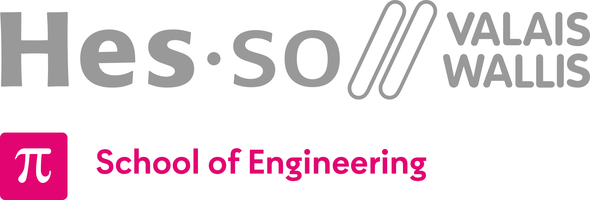

<h1 align="left">
   
  
   
  Advanced Automation
   
</h1>

Course : **AAut**

Author: [Cédric Lenoir](mailto:cedric.lenoir@hevs.ch)

---

# General Overview
This course is a continuation of the [Industrial Automation Base](https://github.com/hei-synd-autb/autb-docs) course. It delves deeper into the principles of managing an automation project and complements them with concepts of object-oriented programming according to [IEC 61131-3:2025](https://webstore.iec.ch/en/publication/68533).

The practical work is based on a [PackML](https://www.isa.org/products/isa-tr88-00-02-2022-machine-and-unit-states-an-imp) OO software structure developed in the automation laboratory of [HEVS](https://www.hevs.ch).

Short llnks for modules
- [General Overview](#general-overview)
- [Liste des modules](#liste-des-modules)
  - [AAut MOD 01 Object Oriented Programming](#aaut-mod-01-object-oriented-programming)
    - [Mod 01 OOP Deutsche Version](#mod-01-oop-deutsche-version)
  - [AAut Module 02, IEC 61131-3 OOP practice](#aaut-module-02-iec-61131-3-oop-practice)
  - [AAut Module 03, PackML selon ISA-TR88.00.02-2022](#aaut-module-03-packml-selon-isa-tr880002-2022)
  - [AAut Module 04, PackML example of implementation](#aaut-module-04-packml-example-of-implementation)
  - [AAut MOD 05 S88 Physical Model](#aaut-mod-05-s88-physical-model)
  - [AAut MOD 06 GMP](#aaut-mod-06-gmp)
  - [AAut Module 7 Node-RED and OpcUa Hands-On](#aaut-module-7-node-red-and-opcua-hands-on)
  - [AAut Modules 8 Node\_RED](#aaut-modules-8-node_red)
  - [AAut Modules 9 OT Security](#aaut-modules-9-ot-security)
  - [AAut Module 10, PackSafety](#aaut-module-10-packsafety)
- [Labs](#labs)
  - [Lab-report-template.](#lab-report-template)
  - [Lab 01 Object Interface and Methods. IEC 61131-3 Practice.](#lab-01-object-interface-and-methods-iec-61131-3-practice)
  - [Lab 02 PackML states for equipments, a OO use case.](#lab-02-packml-states-for-equipments-a-oo-use-case)
  - [AAut Annex 01, System engineering.](#aaut-annex-01-system-engineering)

Short links for labs.
  1.  [Object Interface and Methods](#lab-01-object-interface-and-methods-iec-61131-3-practice).
  2.  [OO Use Case with PackML states for equipments](#lab-02-packml-states-for-equipments-a-oo-use-case)

[Lab-report-template.](#lab-report-template)

---

# Liste des modules

## AAut [MOD 01 Object Oriented Programming](./AAut_MOD_01_IEC_61131_OOP_Introduction/README.md)
Une introduction à la programmation IEC 61131-3 OO dans le cas de l'automatisation modulaire.

### [Mod 01 OOP Deutsche Version](./AAut_MOD_01_IEC_61131_OOP_Introduction/README_DE.md)

## AAut [Module 02, IEC 61131-3 OOP practice](./AAut_MOD_05_IEC_61131_OOP_InPractice/README.MD)
Cas pratiques de l'utilisation de IEC 61131-3, FB_Init...

## AAut [Module 03, PackML selon ISA-TR88.00.02-2022](./AAut_MOD_03_TR88_Pack/README.md)
Une introduction à PackML.

## AAut [Module 04, PackML example of implementation](./AAut_MOD_04_Pack_Components/README.md)
Ce document détaille l'implémentation de la norme PackML 2022 pour la gestion des états et des modes d'une machine industrielle, en utilisant des blocs fonctionnels IEC-61131-3.
Il présente les concepts clés tels que les transitions d'états, les commandes, les alarmes, et les modes, tout en fournissant des exemples de code et des outils comme Node-RED pour la visualisation.
L'objectif est de simplifier le développement de machines complexes tout en assurant leur configurabilité et leur conformité aux normes industrielles.

## AAut [MOD 05 S88 Physical Model](/AAut_MOD_05_S88_Model/README.md)
Ce module traite de la norme **ISA-88** pour la modélisation et la gestion des processus industriels, en particulier pour les systèmes de production par lots. Il explique les concepts clés tels que le **modèle physique**, le modèle procédural et les recettes, et fournit des exemples concrets de leur application. Le document aborde également les différences entre les **processus continus, discrets et par lots**, ainsi que l'importance de la normalisation pour l'interopérabilité des systèmes. Enfin, il mentionne la norme ISA-95 pour la gestion des ressources d'entreprise et propose des exercices pratiques pour appliquer les concepts appris.

## AAut [MOD 06 GMP](/AAut_MOD_06_Specification/README.md)
Une introduction sur la spécification des processus pour l'automatisation, couvrant des concepts tels que les **V-Diagram**, **GMP**, GAMP® 5, et le cycle de vie des systèmes automatisés. Il explique l'importance des spécifications, les différentes composantes d'un système, et les principes de gestion de la qualité. Le document inclut également des exemples pratiques, des exercices, et des annexes pour aider à la rédaction des spécifications **URS**, **FS**, et **DS**. Enfin, il aborde les tests de validation, les **coûts des changements**, et fournit des ressources supplémentaires pour approfondir les connaissances.

## AAut Module 7 [Node-RED and OpcUa Hands-On](./AAut_MOD_08%20Node-RED/opc_ua_node_red_hands_on/HEVS_Version_Of_UA_Tutorial.md)

## AAut Modules 8 [Node_RED](./AAut_MOD_08%20Node-RED/README.md)
[Node_RED DE](./AAut_MOD_08%20Node-RED/README_DE.md)

## AAut Modules 9 [OT Security](./AAut_MOD_09%20OPC-UA%20&%20OT%20Security/README.md)
[OT Security DE](./AAut_MOD_09%20OPC-UA%20&%20OT%20Security/README_DE.md)

## AAut [Module 10, PackSafety](./AAut_MOD_10_Pack_Safety/)
Ce document explore les principes de sécurité des machines, en mettant l'accent sur les normes ISO 12100 et ISO 13489 pour l'évaluation et la réduction des risques. Il aborde également des concepts tels que la sécurité intrinsèque, les zones ATEX, et l'utilisation de technologies comme Ethernet-APL pour les environnements dangereux. Enfin, des exemples pratiques et des questions permettent d'appliquer ces notions à des cas concrets.

---

# Labs
Link to labs.

## [Lab-report-template](./Lab_Report_Template/README.md).
## Lab 01 [Object Interface and Methods](https://github.com/hei-synd-aaut/aaut_lab_01_2026). IEC 61131-3 Practice.
## Lab 02 [PackML states for equipments](https://github.com/hei-synd-aaut/aaut_lab_02_2026), a OO use case.
---

## AAut [Annex 01, System engineering](./AAut_Annex_01_System_Engineering/README.md).
Some tools to work with UML diagrams in Visual Studio Code, including OO Class diagrams.

<!-- end of this document -->